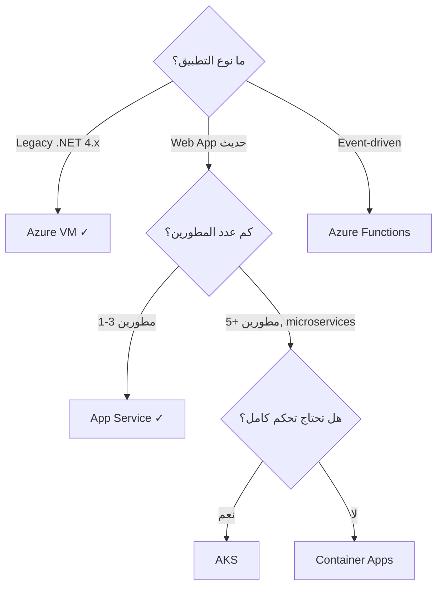

# أساسيات Microsoft Azure

> "لا تبني بيتاً على أرض لا تعرفها. Azure مثل مدينة ضخمة — تعرّف على شوارعها أولاً."

## 🎯 أهداف التعلم

- فهم نموذج Azure التنظيمي (Tenants, Subscriptions, Resource Groups)
- إتقان خدمات الحوسبة الأساسية (VMs, App Service, AKS, Functions)
- فهم شبكات Azure (VNets, Subnets, NSGs, Load Balancers)
- تطبيق إدارة التكاليف والحوكمة
- بناء أول Infrastructure حقيقي على Azure

---

## 📖 الطبقة الأساسية: ما هو Azure؟

Microsoft Azure هي منصة حوسبة سحابية تديرها Microsoft. توفر أكثر من **200 خدمة** تغطي الحوسبة، التخزين، الشبكات، الذكاء الاصطناعي، قواعد البيانات، وإنترنت الأشياء.

### نموذج Azure التنظيمي

<pre>
Tenant (حساب المؤسسة)
 │
 ├── Management Group (اختياري — لتجميع الاشتراكات)
 │    │
 │    ├── Subscription 1 (الإنتاج)
 │    │    ├── Resource Group: networking
 │    │    │    ├── VNet
 │    │    │    ├── Subnet
 │    │    │    └── NSG
 │    │    │
 │    │    ├── Resource Group: compute
 │    │    │    ├── VM
 │    │    │    ├── NIC
 │    │    │    └── Disk
 │    │    │
 │    │    └── Resource Group: monitoring
 │    │         ├── Log Analytics
 │    │         └── Alert Rules
 │    │
 │    └── Subscription 2 (التطوير/الاختبار)
 │
 └── Management Group
      └── Subscription 3 (مشروع آخر)
</pre>

### أنواع الخدمات السحابية

| النموذج  | ما توفره Azure                       | مسؤوليتك                           | مثل               |
| -------- | ------------------------------------ | ---------------------------------- | ----------------- |
| **IaaS** | الأجهزة الافتراضية، التخزين، الشبكات | نظام التشغيل، التطبيقات، التحديثات | Azure VMs         |
| **PaaS** | بيئة التطوير والتشغيل                | الكود والتكوين فقط                 | Azure App Service |
| **SaaS** | التطبيق كاملاً                       | لا شيء — استخدم فقط                | Microsoft 365     |

---

## 🧱 الطبقة المهنية: خدمات Azure الأساسية بعمق

### 1. الحوسبة (Compute)

#### Virtual Machines — الخيار الكلاسيكي

```bash
# إنشاء VM كاملة البيئة
az group create --name prod-weu-rg --location westeurope

az vm create \
  --resource-group prod-weu-rg \
  --name web-server-01 \
  --image "Ubuntu2204" \
  --size "Standard_D2s_v3" \
  --admin-username azureuser \
  --generate-ssh-keys \
  --public-ip-address web-ip \
  --public-ip-address-allocation static \
  --nsg "" # سننشئ NSG منفصلاً
```

**دليل أحجام VMs:**

| السلسلة    | الاستخدام                | vCPU  | RAM      | مثال        |
| ---------- | ------------------------ | ----- | -------- | ----------- |
| B-series   | تطوير/اختبار (burstable) | 1-20  | 0.5-80GB | B2s         |
| D-series   | استخدام عام              | 2-96  | 8-384GB  | D4s v5      |
| E-series   | ذاكرة عالية              | 2-104 | 16-672GB | E8s v5      |
| F-series   | CPU مكثف                 | 2-72  | 4-144GB  | F8s v2      |
| NCas_T4_v3 | GPU (تعلم آلي)           | 4-64  | 28-440GB | NC8as_T4_v3 |

#### Azure App Service — PaaS للتطبيقات

```bash
# App Service Plan + Web App
az appservice plan create \
  --name prod-plan \
  --resource-group prod-weu-rg \
  --sku S1 \
  --is-linux

az webapp create \
  --name cloudnova-portal \
  --resource-group prod-weu-rg \
  --plan prod-plan \
  --runtime "PYTHON:3.11"
```

**مزايا App Service على VMs:**

- لا حاجة لإدارة نظام التشغيل أو التحديثات
- Auto-scaling مدمج
- Deployment slots (zero-downtime deployment)
- شهادات SSL مجانية
- تكامل مباشر مع GitHub Actions

#### Azure Kubernetes Service (AKS)

```bash
az aks create \
  --resource-group prod-weu-rg \
  --name cloudnova-aks \
  --node-count 3 \
  --node-vm-size Standard_D4s_v3 \
  --enable-cluster-autoscaler \
  --min-count 3 \
  --max-count 10 \
  --network-plugin azure \
  --network-policy calico \
  --enable-managed-identity
```

#### Azure Functions — Serverless

```python
# function_app.py — مثال حقيقي
import azure.functions as func
import logging

app = func.FunctionApp()

@app.function_name("ProcessOrder")
@app.service_bus_queue_trigger(
    arg_name="msg",
    queue_name="orders",
    connection="ServiceBusConnection"
)
def process_order(msg: func.ServiceBusMessage):
    """تنفيذ عند وصول طلب جديد إلى قائمة orders"""
    order = msg.get_body().decode("utf-8")
    logging.info(f"🔔 طلب جديد: {order}")

    # منطق معالجة الطلب هنا
    # ...

    logging.info("✅ تمت معالجة الطلب بنجاح")
```

### 2. التخزين (Storage)

#### Azure Storage Account

```bash
az storage account create \
  --name cloudnovastorage \
  --resource-group prod-weu-rg \
  --location westeurope \
  --sku Standard_LRS \
  --kind StorageV2 \
  --access-tier Hot \
  --min-tls-version TLS1_2
```

| نوع التخزين | الاستخدام                       | مثال                          |
| ----------- | ------------------------------- | ----------------------------- |
| **Blob**    | ملفات، صور، سجلات، نسخ احتياطية | سجلات التطبيق، صور المستخدمين |
| **File**    | مشاركة ملفات (SMB/NFS)          | ملفات تكوين مشتركة بين VMs    |
| **Table**   | NoSQL key-value                 | بيانات الجلسات، الإعدادات     |
| **Queue**   | رسائل بين الخدمات               | أوامر معالجة الصور            |

#### Azure SQL Database — PaaS لقواعد البيانات

```sql
-- إنشاء قاعدة بيانات وتكوينها
CREATE DATABASE CloudNovaDB
  (EDITION = 'GeneralPurpose',
   SERVICE_OBJECTIVE = 'GP_S_Gen5_2',
   MAXSIZE = 50 GB);

-- ميزة Geo-Replication
ALTER DATABASE CloudNovaDB
  ADD SECONDARY ON SERVER disaster-recovery-server;
```

### 3. الشبكات (Networking)

#### Virtual Network عملي

```bash
# 1. إنشاء VNet
az network vnet create \
  --name cloudnova-vnet \
  --resource-group prod-weu-rg \
  --address-prefixes 10.0.0.0/16 \
  --location westeurope

# 2. إنشاء Subnets
az network vnet subnet create --name web-subnet \
  --vnet-name cloudnova-vnet \
  --address-prefixes 10.0.1.0/24 \
  --resource-group prod-weu-rg

az network vnet subnet create --name app-subnet \
  --vnet-name cloudnova-vnet \
  --address-prefixes 10.0.2.0/24 \
  --resource-group prod-weu-rg

az network vnet subnet create --name db-subnet \
  --vnet-name cloudnova-vnet \
  --address-prefixes 10.0.3.0/24 \
  --resource-group prod-weu-rg

# 3. NSG — جدار الحماية
az network nsg create \
  --name web-nsg \
  --resource-group prod-weu-rg

az network nsg rule create \
  --name AllowHTTPS \
  --nsg-name web-nsg \
  --priority 100 \
  --direction Inbound \
  --protocol Tcp \
  --source-address-prefixes Internet \
  --destination-port-ranges 443 \
  --resource-group prod-weu-rg
```

**أفضل ممارسات الشبكات:**

- الفصل بين Subnets: web (خارجي)، app (داخلي)، db (معزول)
- NSG على مستوى Subnet + NIC للمرونة
- Azure Firewall أو WAF للتطبيقات الإنتاجية
- Private Endpoints لقواعد البيانات (لا Public IP)
- VNet Peering للاتصال بين بيئات متعددة

---

## 🏗️ الطبقة الإنتاجية: بناء معمارية حقيقية

### قصة CloudNova: بناء منصة SaaS

```
CloudNova تحتاج لنقل منصتها إلى Azure:

Layer 1: DNS + CDN
   ├── Azure Front Door (Global Load Balancing)
   │    └── WAF Policy (حماية من OWASP Top 10)
   │
Layer 2: Web Tier
   ├── App Service (2 instances, auto-scale 2-10)
   │    ├── Deployment Slot: staging (blue/green)
   │    └── Deployment Slot: production
   │
Layer 3: Application Tier
   ├── AKS Cluster (3-10 nodes)
   │    ├── Namespace: production
   │    ├── Namespace: staging
   │    └── Pod Identity (managed identities للخدمات)
   │
Layer 4: Data Tier
   ├── Azure SQL (Business Critical, 2 vCores)
   │    ├── Geo-Replication إلى West US
   │    └── Private Endpoint (لا Public IP)
   ├── Azure Cache for Redis (Premium, 6GB)
   └── Storage Account (LRS, Hot tier)
        └── Blob Containers: logs, backups, media

Layer 5: Security + Monitoring
   ├── Key Vault (أسرار وشهادات)
   ├── Log Analytics Workspace
   ├── Application Insights
   └── Microsoft Defender for Cloud
```

### Terraform للبيئة الكاملة

```hcl
# resource_groups.tf
resource "azurerm_resource_group" "production" {
  name     = "cloudnova-prod-weu-rg"
  location = "West Europe"
  tags = {
    Environment = "Production"
    Project     = "CloudNova"
    ManagedBy   = "Terraform"
  }
}

# key_vault.tf
resource "azurerm_key_vault" "main" {
  name                = "cloudnova-kv-prod"
  location            = azurerm_resource_group.production.location
  resource_group_name = azurerm_resource_group.production.name
  tenant_id           = data.azurerm_client_config.current.tenant_id
  sku_name            = "premium"

  soft_delete_retention_days = 90
  purge_protection_enabled   = true

  network_acls {
    default_action = "Deny"
    bypass         = "AzureServices"
  }
}

# database.tf
resource "azurerm_mssql_server" "main" {
  name                         = "cloudnova-sql-prod"
  resource_group_name          = azurerm_resource_group.production.name
  location                     = azurerm_resource_group.production.location
  version                      = "12.0"
  administrator_login          = "sqladmin"
  administrator_login_password = random_password.sql_admin.result

  azuread_administrator {
    login_username = "DBA Team"
    object_id      = data.azuread_group.dbas.object_id
  }
}
```

---

## 🎨 الطبقة المعمارية: الأنماط والقرارات

### اختيار الخدمة المناسبة

```
هل تحتاج تشغيل تطبيق ويب؟

├── تطبيق بسيط مع طلبات HTTP؟
│   └── Azure App Service ✓ (أبسط وأرخص)
│
├── تطبيق معقد مع microservices؟
│   └── AKS أو Container Apps
│       ├── AKS: تحكم كامل، معقد
│       └── Container Apps: مبسط، أقل تحكم
│
├── أحداث غير متزامنة / serverless؟
│   └── Azure Functions + Service Bus
│
└── تحتاج GPU للذكاء الاصطناعي؟
    ├── Azure ML: تدريب النماذج
    ├── AKS + GPU nodes: استدلال online
    └── Batch: معالجة دفعات
```

### High Availability

| المكون      | SLA هدف | كيف؟                            |
| ----------- | ------- | ------------------------------- |
| Front Door  | 99.99%  | موزع عالمياً تلقائياً           |
| App Service | 99.95%  | منطقتان Availability Zones      |
| AKS         | 99.95%  | 3 nodes minimum, multi-AZ       |
| SQL DB      | 99.995% | Business Critical + Geo-Replica |
| Storage     | 99.9%   | RA-GRS (نسخ عبر المناطق)        |

---

## 🏥 سيناريو CloudNova: هجرة إلى Azure

```
📋 التذكرة: HYD-1294
النوع: هجرة البنية التحتية
الأولوية: عالية
المسند إلى: أنت (Junior Cloud Engineer)

الوصف:
قررت CloudNova نقل بيئة الإنتاج من On-Premise إلى Azure.
أنت مسؤول عن المرحلة الأولى: إعداد الأساس.

المطلوب:
1. إعداد VNet مع 3 Subnets منفصلة
2. إنشاء VM في كل Subnet مع NSG مناسب
3. إعداد Azure SQL مع Private Endpoint
4. توصيل كل شيء معاً
5. إعداد Key Vault للتخزين الآمن للأسرار
6. تجهيز بيئة Terraform

المعايير:
- كل شيء عبر Terraform (ليس يدوياً)
- الأسماء تتبع اصطلاح: {env}-{region}-{resource}-{instance}
- كل مورد موسوم: Environment=Production, Project=CloudNova
- الميزانية الشهرية: $2,000
```

---

## ⚡ الإنتاج وما بعده

### إدارة التكاليف

```bash
# عرض التكاليف الشهرية
az consumption usage list \
  --subscription-id "12345678-1234-1234-1234-123456789abc" \
  --start-date "2026-06-01" \
  --end-date "2026-06-30" \
  --query "[?pretaxCost > '0'].{Name:consumedService,Cost:pretaxCost}" \
  --output table

# تعيين الميزانية مع تنبيه
az consumption budget create \
  --budget-name "Monthly-Budget" \
  --amount 2000 \
  --time-grain Monthly \
  --start-date "2026-07-01" \
  --end-date "2027-07-01" \
  --contact-emails "finops@cloudnova.com"

# إعداد Auto-shutdown لـ VMs التطوير ليلاً
az vm auto-shutdown \
  --resource-group dev-weu-rg \
  --name dev-server-01 \
  --time 2100
```

### أفضل ممارسات الأمان

| الممارسة                             | لماذا؟                          | كيفية التحقق                       |
| ------------------------------------ | ------------------------------- | ---------------------------------- |
| Managed Identity بدلاً من كلمات السر | لا أسرار للتسريب                | `az vm identity show`              |
| Private Endpoints                    | لا تعرض قواعد البيانات للإنترنت | `az network private-endpoint list` |
| Key Vault مع soft-delete             | حماية من الحذف العرضي           | `az keyvault show --name kv`       |
| Defender for Cloud                   | كشف التهديدات                   | Azure Portal > Defender            |
| Azure Policy                         | منع التكوينات الخاطئة           | `az policy assignment list`        |
| Just-In-Time VM Access               | تقليل التعرض للهجوم             | Defender > JIT                     |

---

## 🧠 التذكّر النشط

1. ما الفرق بين IaaS و PaaS و SaaS؟ أعط مثالاً لكل نموذج.
2. ارسم هيكل Azure التنظيمي من Tenant إلى Resource.
3. أين تستخدم Private Endpoint بدلاً من Public IP؟
4. كيف تختار بين App Service و AKS و Functions؟
5. ما هي أفضل ممارسة لتخزين الأسرار في Azure؟

## 🗣️ تمرين فاينمان

اشرح Azure لشخص غير تقني باستخدام تشبيه المدينة:

- Regions = دول
- Availability Zones = مراكز بيانات في مدن مختلفة
- Resource Groups = أحياء
- VMs = مباني
- VNets = طرق
- NSGs = بوابات أمنية

## 📝 بطاقات تعليمية

- **Resource Group**: حاوية منطقية تجمع الموارد المرتبطة معاً. عند حذفها تحذف كل محتوياتها.
- **Azure Policy**: قاعدة تفرض معايير على الموارد (مثلاً: منع VMs بدون تشفير).
- **RBAC**: نظام الصلاحيات في Azure (Owner > Contributor > Reader).
- **Availability Set**: فصل مادي بين VMs لحمايتها من أعطال الأجهزة.
- **Availability Zone**: مراكز بيانات منفصلة في نفس المنطقة تحمي من أعطال المنطقة كاملة.

## 🎤 أسئلة المقابلة

1. **"كيف تختار بين Azure SQL و Cosmos DB؟"**
   - SQL: بيانات علائقية، معاملات ACID، JOINs معقدة
   - Cosmos DB: NoSQL، توزيع عالمي، زمن استجابة < 10ms

2. **"اشرح Azure Load Balancer مقابل Application Gateway."**
   - Load Balancer: طبقة 4 (TCP/UDP)، توزيع بسيط
   - Application Gateway: طبقة 7 (HTTP/HTTPS)، SSL termination، WAF

---

## 🏛️ طبقة الإنتاج: تشغيل Azure على مستوى المؤسسة

### Azure Blueprints — معايير مسبقة للبيئات

```json
{
  "displayName": "CloudNova Production Blueprint",
  "targetScope": "subscription",
  "resourceGroups": {
    "networking": { "location": "westeurope" },
    "compute": { "location": "westeurope" },
    "data": { "location": "westeurope" }
  },
  "policyAssignments": [
    { "policyDefinitionId": "/providers/Microsoft.Authorization/policyDefinitions/enforce-tls12" },
    {
      "policyDefinitionId": "/providers/Microsoft.Authorization/policyDefinitions/enforce-managed-identity"
    }
  ],
  "roleAssignments": [
    { "principalId": "<dba-group>", "roleDefinitionId": "Contributor", "scope": "data-rg" }
  ]
}
```

### Azure Monitor المتقدم — من logs إلى insights

```kusto
// KQL: ابحث عن VMs باستهلاك CPU > 80% لمدة 30 دقيقة
Perf
| where ObjectName == "Processor" and CounterName == "% Processor Time"
| summarize AvgCPU = avg(CounterValue) by Computer, bin(TimeGenerated, 5m)
| where AvgCPU > 80
| join kind=inner (
    AzureActivity
    | where OperationNameValue contains "Deallocate"
    | project Computer, DeallocationTime=TimeGenerated
) on Computer
| project Computer, AvgCPU, DeallocationTime
```

### Azure Policy المتقدم — منع الكوارث قبل حدوثها

```bash
# منع إنشاء VMs في مناطق غير معتمدة
az policy definition create --name "allowed-locations" \
  --rules '{
    "if": { "field": "location", "notIn": ["westeurope", "northeurope"] },
    "then": { "effect": "Deny" }
  }'

# منع حذف Resource Groups الإنتاجية
az policy definition create --name "protect-prod-rg" \
  --rules '{
    "if": { "field": "tags.Environment", "equals": "Production" },
    "then": { "effect": "DenyAction", "details": { "actionNames": ["delete"] } }
  }'
```

### 🚨 سيناريو CloudNova: حادثة أمنية

> **الموقف:** الساعة ٣ فجراً — تنبيه من Defender: ٥٠٠ محاولة فاشلة لتسجيل الدخول من IP في الصين. CloudNova لا تعمل في الصين.

**الاستجابة:**

1. **حظر فوري**:

```bash
az network nsg rule create --name "BlockThreatIP" \
  --nsg-name web-nsg --priority 50 \
  --direction Inbound --source-address-prefixes "45.33.32.0/24" \
  --access Deny
```

2. **تحقيق**:

```kusto
// هل وصلوا لأي شيء؟
SigninLogs | where IPAddress startswith "45.33.32"
| project TimeGenerated, UserPrincipalName, ResultType
```

3. **إجراء دائم**: إضافة Geo-IP filtering إلى WAF policy.

---

## 🎨 طبقة المعماري: قرارات مصيرية

### IaaS vs PaaS vs Serverless — متى تختار ماذا في Azure؟



### متى لا تستخدم Azure؟

| السيناريو                                | لماذا لا Azure؟                 | البديل                           |
| ---------------------------------------- | ------------------------------- | -------------------------------- |
| **حمل ثابت 24/7 بدون تقلبات**            | Reserved VMs أغلى من شراء خوادم | On-Premises أو colocation        |
| **تطبيق أحادي مستخدم واحد**              | Azure overkill                  | DigitalOcean، VPS                |
| **بيانات شديدة الحساسية (حكومة/عسكرية)** | مخاوف سيادية                    | On-Premises مع اعتماد حكومي      |
| **Edge computing في مناطق نائية**        | Azure Regions بعيدة جداً        | Azure Stack Edge أو AWS Outposts |

### المقارنة الخفية: التكلفة الحقيقية

```
ظاهرياً: Azure VM D4s_v3 = $150/شهر
حقيقياً:
├── OS Disk (128GB Premium SSD)   +$25
├── Bandwidth (1TB outbound)      +$87
├── Backup (30 days retention)    +$30
├── Monitor (Logs + Metrics)      +$15
├── Public IP (static)            +$3.6
├── مهندس DevOps (¼ وقت)          +$2,500
└── الإجمالي الحقيقي:             ~$2,810/شهر
```

> **القاعدة:** السعر المعلن = 30-50% فقط من التكلفة الحقيقية للإنتاج.

---

## 🛠️ تدريبات عملية

### تمرين ١: ابنِ بيئة كاملة (سهل)

> باستخدام Azure CLI، ابنِ:
>
> 1. Resource Group
> 2. VNet مع 3 Subnets
> 3. VM في web-subnet مع NSG يسمح فقط بـ HTTPS
> 4. Azure SQL في db-subnet مع Private Endpoint

### تمرين ٢: مراقب التكاليف (متوسط)

> اكتب KQL query في Log Analytics يكتشف:
>
> - VMs تعمل 24/7 لكن average CPU < 5%
> - Disks غير مرتبطة بأي VM (orphaned)
> - Public IPs غير مستخدمة

### تحدي: Autoscaling ذكي (متقدم)

> صمم نظام autoscaling لـ App Service:
>
> - Scale out عندما CPU > 70% لمدة 5 دقائق
> - Scale in عندما CPU < 30% لمدة 30 دقيقة
> - لا تتجاوز 10 instances (تكلفة)
> - لا تنزل عن 2 instances (توفر)
> - استخدم Terraform.

### مشروع CloudNova

> **Ticket #CN-601:** "ميزانية Azure هذا الشهر $8,500 — أعلى بـ 40% من المخطط. اكتشف السبب واقترح خطة توفير."

---

## 📝 تقييم المعرفة

### ✅ تحقق من فهمك (5)

1. ارسم هيكل Azure من Tenant → Management Group → Subscription → Resource Group → Resource.
2. كيف تختار بين D-series و E-series لـ VM؟
3. لماذا Private Endpoint أفضل من Public IP لقاعدة البيانات؟
4. ما فائدة Deployment Slots في App Service؟
5. كيف تمنع فريق dev من إنشاء D16s_v5 للتطوير؟

### 📝 اختبار (3 أسئلة)

**س١:** أي خدمة تختار لـ background job يعالج 10,000 صورة أسبوعياً؟

- **أ)** Azure VM 24/7
- **ب)** Azure Functions (Consumption Plan)
- **ج)** AKS cluster

<details style="display:none">
<summary>الإجابة</summary>

**ب) Azure Functions.** الـ job دوري (أسبوعي) وليس مستمراً. Consumption Plan = تدفع فقط عند التنفيذ. VM 24/7 = تدفع 168 ساعة أسبوعياً مقابل بضع ساعات معالجة.

</details>

**س٢:** كم تكلفة تشغيل App Service P1v2 (٢ instances) + Azure SQL GP (٢ vCores) شهرياً تقريباً؟

<details style="display:none">
<summary>الإجابة</summary>

App Service P1v2: ~$146/instance × 2 = $292
Azure SQL GP 2 vCores: ~$375
الإجمالي التقريبي: ~$667/شهر
(مع Reserved Instances سنة: ~$450/شهر — وفر 33%)

</details>

**س٣:** ما الفرق بين Azure Policy و Azure RBAC؟

<details style="display:none">
<summary>الإجابة</summary>

- **RBAC**: من يستطيع فعل ماذا (صلاحيات). مثال: "Ahmed يستطيع قراءة VMs في prod-rg"
- **Azure Policy**: ما يمكن فعله (قواعد). مثال: "لا أحد يستطيع إنشاء VM بدون managed disk"

RBAC يتحكم في الوصول. Policy تتحكم في الخصائص.

</details>

### 🧠 استدعاء نشط (5)

1. اذكر 5 خدمات Azure Compute ومتى تستخدم كل منها.
2. ارسم هيكل شبكة 3-tier في Azure مع subnets.
3. كيف تبني Disaster Recovery لـ Azure SQL بدون فقدان بيانات؟
4. ما الفرق بين Azure Monitor و Application Insights و Log Analytics؟
5. كيف تؤمن اشتراك Azure من أول يوم؟

### ✍️ تمرين Feynman

اشرح Azure لـ ٣ شخصيات:

- **مدير مالي**: ركز على OpEx vs CapEx، Reserved Instances.
- **مطور مبتدئ**: ركز على App Service، deployment slots.
- **CEO**: ركز على SLA، scale، global reach.

### 🎴 بطاقات تعليمية (8)

| السؤال                    | الإجابة                                                |
| ------------------------- | ------------------------------------------------------ |
| مكونات Azure التنظيمية    | Tenant → MG → Subscription → RG → Resource             |
| أنواع الـ Storage Account | Blob, File, Table, Queue                               |
| App Service Plan = ؟      | مجموعة VMs تديرها Azure تشغّل تطبيقاتك                 |
| Private Endpoint = ؟      | واجهة شبكة في VNet خاص تربط خدمة Azure بدون إنترنت     |
| Azure Policy = ؟          | قواعد تفرض معايير على الموارد (تمنع/تسمح)              |
| Deployment Slots = ؟      | بيئات موازية لنفس الـ App Service — تنشر بدون downtime |
| RBAC roles الأساسية       | Owner > Contributor > Reader                           |
| B-series VMs = ؟          | Burstable — أداء منخفض مع credits للانفجار المؤقت      |

---

## 🎤 التحضير للمقابلة (موسع)

### System Design

**"صمم منصة SaaS على Azure تخدم 50,000 مستخدم وتنمو 20% شهرياً."**

<details style="display:none">
<summary>👀 نموذج الإجابة</summary>

```
الطبقة الأمامية:
├── Azure Front Door (global load balancing + CDN)
├── WAF Policy (OWASP protection)
└── Custom domain + managed TLS

طبقة التطبيق:
├── App Service (P2v3, 3 instances, auto-scale 3-20)
├── Deployment Slots (staging/production)
├── Redis Cache (Premium, clustered)
└── Azure Functions (background processing)

طبقة البيانات:
├── Azure SQL (Business Critical, zone-redundant)
├── Cosmos DB (لبيانات المستخدمين غير العلائقية)
├── Storage Account (media, logs, backups)
└── Private Endpoints لجميع الخدمات

طبقة الأمان:
├── Key Vault (secrets, certs, keys)
├── Managed Identities (لا connection strings)
├── Azure AD B2C (مصادقة العملاء)
└── Defender for Cloud

التكلفة التقديرية: ~$4,200/شهر
قابلية النمو: تلقائية مع auto-scaling
```

</details>

### سؤال تقني

**"كيف تنقل تطبيق NET Framework 4.8 ضخم إلى Azure؟"**

<details style="display:none">
<summary>👀 الإجابة</summary>

المرحلة ١: Rehost (Lift & Shift)

- انقل VMs الحالية إلى Azure VMs (D-series)
- Azure Migrate لتقييم التوافق
- VPN بين on-prem و Azure للانتقال التدريجي

المرحلة ٢: Replatform

- انقل SQL Server → Azure SQL Managed Instance
- استخدم Azure App Service مع Windows containers
- File Server → Azure Files

المرحلة ٣: Modernize (مستقبلي)

- أعد كتابة الأجزاء الحرجة بـ NET 8
- Function apps للأجزاء المستقلة
- CI/CD مع GitHub Actions + deployment slots

</details>

### سؤال سلوكي (STAR)

**"احكِ عن مرة وفّرت فيها تكاليف Azure."**

> **S**: فاتورة Azure ارتفعت لـ $15K/شهر.  
> **T**: خفض 30% خلال ربع سنة.  
> **A**: حللت الـ Cost Analysis: 40% من VMs تستخدم < 10% CPU. Right-sized 35 VM. أضفت auto-shutdown لـ dev/staging. 3-year Reserved Instances للإنتاج.  
> **R**: فاتورة $10.5K/شهر = توفير $54K/سنة. استثمرنا التوفير في Kubernetes migration.

---

## 📚 المراجع والروابط

### دروس مرتبطة

- [Azure Architecture](../07-azure-core/02-azure-architecture) — تصميم متقدم
- [FinOps Fundamentals](../22-finops/01-finops-fundamentals) — تحسين التكلفة
- [Identity Mastery](../23-identity/01-identity-mastery) — Azure AD
- [Terraform Fundamentals](../12-terraform/01-terraform-fundamentals) — البنية ككود

### شهادات ذات صلة

- **AZ-900**: Azure Fundamentals
- **AZ-104**: Azure Administrator
- **AZ-305**: Azure Solutions Architect Expert

### مصادر خارجية

- 📖 [Azure Architecture Center](https://learn.microsoft.com/en-us/azure/architecture/)
- 📖 [Azure CLI Documentation](https://learn.microsoft.com/en-us/cli/azure/)
- 📺 "Azure Master Class" — John Savill
- 📺 "Microsoft Azure Fundamentals (AZ-900)" — freeCodeCamp

### مصطلحات التقنية

| المصطلح               | التعريف                                   |
| --------------------- | ----------------------------------------- |
| **Tenant**            | تمثيل المؤسسة في Azure AD                 |
| **Subscription**      | حدود فواتير + صلاحيات لمجموعة موارد       |
| **Resource Group**    | حاوية منطقية تجمع الموارد المرتبطة        |
| **Managed Identity**  | هوية في Azure AD للخدمات بدون كلمات سر    |
| **Private Endpoint**  | واجهة شبكة خاصة لخدمة Azure               |
| **Reserved Instance** | حجز VM/خدمة لمدة 1-3 سنوات مقابل خصم كبير |

---

[→ الدرس التالي: Azure Architecture](./02-azure-architecture) | [← العودة للموديول](./01-azure-fundamentals) | [🏠 الرئيسية](/)
