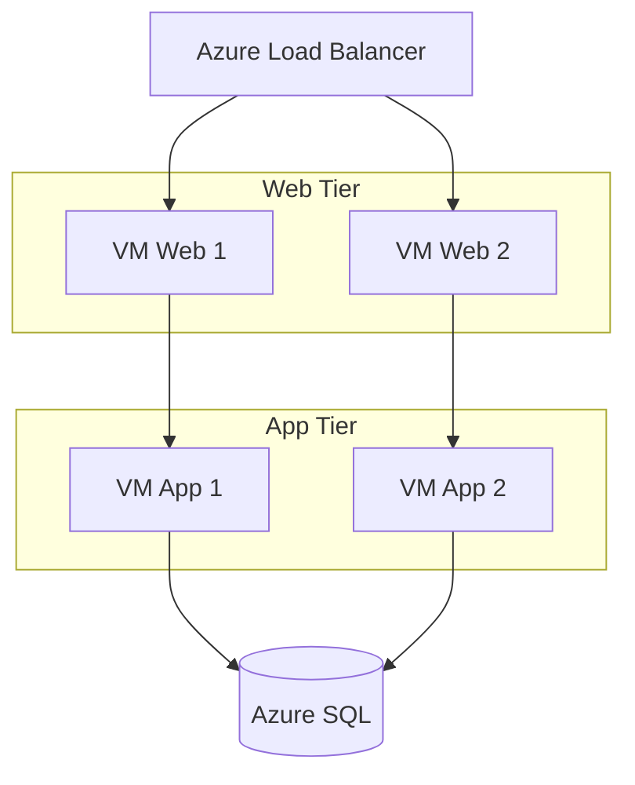

# Azure من الصفر

> **"Azure ليس مجرد بوابة ويب. إنه عشرات الخدمات التي تعمل معاً. تعلم كيف تتنقل بينها."**

## خدمات Azure الأساسية

| الخدمة            | الفئة        | الاستخدام                | متى تختارها                       |
| ----------------- | ------------ | ------------------------ | --------------------------------- |
| **Azure VM**      | حوسبة        | رفع تطبيقات قديمة        | تحتاج تحكماً كاملاً بنظام التشغيل |
| **App Service**   | حوسبة        | تطبيقات ويب و APIs       | تريد PaaS — ركز على الكود         |
| **Functions**     | حوسبة        | تشغيل كود بدون خادم      | مهام صغيرة، حدثية                 |
| **Blob Storage**  | تخزين        | ملفات، صور، نسخ احتياطية | بيانات غير منظمة                  |
| **Azure SQL**     | قواعد بيانات | SQL Server مُدار         | تحتاج SQL تقليدية                 |
| **Cosmos DB**     | قواعد بيانات | NoSQL عالمي              | تحتاج انتشاراً عالمياً            |
| **VNet**          | شبكات        | شبكات افتراضية خاصة      | عزل بيئاتك                        |
| **Load Balancer** | شبكات        | توزيع الحركة             | توفر عالي                         |
| **Key Vault**     | أمان         | تخزين الأسرار والشهادات  | لا تضع أسراراً في الكود أبداً     |
| **Monitor**       | مراقبة       | سجلات، metrics، تنبيهات  | راقب كل شيء                       |

## Azure CLI — أداتك اليومية

```bash
# تسجيل الدخول
az login

# إنشاء مجموعة موارد
az group create --name cloudnova-prod --location westeurope

# إنشاء خادم ويب
az vm create \
  --resource-group cloudnova-prod \
  --name web-01 \
  --image Ubuntu2204 \
  --admin-username azureuser \
  --generate-ssh-keys

# فتح منفذ
az vm open-port --port 80 --resource-group cloudnova-prod --name web-01

# عرض كل الخوادم
az vm list --output table

# حذف مجموعة الموارد (ينظف كل شيء)
az group delete --name cloudnova-prod --yes --no-wait
```

## بناء معمارية ثلاثية الطبقات



## نصائح Azure العملية

1. **استخدم Resource Groups** لتنظيم الموارد — كل ما يتعلق بمشروع في مجموعة واحدة
2. **وسم كل شيء Tags.** `environment=prod`, `cost-center=engineering`, `project=cloudnova`
3. **Key Vault للأسرار.** لا تضع كلمات مرور في الكود أو المتغيرات أبداً
4. **Managed Identity بدل كلمات المرور.** Azure يديرها تلقائياً
5. **احذف ما لا تستخدم.** كل مورد مهمل يكلف مالاً

## سيناريو CloudNova: فاتورة Azure مفاجئة

> **الموقف:** فاتورة Azure هذا الشهر ٣ أضعاف المتوقع. من أين؟

```bash
# ١. تحليل التكلفة
az consumption usage list --query "[?cost > 100]" --output table

# ٢. أكبر المكلفين:
# - ٥ خوادم DSv3 في بيئة dev شغالة ٢٤/٧ (٨٠٠$)
# - ٤ أقراص Premium SSD غير متصلة بأي خادم (٢٠٠$)
# - ٣ عناوين IP ثابتة غير مستخدمة (٣٠$)

# ٣. الحلول:
# - Auto-shutdown لبيئة dev الساعة ٨ مساءً
# - احذف الأقراص والـ IPs غير المستخدمة
# - غيّر unused VMs إلى B-series (رخيصة)
```

---

[← العودة للوحدة](index.md) | [🏠 الرئيسية](/)
