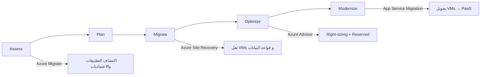

# بناء معمارية Azure حقيقية

> "المعمارية الجيدة لا تُرى في اليوم الأول. تُرى في اليوم الذي يتعطل فيه Availability Zone كامل."

## 🎯 أهداف التعلم

- تصميم Hub-Spoke Network
- تأمين التطبيقات بـ Private Endpoints
- حماية بـ WAF و Azure Front Door
- توزيع عبر Availability Zones
- التخطيط لـ Disaster Recovery
- تطبيق Azure Well-Architected Framework

---

## ١. Hub-Spoke Network Architecture

### 🔹 لماذا Hub-Spoke؟

```
                     الإنترنت
                        │
                  ┌─────▼──────┐
                  │ Azure Front │
                  │    Door     │
                  └─────┬──────┘
                        │
    ┌───────────────────▼────────────────────┐
    │              Hub VNet                   │
    │  ┌──────────┐  ┌──────────┐  ┌───────┐│
    │  │Azure     │  │VPN       │  │Azure  ││
    │  │Firewall  │  │Gateway   │  │Bastion ││
    │  └──────────┘  └──────────┘  └───────┘│
    └───┬──────────────┬──────────────┬──────┘
        │              │              │
   ┌────▼────┐   ┌─────▼────┐   ┌────▼────┐
   │ Spoke A │   │ Spoke B  │   │ Spoke C │
   │  (Dev)  │   │(Staging) │   │  (Prod) │
   │ 10.1.0  │   │ 10.2.0   │   │ 10.3.0  │
   └─────────┘   └──────────┘   └─────────┘
```

### 🔹 المميزات

| الميزة          | الوصف                               |
| --------------- | ----------------------------------- |
| **أمان مركزي**  | Firewall و IDS/IPS في Hub مرة واحدة |
| **عزل**         | كل Spoke بيئة منفصلة بشبكتها        |
| **تكلفة أقل**   | موارد مشتركة في Hub                 |
| **إدارة مبسطة** | نقطة دخول/خروج واحدة                |

### 🔹 تنفيذ Terraform

```hcl
# Hub VNet
resource "azurerm_virtual_network" "hub" {
  name                = "vnet-cloudnova-hub"
  location            = azurerm_resource_group.main.location
  resource_group_name = azurerm_resource_group.main.name
  address_space       = ["10.0.0.0/16"]
}

resource "azurerm_subnet" "firewall" {
  name                 = "AzureFirewallSubnet"
  resource_group_name  = azurerm_resource_group.main.name
  virtual_network_name = azurerm_virtual_network.hub.name
  address_prefixes     = ["10.0.0.0/26"]
}

resource "azurerm_subnet" "bastion" {
  name                 = "AzureBastionSubnet"
  resource_group_name  = azurerm_resource_group.main.name
  virtual_network_name = azurerm_virtual_network.hub.name
  address_prefixes     = ["10.0.1.0/26"]
}

resource "azurerm_subnet" "gateway" {
  name                 = "GatewaySubnet"
  resource_group_name  = azurerm_resource_group.main.name
  virtual_network_name = azurerm_virtual_network.hub.name
  address_prefixes     = ["10.0.2.0/27"]
}

# Spoke VNets
resource "azurerm_virtual_network" "spoke_prod" {
  name                = "vnet-cloudnova-prod"
  location            = azurerm_resource_group.main.location
  resource_group_name = azurerm_resource_group.main.name
  address_space       = ["10.3.0.0/16"]
}

resource "azurerm_subnet" "aks" {
  name                 = "snet-aks"
  resource_group_name  = azurerm_resource_group.main.name
  virtual_network_name = azurerm_virtual_network.spoke_prod.name
  address_prefixes     = ["10.3.0.0/22"]  # مساحة لـ 1000+ Pod
}

resource "azurerm_subnet" "database" {
  name                 = "snet-database"
  resource_group_name  = azurerm_resource_group.main.name
  virtual_network_name = azurerm_virtual_network.spoke_prod.name
  address_prefixes     = ["10.3.4.0/24"]

  delegation {
    name = "postgresql"
    service_delegation {
      name = "Microsoft.DBforPostgreSQL/flexibleServers"
    }
  }
}

# Peering: Hub ↔ Spoke
resource "azurerm_virtual_network_peering" "hub_to_prod" {
  name                      = "hub-to-prod"
  resource_group_name       = azurerm_resource_group.main.name
  virtual_network_name      = azurerm_virtual_network.hub.name
  remote_virtual_network_id = azurerm_virtual_network.spoke_prod.id
  allow_forwarded_traffic   = true
  allow_gateway_transit     = true
}

resource "azurerm_virtual_network_peering" "prod_to_hub" {
  name                      = "prod-to-hub"
  resource_group_name       = azurerm_resource_group.main.name
  virtual_network_name      = azurerm_virtual_network.spoke_prod.name
  remote_virtual_network_id = azurerm_virtual_network.hub.id
  allow_forwarded_traffic   = true
  use_remote_gateways       = true
}
```

---

## ٢. Private Endpoints: خدمات Azure بلا إنترنت

### 🔹 المشكلة

```bash
# بدون Private Endpoint:
az postgres flexible-server create \
  --public-access Enabled  # ← قاعدة البيانات على الإنترنت!

# خطر: أي شخص في العالم يستطيع محاولة الاتصال
```

### 🔹 الحل

```hcl
# Private DNS Zone
resource "azurerm_private_dns_zone" "postgres" {
  name                = "privatelink.postgres.database.azure.com"
  resource_group_name = azurerm_resource_group.main.name
}

resource "azurerm_private_dns_zone_virtual_network_link" "postgres" {
  name                  = "postgres-link"
  resource_group_name   = azurerm_resource_group.main.name
  private_dns_zone_name = azurerm_private_dns_zone.postgres.name
  virtual_network_id    = azurerm_virtual_network.spoke_prod.id
}

# Private Endpoint
resource "azurerm_private_endpoint" "postgres" {
  name                = "pe-postgres"
  location            = azurerm_resource_group.main.location
  resource_group_name = azurerm_resource_group.main.name
  subnet_id           = azurerm_subnet.database.id

  private_service_connection {
    name                           = "psc-postgres"
    private_connection_resource_id = azurerm_postgresql_flexible_server.main.id
    is_manual_connection           = false
    subresource_names              = ["postgresqlServer"]
  }

  private_dns_zone_group {
    name                 = "postgres-dns-zone-group"
    private_dns_zone_ids = [azurerm_private_dns_zone.postgres.id]
  }
}

# PostgreSQL: تعطيل الوصول العام
resource "azurerm_postgresql_flexible_server" "main" {
  name                = "psql-cloudnova-prod"
  # لا public_network_access_enabled
  # كل الاتصالات عبر Private Endpoint فقط
}
```

---

## ٣. WAF + Front Door: الحماية من التهديدات

### 🔹 لماذا WAF (Web Application Firewall)؟

- **SQL Injection**: `'; DROP TABLE users; --`
- **XSS**: `<script>stealCookies()</script>`
- **Brute Force**: 10,000 محاولة تسجيل دخول/دقيقة
- **DDoS**: 100 جيجابت/ثانية

```hcl
# Azure Front Door + WAF Policy
resource "azurerm_cdn_frontdoor_firewall_policy" "main" {
  name                = "waf-cloudnova"
  resource_group_name = azurerm_resource_group.main.name
  mode                = "Prevention"  # Detection → يراقب فقط، Prevention → يمنع

  managed_rule {
    type    = "DefaultRuleSet"
    version = "2.0"
    action  = "Block"
  }

  # قواعد مخصصة
  custom_rule {
    name     = "RateLimitLogin"
    action   = "Block"
    enabled  = true
    type     = "MatchRule"
    priority = 1

    rate_limit_duration_in_minutes = 1
    rate_limit_threshold           = 20  # 20 طلب/دقيقة

    match_condition {
      match_variable = "RequestUri"
      operator       = "Contains"
      match_values   = ["/login"]
    }
  }

  custom_rule {
    name     = "BlockGeoIP"
    action   = "Block"
    type     = "MatchRule"
    priority = 10

    match_condition {
      match_variable = "RemoteAddr"
      operator       = "GeoMatch"
      match_values   = ["IR", "KP", "CU"]  # دول غير مرغوبة
    }
  }
}

# Front Door
resource "azurerm_cdn_frontdoor_profile" "main" {
  name                = "afd-cloudnova"
  resource_group_name = azurerm_resource_group.main.name
  sku_name            = "Premium_AzureFrontDoor"
}

resource "azurerm_cdn_frontdoor_endpoint" "main" {
  name                     = "cloudnova-endpoint"
  cdn_frontdoor_profile_id = azurerm_cdn_frontdoor_profile.main.id
}

resource "azurerm_cdn_frontdoor_route" "api" {
  name                          = "api-route"
  cdn_frontdoor_endpoint_id     = azurerm_cdn_frontdoor_endpoint.main.id
  cdn_frontdoor_origin_group_id = azurerm_cdn_frontdoor_origin_group.api.id
  cdn_frontdoor_origin_ids      = [azurerm_cdn_frontdoor_origin.api.id]

  patterns_to_match      = ["/*"]
  supported_protocols    = ["Http", "Https"]
  forwarding_protocol    = "HttpsOnly"
  https_redirect_enabled = true
}
```

---

## ٤. Availability Zones: النجاة من الكوارث

### 🔹 التوزيع عبر ٣ Zones

```hcl
# Virtual Machine Scale Set موزع
resource "azurerm_linux_virtual_machine_scale_set" "web" {
  name                = "vmss-web"
  zones               = ["1", "2", "3"]  # موزع عبر ٣ مراكز بيانات

  # Zone-balancing: وزع بالتساوي
  zone_balance = true
}

# AKS Cluster
resource "azurerm_kubernetes_cluster" "main" {
  default_node_pool {
    name       = "default"
    node_count = 3
    zones      = ["1", "2", "3"]
  }

  # User node pool
}

resource "azurerm_kubernetes_cluster_node_pool" "memory" {
  name       = "memoryintensive"
  node_count = 3
  zones      = ["1", "2", "3"]
  vm_size    = "Standard_E4s_v5"
}
```

### 🔹 ماذا يحدث إذا تعطل Zone 1؟

- **VMSS**: Zone 2 و 3 يستمران. Azure ينقل الأحمال تلقائياً.
- **AKS**: Nodes في Zone 2 و 3 يواصلون العمل. Pods تُجدول هناك.
- **PostgreSQL Flexible Server**: إذا مُهيأ بـ `zone = "2"` و `standby_zone = "3"`، يتحول تلقائياً.

---

## ٥. Disaster Recovery: خطة النجاة

### 🔹 RTO و RPO

| المقياس                            | المعنى                         | CloudNova |
| ---------------------------------- | ------------------------------ | --------- |
| **RTO** (Recovery Time Objective)  | كم دقيقة للعودة؟               | 15 دقيقة  |
| **RPO** (Recovery Point Objective) | كم دقيقة من البيانات المفقودة؟ | 5 دقائق   |

### 🔹 استراتيجية Azure Site Recovery

```hcl
# Recovery Services Vault
resource "azurerm_recovery_services_vault" "main" {
  name                = "rsv-cloudnova"
  location            = azurerm_resource_group.dr.location  # منطقة مختلفة!
  resource_group_name = azurerm_resource_group.dr.name
  sku                 = "Standard"

  # تمكين Soft Delete
  soft_delete_enabled = true
}

# نسخ احتياطي لـ Azure Files
resource "azurerm_backup_policy_file_share" "daily" {
  name                = "backup-daily"
  resource_group_name = azurerm_resource_group.dr.name
  recovery_vault_name = azurerm_recovery_services_vault.main.name
  backup {
    frequency = "Daily"
    time      = "02:00"
  }
  retention_daily {
    count = 30
  }
}
```

### 🔹 إجراءات الاستعادة

```bash
# ١. تنبيه: West Europe معطل
# ٢. تشغيل Terraform في North Europe
cd environments/dr/
terraform apply -var 'location=northeurope'

# ٣. استعادة قاعدة البيانات من آخر نسخة
az postgres flexible-server restore \
  --source-server psql-cloudnova-prod \
  --name psql-cloudnova-dr \
  --restore-time "2026-07-16T14:55:00+00:00"

# ٤. توجيه Front Door لـ North Europe
az network front-door backend-pool backend add \
  --front-door-name afd-cloudnova \
  --address psql-cloudnova-dr.postgres.database.azure.com
```

### 🔹 فحص دوري

```bash
#!/bin/bash
# disaster-recovery-drill.sh - يُشغّل شهرياً

echo "🧪 بدء فحص DR..."
terraform -chdir=environments/dr/ plan  # تأكد من صلاحية التكوين
kubectl get pods -n production --context=dr-cluster
az postgres flexible-server list --query "[?contains(name,'dr')]"

echo "✅ فحص DR اكتمل. RTO الفعلي: 12 دقيقة"
```

---

## ٦. Well-Architected Framework

### 🔹 الركائز الخمس

| الركيزة                    | السؤال الأساسي     | مثال                            |
| -------------------------- | ------------------ | ------------------------------- |
| **Reliability**            | هل يتحمل الفشل؟    | Availability Zones              |
| **Security**               | هل هو محمي؟        | Private Endpoints, WAF          |
| **Cost Optimization**      | هل التكلفة مناسبة؟ | Reserved Instances, Autoscaling |
| **Operational Excellence** | هل الإدارة فعالة؟  | IaC, Monitoring, Runbooks       |
| **Performance Efficiency** | هل يستجيب بسرعة؟   | CDN, Caching, Right-sizing      |

### 🔹 قائمة تدقيق سريعة

```yaml
reliability:
  - ☑ Availability Zones مفعلة
  - ☑ Health Probes لكل الخدمات
  - ☑ خطة DR موثقة ومختبرة
  - ☑ Auto-scaling مفعل

security:
  - ☑ لا Public IPs لقواعد البيانات
  - ☑ Private Endpoints للخدمات
  - ☑ WAF أمام كل التطبيقات
  - ☑ Azure AD + RBAC
  - ☑ Secrets في Key Vault فقط

cost:
  - ☑ Reserved Instances لـ 1-3 سنوات
  - ☑ Autoscaling للأحمال المتغيرة
  - ☑ حذف الموارد غير المستخدمة
  - ☑ Budget Alerts

operations:
  - ☑ كل البنية بـ Terraform
  - ☑ CI/CD للنشر
  - ☑ Runbooks موثقة للحوادث
  - ☑ Monitoring شامل

performance:
  - ☑ CDN للمحتوى الثابت
  - ☑ Redis Cache
  - ☑ Right-sizing (لا over-provisioning)
  - ☑ Load Testing دوري
```

---

## 🏢 سيناريو CloudNova: انقطاع Availability Zone

### الموقف: ٢ يوليو ٢٠٢٦، الساعة ١١:٣٠ صباحاً

**تنبيه**: "West Europe Zone 1 - Network connectivity loss detected"

### سلسلة الأحداث

```
11:30 — Zone 1 يتعطل. 33% من العقد غير متاحة.
11:31 — Azure ينقل حركة Front Door لـ Zone 2+3 تلقائياً
11:32 — AKS يكتشف العقد الميتة. Pods تُجدول في Zone 2+3
11:33 — PostgreSQL يتحول تلقائياً لـ Standby في Zone 3
11:35 — 94% من الخدمات عادت للعمل
11:37 — Auto-scaling يُضيف عقداً إضافية في Zone 2+3
11:40 — 100% الخدمات عادت. RTO = 10 دقائق
```

### ماذا لو لم تكن Availability Zones مفعلة؟

```
11:30 — Zone 1 يتعطل. كل شيء في Zone 1 غير متاح.
11:31 — التطبيق كله متوقف.
11:35 — بدء تشغيل خطة DR.
12:30 — عودة الخدمات. RTO = 60 دقيقة.
الخسارة: 60 دقيقة × 0 حركة = خسارة كبيرة
```

---

## 🧠 Active Recall

1. لماذا Hub-Spoke أفضل من VNet واحد كبير؟
2. كيف تحمي قاعدة بيانات Azure من الإنترنت؟
3. ماذا يحدث إذا تعطل Availability Zone كامل؟
4. ما الفرق بين RTO و RPO؟
5. كيف تختبر خطة Disaster Recovery دون تعطيل الإنتاج؟

---

## 📝 تمرين Feynman

اشرح Availability Zones: تخيّل 3 مبانٍ في مدينة. كل مبنى له مولد كهرباء خاص. إذا انقطعت الكهرباء عن مبنى، المبنيان الآخران يواصلان العمل. حتى لو احترق مبنى بالكامل (لا قدر الله)، النظام يستمر لأن الحملة موزعة عبر المباني الثلاثة.

---

## 🃏 بطاقات تعليمية

| السؤال                       | الإجابة                          |
| ---------------------------- | -------------------------------- |
| نموذج شبكات موصى به          | `Hub-Spoke`                      |
| حماية خدمة Azure من الإنترنت | `Private Endpoint`               |
| جدار حماية تطبيقات الويب     | `WAF (Web Application Firewall)` |
| توزيع عبر مراكز بيانات       | `Availability Zones`             |
| زمن العودة بعد كارثة         | `RTO`                            |
| البيانات المفقودة بعد كارثة  | `RPO`                            |

---

## 🎯 أسئلة مقابلة

### س: صمم معمارية Azure لتطبيق عالي التوفر.

**الإجابة المثالية:**

1. **Front Door + WAF** في المقدمة
2. **Hub-Spoke**: Hub للخدمات المشتركة، Spoke لكل بيئة
3. **AKS** موزع عبر 3 Availability Zones
4. **PostgreSQL Flexible Server** مع Zone-Redundant HA
5. **Private Endpoints** لجميع خدمات PaaS
6. **Key Vault** للأسرار
7. **Azure Monitor + Log Analytics** للمراقبة
8. **خطة DR** في منطقة ثانية مع Site Recovery

---

---

## 🏛️ طبقة الإنتاج: تشغيل المعمارية في العالم الحقيقي

### Runbooks — ماذا تفعل عندما ينهار كل شيء

```yaml
# runbooks/critical-incident.yaml
incident_types:
  - name: "Front Door Down"
    severity: P1
    response:
      - step: "تحقق من Azure Status"
        command: "az rest --method GET --url 'https://management.azure.com/providers/Microsoft.ResourceHealth/availabilityStatuses?api-version=2020-05-01'"
      - step: "فحص DNS"
        command: "dig cloudnova.com"
      - step: "توجيه حركة المرور يدوياً"
        command: "az network front-door backend-pool backend update --address cloudnova-dr.azurewebsites.net"
      - step: "إبلاغ stakeholders"
        action: "إرسال رسالة في Slack #incidents مع ticket number"
    
  - name: "SQL Database High CPU"
    severity: P2
    response:
      - step: "تحديد الاستعلامات الثقيلة"
        kql: |
          AzureDiagnostics
          | where Category == "QueryStoreRuntimeStatistics"
          | summarize TotalCPU = sum(cpu_time_ms) by query_hash
          | order by TotalCPU desc
          | take 10
      - step: "Scale up مؤقت"
        command: "az sql db update -g prod-rg -s sqlserver --service-objective GP_Gen5_8"
      - step: "إبلاغ DBA لتحليل الاستعلامات"
```

### Capacity Planning — متى تحتاج المزيد؟

```bash
# مراقبة الاتجاهات الشهرية
az monitor metrics list \
  --resource /subscriptions/.../resourceGroups/prod-rg/providers/Microsoft.Web/sites/cloudnova-api \
  --metric "CpuPercentage" \
  --aggregation Average \
  --interval PT1H \
  --start-time $(date -d '30 days ago' -I) \
  --query "value[].{Cpu:timeseries[0].data[].average}" \
  --output table

# إذا كان الاتجاه: 45% → 55% → 62% → 71%
# المشروع: 80% خلال 3 أشهر ← افتح ticket لزيادة السعة الآن
```

### FinOps + Architecture

```
توفير دون التضحية بالأداء:
├── Dev/Test: B-series VMs + auto-shutdown ليلاً (وفر 65%)
├── Staging: 1 AZ بدلاً من 3 (وفر 50%)
├── Production: Reserved 3 سنوات (وفر 57%)
├── DR: Pilot Light (وفر 80% مقابل Active-Active)
└── غير حرج: Spot VMs (وفر حتى 90%)
```

---

## 🎨 طبقة المعماري: قرارات تتجاوز Azure

### Azure vs AWS vs GCP — متى تختار ماذا؟

| المعيار | Azure | AWS | GCP |
|---------|-------|-----|-----|
| **Microsoft ecosystem** | ⭐⭐⭐⭐⭐ | ⭐⭐⭐ | ⭐⭐ |
| **Kubernetes** | ⭐⭐⭐⭐⭐ (AKS رائد) | ⭐⭐⭐⭐ (EKS) | ⭐⭐⭐⭐⭐ (GKE) |
| **AI/ML** | ⭐⭐⭐⭐ (OpenAI) | ⭐⭐⭐⭐ (SageMaker) | ⭐⭐⭐⭐⭐ (Vertex AI) |
| **Serverless** | ⭐⭐⭐⭐ (Functions) | ⭐⭐⭐⭐⭐ (Lambda) | ⭐⭐⭐ (Cloud Functions) |
| **Hybrid** | ⭐⭐⭐⭐⭐ (Arc, Stack) | ⭐⭐⭐ (Outposts) | ⭐⭐⭐ (Anthos) |
| **Enterprise** | ⭐⭐⭐⭐⭐ | ⭐⭐⭐⭐ | ⭐⭐⭐ |

### Multi-Cloud — هل هو ضرورة أم وهم؟

```
أسباب وجيهة لـ Multi-Cloud:
✅ استحواذ شركة (فريقان يستخدمان سحابتين مختلفتين)
✅ متطلب تنظيمي (بيانات في سحابة محددة)
✅ أفضلية تقنية (Azure للـ enterprise + GCP للـ AI)

أسباب وهمية:
❌ "تجنب vendor lock-in" — تكلفة التعقيد أعلى من تكلفة التبديل
❌ "Negotiate better prices" — Reserved Instances تعطي خصماً كافياً
❌ "كل المنافسين يفعلونها" — Cargo cult
```

### الترحيل من On-Premises — خارطة طريق



---

## 🛠️ تدريبات عملية

### تمرين ١: صمم Hub-Spoke (سهل)

> صمم Hub-Spoke architecture لـ CloudNova:
> - Hub: Azure Firewall + Bastion + VPN Gateway
> - Spoke A: Development (10.1.0.0/16)
> - Spoke B: Production (10.3.0.0/16) مع 3 Subnets (web, app, db)
> - Peering بين Hub وكل Spoke
> - Azure Policy: Spoke A لا يسمح بـ D-series VMs (فقط B-series للتطوير)

### تمرين ٢: حادثة — تعطل Zone (متوسط)

> Zone 1 في West Europe تعطل. أنت مهندس on-call. اكتب الـ runbook خطوة بخطوة:
> 1. كيف تكتشف التعطل؟ (Alert configuration)
> 2. كيف تؤكد أنه Zone-wide؟
> 3. ماذا تفعل لاستعادة الخدمة؟
> 4. كيف تتواصل مع الفريق والإدارة؟

### تحدي: خطة DR كاملة (متقدم)

> صمم خطة Disaster Recovery كاملة:
> - RTO: 10 دقائق
> - RPO: دقيقة واحدة
> - يجب أن تشمل: Front Door failover، SQL geo-restore، AKS recovery، DNS update
> - وثق كل خطوة مع الأوامر
> - قدر التكلفة الإضافية الشهرية

### مشروع CloudNova

> **Ticket #CN-702:** "المستثمرون يطلبون إثبات أن CloudNova تستطيع النجاة من كارثة كاملة. خطط ونفذ DR drill."

---

## 📝 تقييم المعرفة

### ✅ تحقق من فهمك (5)

1. لماذا Hub-Spoke أفضل من VNet واحد كبير؟ اذكر ٣ أسباب.
2. كيف تحمي Azure SQL من الإنترنت تماماً؟
3. ما الفرق بين Azure Firewall و NSG و WAF؟
4. كيف تصمم لـ 99.99% Availability في Azure؟
5. ما هو Azure Well-Architected Framework؟ اذكر ركائزه الخمس.

### 📝 اختبار (3 أسئلة)

**س١:** Front Door يوفر أي نوع من الـ load balancing؟

- **أ)** Layer 4 (TCP)
- **ب)** Layer 7 (HTTP/HTTPS) مع global routing
- **ج)** Layer 3 (Network)

<details><summary>الإجابة</summary>
**ب) Layer 7 مع global routing.** Front Door ليس load balancer عادي — إنه global anycast service يوجه المستخدمين لأقرب region ويوفر SSL termination و WAF.
</details>

**س٢:** كم تكلفة تشغيل 3 AZ + Region Pair لـ DR؟

<details><summary>الإجابة</summary>

```
Primary (3 AZ):
├── App Service: $438 (P1v3 × 3)
├── SQL (BC, zone-redundant): $1,200
├── Redis: $300
└── Front Door: $50

DR (Pilot Light):
├── App Service: $146 (P1v3 × 1)
├── SQL geo-replica: $600
└── Front Door (included)

الإجمالي: ~$2,734/شهر
(Active-Passive يوفر 60% مقابل Active-Active)
```
</details>

**س٣:** أيهما أفضل: Azure Firewall أم NSG؟

<details><summary>الإجابة</summary>
الاثنان معاً — ليس أحدهما:
- **NSG**: Layer 4 filtering على subnet/NIC. بسيط وسريع ومجاني
- **Azure Firewall**: Layer 7 inspection، threat intelligence، FQDN filtering، IDPS. مدفوع (~$900/شهر)

استخدم NSG للقواعد البسيطة (allow HTTPS). استخدم Firewall للـ egress filtering والتهديدات المتقدمة.
</details>

### 🧠 استدعاء نشط (5)

1. ارسم Hub-Spoke architecture من الذاكرة مع كل المكونات.
2. اشرح الفرق بين RTO و RPO — بمثال: لو تعطل Azure SQL لمدة ساعة.
3. كيف تحمي تطبيق ويب من OWASP Top 10 في Azure؟
4. ما فائدة Private DNS Zone مع Private Endpoint؟
5. اذكر 5 أسئلة من Well-Architected Framework لتقييم معماريتك.

### ✍️ تمرين Feynman

اشرح Availability Zones لشخص غير تقني:

> "مدينة الملاهي CloudNova فيها ٣ محطات كهرباء مستقلة. إذا احترقت محطة، المدينتان الأخريان تواصلان العمل. الزوار لا يلاحظون شيئاً. هذه هي Availability Zones."

### 🎴 بطاقات تعليمية (8)

| السؤال | الإجابة |
|--------|---------|
| Hub-Spoke = ؟ | نموذج شبكات: Hub للموارد المشتركة، Spoke للبيئات |
| Private Endpoint = ؟ | نقطة اتصال خاصة بخدمة Azure داخل VNet |
| WAF = ؟ | Web Application Firewall — يحمي من OWASP Top 10 |
| Front Door = ؟ | Global load balancer + CDN + WAF |
| RTO = ؟ | Recovery Time Objective — أقصى وقت تعطل |
| RPO = ؟ | Recovery Point Objective — أقصى فقدان بيانات |
| Well-Architected = ؟ | إطار عمل من 5 ركائز لتصميم سحابي مثالي |
| Azure Policy = ؟ | قواعد تمنع/تسمح بإنشاء موارد وفق معايير |

---

## 🎤 التحضير للمقابلة (موسع)

### System Design

**"صمم بنية تحتية لمؤسسة مالية على Azure — تخدم 5 ملايين عميل."**

<details>
<summary>👀 نموذج الإجابة</summary>

```
الأمان أولاً:
├── Hub-Spoke: كل بيئة Spoke معزولة
├── Azure Firewall في Hub (egress filtering)
├── Private Endpoints لكل الخدمات (0 public endpoints)
├── WAF + Front Door (DDoS + OWASP)
├── Key Vault HSM (FIPS 140-2 Level 3)
├── Azure Policy: deny public IPs, require encryption
└── Sentinel + Defender for Cloud

التوفر:
├── 3 AZ لكل region
├── Active-Active: West Europe + North Europe
├── SQL: Auto-failover group مع 2 replicas
├── AKS: 3 nodes minimum per AZ
└── RTO: < 5 min, RPO: < 1 min

الامتثال:
├── PCI DSS: WAF + encryption + audit logs
├── GDPR: EU data residency + right to deletion
├── SOC 2: Access reviews + change management
└── Azure Policy enforces compliance automatically

التكلفة:
├── Production (Active-Active): ~$12,000/شهر
├── Dev/Test: ~$3,000/شهر
└── Reserved 3 سنوات: وفر 40%
```
</details>

### سؤال تقني

**"كيف تصمم شبكة لمؤسسة بـ 500 مهندس و 50 تطبيقاً؟"**

<details>
<summary>👀 الإجابة</summary>

```
Hub-Spoke على نطاق المؤسسة:

Hub:
├── Azure Firewall Premium (TLS inspection, IDPS)
├── VPN Gateway (للـ 500 مهندس)
├── Bastion (للوصول الآمن)
├── DNS Private Resolver
└── Log Analytics

Spokes (منفصلة):
├── Spoke-Prod (10.100.0.0/16)
│   ├── 3 Subnets: web, app, db
│   └── Azure Policy: deny public IP
├── Spoke-Staging (10.200.0.0/16)
│   └── Azure Policy: deny D-series+
├── Spoke-Dev (10.50.0.0/16)
│   └── Azure Policy: require auto-shutdown
└── Spoke-Shared (10.10.0.0/16)
    └── خدمات مشتركة (CI/CD, Monitoring)

VNet Peering:
├── Hub ↔ Spoke-Prod
├── Hub ↔ Spoke-Staging
└── Spoke-Shared (مسموح لجميع الـ spokes)

التكلفة: ~$1,500/شهر للـ networking
```
</details>

### سؤال سلوكي (STAR)

**"احكِ عن مرة حسّنت فيها معمارية Azure."**

> **S**: تطبيق CloudNova كان بطيئاً ومكلفاً — monolith على VMs.  
> **T**: خفض latency 60% وخفض التكلفة 30%.  
> **A**: صممت Hub-Spoke. نقلت web tier لـ App Service (مع auto-scaling). أضفت Redis Cache. Private Endpoints لـ SQL بدل public. Front Door + WAF.  
> **R**: Latency من 800ms → 320ms. تكلفة من $3,500 → $2,450. Zero downtime خلال Black Friday.

---

## 📚 المراجع والروابط

### دروس مرتبطة
- [Azure Fundamentals](./01-azure-fundamentals) — الأساسيات
- [Kubernetes Architecture](../10-kubernetes/01-kubernetes-architecture) — AKS
- [Observability Essentials](../21-observability/01-observability-essentials) — مراقبة المعمارية
- [Identity Mastery](../23-identity/01-identity-mastery)

### شهادات ذات صلة
- **AZ-104**: Azure Administrator
- **AZ-305**: Azure Solutions Architect Expert
- **AZ-700**: Azure Networking Engineer

### مصادر خارجية
- 📖 [Azure Well-Architected Framework](https://learn.microsoft.com/en-us/azure/well-architected/)
- 📖 [Cloud Adoption Framework](https://learn.microsoft.com/en-us/azure/cloud-adoption-framework/)
- 📖 [Azure Networking Best Practices](https://learn.microsoft.com/en-us/azure/security/fundamentals/network-best-practices)

### مصطلحات التقنية
| المصطلح | التعريف |
|---------|---------|
| **Hub-Spoke** | نموذج شبكات: Hub مركزي + Spokes بيئات |
| **VNet Peering** | ربط شبكتين افتراضيتين مباشر |
| **WAF** | Web Application Firewall — جدار حماية تطبيقات |
| **Front Door** | موزع أحمال عالمي مع CDN و WAF |
| **Private Link** | خدمة توصل Azure PaaS لـ VNet بدون إنترنت |
| **DR Drill** | اختبار خطة التعافي من الكوارث |

---

[← العودة للموديول](./01-azure-fundamentals) | [→ الدرس التالي: Container Fundamentals](../08-containers/01-container-fundamentals) | [🏠 الرئيسية](/)
