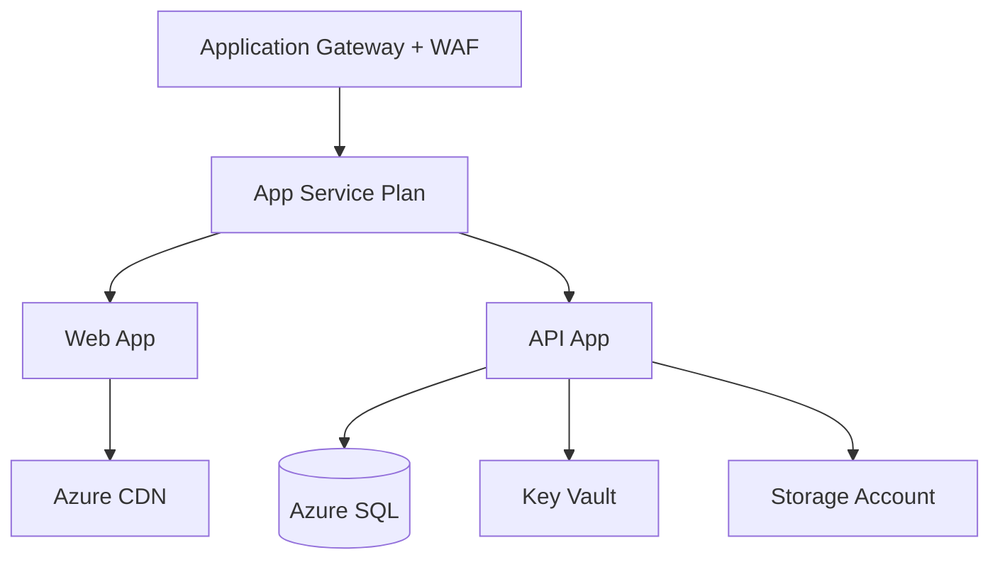

# Azure التطبيقي

> **"النظرية وحدها لا تكفي. لنبنِ معمارية حقيقية الآن."**

## معمارية CloudNova للإنتاج



## بنائها خطوة بخطوة

```bash
# ١. مجموعة الموارد
az group create --name cloudnova-prod --location westeurope

# ٢. App Service Plan
az appservice plan create --name cloudnova-plan \
  --resource-group cloudnova-prod --sku P1v2 --is-linux

# ٣. Web App
az webapp create --name cloudnova-web \
  --plan cloudnova-plan --resource-group cloudnova-prod \
  --runtime "PYTHON:3.12"

# ٤. Azure SQL مع Private Endpoint
az sql server create --name cloudnova-sql \
  --resource-group cloudnova-prod \
  --admin-user cloudnova --admin-password "$(az keyvault secret show --name sql-password --vault-name cloudnova-kv --query value -o tsv)"

# ٥. Key Vault
az keyvault create --name cloudnova-kv \
  --resource-group cloudnova-prod --location westeurope
```

## التكلفة التقديرية

| المورد | المستوى | التكلفة/شهر |
|---|---|---|
| App Service Plan | P1v2 | ~$١٤٦ |
| Azure SQL | General Purpose | ~$٣٧٥ |
| Key Vault | Standard | ~$٠.٣٠ |
| Application Gateway | WAF v2 | ~$٣٥٠ |
| CDN | Standard | ~$٢٠ |
| **الإجمالي** | | **~$٨٩١** |

---

[← الدرس السابق](azure-fundamentals) | [العودة للوحدة](index.md) | [🏠 الرئيسية](/)
