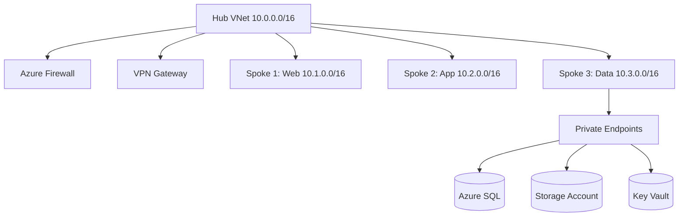

# شبكات Azure المتقدمة

> "الشبكة هي العمود الفقري لكل شيء في السحابة. صممها بشكل صحيح من البداية."

## 🎯 أهداف التعلم

- تصميم Hub-Spoke network topology
- VNet Peering و Global Peering
- Private Endpoints للأمان
- Service Endpoints vs Private Link
- استكشاف أخطاء الاتصال

## ⏱️ الوقت المقدر: 45 دقيقة | المستوى: Advanced

---

## 🏗️ Hub-Spoke Architecture



### VNet Peering

```bash
# إنشاء peering بين Hub و Spoke
az network vnet peering create \
  --name hub-to-spoke1 \
  --resource-group cloudnova-hub \
  --vnet-name hub-vnet \
  --remote-vnet /subscriptions/.../spoke1-vnet \
  --allow-vnet-access \
  --allow-forwarded-traffic \
  --allow-gateway-transit  # Hub يشارك بوابته

# Spoke يستخدم بوابة Hub
az network vnet peering create \
  --name spoke1-to-hub \
  --resource-group cloudnova-spoke \
  --vnet-name spoke1-vnet \
  --remote-vnet /subscriptions/.../hub-vnet \
  --use-remote-gateways
```

### Private Endpoints — وصول خاص كلياً

```bash
# إنشاء Private Endpoint لـ Azure SQL
az network private-endpoint create \
  --name sql-private-endpoint \
  --resource-group cloudnova-data \
  --vnet-name spoke3-vnet \
  --subnet private-endpoints \
  --private-connection-resource-id /subscriptions/.../sqlServers/cloudnova-sql \
  --group-ids sqlServer \
  --connection-name sql-connection

# الآن SQL لا يمكن الوصول إليه إلا من داخل الـ VNet
# Public access معطل تماماً
```

---

## 🏛️ سيناريو CloudNova: مشكلة اتصال

**المشكلة**: App Service في Spoke 2 لا يستطيع الاتصال بـ SQL Database في Spoke 3.

**التحقيق**:
1. هل Service Endpoint مفعل على subnet Spoke 2؟ ✅
2. هل Private Endpoint موجود في Spoke 3؟ ✅
3. هل DNS يحل إلى الـ private IP؟ ❌ — المشكلة هنا!

**الحل**: DNS Private Zone غير مرتبط بـ Spoke 2 VNet.

```bash
# ربط Private DNS Zone
az network private-dns zone link create \
  --zone-name privatelink.database.windows.net \
  --name spoke2-link \
  --resource-group cloudnova-dns \
  --virtual-network spoke2-vnet \
  --registration-enabled false
```

---

## 🛠️ تدريبات

### تمرين: صمم شبكة CloudNova

ارسم topology لـ CloudNova:
- Hub: Azure Firewall + VPN Gateway
- 3 Spokes: Web, App, Data
- Private Endpoints لقاعدة البيانات
- كل الـ outbound traffic يمر عبر Firewall

---

[← Azure Architecture](./02-azure-architecture) | [→ Storage Deep Dive](./04-azure-storage-deep-dive) | [🏠 الرئيسية](/)
