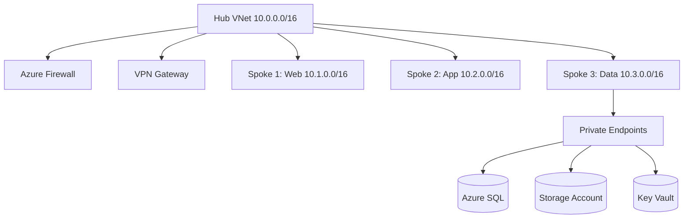

# شبكات Azure المتقدمة

> "الشبكة هي العمود الفقري لكل شيء في السحابة. صممها بشكل صحيح من البداية."

## 🎯 أهداف التعلم

- تصميم Hub-Spoke network topology
- VNet Peering و Global Peering
- Private Endpoints للأمان
- Service Endpoints vs Private Link
- استكشاف أخطاء الاتصال

## ⏱️ الوقت المقدر: 45 دقيقة | المستوى: Advanced

---

## 🏗️ Hub-Spoke Architecture



### VNet Peering

```bash
# إنشاء peering بين Hub و Spoke
az network vnet peering create \
  --name hub-to-spoke1 \
  --resource-group cloudnova-hub \
  --vnet-name hub-vnet \
  --remote-vnet /subscriptions/.../spoke1-vnet \
  --allow-vnet-access \
  --allow-forwarded-traffic \
  --allow-gateway-transit  # Hub يشارك بوابته

# Spoke يستخدم بوابة Hub
az network vnet peering create \
  --name spoke1-to-hub \
  --resource-group cloudnova-spoke \
  --vnet-name spoke1-vnet \
  --remote-vnet /subscriptions/.../hub-vnet \
  --use-remote-gateways
```

### Private Endpoints

```bash
az network private-endpoint create \
  --name sql-private-endpoint \
  --resource-group cloudnova-data \
  --vnet-name spoke3-vnet \
  --subnet private-endpoints \
  --private-connection-resource-id /subscriptions/.../sqlServers/cloudnova-sql \
  --group-ids sqlServer \
  --connection-name sql-connection
```

---

## 🏛️ طبقة الإنتاج: سيناريو CloudNova

**المشكلة**: App Service في Spoke 2 لا يستطيع الاتصال بـ SQL Database في Spoke 3.

```bash
# 1. فحص Service Endpoint
az network vnet subnet show --vnet-name spoke2-vnet --name app-subnet \
  --query "serviceEndpoints"

# 2. فحص Private DNS Zone
az network private-dns zone list --query "[?zoneName=='privatelink.database.windows.net']"

# 3. المشكلة: DNS Zone غير مرتبط بـ Spoke 2!
az network private-dns link vnet create \
  --zone-name privatelink.database.windows.net \
  --name spoke2-link \
  --resource-group cloudnova-dns \
  --virtual-network spoke2-vnet \
  --registration-enabled false
```

**الدرس**: DNS هو المتهم الخفي في 80% من مشاكل الشبكة!

---

## 🎨 طبقة المعماري

### Service Endpoints vs Private Link

|                       | Service Endpoint                   | Private Link       |
| --------------------- | ---------------------------------- | ------------------ |
| **التكلفة**           | مجاني                              | مدفوع              |
| **IP**                | Public IP (لكن عبر Azure backbone) | Private IP في VNet |
| **الوصول من On-Prem** | ❌ (بدون VPN/ER)                   | ✅ (عبر VPN)       |
| **Data Exfiltration** | ممكن (إذا خمن الـ IP)              | مستحيل             |

**القاعدة**: Service Endpoints جيدة. Private Link أفضل. استخدم Private Link للبيانات الحساسة.

### Global Peering

```bash
az network vnet peering create \
  --name eu-to-us \
  --resource-group cloudnova-eu \
  --vnet-name eu-vnet \
  --remote-vnet /subscriptions/.../us-vnet \
  --allow-vnet-access
# الاتصال عبر Azure backbone — ليس عبر الإنترنت!
```

---

## 🛠️ تدريبات

### تمرين: صمم شبكة CloudNova

صمم topology: Hub + 3 Spokes + Private Endpoints + Firewall.

### تحدي: استكشاف مشكلة اتصال

صمم سيناريو فشل اتصال بين خدمتين واستخدم `az network` لتشخيصه.

---

## 📝 تقييم

### ✅ فحص المعرفة

1. ما الفرق بين Service Endpoint و Private Link؟
2. لماذا Hub-Spoke أفضل من mesh topology؟
3. كيف يختلف Global Peering عن VNet Peering العادي؟
4. متى تستخدم Private DNS Zone؟

### 🃏 بطاقات

| السؤال       | الإجابة                             |
| ------------ | ----------------------------------- |
| VNet Peering | ربط VNets عبر Azure backbone        |
| Private Link | وصول خاص لخدمات PaaS عبر Private IP |
| Hub-Spoke    | Hub مركزي + Spokes متفرعة           |

---

## 🎤 مقابلة

1. **"صمم شبكة Azure لـ 500 مهندس"**
   → Hub-Spoke + Firewall + VPN/ER + Private Link + DNS resolution

2. **"كيف تستكشف مشكلة اتصال بين خدمتين في Azure؟"**
   → DNS check → NSG rules → Route tables → VNet peering → Firewall logs

---

## 📚 مراجع

| النوع     | الرابط                                        |
| --------- | --------------------------------------------- |
| درس مرتبط | [Azure Storage](./04-azure-storage-deep-dive) |
| شهادة     | AZ-700 (Azure Networking)                     |
| شهادة     | AZ-104 (Administrator)                        |

---

[← Azure Architecture](./02-azure-architecture) | [→ Storage Deep Dive](./04-azure-storage-deep-dive) | [🏠 الرئيسية](/)
