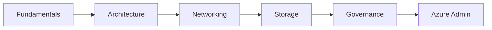

import Tabs from '@theme/Tabs';
import TabItem from '@theme/TabItem';

# 🚀 Azure Core

> أساسيات Azure، المعمارية، الشبكات، التخزين، الحوكمة — كل ما تحتاجه لـ AZ-104.

## 🎯 أهداف التعلم

بعد إكمال هذه الوحدة، ستكون قادراً على:

- [**أساسيات Azure**](01-azure-fundamentals) — البوابة، CLI، PowerShell
- [**معمارية Azure**](02-azure-architecture) — تصميم الحلول
- [**شبكات Azure**](03-azure-networking-vnet-peering) — VNet Peering
- [**تخزين Azure**](04-azure-storage-deep-dive) — Blob، Files، Disks
- [**الحوكمة**](05-azure-governance-management-groups) — Policy و Management Groups

## 💡 المهارات التي ستكتسبها

Azure Architecture • VNet • Storage • Governance • Management Groups

## 📊 معلومات الوحدة

| العنصر           | القيمة          |
| ---------------- | --------------- |
| **المستوى**      | متوسط           |
| **الوقت المقدر** | 10 ساعات        |
| **المتطلبات**    | أساسيات السحابة |
| **الشهادات**     | AZ-104, AZ-305  |
| **المشاريع**     | نشر بيئة كاملة  |
| **المختبرات**    | Azure Portal    |

## 🏛️ مهمة CloudNova

> صمم معمارية CloudNova على Azure: شبكة، تخزين، حوكمة، وأمان من اليوم الأول.

## 🗺️ خريطة الوحدة

## 📖 الدروس

<Tabs>
<TabItem value="all" label="كل الدروس" default>

- [**أساسيات Azure**](01-azure-fundamentals) — البوابة، CLI، PowerShell
- [**معمارية Azure**](02-azure-architecture) — تصميم الحلول
- [**شبكات Azure**](03-azure-networking-vnet-peering) — VNet Peering
- [**تخزين Azure**](04-azure-storage-deep-dive) — Blob، Files، Disks
- [**الحوكمة**](05-azure-governance-management-groups) — Policy و Management Groups

</TabItem>
</Tabs>

## 🚀 ابدأ التعلم

[▶️ ابدأ الدرس الأول](01-azure-fundamentals)
