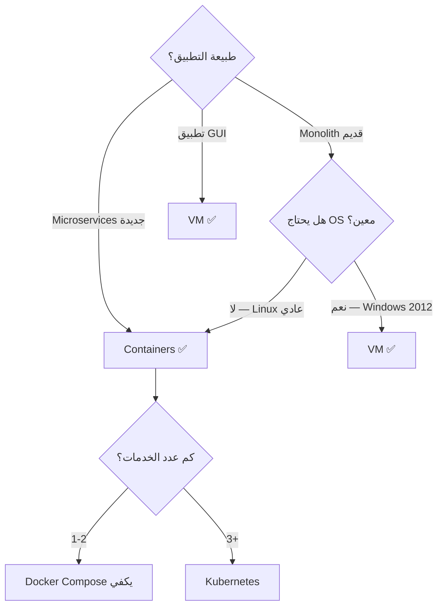

# أساسيات الحاويات (Containers)

> "الحاوية ليست VM صغيرة. الحاوية هي عملية محاطة بجدار خفيف."

## 🎯 أهداف التعلم

- فهم الفرق الجوهري بين الحاويات والآلات الافتراضية
- فهم namespaces و cgroups (آلية عمل الحاويات)
- إتقان بناء صور Docker بكفاءة (multi-stage builds)
- فهم نموذج OCI والحاويات في Kubernetes
- تطبيق أنماط الحاويات الإنتاجية

---

## 📖 الطبقة الأساسية: لماذا الحاويات؟

### المشكلة قبل الحاويات

```
المطور: "الكود يشتغل على جهازي!"
DevOps: "لا يشتغل على السيرفر..."
المطور: "نفس نظام التشغيل، نفس النسخة..."
DevOps: "لكن نسخة Python مختلفة..."
```

الحاويات تحل هذه المشكلة بتغليف التطبيق **مع كل اعتمادياته** في وحدة واحدة قابلة للنقل.

### الحاوية vs الآلة الافتراضية

```
Virtual Machine (VM):
┌──────────────────────────────────┐
│ App A     │ App B    │
│ Bins/Libs │ Bins/Libs│
│ Guest OS  │ Guest OS │
├──────────────────────────────────┤
│ Hypervisor                      │
├──────────────────────────────────┤
│ Host OS                         │
│ Hardware                        │
└──────────────────────────────────┘

Container:
┌──────────────────────────────────┐
│ App A     │ App B    │
│ Bins/Libs │ Bins/Libs│
├──────────────────────────────────┤
│ Container Runtime (Docker)      │
├──────────────────────────────────┤
│ Host OS                         │
│ Hardware                        │
└──────────────────────────────────┘
```

| الفرق        | VM                    | Container             |
| ------------ | --------------------- | --------------------- |
| نظام التشغيل | نظام كامل لكل VM      | يشارك Host OS kernel  |
| الحجم        | GBs                   | MBs                   |
| التشغيل      | دقائق                 | ثوانٍ                 |
| العزل        | قوي جداً (hypervisor) | خفيف (namespaces)     |
| الكثافة      | 10-20 VM/server       | 100+ container/server |

---

## 🧱 الطبقة المهنية: ما بداخل الحاوية

### Linux Namespaces — كيف ترى الحاوية "عالمها الخاص"

| namespace  | ماذا يعزل             | مثال                            |
| ---------- | --------------------- | ------------------------------- |
| **PID**    | قائمة العمليات        | `ps aux` يرى فقط عمليات الحاوية |
| **NET**    | واجهات الشبكة         | للحاوية IP خاص و routing table  |
| **MNT**    | نظام الملفات          | `/` يرى فقط ملفات الحاوية       |
| **UTS**    | اسم المضيف            | hostname مختلف عن الـ host      |
| **IPC**    | التواصل بين العمليات  | shared memory معزول             |
| **USER**   | المستخدمين والمجموعات | root في الحاوية ≠ root في host  |
| **CGROUP** | حدود الموارد          | CPU/RAM مخصص للحاوية            |

### Cgroups — حدود الموارد

```bash
# رؤية cgroups مباشرة
docker run --memory=512m --cpus=2 nginx

# داخل host:
cat /sys/fs/cgroup/memory/docker/<container-id>/memory.limit_in_bytes
# الناتج: 536870912 (512MB)

# منع حاوية من استهلاك كل الذاكرة
docker run \
  --memory=1g \
  --memory-swap=1g \
  --cpus=2 \
  --pids-limit=100 \
  my-app
```

### طبقات الصورة (Image Layers)

```dockerfile
# كل أمر يبني طبقة جديدة
FROM ubuntu:22.04                    # Layer 1: 77MB
RUN apt-get update && apt-get install -y python3  # Layer 2: 150MB
RUN pip install flask                 # Layer 3: 5MB
COPY app.py /app/                    # Layer 4: 1KB
CMD ["python3", "/app/app.py"]       # Layer 5 (metadata only)
```

**سبب أهمية الطبقات:**

- الصور تشترك في الطبقات → توفير مساحة
- التغيير في طبقة يعيد بناء ما بعدها فقط
- النقل أسرع (ننقل الطبقات الجديدة فقط)

---

## 🏗️ الطبقة الإنتاجية: بناء صور احترافية

### Multi-Stage Builds — الحجم مهم

```dockerfile
# ====== مرحلة البناء ======
FROM node:18-alpine AS builder
WORKDIR /app
COPY package*.json ./
RUN npm ci --only=production
COPY . .
RUN npm run build

# ====== مرحلة الإنتاج ======
FROM nginx:1.25-alpine
# لا npm! لا node_modules! لا كود مصدري!
COPY --from=builder /app/dist /usr/share/nginx/html
COPY nginx.conf /etc/nginx/nginx.conf
EXPOSE 80
```

**قبل multi-stage:** 950MB
**بعد multi-stage:** 12MB
هذا فرق 98% في الحجم!

### أفضل ممارسات Dockerfile — القائمة النهائية

```dockerfile
# 1. استخدم صورة أساسية محددة
FROM python:3.12-slim-bookworm  # ✅ محدد
# FROM python:latest           # ❌ غير محدد

# 2. استخدم مستخدم غير root
RUN useradd --create-home --shell /bin/bash appuser
USER appuser

# 3. انسخ ملفات الاعتماديات أولاً (للاستفادة من التخزين المؤقت)
COPY requirements.txt .
RUN pip install --no-cache-dir -r requirements.txt
COPY . .

# 4. دمج أوامر RUN
RUN apt-get update && \
    apt-get install -y --no-install-recommends \
      curl \
      ca-certificates && \
    apt-get clean && \
    rm -rf /var/lib/apt/lists/*

# 5. HEALTHCHECK
HEALTHCHECK --interval=30s --timeout=3s --retries=3 \
  CMD curl -f http://localhost:8080/health || exit 1

# 6. لا تستخدم root
USER 1000
```

### .dockerignore — لا ترسل كل شيء

```
# .dockerignore
node_modules/
__pycache__/
*.pyc
.git/
.gitignore
.env
.env.local
Dockerfile
docker-compose.yml
.vscode/
.idea/
*.md
tests/
```

---

## 🎨 الطبقة المعمارية: OCI ومعايير الصناعة

### Open Container Initiative (OCI)

```
OCI Specifications:
├── Image Spec — كيف تُبنى الصورة وطبقاتها
│   ├── Image Manifest (فهرس الطبقات)
│   ├── Image Configuration (الإعدادات)
│   └── Layer Filesystems (الطبقات الفعلية)
│
└── Runtime Spec — كيف تُشغّل الحاوية
    ├── config.json (التكوين)
    └── rootfs (نظام الملفات)
```

**لماذا OCI مهم؟**

لأنه يعني أن صورتك تشتغل على **أي** runtime متوافق: Docker، containerd، CRI-O، Podman.

### العزل الأمني — مستويات مختلفة

```
مستوى العزل (من الأضعف إلى الأقوى):

1. Docker (default) — namespaces + cgroups فقط
2. Docker + seccomp + AppArmor
3. Docker + user namespaces + read-only rootfs
4. gVisor (userspace kernel) — طبقة إضافية
5. Kata Containers (VM خفيفة) — Hypervisor
```

**قاعدة ذهبية:** لا تثق أبداً بالكود الذي يشغله العميل في نفس الحاوية مع خدمتك.

---

## 🏥 سيناريو CloudNova: تحويل تطبيق إلى حاويات

```
📋 التذكرة: HYD-1301
النوع: مهمة بنية تحتية
الأولوية: عالية

الوصف:
تطبيق Python/Flask القديم يحتاج تحويله إلى Docker.
حالياً يأخذ 30 دقيقة لتثبيته على كل سيرفر.

المطلوب:
1. كتابة Dockerfile بـ multi-stage build
2. حجم الصورة النهائية أقل من 100MB
3. تشغيل بـ non-root user
4. HEALTHCHECK endpoint
5. docker-compose للتطوير المحلي
6. تجهيز pipeline test للصورة

الحل:

# 1. Dockerfile
# 2. docker-compose.yml:
version: "3.9"
services:
  api:
    build:
      context: .
      dockerfile: Dockerfile
    image: cloudnova-api:latest
    ports:
      - "8080:8080"
    environment:
      - DB_HOST=database
      - REDIS_HOST=cache
    depends_on:
      database:
        condition: service_healthy
    healthcheck:
      test: ["CMD", "curl", "-f", "http://localhost:8080/health"]
      interval: 30s
      retries: 3

  database:
    image: postgres:16-alpine
    environment:
      POSTGRES_DB: cloudnova
      POSTGRES_USER: app
      POSTGRES_PASSWORD: ${DB_PASSWORD}
    volumes:
      - pgdata:/var/lib/postgresql/data
    healthcheck:
      test: ["CMD-SHELL", "pg_isready -U app -d cloudnova"]
      interval: 10s

  cache:
    image: redis:7-alpine
    ports:
      - "6379:6379"
    volumes:
      - redisdata:/data

volumes:
  pgdata:
  redisdata:
```

---

## ⚡ الإنتاج وما بعده

### مشاكل شائعة وحلولها

| المشكلة               | السبب المحتمل        | الحل                              |
| --------------------- | -------------------- | --------------------------------- |
| الحاوية تخرج فوراً    | لا عملية foreground  | تأكد من CMD الصحيح                |
| "port already in use" | منفذ مستخدم على host | غيّر المنفذ أو أوقف العملية       |
| الحاوية لا ترى الشبكة | DNS/network issue    | جرب `--network host` للتشخيص      |
| Out of Memory         | cgroup memory limit  | زد `--memory` أو حلل التسريبات    |
| "permission denied"   | user/group mismatch  | استخدم `--user` أو صحح Dockerfile |

### أوامر تشخيصية أساسية

```bash
# ماذا يحدث داخل الحاوية؟
docker exec -it container-name /bin/sh

# استهلاك الموارد
docker stats --no-stream

# سجلات الحاوية
docker logs --tail=100 -f container-name

# ماذا تغير في الحاوية عن الصورة؟
docker diff container-name

# فحص الصورة — الطبقات والإعدادات
docker image inspect image-name
docker history image-name

# تنظيف الصور غير المستخدمة
docker image prune -a
docker system prune -a --volumes
```

---

## 🧠 التذكّر النشط

1. ما الفرق الأساسي بين الحاوية والآلة الافتراضية؟
2. كيف تستخدم namespaces لعزل PID و NETWORK؟
3. لماذا نستخدم multi-stage builds؟
4. ما هي أفضل ممارسة لتشغيل العمليات داخل الحاوية (user/root)؟
5. كيف تفحص حجم الصورة وطبقاتها؟

## 🗣️ تمرين فاينمان

اشرح الحاويات لشخص غير تقني:

"تخيل أنك تريد إرسال لعبة لأصدقائك. بدلاً من إرسال اللعبة مع تعليمات 'ثبّت DirectX، ثبّت Visual C++، اضبط الإعدادات'، ترسل لهم صندوقاً يحتوي اللعبة وكل ما تحتاجه جاهزة للتشغيل مباشرة. الصندوق هو الحاوية."

## 📝 بطاقات تعليمية

- **Image**: قالب للقراءة فقط يحتوي التطبيق واعتمادياته
- **Container**: نسخة مشغّلة من الصورة (طبقة قراءة/كتابة فوقها)
- **Dockerfile**: وصفة بناء الصورة
- **Registry**: مستودع لتخزين الصور (Docker Hub, ACR, ECR)
- **Layer**: طبقة في الصورة، تشترك فيها الحاويات لتوفير المساحة

## 🎤 أسئلة المقابلة

1. **"كيف تختار صورة أساسية للتطبيق؟"**
   - `alpine`: أصغر (5MB)، لكن musl libc قد يسبب مشاكل
   - `slim`: متوسطة، Debian-based، آمنة
   - `distroless`: فقط التطبيق + runtime (لا shell!)

2. **"كيف تؤمن حاوية Docker؟"**
   - non-root user
   - read-only root filesystem
   - drop capabilities (`--cap-drop=ALL`)
   - seccomp/AppArmor profiles
   - مسح الصور للثغرات (Trivy, Snyk)

3. **"ما الفرق بين CMD و ENTRYPOINT؟"**
   - CMD: افتراضي، يمكن تجاوزه
   - ENTRYPOINT: الأمر الرئيسي، لا يتجاوز بسهولة
   - معاً: ENTRYPOINT يحدد البرنامج، CMD يحدد المعاملات الافتراضية

---

## 🏛️ طبقة الإنتاج: حاويات في ساحة المعركة

### تنسيق الحاويات — لماذا تحتاج Kubernetes

```
تطبيق CloudNova — قبل التنسيق:
├── ٥ حاويات API (موزعة يدوياً على ٣ خوادم)
├── ٢ حاوية worker (خادم واحد)
├── ١ Redis (خادم منفصل)
└── المشكلة: إذا مات خادم، من يعيد تشغيل الحاويات؟

بعد Kubernetes:
├── Deployment: 5 replicas مضمونة
├── Self-healing: ماتت حاوية؟ K8s يعيد تشغيلها
├── Service Discovery: DNS داخلي تلقائي
└── Rolling Updates: تحديث بدون downtime
```

### Container Registry — أكثر من مجرد تخزين

```bash
# Azure Container Registry مع ميزات الإنتاج
az acr create \
  --name cloudnovaregistry \
  --resource-group prod-rg \
  --sku Premium \
  --admin-enabled false \
  --public-network-enabled false  # Private Endpoint فقط

# مسح الثغرات تلقائياً
az acr task create \
  --name scan-image \
  --registry cloudnovaregistry \
  --cmd "trivy image cloudnovaregistry.azurecr.io/api:latest" \
  --schedule "0 6 * * *"

# Retention policy — احذف الصور القديمة
az acr config retention update \
  --registry cloudnovaregistry \
  --days 30 \
  --type UntaggedManifests
```

### مراقبة الحاويات في الإنتاج

```yaml
# Prometheus metrics من داخل الحاوية
apiVersion: v1
kind: Pod
metadata:
  annotations:
    prometheus.io/scrape: "true"
    prometheus.io/port: "8080"
    prometheus.io/path: "/metrics"
spec:
  containers:
    - name: api
      image: cloudnova-api:v2.4.1
      resources:
        requests:
          cpu: "500m"
          memory: "512Mi"
        limits:
          cpu: "2"
          memory: "2Gi"
      livenessProbe:
        httpGet:
          path: /healthz
          port: 8080
        initialDelaySeconds: 30
        periodSeconds: 10
      readinessProbe:
        httpGet:
          path: /ready
          port: 8080
        initialDelaySeconds: 5
        periodSeconds: 5
```

### 🚨 سيناريو CloudNova: حاوية تلتهم الذاكرة

> **الموقف:** الساعة ٢ ظهراً — تنبيه: `container_memory_usage > 90%`. الحاوية api-v2.3 تستهلك 1.8GB من 2GB.

**التشخيص:**

```bash
# ١. ادخل الحاوية وافحص
kubectl exec -it api-v2.3-7d8f9 -- /bin/sh

# ٢. أكثر العمليات استهلاكاً
ps aux --sort=-%mem | head -5

# ٣. Python memory profile
python -c "import tracemalloc; tracemalloc.start()"
# ... شغّل الكود المريب ...
snapshot = tracemalloc.take_snapshot()
top_stats = snapshot.statistics('lineno')
for stat in top_stats[:5]:
    print(stat)
# → Memory leak في `cache_results()` — لا يمسح cache القديم!
```

**الحل العاجل:** `kubectl rollout undo deployment/api` (ارجع للإصدار السابق)
**الحل الدائم:** أضف `maxsize=1000` لـ `lru_cache` + memory limit alert.

---

## 🎨 طبقة المعماري: قرارات التصميم

### Container vs VM — متى تختار ماذا (ولماذا)



### Container Runtimes — المشهد المتغير

| Runtime             | النوع                        | متى تستخدم                     |
| ------------------- | ---------------------------- | ------------------------------ |
| **Docker**          | High-level (daemon)          | تطوير محلي، CI/CD              |
| **containerd**      | Mid-level (daemon)           | Kubernetes nodes               |
| **CRI-O**           | Mid-level (K8s native)       | Kubernetes (Red Hat/OpenShift) |
| **Podman**          | Daemonless                   | بديل Docker الخفيف             |
| **gVisor**          | Sandboxed (userspace kernel) | تشغيل كود غير موثوق            |
| **Kata Containers** | Hardware VM per container    | أمان عالي جداً                 |

### استراتيجيات التصميم

| النمط              | الوصف                       | مثال                         |
| ------------------ | --------------------------- | ---------------------------- |
| **Sidecar**        | حاوية مساعدة بجانب الرئيسية | Envoy proxy لـ service mesh  |
| **Init Container** | تشغيل قبل الحاوية الرئيسية  | تشغيل migrations قبل بدء API |
| **Ambassador**     | وسيط للاتصالات الخارجية     | Redis proxy للـ sharding     |

---

## 🛠️ تدريبات عملية

### تمرين ١: Dockerfile من الصفر (سهل)

> ابنِ Dockerfile لـ تطبيق Python Flask:
>
> - حجم الصورة أقل من 100MB
> - يستخدم non-root user
> - HEALTHCHECK كل ٣٠ ثانية
> - Multi-stage: build + production

### تمرين ٢: تصحيح حاوية مريضة (متوسط)

> حاوية Nginx تعيد 502 Bad Gateway. شخّص:
>
> 1. `docker logs` — ماذا يقول؟
> 2. `docker exec` — هل العملية تعمل؟
> 3. `docker inspect` — هل الشبكة مضبوطة؟
> 4. اكتب الخطوات التي تتبعها.

### تحدي: تشغيل آمن (متقدم)

> شغّل حاوية nginx بأقصى إجراءات الأمان:
>
> - Read-only root filesystem
> - No new privileges
> - Drop ALL capabilities (أضف فقط ما تحتاجه)
> - Seccomp profile مخصص
> - Pids limit: 50

### مشروع CloudNova

> **Ticket #CN-803:** "حوّل تطبيق Node.js القديم (750MB image!) إلى Docker. الهدف: صورة أقل من 50MB."

---

## 📝 تقييم المعرفة

### ✅ تحقق من فهمك (5)

1. ما الفرق الجوهري بين الحاوية والآلة الافتراضية؟ اشرح من حيث kernel sharing.
2. كيف تستخدم Multi-stage build لتقليل حجم الصورة؟
3. لماذا يجب تشغيل الحاوية بـ non-root user؟
4. ما هي OCI؟ ولماذا هي مهمة؟
5. كيف تكتشف memory leak في حاوية إنتاج؟

### 📝 اختبار (3 أسئلة)

**س١:** أي من التالي صحيح عن طبقات Docker؟

- **أ)** التغيير في طبقة يعيد بناء كل الطبقات
- **ب)** الطبقات تُشارك بين الصور لتوفير مساحة
- **ج)** كل طبقة مستقلة تماماً

<details style="display:none">
<summary>الإجابة</summary>

**ب) الطبقات تُشارك بين الصور.** إذا استخدمت 10 صور `FROM ubuntu:22.04`، طبقة ubuntu تخزّن مرة واحدة فقط. Docker يستخدم copy-on-write.

</details>

**س٢:** ما فائدة `.dockerignore`؟

<details style="display:none">
<summary>الإجابة</summary>

يمنع إرسال ملفات غير ضرورية لـ build context (مثل `node_modules/`، `.git/`). الفوائد:

1. أسرع build (context أصغر)
2. أمان (لن تصل `.env` للصورة بالخطأ)
3. cache أكثر فعالية

</details>

**س٣:** ما الفرق بين `livenessProbe` و `readinessProbe`؟

<details style="display:none">
<summary>الإجابة</summary>

- **livenessProbe**: هل الحاوية حيّة؟ إذا فشلت → K8s يعيد تشغيلها
- **readinessProbe**: هل الحاوية جاهزة لاستقبال طلبات؟ إذا فشلت → K8s يزيلها من الـ Service مؤقتاً

مثال: حاوية تعمل لكن قاعدة البيانات لم تصل بعد = liveness OK ولكن readiness لا.

</details>

### 🧠 استدعاء نشط (5)

1. ارسم هيكل حاوية Docker: namespaces + cgroups + image layers.
2. كيف تبني Dockerfile احترافي (اذكر 7 أفضل ممارسات)؟
3. ما هي مستويات الأمان المختلفة للحاويات؟ رتبها من الأضعف للأقوى.
4. كيف تراقب حاوية في الإنتاج؟ اذكر 5 metrics أساسية.
5. اشرح دورة حياة الحاوية من `docker run` إلى `docker stop`.

### ✍️ تمرين Feynman

اشرح الحاويات لـ ٣ شخصيات:

- **طاهٍ**: "الحاوية = صندوق يحتوي الوصفة وكل المكونات. أي مطبخ يستطيع طهيها."
- **مدير لوجستي**: "الحاوية = حاوية شحن بحري. تغلف المنتج وتنقله لأي مكان."
- **طالب**: "الحاوية = لعبة جاهزة داخل صندوقها. لا تحتاج تثبيت أي شيء."

### 🎴 بطاقات تعليمية (8)

| السؤال                    | الإجابة                                               |
| ------------------------- | ----------------------------------------------------- |
| الحاوية = ؟               | عملية محاطة بـ namespaces + cgroups                   |
| Image = ؟                 | قالب للقراءة فقط بطبقات                               |
| Namespace = ؟             | آلية Linux Kernel تعزل الموارد (PID, NET, MNT...)     |
| Cgroup = ؟                | آلية تحدد استخدام الموارد (CPU, RAM, I/O)             |
| OCI = ؟                   | معيار مفتوح لصور و runtime الحاويات                   |
| Multi-stage build = ؟     | بناء بمراحل متعددة — الصورة النهائية تحتوي binary فقط |
| Liveness vs Readiness = ؟ | Liveness = هل هي حية؟ Readiness = هل تستقبل طلبات؟    |
| Sidecar = ؟               | حاوية مساعدة تعمل بجانب الحاوية الرئيسية              |

---

## 🎤 التحضير للمقابلة (موسع)

### System Design

**"صمم استراتيجية حاويات لشركة بـ 50 خدمة microservice."**

<details style="display:none">
<summary>👀 نموذج الإجابة</summary>

```
طبقة الصور:
├── Base image موحد لكل الخدمات (Python 3.12-slim)
├── CI/CD يبني الصور تلقائياً (GitHub Actions)
├── Multi-stage builds — حجم أقل من 100MB
├── Trivy scanning في CI (block على CRITICAL)
└── ACR Premium مع retention 30 يوم

طبقة Kubernetes:
├── Namespace لكل بيئة (prod, staging)
├── Deployment مع 3 replicas minimum
├── HPA (Horizontal Pod Autoscaler) — CPU > 70%
├── Pod Disruption Budget — minimum 2 available
├── Network Policies — عزل بين الخدمات
└── Service Mesh (Istio) للتتبع والمراقبة

طبقة الأمان:
├── non-root users في كل الحاويات
├── Read-only rootfs للحاويات الإنتاجية
├── Pod Security Standards: Restricted
├── Azure AD Pod Identity للوصول لـ Key Vault
└── Falco لمراقبة سلوك الحاويات

طبقة المراقبة:
├── Prometheus + Grafana (metrics)
├── Loki (logs)
├── Tempo (traces)
└── AlertManager (تنبيهات)
```

</details>

### سؤال تقني

**"كيف تقلص Docker image من 1.2GB إلى 15MB؟"**

<details style="display:none">
<summary>👀 الإجابة</summary>

```dockerfile
# ❌ قبل: 1.2GB
FROM ubuntu:22.04
RUN apt-get install -y python3 nodejs npm gcc ...
COPY . .
RUN npm install
RUN pip install -r requirements.txt
CMD ["python3", "app.py"]

# ✅ بعد: 15MB
# Stage 1: Build
FROM python:3.12-slim AS builder
RUN pip install --user --no-cache-dir -r requirements.txt

# Stage 2: Production
FROM python:3.12-slim
COPY --from=builder /root/.local /home/appuser/.local
RUN useradd appuser && \
    apt-get clean && rm -rf /var/lib/apt/lists/*
USER appuser
ENV PATH=/home/appuser/.local/bin:$PATH
COPY app.py .
CMD ["python3", "app.py"]
```

التقنيات:

1. Multi-stage: افصل البناء عن الإنتاج
2. صورة أساسية خفيفة: `slim` بدل `ubuntu`
3. `--no-cache-dir`: لا pip cache
4. تنظيف apt: `rm -rf /var/lib/apt/lists/*`
5. دمج RUN commands لتقليل الطبقات
6. `.dockerignore`: استبعد node_modules, .git

</details>

### سؤال سلوكي (STAR)

**"احكِ عن مرة انتقلت فيها من VMs إلى Containers."**

> **S**: 20 VM تدير 15 تطبيقاً. نشر يستغرق 45 دقيقة. Scaling يدوي.  
> **T**: توحيد النشر تحت 5 دقائق مع auto-scaling.  
> **A**: صممت Docker images. هاجرنا من VMs لـ AKS تدريجياً — خدمة كل أسبوع. أضفنا CI/CD مع GitHub Actions.  
> **R**: نشر في 3 دقائق (كان 45). Auto-scaling يضيف pods في ثوانٍ. وفرنا 40% من تكلفة VMs. Zero downtime deployment.

---

## 📚 المراجع والروابط

### دروس مرتبطة

- [Docker Mastery](../09-docker/01-docker-mastery) — تعمق في Docker
- [Kubernetes Architecture](../10-kubernetes/01-kubernetes-architecture) — K8s
- [DevSecOps Security Pipeline](../17-devsecops/01-security-pipeline) — أمان الحاويات

### شهادات ذات صلة

- **AZ-104**: Azure Administrator (ACR, ACI)
- **CKA**: Certified Kubernetes Administrator
- **DCA**: Docker Certified Associate

### مصادر خارجية

- 📖 [Docker Documentation](https://docs.docker.com/)
- 📖 [OCI Specifications](https://github.com/opencontainers)
- 📖 [Dockerfile Best Practices](https://docs.docker.com/develop/develop-images/dockerfile_best-practices/)
- 📺 "Docker Deep Dive" — Nigel Poulton

### مصطلحات التقنية

| المصطلح             | التعريف                             |
| ------------------- | ----------------------------------- |
| **Image**           | قالب للقراءة فقط بطبقات             |
| **Container**       | نسخة مشغّلة من الصورة               |
| **Namespace**       | آلية Kernel لعزل الموارد            |
| **Cgroup**          | آلية للتحكم في حدود الموارد         |
| **OCI**             | معيار مفتوح للصور و runtimes        |
| **Registry**        | مستودع لتخزين وتوزيع الصور          |
| **Readiness Probe** | فحص جاهزية الحاوية لاستقبال الطلبات |

---

[→ الدرس التالي: Docker Mastery](../09-docker/01-docker-mastery) | [← العودة للموديول](./01-container-fundamentals) | [🏠 الرئيسية](/)
