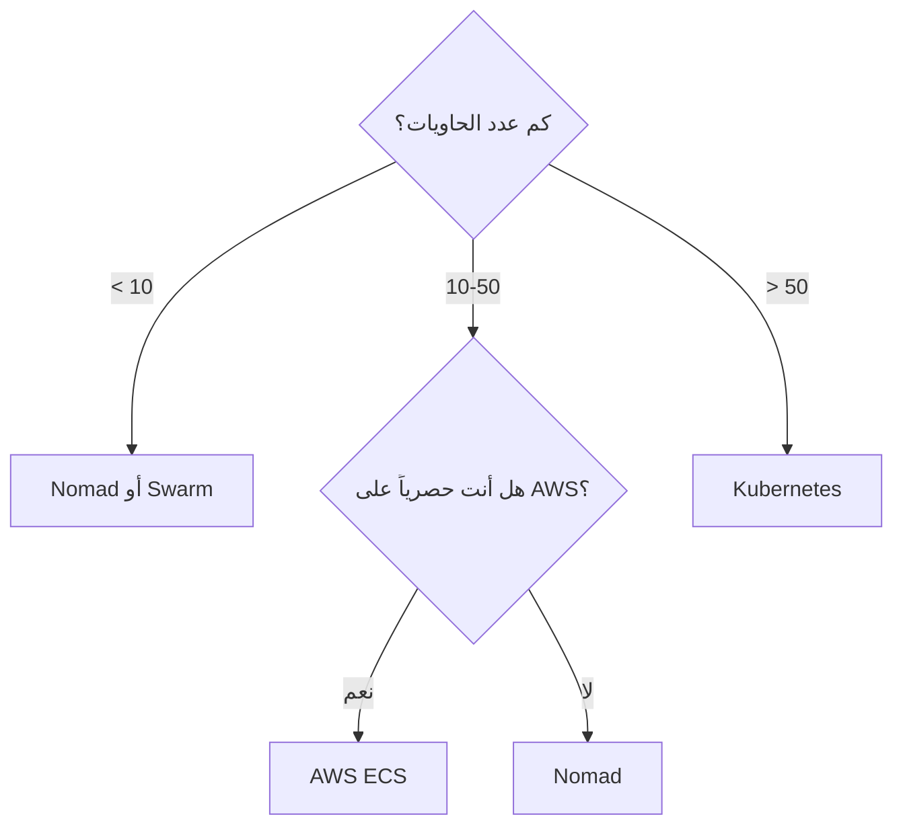

# مقارنة منصات تنسيق الحاويات

> "Kubernetes ليس الحل الوحيد. أحياناً Docker Swarm يكفي، وأحياناً Nomad أفضل."

## 🎯 أهداف التعلم

- مقارنة Kubernetes, Docker Swarm, Nomad, ECS
- فهم متى تختار كل منصة
- Trade-off بين التعقيد والمرونة

## ⏱️ الوقت المقدر: 35 دقيقة | المستوى: Intermediate

---

## 🏗️ مقارنة شاملة

| الميزة | Kubernetes | Docker Swarm | Nomad | ECS |
|--------|-----------|-------------|-------|-----|
| **التعقيد** | عالي جداً | منخفض | متوسط | متوسط |
| **التوسع** | 5000+ nodes | ~100 nodes | 1000+ nodes | غير محدود (AWS) |
| **Service Mesh** | Istio, Linkerd | ❌ | Consul Connect | App Mesh |
| **Auto-scaling** | HPA, VPA, KEDA | ❌ | Nomad Autoscaler | Service Auto Scaling |
| **Helm Charts** | ✅ | ❌ | ❌ | ❌ |
| **التعلم** | شهور | أيام | أسابيع | أسابيع |
| **متى تختاره؟** | مؤسسات كبيرة | فرق صغيرة | Hybrid cloud | AWS فقط |

### شجرة القرار

---

## 🏛️ CloudNova Decision

في CloudNova، بدأنا بـ 5 خدمات على Docker Swarm. كان رائعاً: `docker stack deploy` وينتهي الأمر.

بعد سنة، أصبح لدينا 45 خدمة. Swarm بدأ يظهر عيوبه: لا auto-scaling، لا service mesh، troubleshooting صعب.

**القرار**: الانتقال إلى AKS (Azure Kubernetes Service). كان مؤلماً لمدة شهرين، لكنه أنقذنا لاحقاً.

**الدرس**: اختر المنصة لمستقبلك، ليس لحاضرك فقط.

---

## 🎤 مقابلة

1. **"لماذا Kubernetes وليس Swarm؟"**
2. **"متى تختار ECS على EKS؟"**

---

[← Container Security](./02-container-security-scanning) | [→ Docker Mastery](../../09-docker/01-docker-mastery) | [🏠 الرئيسية](/)
