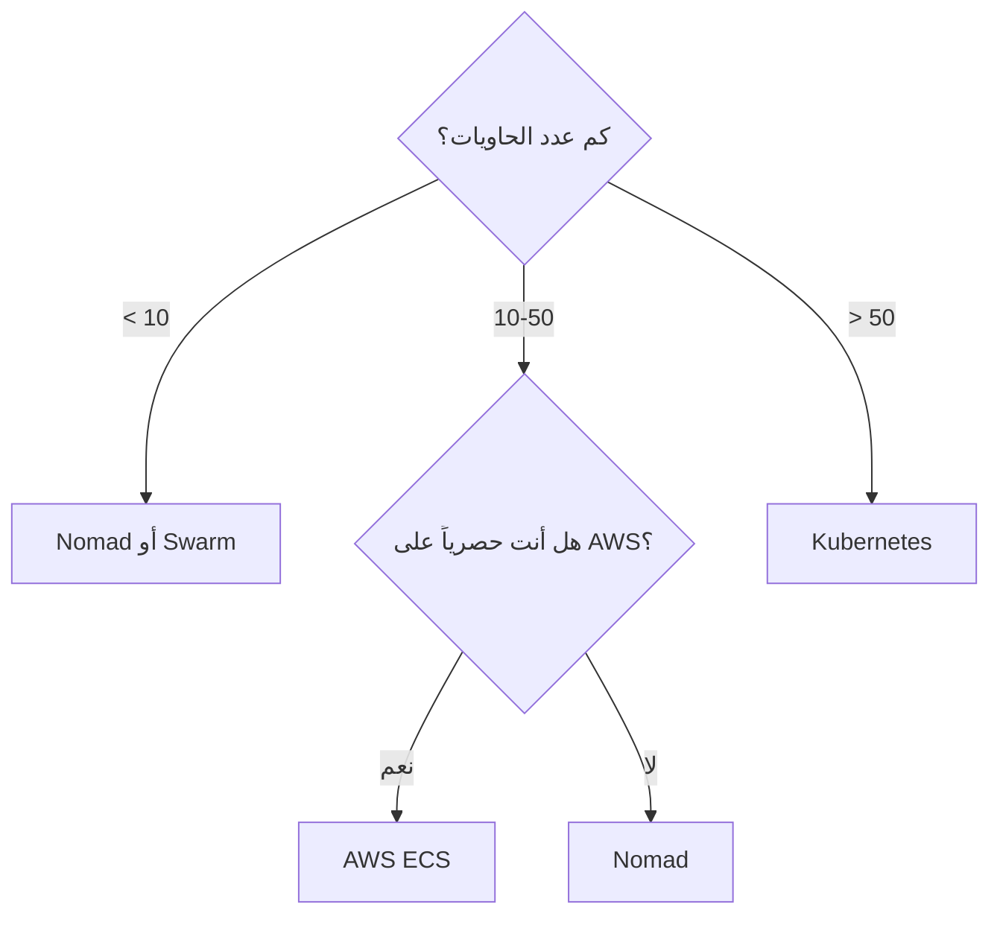

# مقارنة منصات تنسيق الحاويات

> "Kubernetes ليس الحل الوحيد. أحياناً Docker Swarm يكفي، وأحياناً Nomad أفضل."

## 🎯 أهداف التعلم

- مقارنة Kubernetes, Docker Swarm, Nomad, ECS
- فهم متى تختار كل منصة
- Trade-off بين التعقيد والمرونة

## ⏱️ الوقت المقدر: 35 دقيقة | المستوى: Intermediate

---

## 🏗️ مقارنة شاملة

| الميزة           | Kubernetes     | Docker Swarm | Nomad            | ECS                  |
| ---------------- | -------------- | ------------ | ---------------- | -------------------- |
| **التعقيد**      | عالي جداً      | منخفض        | متوسط            | متوسط                |
| **التوسع**       | 5000+ nodes    | ~100 nodes   | 1000+ nodes      | غير محدود (AWS)      |
| **Service Mesh** | Istio, Linkerd | ❌           | Consul Connect   | App Mesh             |
| **Auto-scaling** | HPA, VPA, KEDA | ❌           | Nomad Autoscaler | Service Auto Scaling |
| **Helm Charts**  | ✅             | ❌           | ❌               | ❌                   |
| **التعلم**       | شهور           | أيام         | أسابيع           | أسابيع               |
| **متى تختاره؟**  | مؤسسات كبيرة   | فرق صغيرة    | Hybrid cloud     | AWS فقط              |

### شجرة القرار

---

## 🏛️ CloudNova Journey

في CloudNova، بدأنا بـ 5 خدمات على Docker Swarm. كان رائعاً: `docker stack deploy` وينتهي الأمر.

بعد سنة، أصبح لدينا 45 خدمة. Swarm بدأ يظهر عيوبه: لا auto-scaling، لا service mesh، troubleshooting صعب.

**القرار**: الانتقال إلى AKS. كان مؤلماً لمدة شهرين، لكنه أنقذنا لاحقاً.

**الدرس**: اختر المنصة لمستقبلك، ليس لحاضرك فقط.

---

## 🎨 طبقة المعماري: تكلفة Kubernetes

### التكلفة الحقيقية لـ Kubernetes

| التكلفة           | التفاصيل                          |
| ----------------- | --------------------------------- |
| **Control Plane** | AKS: مجاني. Self-hosted: ~$70/شهر |
| **Nodes**         | 3 nodes minimum لـ HA = ~$150/شهر |
| **التعليم**       | 3-6 أشهر لفريق جديد               |
| **الصيانة**       | ترقيات، patches، troubleshooting  |
| **الأدوات**       | Monitoring, logging, service mesh |

**المجموع التقريبي**: $500-2000/شهر لـ production cluster صغير-متوسط

### متى Kubernetes ليس الحل؟

- أقل من 5 خدمات → Docker Compose + systemd
- تطبيق بسيط → App Service
- فريق صغير بدون خبرة → PaaS أفضل

---

## 🛠️ تدريبات

### تمرين: قيّم منصتك

لديك تطبيق بـ 3 services. أي منصة تختار؟ لماذا؟

### تحدي: صمم خطة ترحيل

صمم خطة لنقل 20 خدمة من Swarm إلى Kubernetes.

---

## 📝 تقييم

### ✅ فحص المعرفة

1. متى تختار Swarm بدلاً من Kubernetes؟
2. ما هي التكلفة الحقيقية لـ Kubernetes؟
3. لماذا انتقلت CloudNova من Swarm إلى AKS؟
4. متى يكون Kubernetes "overkill"؟

### 🃏 بطاقات

| السؤال       | الإجابة                           |
| ------------ | --------------------------------- |
| Kubernetes   | منصة تنسيق حاويات للمؤسسات        |
| Docker Swarm | تنسيق بسيط مدمج مع Docker         |
| AKS          | Azure Kubernetes Service (مُدار)  |
| Overkill     | استخدام Kubernetes لـ 3 خدمات فقط |

---

## 🎤 مقابلة

1. **"لماذا Kubernetes وليس Swarm؟"**
   → Auto-scaling، service mesh، ecosystem، community

2. **"متى تختار ECS على EKS؟"**
   → إذا كنت حصرياً على AWS ولا تحتاج multi-cloud

3. **"كيف تقنع فريقاً صغيراً بعدم استخدام Kubernetes؟"**
   → احسب التكلفة الحقيقية (تعليم + صيانة + تشغيل) وقارنها بالـ value

---

## 📚 مراجع

| النوع     | الرابط                                                                    |
| --------- | ------------------------------------------------------------------------- |
| درس مرتبط | [Container Security](./02-container-security-scanning)                    |
| درس مرتبط | [Kubernetes Architecture](../../10-kubernetes/01-kubernetes-architecture) |
| شهادة     | CKA (Certified Kubernetes Administrator)                                  |

---

[← Container Security](./02-container-security-scanning) | [→ Docker Mastery](../../09-docker/01-docker-mastery) | [🏠 الرئيسية](/)
