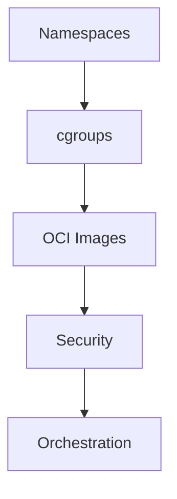

import Tabs from '@theme/Tabs';
import TabItem from '@theme/TabItem';

# 🚀 الحاويات

> Namespaces، cgroups، OCI — افهم كيف تعمل الحاويات من الداخل قبل Docker.

## 🎯 أهداف التعلم

بعد إكمال هذه الوحدة، ستكون قادراً على:

- [**أساسيات الحاويات**](01-container-fundamentals) — كيف تعمل الحاويات
- [**فحص أمن الحاويات**](02-container-security-scanning) — Trivy و Snyk
- [**مقارنة التنسيق**](03-container-orchestration-comparison) — K8s vs Swarm vs Nomad

## 💡 المهارات التي ستكتسبها

Namespaces • cgroups • OCI • Container Security • Orchestration

## 📊 معلومات الوحدة

| العنصر           | القيمة      |
| ---------------- | ----------- |
| **المستوى**      | متوسط       |
| **الوقت المقدر** | 4 ساعات     |
| **المتطلبات**    | Linux       |
| **الشهادات**     | AZ-104, CKA |
| **المشاريع**     | —           |
| **المختبرات**    | —           |

## 🏛️ مهمة CloudNova

> فريق CloudNova يريد نقل 10 تطبيقات إلى حاويات. قارن بين خيارات التنسيق.

## 🗺️ خريطة الوحدة

## 📖 الدروس

<Tabs>
<TabItem value="all" label="كل الدروس" default>

- [**أساسيات الحاويات**](01-container-fundamentals) — كيف تعمل الحاويات
- [**فحص أمن الحاويات**](02-container-security-scanning) — Trivy و Snyk
- [**مقارنة التنسيق**](03-container-orchestration-comparison) — K8s vs Swarm vs Nomad

</TabItem>
</Tabs>

## 🚀 ابدأ التعلم

[▶️ ابدأ الدرس الأول](01-container-fundamentals)
