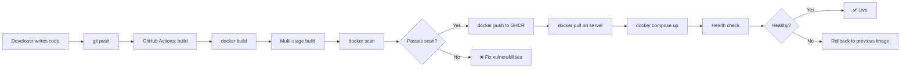

# Docker من الصفر إلى الإتقان

> **"الحاويات غيّرت طريقة نشر البرمجيات. Docker جعلها في متناول الجميع. أتقنها ولن تخاف من 'الشغال عندي' مرة أخرى."**

## 🎯 أهداف التعلم

- بناء صور Docker إنتاجية مع Multi-stage Builds
- إدارة تطبيقات multi-container بـ Docker Compose
- تحسين أحجام الصور (من 900MB إلى 150MB)
- تأمين الحاويات من التهديدات الشائعة
- تشخيص وحل مشاكل Docker في الإنتاج

---

## 📖 الطبقة الأساسية: لماذا Docker؟

قبل Docker: "التطبيق شغال على جهازي — مش عارف ليه مش شغال على الخادم."
بعد Docker: الصورة واحدة. تشتغل في أي مكان. **بالضبط نفس البيئة.**

| المشكلة            | قبل Docker                                | بعد Docker               |
| ------------------ | ----------------------------------------- | ------------------------ |
| **بيئات مختلفة**   | "عندي Python 3.12، الخادم 3.9"            | الصورة تحمل كل شيء       |
| **تبعيات متضاربة** | "App A يحتاج Postgres 14، App B يحتاج 16" | كل حاوية معزولة          |
| **النشر**          | ٣٠ خطوة يدوية                             | `docker run`             |
| **التوسع**         | تثبيت على كل خادم                         | `docker run` على أي خادم |
| **التراجع**        | "كيف أرجع للإصدار السابق؟"                | `docker run old-image`   |

---

## 🧱 الطبقة المهنية: المفاهيم الأساسية

| المفهوم        | المعنى                        | تشبيه واقعي                  |
| -------------- | ----------------------------- | ---------------------------- |
| **Dockerfile** | ملف نصي يصف كيفية بناء الصورة | وصفة الطبخ                   |
| **Image**      | قالب للقراءة فقط              | الوجبة الجاهزة المجمدة       |
| **Container**  | نسخة مشغّلة من الصورة         | الوجبة المسخنة الجاهزة للأكل |
| **Registry**   | مستودع لتخزين الصور           | السوبرماركت                  |
| **Volume**     | تخزين دائم للحاوية            | الثلاجة — تحفظ بعد الطبخ     |
| **Network**    | اتصال بين الحاويات            | طاولة الطعام                 |

---

## 🏗️ الطبقة الإنتاجية: Dockerfile — من البسيط إلى الإنتاجي

### Dockerfile بسيط (للتطوير فقط)

```dockerfile
FROM python:3.12-slim
WORKDIR /app
COPY requirements.txt .
RUN pip install --no-cache-dir -r requirements.txt
COPY . .
EXPOSE 8080
CMD ["python", "app.py"]
```

```bash
docker build -t cloudnova-api:v1 .
docker run -d -p 8080:8080 --name api cloudnova-api:v1
```

### Dockerfile إنتاجي — Multi-Stage Build

المشكلة: الصورة البسيطة حجمها ~٩٠٠MB. لماذا؟ كل أدوات البناء (compilers, headers) موجودة.

الحل: Multi-stage build — ابْنِ في مرحلة، وشغّل في مرحلة أخف:

```dockerfile
# ===== المرحلة ١: البناء =====
FROM python:3.12-slim AS builder
WORKDIR /app
COPY requirements.txt .
RUN pip install --no-cache-dir --user -r requirements.txt

# ===== المرحلة ٢: التشغيل =====
FROM python:3.12-slim
WORKDIR /app

# انسخ فقط المكتبات المثبتة من مرحلة البناء
COPY --from=builder /root/.local /root/.local
ENV PATH=/root/.local/bin:$PATH

COPY . .

# أمان — لا تشغل كـ root
RUN useradd --create-home --shell /bin/bash appuser && \
    chown -R appuser:appuser /app
USER appuser

# فحص صحة
HEALTHCHECK --interval=30s --timeout=3s --retries=3 \
  CMD curl -f http://localhost:8080/health || exit 1

EXPOSE 8080
CMD ["python", "app.py"]
```

النتيجة: صورة بحجم ~١٥٠MB بدلاً من ٩٠٠MB. **توفير ٨٣٪!**

---

## 🎨 الطبقة المعمارية: BuildKit — بناء أسرع بمراحل

```bash
# تفعيل BuildKit
export DOCKER_BUILDKIT=1

# بناء مع cache mounting (لا تعيد تثبيت dependencies كل مرة!)
```

```dockerfile
# BuildKit cache mount — يسرّع البناء 10x
FROM python:3.12-slim AS builder
WORKDIR /app
COPY requirements.txt .
RUN --mount=type=cache,target=/root/.cache/pip \
    pip install --user -r requirements.txt

# BuildKit secrets — لا تترك secrets في الطبقات
FROM python:3.12-slim
WORKDIR /app
COPY --from=builder /root/.local /root/.local
ENV PATH=/root/.local/bin:$PATH

# secret لا يبقى في الصورة
RUN --mount=type=secret,id=github_token \
    GITHUB_TOKEN=$(cat /run/secrets/github_token) \
    pip install --user git+https://${GITHUB_TOKEN}@github.com/org/private-package.git

COPY . .
USER 1000
CMD ["python", "app.py"]
```

```bash
# بناء مع secret
docker build --secret id=github_token,src=$HOME/.github_token -t cloudnova-api:v2 .
```

---

## ⚡ الإنتاج وما بعده: Docker Compose — تطبيقات متعددة الحاويات

```yaml
# docker-compose.yml — CloudNova API كاملة
version: "3.8"
services:
  api:
    build:
      context: .
      dockerfile: Dockerfile
    ports:
      - "8080:8080"
    environment:
      - DATABASE_URL=postgresql://user:${DB_PASSWORD}@db:5432/cloudnova
      - REDIS_URL=redis://redis:6379
    depends_on:
      db:
        condition: service_healthy
      redis:
        condition: service_started
    restart: unless-stopped
    deploy:
      resources:
        limits:
          memory: 512M
          cpus: "1.0"
    logging:
      driver: "json-file"
      options:
        max-size: "10m"
        max-file: "3"
    healthcheck:
      test: ["CMD", "curl", "-f", "http://localhost:8080/health"]
      interval: 30s
      timeout: 5s
      retries: 3

  db:
    image: postgres:16-alpine
    environment:
      POSTGRES_USER: cloudnova
      POSTGRES_PASSWORD: ${DB_PASSWORD}
      POSTGRES_DB: cloudnova
    volumes:
      - pgdata:/var/lib/postgresql/data
    healthcheck:
      test: ["CMD-SHELL", "pg_isready -U cloudnova"]
      interval: 10s
      timeout: 5s
      retries: 5
    restart: unless-stopped

  redis:
    image: redis:7-alpine
    volumes:
      - redisdata:/data
    restart: unless-stopped

volumes:
  pgdata:
  redisdata:
```

---

## 🏛️ Volumes + Networks

### Volumes — التخزين الدائم

```bash
# Bind Mount — للتطوير (ملفاتك المحلية داخل الحاوية)
docker run -v $(pwd)/app:/app -p 8080:8080 cloudnova-api

# Named Volume — للإنتاج (Docker يديره)
docker volume create pgdata
docker run -v pgdata:/var/lib/postgresql/data postgres:16

# tmpfs — للبيانات المؤقتة (في الذاكرة — أسرع)
docker run --tmpfs /tmp:rw,size=100M cloudnova-api
```

### Networks — اتصال الحاويات

```bash
# شبكة مخصصة
docker network create cloudnova-net

# شغّل الحاويات على نفس الشبكة
docker run -d --name db --network cloudnova-net postgres:16
docker run -d --name api --network cloudnova-net -p 8080:8080 cloudnova-api

# الآن api يصل لـ db باسم "db" فقط:
# postgresql://user:pass@db:5432/cloudnova
```

---

## 🛡️ أمان Docker — ٧ قواعد ذهبية

```dockerfile
# ١. لا تشغّل كـ root
USER 1000

# ٢. صورة أساسية موثوقة وخفيفة
FROM python:3.12-slim  # ليس python:3.12 (أكبر 5x)

# ٣. لا تضع أسراراً في الصورة
# ❌ ENV DATABASE_PASSWORD=secret123
# ✅ استخدم secrets أو env vars عند التشغيل

# ٤. قلل مساحة الهجوم — انسخ فقط ما تحتاجه
COPY app/ /app/   # وليس COPY . /app/

# ٥. افحص الصور بانتظام
# docker scan cloudnova-api:v1
# أو: trivy image cloudnova-api:v1

# ٦. استخدم .dockerignore
# node_modules/
# .git/
# *.md
# .env*

# ٧. حدد resources — امنع حاوية واحدة من استهلاك الخادم
# docker run --memory=512m --cpus=1 cloudnova-api
```

### فحص أمني

```bash
# فحص سريع
docker scan cloudnova-api:v1

# فحص شامل مع Trivy
trivy image cloudnova-api:v1 --severity HIGH,CRITICAL

# فحص Dockerfile نفسه
hadolint Dockerfile
```

---

## 📊 رسم بياني: دورة حياة Docker في CloudNova



---

## 📋 ورقة غش الأوامر اليومية

| الأمر                                   | الغرض           |
| --------------------------------------- | --------------- |
| `docker build -t name:tag .`            | بناء صورة       |
| `docker run -d --name x -p 8080:80 img` | تشغيل حاوية     |
| `docker ps`                             | الحاويات النشطة |
| `docker ps -a`                          | كل الحاويات     |
| `docker logs -f container`              | سجلات مباشرة    |
| `docker exec -it container bash`        | ادخل الحاوية    |
| `docker inspect container`              | تفاصيل كاملة    |
| `docker stats`                          | استهلاك الموارد |
| `docker system prune -a`                | تنظيف كل شيء    |
| `docker image history img`              | طبقات الصورة    |
| `docker compose up -d`                  | تشغيل compose   |
| `docker compose down -v`                | إيقاف وتنظيف    |
| `docker compose logs -f`                | سجلات compose   |
| `docker image prune -a`                 | حذف الصور غير المستخدمة |

---

## 🚨 سيناريو CloudNova ١: تحقيق في حادثة شبكة

> **الموقف:** الحاوية تعمل محلياً لكنها تخرج بعد ٣٠ ثانية في Azure.

```bash
# ١. هل الحاوية شغالة؟
docker ps -a | grep api
# STATUS: Exited (1) 30 seconds ago

# ٢. شوف السجلات
docker logs api --tail 50
# FATAL: could not connect to database
# Connection refused at db:5432

# ٣. هل الشبكة صحيحة؟
docker network ls
# api على network: bridge (الافتراضية)
# db على network: cloudnova-net
# ← شبكتان مختلفتان! لا يمكنهما الاتصال

# ٤. الحل: نفس الشبكة
docker network connect cloudnova-net api
docker restart api

# ٥. راقب
docker logs -f api
# ✅ Connected to database successfully
```

---

## 🚨 سيناريو CloudNova ٢: صورة كبيرة جداً

> **الموقف:** `docker images` يظهر الصورة بحجم 1.2GB. النشر يأخذ 4 دقائق.

```bash
# ١. حلل الطبقات — أين الحجم؟
docker image history cloudnova-api:v2
# 450MB  COPY . .         ← كل node_modules + .git + tests!
# 300MB  pip install       ← dev dependencies!
# 200MB  FROM python:3.12  ← صورة أساسية كبيرة

# ٢. التحسينات:
echo ".git/"       >> .dockerignore
echo "node_modules/" >> .dockerignore
echo "tests/"      >> .dockerignore
echo "*.md"        >> .dockerignore

# ٣. Multi-stage + صورة أخف
# FROM python:3.12 → FROM python:3.12-slim (أصغر 5x)
# pip install كل شيء → pip install --user + COPY --from=builder

# ٤. النتيجة:
docker build -t cloudnova-api:v3 .
docker images cloudnova-api
# v2: 1.2GB → v3: 150MB (توفير 87%!)
```

---

## 🚨 سيناريو CloudNova ٣: تسرّب أسرار في الصورة

> **الموقف:** أحدهم دفع `docker push` وصورة تحوي `.env` بقاعدة بيانات الإنتاج!

```bash
# ١. تأكد من المشكلة
docker run --rm cloudnova-api:v2.5 cat /app/.env
# DATABASE_URL=postgresql://prod_user:REAL_PASSWORD@db:5432/cloudnova
# AWS_ACCESS_KEY_ID=AKIA...
# ← كارثة!

# ٢. الحل الفوري:
# - غيّر كل الأسرار المسربة فوراً
# - احذف الـ tag من registry
docker push --delete ghcr.io/org/cloudnova-api:v2.5

# ٣. المنع الدائم:
echo ".env*" >> .dockerignore
echo "*.pem"  >> .dockerignore
echo "credentials*" >> .dockerignore

# ٤. افحص الصور قبل النشر — أضف لـ CI:
docker scan cloudnova-api:${{ github.sha }}
trivy image cloudnova-api:${{ github.sha }}
```

---

## نصائح الإنتاج — الخلاصة

1. **Multi-stage builds دائماً.** صورة البناء ≠ صورة التشغيل
2. **BuildKit + cache.** يسرّع البناء 10x. `DOCKER_BUILDKIT=1`
3. **لا تشغّل كـ root.** `USER 1000` في نهاية Dockerfile
4. **صور خفيفة.** `-slim` أو `-alpine`. كل MB أقل = سطح هجوم أقل
5. **افحص الصور بانتظام.** `docker scan` أو `trivy` في CI/CD
6. **استخدم docker-compose.** لا تشغل حاويات منفردة في الإنتاج
7. **ضع limits.** `--memory=512m --cpus=1` لكل حاوية
8. **سجلات منظمة.** json-file مع max-size و max-file

---

## 🧠 التذكّر النشط

1. كيف تقلل حجم صورة Docker من 900MB إلى 150MB؟
2. لماذا من الخطر تشغيل الحاويات كـ root؟
3. ما الفرق بين COPY و ADD في Dockerfile؟
4. كيف تكتشف secrets مسربة في Docker image؟
5. لماذا تستخدم `depends_on` مع `condition: service_healthy`؟

## ✍️ تمرين Feynman

اشرح لشخص غير تقني: "كيف يشبه Docker حاوية الشحن؟ (الحاوية تحمل البضائع وتنتقل بين السفن والشاحنات والقطارات دون فتحها)"

## 📝 بطاقات تعليمية

- **Layer**: كل سطر في Dockerfile = طبقة. تتخزّن مؤقتاً وتُعاد استخدامها
- **BuildKit**: محرك بناء Docker الحديث. أسرع، caching أفضل، secrets آمنة
- **Multi-stage**: فصل البناء عن التشغيل. الصورة النهائية لا تحتوي أدوات البناء
- **Volume**: تخزين دائم ينجو من حذف الحاوية. للـ databases والملفات
- **.dockerignore**: مثل `.gitignore`. يمنع نسخ ملفات غير ضرورية للصورة

## 🎤 أسئلة المقابلة

1. **"كيف تبني Dockerfile إنتاجياً؟"**
   - Multi-stage build
   - صورة أساسية خفيفة (`-slim` أو `-alpine`)
   - مستخدم غير root
   - HEALTHCHECK
   - BuildKit cache + secrets
   - لا تنسخ كل شيء — `.dockerignore`

2. **"ما الفرق بين CMD و ENTRYPOINT؟"**
   - CMD: الأمر الافتراضي (يمكن override عند `docker run`)
   - ENTRYPOINT: الأمر الرئيسي (لا يمكن override بسهولة)
   - استخدم ENTRYPOINT للتطبيق + CMD للـ flags الافتراضية

3. **"كيف تكتشف وتصلح مشكلة في حاوية إنتاجية؟"**
   - `docker ps -a` — هل الحاوية شغالة؟
   - `docker logs` — ماذا كتبت؟
   - `docker inspect` — ما الإعدادات؟
   - `docker exec -it bash` — ادخل وحقق
   - `docker stats` — هل الموارد ممتلئة؟

---

---

## 🏛️ طبقة الإنتاج: Docker في المعركة

### Docker Registry في الإنتاج — ACR Premium

```bash
# Azure Container Registry - Premium tier
az acr create \
  --name cloudnovaregistry \
  --resource-group prod-rg \
  --sku Premium \
  --admin-enabled false \
  --public-network-enabled false

# Private Endpoint لـ ACR
az network private-endpoint create \
  --name pe-acr \
  --resource-group prod-rg \
  --vnet-name cloudnova-vnet \
  --subnet registry-subnet \
  --private-connection-resource-id $(az acr show --name cloudnovaregistry --query id -o tsv) \
  --group-id registry

# Geo-replication للصور
docker buildx build \
  --platform linux/amd64,linux/arm64 \
  --push -t cloudnovaregistry.azurecr.io/api:v3 .

# Content Trust — توقيع الصور
az acr config content-trust update \
  --registry cloudnovaregistry \
  --status enabled
```

### مراقبة Docker Daemon

```bash
# Docker daemon metrics
docker system info
curl http://localhost:9323/metrics  # إذا مفعل metrics

# Metricbeat for Docker
# docker-compose.yml:
#   metricbeat:
#     image: docker.elastic.co/beats/metricbeat:8.4.0
#     volumes:
#       - /var/run/docker.sock:/var/run/docker.sock:ro
#     environment:
#       - output.elasticsearch.hosts=["elasticsearch:9200"]
```

### 🚨 سيناريو CloudNova ٤: Daemon يموت

> **الموقف:** `docker ps` لا يستجيب. الخادم يعمل لكن Docker مات.

```bash
# تشخيص
sudo systemctl status docker
# Active: failed (Result: timeout)

# سجلات Docker daemon
sudo journalctl -u docker.service --since "10 minutes ago" | tail -30
# level=error msg="failed to start containerd"
# level=fatal msg="no space left on device"

# السبب: /var/lib/docker ممتلئ
sudo du -sh /var/lib/docker/*
# 48G  /var/lib/docker/overlay2
# 12G  /var/lib/docker/containers
# 2G   /var/lib/docker/volumes

# الحل العاجل
docker system prune -a --volumes --force

# الحل الدائم: cron job للتنظيف الأسبوعي
echo "0 3 * * 0 docker system prune -a --filter 'until=168h' --force" | sudo crontab -
```

---

## 🎨 طبقة المعماري: قرارات التصميم

### Docker vs Podman vs containerd — مقارنة معمارية

| المعيار | Docker | Podman | containerd |
|---------|--------|--------|------------|
| **Daemon** | ✅ (dockerd) | ❌ (fork-exec model) | ✅ (containerd) |
| **Rootless** | مؤخراً (v20+) | ✅ افتراضي | ❌
| **Compose** | docker-compose | podman-compose | ❌ (K8s native) |
| **K8s integration** | عبر cri-dockerd | ❌ | ✅ (مباشر) |
| **Images** | OCI | OCI | OCI |
| **حجم التثبيت** | كبير | متوسط | صغير |

### متى لا تستخدم Docker؟

| السيناريو | لماذا؟ | البديل |
|-----------|-------|--------|
| **Kubernetes 1.24+** | Docker runtime أُزيل | containerd (مدمج) |
| **حاويات بدون root مطلقاً** | Docker يحتاج root للـ daemon | Podman (rootless) |
| **بناء صور لـ ARM** | Docker buildx يعمل لكن Podman أسرع | Podman multi-arch |

### استراتيجية التخزين المؤقت (Caching)

```dockerfile
# الترتيب الصحيح للاستفادة من cache
FROM python:3.12-slim
WORKDIR /app

# ١. الاعتماديات أولاً (نادراً ما تتغير)
COPY requirements.txt .
RUN pip install --no-cache-dir -r requirements.txt

# ٢. الكود ثانياً (يتغير كثيراً)
COPY src/ ./src/
COPY app.py .
```

---

## 🛠️ تدريبات عملية

### تمرين ١: صورة مثالية (سهل)
> ابنِ Dockerfile لـ Node.js app:
> - Multi-stage: builder (npm build) + production (nginx)
> - حجم أقل من 30MB
> - non-root user
> - HEALTHCHECK

### تمرين ٢: تحقيق security scan (متوسط)
> شغّل Trivy على صور CloudNova. وثّق كل HIGH/CRITICAL vulnerabilities وخطة علاجها.

### تحدي: CI/CD Pipeline (متقدم)
> صمم GitHub Actions workflow:
> 1. Build multi-arch image
> 2. Scan with Trivy (block on CRITICAL)
> 3. Push to ACR
> 4. Deploy to staging
> 5. Smoke tests

### مشروع CloudNova
> **Ticket #CN-901:** "صور Docker تستهلك 45GB على الخادم. نظف وامنع التراكم."

---

## 📝 تقييم المعرفة

### ✅ تحقق من فهمك (5)
1. كيف تقلل حجم صورة من 900MB إلى 150MB؟
2. لماذا `USER 1000` أفضل من `USER root`؟
3. ما فائدة BuildKit secrets؟
4. كيف تكتشف secrets مسربة في Docker image؟
5. اشرح دورة حياة Docker: Dockerfile → Image → Registry → Container.

### 📝 اختبار (3 أسئلة)

**س١:** ما الترتيب الصحيح لطبقات Dockerfile للاستفادة القصوى من cache؟

- **أ)** COPY . . ثم RUN pip install
- **ب)** COPY requirements.txt ثم RUN pip install ثم COPY . .
- **ج)** لا فرق

<details><summary>الإجابة</summary>
**ب.** ضع الاعتماديات أولاً لأنها تتغير أقل من الكود. Docker يعيد استخدام كل طبقة قبل الطبقة التي تغيرت.
</details>

**س٢:** كيف تسحب صورة من ACR خاص بـ Private Endpoint؟

<details><summary>الإجابة</summary>
```bash
# يجب أن تكون على VNet المرتبط بـ Private Endpoint
az acr login --name cloudnovaregistry
docker pull cloudnovaregistry.azurecr.io/api:v3
# أو استخدم Managed Identity:
az acr login --name cloudnovaregistry --expose-token
```
</details>

**س٣:** ما فائدة `--mount=type=cache` في BuildKit؟

<details><summary>الإجابة</summary>
يحفظ cache directory عبر builds المختلفة.
```dockerfile
RUN --mount=type=cache,target=/root/.cache/pip \
    pip install -r requirements.txt
```
المكتبات تُحمل مرة واحدة فقط. البناء التالي: pip install فوري تقريباً — وفر 90% من وقت البناء.
</details>

### 🧠 استدعاء نشط
1. ارسم مراحل Multi-stage build من الذاكرة.
2. اذكر 7 قواعد أمنية لـ Dockerfile.
3. كيف تشخص حاوية لا تستجيب؟ (5 خطوات)
4. ما الفرق بين bind mount و named volume؟
5. كيف تبني صورة لـ ARM و x86 معاً؟

### ✍️ تمرين Feynman
اشرح Docker لـ 3 شخصيات:
- **طاهٍ**: "الصورة = وصفة مجمدة. الحاوية = وجبة جاهزة للأكل."
- **مدير شحن**: "الحاوية = حاوية شحن بحري ISO. تغلف المنتج وتنقله لأي مكان."
- **طفل ١٢ سنة**: "Docker = صندوق سحري يحمل لعبتك المفضلة بكل إعداداتها. تفتح الصندوق على أي كمبيوتر وتلعب فوراً."

### 🎴 بطاقات (8)

| السؤال | الإجابة |
|--------|---------|
| Layer | كل أمر في Dockerfile = طبقة |
| BuildKit | محرك بناء حديث — cache أفضل، secrets آمنة |
| Multi-stage | فصل البناء عن التشغيل — حجم أقل 80%+ |
| Volume | تخزين دائم ينجو من حذف الحاوية |
| HEALTHCHECK | أمر يفحص صحة الحاوية دورياً |
| Registry | مستودع لتخزين وتوزيع الصور |
| .dockerignore | ملف يمنع نسخ ملفات غير ضرورية للصورة |
| Trivy | أداة فحص ثغرات أمنية في صور الحاويات |

---

## 🎤 التحضير للمقابلة (موسع)

### System Design

**"صمم CI/CD pipeline لـ 30 microservice كل منها في repo منفصل."**

<details><summary>نموذج الإجابة</summary>

```
استراتيجية الصور:
├── Base image موحد (Python 3.12-slim + common libs)
├── 30 Dockerfile (واحد لكل خدمة)
├── Multi-stage builds — حجم نهائي < 150MB
└── .dockerignore مخصص لكل خدمة

CI/CD:
├── GitHub Actions (push on main)
├── Build: docker build --cache-from registry/base:latest
├── Test: container structure tests + integration tests
├── Scan: Trivy (block CRITICAL/HIGH)
├── Push: ACR مع tag = git SHA + latest
└── Deploy: Argo CD Image Updater

التحسينات:
├── BuildKit cache registry (مشترك بين كل الـ repos)
├── Build only changed services (path filtering)
├── Parallel builds (matrix strategy)
└── Nightly rebuild of base image
```
</details>

### سؤال تقني

**"كيف تحقق build reproducible (نفس الـ hash كل مرة)؟"**

<details><summary>الإجابة</summary>

```dockerfile
# ١. Pin versions (لا latest)
FROM python:3.12.3-slim-bookworm@sha256:abc123...

# ٢. Pin pip packages
COPY requirements.txt ./
RUN pip install --no-cache-dir \
    flask==3.0.0 \
    requests==2.31.0

# ٣. BuildKit + cache busting
ARG CACHE_BUST=1  # اضبطه في CI

# ٤. Build args للـ metadata
ARG BUILD_DATE
ARG GIT_COMMIT
LABEL org.label-schema.build-date=$BUILD_DATE \
      org.label-schema.vcs-ref=$GIT_COMMIT
```

```bash
docker build \
  --build-arg BUILD_DATE=$(date -u +'%Y-%m-%dT%H:%M:%SZ') \
  --build-arg GIT_COMMIT=$(git rev-parse HEAD) \
  -t api:v1.2.3 .
```
</details>

### سؤال سلوكي (STAR)

**"احكِ عن مرة أنقذت فيها الموقف بحل Docker."**

> **S**: بيئة staging تعطلت 3 ساعات بسبب اختلاف إصدارات Python.  
> **T**: توحيد البيئات عبر Docker في أسبوع واحد.  
> **A**: بنيت Dockerfiles، هاجرت docker-compose للإنتاج المصغر، وثّقت كل خطوة.  
> **R**: صفر مشاكل بيئة منذ ذلك الحين. وقت الـ onboarding من 3 أيام → 30 دقيقة.

---

## 📚 المراجع والروابط

### دروس مرتبطة
- [Container Fundamentals](../08-containers/01-container-fundamentals) — Namespaces, cgroups
- [Docker Compose Production](./02-docker-compose-production) — Compose في الإنتاج
- [CI/CD Pipelines](../15-cicd/01-cicd-pipelines) — Docker في CI/CD

### شهادات
- **DCA**: Docker Certified Associate
- **AZ-104**: Azure Administrator (ACR, ACI)

### مصادر خارجية
- 📖 [Dockerfile Best Practices](https://docs.docker.com/develop/develop-images/dockerfile_best-practices/)
- 📖 [BuildKit Documentation](https://docs.docker.com/build/buildkit/)
- 📺 "Docker Deep Dive" — Nigel Poulton

### مصطلحات
| المصطلح | التعريف |
|---------|---------|
| **Multi-stage Build** | بناء بمراحل — الصورة النهائية تحتوي binary فقط |
| **BuildKit** | محرك بناء حديث — caching ذكي، secrets آمن |
| **OCI** | معيار مفتوح لصور و runtimes الحاويات |
| **Registry** | مستودع لتخزين وتوزيع الصور |

---

[← العودة للموديول](01-docker-mastery) | [→ Docker Compose Production](./02-docker-compose-production) | [🏠 الرئيسية](/)
