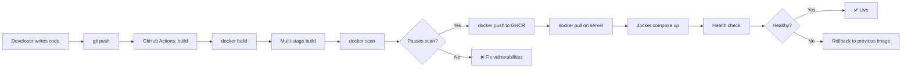

# Docker من الصفر إلى الإتقان

> **"الحاويات غيّرت طريقة نشر البرمجيات. Docker جعلها في متناول الجميع. أتقنها ولن تخاف من 'الشغال عندي' مرة أخرى."**

## 🎯 أهداف التعلم

- بناء صور Docker إنتاجية مع Multi-stage Builds
- إدارة تطبيقات multi-container بـ Docker Compose
- تحسين أحجام الصور (من 900MB إلى 150MB)
- تأمين الحاويات من التهديدات الشائعة
- تشخيص وحل مشاكل Docker في الإنتاج

---

## 📖 الطبقة الأساسية: لماذا Docker؟

قبل Docker: "التطبيق شغال على جهازي — مش عارف ليه مش شغال على الخادم."
بعد Docker: الصورة واحدة. تشتغل في أي مكان. **بالضبط نفس البيئة.**

| المشكلة            | قبل Docker                                | بعد Docker               |
| ------------------ | ----------------------------------------- | ------------------------ |
| **بيئات مختلفة**   | "عندي Python 3.12، الخادم 3.9"            | الصورة تحمل كل شيء       |
| **تبعيات متضاربة** | "App A يحتاج Postgres 14، App B يحتاج 16" | كل حاوية معزولة          |
| **النشر**          | ٣٠ خطوة يدوية                             | `docker run`             |
| **التوسع**         | تثبيت على كل خادم                         | `docker run` على أي خادم |
| **التراجع**        | "كيف أرجع للإصدار السابق؟"                | `docker run old-image`   |

---

## 🧱 الطبقة المهنية: المفاهيم الأساسية

| المفهوم        | المعنى                        | تشبيه واقعي                  |
| -------------- | ----------------------------- | ---------------------------- |
| **Dockerfile** | ملف نصي يصف كيفية بناء الصورة | وصفة الطبخ                   |
| **Image**      | قالب للقراءة فقط              | الوجبة الجاهزة المجمدة       |
| **Container**  | نسخة مشغّلة من الصورة         | الوجبة المسخنة الجاهزة للأكل |
| **Registry**   | مستودع لتخزين الصور           | السوبرماركت                  |
| **Volume**     | تخزين دائم للحاوية            | الثلاجة — تحفظ بعد الطبخ     |
| **Network**    | اتصال بين الحاويات            | طاولة الطعام                 |

---

## 🏗️ الطبقة الإنتاجية: Dockerfile — من البسيط إلى الإنتاجي

### Dockerfile بسيط (للتطوير فقط)

```dockerfile
FROM python:3.12-slim
WORKDIR /app
COPY requirements.txt .
RUN pip install --no-cache-dir -r requirements.txt
COPY . .
EXPOSE 8080
CMD ["python", "app.py"]
```

```bash
docker build -t cloudnova-api:v1 .
docker run -d -p 8080:8080 --name api cloudnova-api:v1
```

### Dockerfile إنتاجي — Multi-Stage Build

المشكلة: الصورة البسيطة حجمها ~٩٠٠MB. لماذا؟ كل أدوات البناء (compilers, headers) موجودة.

الحل: Multi-stage build — ابْنِ في مرحلة، وشغّل في مرحلة أخف:

```dockerfile
# ===== المرحلة ١: البناء =====
FROM python:3.12-slim AS builder
WORKDIR /app
COPY requirements.txt .
RUN pip install --no-cache-dir --user -r requirements.txt

# ===== المرحلة ٢: التشغيل =====
FROM python:3.12-slim
WORKDIR /app

# انسخ فقط المكتبات المثبتة من مرحلة البناء
COPY --from=builder /root/.local /root/.local
ENV PATH=/root/.local/bin:$PATH

COPY . .

# أمان — لا تشغل كـ root
RUN useradd --create-home --shell /bin/bash appuser && \
    chown -R appuser:appuser /app
USER appuser

# فحص صحة
HEALTHCHECK --interval=30s --timeout=3s --retries=3 \
  CMD curl -f http://localhost:8080/health || exit 1

EXPOSE 8080
CMD ["python", "app.py"]
```

النتيجة: صورة بحجم ~١٥٠MB بدلاً من ٩٠٠MB. **توفير ٨٣٪!**

---

## 🎨 الطبقة المعمارية: BuildKit — بناء أسرع بمراحل

```bash
# تفعيل BuildKit
export DOCKER_BUILDKIT=1

# بناء مع cache mounting (لا تعيد تثبيت dependencies كل مرة!)
```

```dockerfile
# BuildKit cache mount — يسرّع البناء 10x
FROM python:3.12-slim AS builder
WORKDIR /app
COPY requirements.txt .
RUN --mount=type=cache,target=/root/.cache/pip \
    pip install --user -r requirements.txt

# BuildKit secrets — لا تترك secrets في الطبقات
FROM python:3.12-slim
WORKDIR /app
COPY --from=builder /root/.local /root/.local
ENV PATH=/root/.local/bin:$PATH

# secret لا يبقى في الصورة
RUN --mount=type=secret,id=github_token \
    GITHUB_TOKEN=$(cat /run/secrets/github_token) \
    pip install --user git+https://${GITHUB_TOKEN}@github.com/org/private-package.git

COPY . .
USER 1000
CMD ["python", "app.py"]
```

```bash
# بناء مع secret
docker build --secret id=github_token,src=$HOME/.github_token -t cloudnova-api:v2 .
```

---

## ⚡ الإنتاج وما بعده: Docker Compose — تطبيقات متعددة الحاويات

```yaml
# docker-compose.yml — CloudNova API كاملة
version: "3.8"
services:
  api:
    build:
      context: .
      dockerfile: Dockerfile
    ports:
      - "8080:8080"
    environment:
      - DATABASE_URL=postgresql://user:${DB_PASSWORD}@db:5432/cloudnova
      - REDIS_URL=redis://redis:6379
    depends_on:
      db:
        condition: service_healthy
      redis:
        condition: service_started
    restart: unless-stopped
    deploy:
      resources:
        limits:
          memory: 512M
          cpus: "1.0"
    logging:
      driver: "json-file"
      options:
        max-size: "10m"
        max-file: "3"
    healthcheck:
      test: ["CMD", "curl", "-f", "http://localhost:8080/health"]
      interval: 30s
      timeout: 5s
      retries: 3

  db:
    image: postgres:16-alpine
    environment:
      POSTGRES_USER: cloudnova
      POSTGRES_PASSWORD: ${DB_PASSWORD}
      POSTGRES_DB: cloudnova
    volumes:
      - pgdata:/var/lib/postgresql/data
    healthcheck:
      test: ["CMD-SHELL", "pg_isready -U cloudnova"]
      interval: 10s
      timeout: 5s
      retries: 5
    restart: unless-stopped

  redis:
    image: redis:7-alpine
    volumes:
      - redisdata:/data
    restart: unless-stopped

volumes:
  pgdata:
  redisdata:
```

---

## 🏛️ Volumes + Networks

### Volumes — التخزين الدائم

```bash
# Bind Mount — للتطوير (ملفاتك المحلية داخل الحاوية)
docker run -v $(pwd)/app:/app -p 8080:8080 cloudnova-api

# Named Volume — للإنتاج (Docker يديره)
docker volume create pgdata
docker run -v pgdata:/var/lib/postgresql/data postgres:16

# tmpfs — للبيانات المؤقتة (في الذاكرة — أسرع)
docker run --tmpfs /tmp:rw,size=100M cloudnova-api
```

### Networks — اتصال الحاويات

```bash
# شبكة مخصصة
docker network create cloudnova-net

# شغّل الحاويات على نفس الشبكة
docker run -d --name db --network cloudnova-net postgres:16
docker run -d --name api --network cloudnova-net -p 8080:8080 cloudnova-api

# الآن api يصل لـ db باسم "db" فقط:
# postgresql://user:pass@db:5432/cloudnova
```

---

## 🛡️ أمان Docker — ٧ قواعد ذهبية

```dockerfile
# ١. لا تشغّل كـ root
USER 1000

# ٢. صورة أساسية موثوقة وخفيفة
FROM python:3.12-slim  # ليس python:3.12 (أكبر 5x)

# ٣. لا تضع أسراراً في الصورة
# ❌ ENV DATABASE_PASSWORD=secret123
# ✅ استخدم secrets أو env vars عند التشغيل

# ٤. قلل مساحة الهجوم — انسخ فقط ما تحتاجه
COPY app/ /app/   # وليس COPY . /app/

# ٥. افحص الصور بانتظام
# docker scan cloudnova-api:v1
# أو: trivy image cloudnova-api:v1

# ٦. استخدم .dockerignore
# node_modules/
# .git/
# *.md
# .env*

# ٧. حدد resources — امنع حاوية واحدة من استهلاك الخادم
# docker run --memory=512m --cpus=1 cloudnova-api
```

### فحص أمني

```bash
# فحص سريع
docker scan cloudnova-api:v1

# فحص شامل مع Trivy
trivy image cloudnova-api:v1 --severity HIGH,CRITICAL

# فحص Dockerfile نفسه
hadolint Dockerfile
```

---

## 📊 رسم بياني: دورة حياة Docker في CloudNova



---

## 📋 ورقة غش الأوامر اليومية

| الأمر                                   | الغرض           |
| --------------------------------------- | --------------- |
| `docker build -t name:tag .`            | بناء صورة       |
| `docker run -d --name x -p 8080:80 img` | تشغيل حاوية     |
| `docker ps`                             | الحاويات النشطة |
| `docker ps -a`                          | كل الحاويات     |
| `docker logs -f container`              | سجلات مباشرة    |
| `docker exec -it container bash`        | ادخل الحاوية    |
| `docker inspect container`              | تفاصيل كاملة    |
| `docker stats`                          | استهلاك الموارد |
| `docker system prune -a`                | تنظيف كل شيء    |
| `docker image history img`              | طبقات الصورة    |
| `docker compose up -d`                  | تشغيل compose   |
| `docker compose down -v`                | إيقاف وتنظيف    |
| `docker compose logs -f`                | سجلات compose   |
| `docker image prune -a`                 | حذف الصور غير المستخدمة |

---

## 🚨 سيناريو CloudNova ١: تحقيق في حادثة شبكة

> **الموقف:** الحاوية تعمل محلياً لكنها تخرج بعد ٣٠ ثانية في Azure.

```bash
# ١. هل الحاوية شغالة؟
docker ps -a | grep api
# STATUS: Exited (1) 30 seconds ago

# ٢. شوف السجلات
docker logs api --tail 50
# FATAL: could not connect to database
# Connection refused at db:5432

# ٣. هل الشبكة صحيحة؟
docker network ls
# api على network: bridge (الافتراضية)
# db على network: cloudnova-net
# ← شبكتان مختلفتان! لا يمكنهما الاتصال

# ٤. الحل: نفس الشبكة
docker network connect cloudnova-net api
docker restart api

# ٥. راقب
docker logs -f api
# ✅ Connected to database successfully
```

---

## 🚨 سيناريو CloudNova ٢: صورة كبيرة جداً

> **الموقف:** `docker images` يظهر الصورة بحجم 1.2GB. النشر يأخذ 4 دقائق.

```bash
# ١. حلل الطبقات — أين الحجم؟
docker image history cloudnova-api:v2
# 450MB  COPY . .         ← كل node_modules + .git + tests!
# 300MB  pip install       ← dev dependencies!
# 200MB  FROM python:3.12  ← صورة أساسية كبيرة

# ٢. التحسينات:
echo ".git/"       >> .dockerignore
echo "node_modules/" >> .dockerignore
echo "tests/"      >> .dockerignore
echo "*.md"        >> .dockerignore

# ٣. Multi-stage + صورة أخف
# FROM python:3.12 → FROM python:3.12-slim (أصغر 5x)
# pip install كل شيء → pip install --user + COPY --from=builder

# ٤. النتيجة:
docker build -t cloudnova-api:v3 .
docker images cloudnova-api
# v2: 1.2GB → v3: 150MB (توفير 87%!)
```

---

## 🚨 سيناريو CloudNova ٣: تسرّب أسرار في الصورة

> **الموقف:** أحدهم دفع `docker push` وصورة تحوي `.env` بقاعدة بيانات الإنتاج!

```bash
# ١. تأكد من المشكلة
docker run --rm cloudnova-api:v2.5 cat /app/.env
# DATABASE_URL=postgresql://prod_user:REAL_PASSWORD@db:5432/cloudnova
# AWS_ACCESS_KEY_ID=AKIA...
# ← كارثة!

# ٢. الحل الفوري:
# - غيّر كل الأسرار المسربة فوراً
# - احذف الـ tag من registry
docker push --delete ghcr.io/org/cloudnova-api:v2.5

# ٣. المنع الدائم:
echo ".env*" >> .dockerignore
echo "*.pem"  >> .dockerignore
echo "credentials*" >> .dockerignore

# ٤. افحص الصور قبل النشر — أضف لـ CI:
docker scan cloudnova-api:${{ github.sha }}
trivy image cloudnova-api:${{ github.sha }}
```

---

## نصائح الإنتاج — الخلاصة

1. **Multi-stage builds دائماً.** صورة البناء ≠ صورة التشغيل
2. **BuildKit + cache.** يسرّع البناء 10x. `DOCKER_BUILDKIT=1`
3. **لا تشغّل كـ root.** `USER 1000` في نهاية Dockerfile
4. **صور خفيفة.** `-slim` أو `-alpine`. كل MB أقل = سطح هجوم أقل
5. **افحص الصور بانتظام.** `docker scan` أو `trivy` في CI/CD
6. **استخدم docker-compose.** لا تشغل حاويات منفردة في الإنتاج
7. **ضع limits.** `--memory=512m --cpus=1` لكل حاوية
8. **سجلات منظمة.** json-file مع max-size و max-file

---

## 🧠 التذكّر النشط

1. كيف تقلل حجم صورة Docker من 900MB إلى 150MB؟
2. لماذا من الخطر تشغيل الحاويات كـ root؟
3. ما الفرق بين COPY و ADD في Dockerfile؟
4. كيف تكتشف secrets مسربة في Docker image؟
5. لماذا تستخدم `depends_on` مع `condition: service_healthy`؟

## ✍️ تمرين Feynman

اشرح لشخص غير تقني: "كيف يشبه Docker حاوية الشحن؟ (الحاوية تحمل البضائع وتنتقل بين السفن والشاحنات والقطارات دون فتحها)"

## 📝 بطاقات تعليمية

- **Layer**: كل سطر في Dockerfile = طبقة. تتخزّن مؤقتاً وتُعاد استخدامها
- **BuildKit**: محرك بناء Docker الحديث. أسرع، caching أفضل، secrets آمنة
- **Multi-stage**: فصل البناء عن التشغيل. الصورة النهائية لا تحتوي أدوات البناء
- **Volume**: تخزين دائم ينجو من حذف الحاوية. للـ databases والملفات
- **.dockerignore**: مثل `.gitignore`. يمنع نسخ ملفات غير ضرورية للصورة

## 🎤 أسئلة المقابلة

1. **"كيف تبني Dockerfile إنتاجياً؟"**
   - Multi-stage build
   - صورة أساسية خفيفة (`-slim` أو `-alpine`)
   - مستخدم غير root
   - HEALTHCHECK
   - BuildKit cache + secrets
   - لا تنسخ كل شيء — `.dockerignore`

2. **"ما الفرق بين CMD و ENTRYPOINT؟"**
   - CMD: الأمر الافتراضي (يمكن override عند `docker run`)
   - ENTRYPOINT: الأمر الرئيسي (لا يمكن override بسهولة)
   - استخدم ENTRYPOINT للتطبيق + CMD للـ flags الافتراضية

3. **"كيف تكتشف وتصلح مشكلة في حاوية إنتاجية؟"**
   - `docker ps -a` — هل الحاوية شغالة؟
   - `docker logs` — ماذا كتبت؟
   - `docker inspect` — ما الإعدادات؟
   - `docker exec -it bash` — ادخل وحقق
   - `docker stats` — هل الموارد ممتلئة؟

---

[← العودة للوحدة](index.md) | [🏠 الرئيسية](/)
