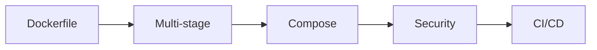

import Tabs from '@theme/Tabs';
import TabItem from '@theme/TabItem';

# 🚀 Docker

> من Dockerfile إلى الإنتاج — Multi-stage Builds، Compose، الأمان، CI/CD.

## 🎯 أهداف التعلم

بعد إكمال هذه الوحدة، ستكون قادراً على:

- [**إتقان Docker**](01-docker-mastery) — من الصفر للإتقان
- [**Docker Compose**](02-docker-compose-production) — تطبيقات متعددة الحاويات
- [**أمن Docker**](03-docker-security-best-practices) — أفضل الممارسات
- [**Docker في CI/CD**](04-docker-in-ci-cd) — أتمتة البناء والنشر

## 💡 المهارات التي ستكتسبها

Dockerfile • Multi-stage • Compose • Security • CI/CD

## 📊 معلومات الوحدة

| العنصر | القيمة |
| ------ | ------ |
| **المستوى** | متوسط |
| **الوقت المقدر** | 6 ساعات |
| **المتطلبات** | الحاويات |
| **الشهادات** | AZ-104, DCA |
| **المشاريع** | تحسين صور Docker |
| **المختبرات** | Docker Playground |

## 🏛️ مهمة CloudNova

> قلص صور CloudNova من 900MB إلى 150MB. وفر 83% من وقت النشر والتخزين.

## 🗺️ خريطة الوحدة

## 📖 الدروس

<Tabs>
<TabItem value="all" label="كل الدروس" default>

- [**إتقان Docker**](01-docker-mastery) — من الصفر للإتقان
- [**Docker Compose**](02-docker-compose-production) — تطبيقات متعددة الحاويات
- [**أمن Docker**](03-docker-security-best-practices) — أفضل الممارسات
- [**Docker في CI/CD**](04-docker-in-ci-cd) — أتمتة البناء والنشر

</TabItem>
</Tabs>

## 🚀 ابدأ التعلم

[▶️ ابدأ الدرس الأول](01-docker-mastery)
