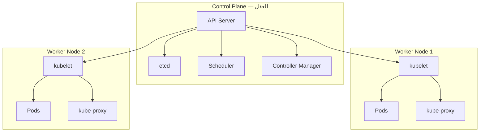
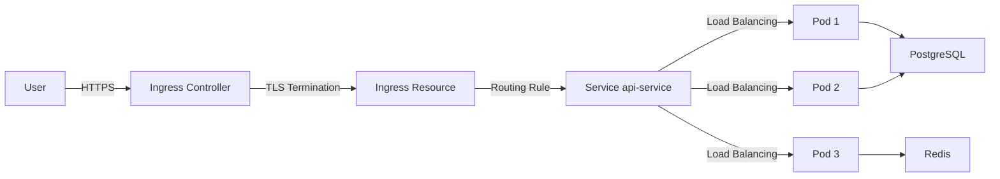

# Kubernetes من الصفر

> **"Kubernetes هو نظام التشغيل للسحابة الحديثة. إنه يدير حاوياتك عبر عشرات الخوادم — تلقائياً."**

## 🎯 أهداف التعلم

- فهم معمارية Kubernetes (Control Plane + Workers)
- إنشاء Deployments، Services، Ingress
- إدارة التكوين مع ConfigMaps و Secrets
- تطبيق NetworkPolicies و RBAC
- تشخيص وحل مشاكل الإنتاج

---

## 📖 الطبقة الأساسية: لماذا Kubernetes؟

تخيل أنك تدير ١٠٠ حاوية عبر ٢٠ خادماً. كل يوم:

- خادم يتعطل — من سينقل الحاويات لخادم آخر؟
- حمل المستخدمين يزداد — من سيضاعف الحاويات؟
- نشرت نسخة جديدة — من سيحدث دون توقف الخدمة؟
- حاوية تعطلت — من سيعيد تشغيلها؟

Kubernetes يفعل كل هذا تلقائياً. هذا هو السحر.

---

## 🧱 الطبقة المهنية: المعمارية — طائرتان



### مكونات Control Plane

| المكون                 | ماذا يفعل                            | ماذا لو تعطل؟                     |
| ---------------------- | ------------------------------------ | --------------------------------- |
| **API Server**         | المدخل الوحيد — كل شيء يمر عبره      | الكلستر يعمل لكن لا تغييرات جديدة |
| **etcd**               | قاعدة بيانات الكلستر — كل الحالة هنا | كارثة! آخر نسخة احتياطية تنقذك    |
| **Scheduler**          | يختار أي Node تشغل الـ Pod           | Pods جديدة تنتظر إلى الأبد        |
| **Controller Manager** | يراقب الحالة ويصلحها                 | لا إصلاح ذاتي، لا تحجيم           |

---

## 🏗️ الطبقة الإنتاجية: الموارد الأساسية — من Pod إلى Service

### Pod — أصغر وحدة

Pod هو مجموعة من حاوية واحدة أو أكثر. يشتركون في:

- نفس عنوان IP
- نفس مساحة التخزين
- نفس دورة الحياة — يولدون معاً ويموتون معاً

```yaml
apiVersion: v1
kind: Pod
metadata:
  name: cloudnova-api
  labels:
    app: api
spec:
  containers:
    - name: api
      image: cloudnova/api:v2.1
      ports:
        - containerPort: 8080
      env:
        - name: DATABASE_URL
          valueFrom:
            secretKeyRef:
              name: db-secret
              key: url
```

### Deployment — يدير Pods نيابة عنك

```yaml
apiVersion: apps/v1
kind: Deployment
metadata:
  name: api-deployment
spec:
  replicas: 3 # ثلاث نسخ دائمة
  selector:
    matchLabels:
      app: api
  strategy:
    type: RollingUpdate
    rollingUpdate:
      maxSurge: 1        # أقصى عدد Pods إضافية أثناء التحديث
      maxUnavailable: 0  # لا تفقد أي Pod أثناء التحديث
  template:
    metadata:
      labels:
        app: api
    spec:
      containers:
        - name: api
          image: cloudnova/api:v2.1
          ports:
            - containerPort: 8080
          resources:
            requests:
              memory: "128Mi"
              cpu: "100m"
            limits:
              memory: "256Mi"
              cpu: "500m"
          readinessProbe:
            httpGet:
              path: /health
              port: 8080
            initialDelaySeconds: 10
            periodSeconds: 5
          livenessProbe:
            httpGet:
              path: /health
              port: 8080
            initialDelaySeconds: 30
            periodSeconds: 15
```

---

## 🎨 الطبقة المعمارية: Service + Ingress — الوصول لـ Pods

### ClusterIP — داخلي فقط

```yaml
apiVersion: v1
kind: Service
metadata:
  name: api-service
spec:
  type: ClusterIP
  selector:
    app: api
  ports:
    - port: 80
      targetPort: 8080
      protocol: TCP
```

### Ingress — المدخل من الخارج

```yaml
apiVersion: networking.k8s.io/v1
kind: Ingress
metadata:
  name: api-ingress
  annotations:
    cert-manager.io/cluster-issuer: letsencrypt-prod
    nginx.ingress.kubernetes.io/ssl-redirect: "true"
spec:
  ingressClassName: nginx
  tls:
    - hosts:
        - api.cloudnova.com
      secretName: api-tls
  rules:
    - host: api.cloudnova.com
      http:
        paths:
          - path: /
            pathType: Prefix
            backend:
              service:
                name: api-service
                port:
                  number: 80
```

---

## ⚡ الإنتاج وما بعده: ConfigMap + Secret

```yaml
apiVersion: v1
kind: ConfigMap
metadata:
  name: api-config
data:
  LOG_LEVEL: "info"
  MAX_CONNECTIONS: "100"
  API_TIMEOUT: "30s"
---
apiVersion: v1
kind: Secret
metadata:
  name: db-secret
type: Opaque
stringData:
  url: "postgresql://user:pass@db:5432/cloudnova"
```

---

## 🛡️ NetworkPolicies — جدار الحماية بين Pods

```yaml
apiVersion: networking.k8s.io/v1
kind: NetworkPolicy
metadata:
  name: api-network-policy
spec:
  podSelector:
    matchLabels:
      app: api
  policyTypes:
    - Ingress
    - Egress
  ingress:
    # اسمح فقط من الـ Ingress Controller
    - from:
        - namespaceSelector:
            matchLabels:
              name: ingress-nginx
      ports:
        - port: 8080
  egress:
    # اسمح فقط لـ postgres و redis
    - to:
        - podSelector:
            matchLabels:
              app: postgres
      ports:
        - port: 5432
    - to:
        - podSelector:
            matchLabels:
              app: redis
      ports:
        - port: 6379
```

> **قاعدة ذهبية:** كل Namespace له `deny-all` افتراضي. ثم اسمح فقط بما تحتاجه.

---

## 🏛️ RBAC — من يفعل ماذا

```yaml
apiVersion: rbac.authorization.k8s.io/v1
kind: Role
metadata:
  namespace: production
  name: api-developer
rules:
  - apiGroups: [""]
    resources: ["pods", "pods/log"]
    verbs: ["get", "list", "watch"]
  - apiGroups: ["apps"]
    resources: ["deployments"]
    verbs: ["get", "list", "watch", "update", "patch"]
---
apiVersion: rbac.authorization.k8s.io/v1
kind: RoleBinding
metadata:
  namespace: production
  name: api-developer-binding
subjects:
  - kind: User
    name: ahmed@cloudnova.com
    apiGroup: rbac.authorization.k8s.io
roleRef:
  kind: Role
  name: api-developer
  apiGroup: rbac.authorization.k8s.io
```

---

## 📦 Helm — مدير حزم Kubernetes

```bash
# بحث عن PostgreSQL في Artifact Hub
helm search hub postgresql

# تثبيت PostgreSQL من Bitnami
helm repo add bitnami https://charts.bitnami.com/bitnami
helm install cloudnova-db bitnami/postgresql \
  --set auth.database=cloudnova \
  --set auth.password=secretpassword \
  --set primary.persistence.size=50Gi

# قيم مخصصة بملف values.yaml
cat > values.yaml <<EOF
auth:
  database: cloudnova
  password: secretpassword
primary:
  persistence:
    size: 50Gi
  resources:
    requests:
      memory: 512Mi
      cpu: 250m
EOF

helm upgrade cloudnova-db bitnami/postgresql -f values.yaml
```

---

## 📊 رسم بياني: تدفق الطلب من المستخدم لـ Pod



---

## 🚨 سيناريو CloudNova ١: CrashLoopBackOff

> **الموقف:** Pod الجديد لا يبدأ. CrashLoopBackOff.

```bash
# ١. ماذا حدث؟
kubectl describe pod api-deployment-7d8f6-abcde
# State: Waiting — Reason: CrashLoopBackOff
# Last State: Terminated — Reason: Error
# Exit Code: 1

# ٢. ماذا كتبت قبل أن تموت؟
kubectl logs api-deployment-7d8f6-abcde --previous
# Traceback: ModuleNotFoundError: No module named 'redis'
# ← requirements.txt لم يُحدّث!

# ٣. الحل:
# أضف redis لـ requirements.txt، rebuild الصورة، وحدث Deployment
kubectl set image deployment/api-deployment api=cloudnova/api:v2.2
kubectl rollout status deployment/api-deployment
```

---

## 🚨 سيناريو CloudNova ٢: Service لا تصل لـ Pods

> **الموقف:** `curl http://api-service` يعطي 503 Service Unavailable.

```bash
# ١. هل الـ Service موجودة؟
kubectl get svc api-service
# NAME          TYPE        CLUSTER-IP    PORT(S)
# api-service   ClusterIP   10.0.12.45    80/TCP

# ٢. هل الـ Endpoints صحيحة؟
kubectl get endpoints api-service
# NAME          ENDPOINTS
# api-service   <none>    ← لا Endpoints!

# ٣. لماذا؟ تحقق من selectors
kubectl describe svc api-service | grep Selector
# Selector: app=api

kubectl get pods -l app=api
# No resources found ← الـ Pods بعلامة مختلفة!

# ٤. الإصلاح:
kubectl get pods --show-labels | grep api
# api-xyz   app=api-backend   ← التسمية مختلفة!

# حدث الـ Service أو الـ Deployment ليطابقا:
kubectl patch deployment api-deployment -p \
  '{"spec":{"template":{"metadata":{"labels":{"app":"api"}}}}}'
```

---

## 🚨 سيناريو CloudNova ٣: OOMKilled — الذاكرة نفدت

> **الموقف:** الـ Pod يخرج بـ OOMKilled. Exit Code 137.

```bash
# ١. تشخيص
kubectl describe pod api-deployment-7d8f6-xyz
# Last State: Terminated — Reason: OOMKilled
# Exit Code: 137

# ٢. كم ذاكرة كانت تستهلك؟
kubectl top pod api-deployment-7d8f6-xyz
# NAME                       CPU    MEMORY
# api-deployment-xyz         50m    510Mi ← تجاوز limit 256Mi!

# ٣. تحليل الذاكرة
kubectl exec api-deployment-new -- python -c "
import tracemalloc
tracemalloc.start()
# ... run test workload ...
snapshot = tracemalloc.take_snapshot()
for stat in snapshot.statistics('lineno')[:5]:
    print(stat)
"

# ٤. الحلول:
# أ. ضاعف memory limit (مؤقت)
# ب. أصلح memory leak في الكود (دائم)
# ج. أضف HorizontalPodAutoscaler
```

---

## 📈 تحجيم تلقائي — HPA

```yaml
apiVersion: autoscaling/v2
kind: HorizontalPodAutoscaler
metadata:
  name: api-hpa
spec:
  scaleTargetRef:
    apiVersion: apps/v1
    kind: Deployment
    name: api-deployment
  minReplicas: 2
  maxReplicas: 10
  metrics:
    - type: Resource
      resource:
        name: cpu
        target:
          type: Utilization
          averageUtilization: 70
    - type: Resource
      resource:
        name: memory
        target:
          type: Utilization
          averageUtilization: 80
  behavior:
    scaleDown:
      stabilizationWindowSeconds: 300  # انتظر 5 دقائق قبل التخفيض
    scaleUp:
      stabilizationWindowSeconds: 0    # زِد فوراً
```

---

## 🔬 أدوات تشخيص متقدمة

```bash
# تفقد حالة كل الموارد في namespace
kubectl get all -n production

# تفاصيل شاملة عن Pod
kubectl describe pod <pod-name>

# ادخل الحاوية للتحقيق
kubectl exec -it <pod-name> -- /bin/sh

# منفذ Pod محلياً للفحص
kubectl port-forward <pod-name> 8080:8080

# سجلات pods متعددة بعلامة
kubectl logs -l app=api --all-containers=true -f

# تصدير YAML كامل — مراجعة
kubectl get deployment api-deployment -o yaml > backup.yaml

# كلفة الموارد
kubectl resource-capacity --pods --util

# أحداث الكلستر
kubectl get events --sort-by='.lastTimestamp' | tail -20
```

---

## نصائح إنتاجية — الخلاصة

1. **Requests = Limits في البداية.** حتى تفهم نمط الاستهلاك
2. **استخدم namespaces.** dev / staging / prod منفصلة تماماً
3. **Resource Quotas.** امنع فريق dev من استهلاك الكلستر كله
4. **NetworkPolicies.** ابدأ بـ deny-all، اسمح فقط ما تحتاجه
5. **Pod Disruption Budgets.** امنع حذف كل الـ Pods دفعة واحدة
6. **انسخ etcd احتياطياً.** إذا ضاع etcd — ضاع الكلستر
7. **لا تستخدم latest tag.** الإصدارات المحددة فقط
8. **Readiness Probes قبل Liveness Probes.** جاهزية ≠ حياة
9. **استخدم Helm.** لا تنشر يدوياً. Helm للإدارة، Argo CD للنشر

---

## 🧠 التذكّر النشط

1. ما الفرق بين readinessProbe و livenessProbe؟ متى تستخدم أياً منهما؟
2. لماذا تبدأ بـ deny-all في NetworkPolicies؟
3. كيف يعرف Service أي Pods يرسل لها الطلبات؟
4. ما الذي يحدث عندما يتجاوز Pod الـ memory limit؟
5. لماذا لا تستخدم latest tag في صور Kubernetes؟

## ✍️ تمرين Feynman

اشرح لشخص غير تقني: "كيف يشبه Kubernetes مدير مبنى سكني؟ (Control Plane = الإدارة، Worker Nodes = الشقق، Pods = السكان)"

## 📝 بطاقات تعليمية

- **kubelet**: الوكيل على كل Node. يتواصل مع Control Plane ويضمن تشغيل Pods
- **etcd**: قاعدة بيانات موزعة تحفظ كل حالة الكلستر. إذا ضاعت — ضاع كل شيء
- **Service**: طبقة تجريد توفر IP ثابت و DNS لمجموعة Pods متغيرة
- **Ingress**: بوابة HTTP/HTTPS خارجية. تدير TLS والتوجيه
- **Helm**: مدير حزم Kubernetes. ينشئ، يحدث، ويحذف مجموعات من الموارد
- **NetworkPolicy**: قواعد جدار حماية بين Pods. بالأساس deny-all ثم سماح انتقائي

## 🎤 أسئلة المقابلة

1. **"كيف تضمن Zero Downtime أثناء التحديث؟"**
   - RollingUpdate strategy مع maxUnavailable: 0
   - Readiness probes تؤكد جاهزية pods الجديدة قبل إزالة القديمة
   - PodDisruptionBudget يمنع حذف كل النسخ دفعة واحدة

2. **"كيف تصمم Namespace structure لشركة؟"**
   - Namespace لكل بيئة: dev, staging, prod
   - ResourceQuota يحدد استهلاك كل فريق
   - NetworkPolicies تفصل بين البيئات
   - RBAC يحدد صلاحيات كل فريق في الـ namespace الخاص به

3. **"ما الفرق بين Deployment و StatefulSet؟"**
   - Deployment: Pods متطابقة بدون هوية. أي Pod يمكن استبداله
   - StatefulSet: Pods بهوية ثابتة (اسم + تخزين). للـ Databases وقوائم الانتظار
   - StatefulSet يضمن ترتيب البدء والإيقاف

---

[← العودة للوحدة](01-kubernetes-architecture) | [🏠 الرئيسية](/)
