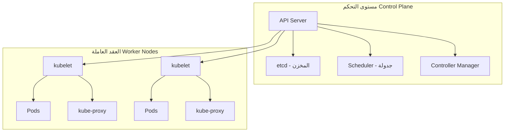

# أساسيات Kubernetes

> **"Kubernetes يُنسّق الحاويات على نطاق واسع. إنه نظام التشغيل للسحابة الحديثة. افهمه."**

## ما المشكلة التي يحلها Kubernetes؟

لديك ١٠ حاويات. سهلة — `docker run`.

لديك ١٠٠٠ حاوية عبر ٥٠ خادماً. الآن تحتاج:

- من يشغّل الحاوية على أي خادم؟ (جدولة)
- ماذا لو مات خادم؟ (إصلاح ذاتي)
- كيف تصل للحاوية من الخارج؟ (شبكات)
- كيف تحدّث دون توقف؟ (نشر تدريجي)
- كيف توسّع عند زيادة الحمل؟ (تحجيم)

Kubernetes يحل كل هذا. وأكثر.

## المعمارية — الطائرتان



## الموارد الأساسية

### Pod — أصغر وحدة

Pod يحتوي على حاوية واحدة أو أكثر. يشاركون نفس IP ونفس التخزين.

```yaml
apiVersion: v1
kind: Pod
metadata:
  name: cloudnova-api
spec:
  containers:
    - name: api
      image: cloudnova/api:v2
      ports:
        - containerPort: 8080
```

### Deployment — إدارة الـ Pods

```yaml
apiVersion: apps/v1
kind: Deployment
metadata:
  name: cloudnova-api
spec:
  replicas: 3 # ثلاث نسخ — توفر عالي
  selector:
    matchLabels:
      app: cloudnova-api
  template:
    metadata:
      labels:
        app: cloudnova-api
    spec:
      containers:
        - name: api
          image: cloudnova/api:v2
          ports:
            - containerPort: 8080
          resources:
            requests:
              memory: "128Mi"
              cpu: "100m"
            limits:
              memory: "256Mi"
              cpu: "500m"
          readinessProbe: # هل الحاوية جاهزة؟
            httpGet:
              path: /health
              port: 8080
            initialDelaySeconds: 5
            periodSeconds: 10
```

### Service — الوصول إلى الـ Pods

```yaml
apiVersion: v1
kind: Service
metadata:
  name: cloudnova-api-svc
spec:
  selector:
    app: cloudnova-api
  ports:
    - port: 80
      targetPort: 8080
  type: LoadBalancer # يعطي IP خارجي
```

## تشخيص المشاكل

```bash
# CrashLoopBackOff — الحاوية تبدأ وتموت
kubectl describe pod cloudnova-api-7d8f6-abcde
# Last State: Terminated — Reason: OOMKilled
# ← الذاكرة غير كافية! ضعف limits.memory

# شوف السجلات
kubectl logs cloudnova-api-7d8f6-abcde
kubectl logs cloudnova-api-7d8f6-abcde --previous  # الانهيار السابق

# ادخل الحاوية
kubectl exec -it cloudnova-api-7d8f6-abcde -- bash
```

## أوامر يومية

```bash
kubectl get pods                    # الحاويات
kubectl get deployments             # النشرات
kubectl get services                # الخدمات
kubectl get nodes                   # الخوادم
kubectl describe pod <name>         # تفاصيل حاوية
kubectl logs -f <pod>               # سجلات مباشرة
kubectl apply -f deployment.yaml    # نشر
kubectl delete pod <name>           # احذف حاوية (ستُعاد تلقائياً)
kubectl rollout restart deployment <name>  # أعد تشغيل النشر
kubectl scale deployment <name> --replicas=5  # وسّع
```

## سيناريو CloudNova: النشر الجديد يقتل التطبيق

> **الموقف:** نشرت `v3` من الـ API. فجأة — ٥٠٪ من الطلبات 500 Error.

```bash
# ١. شوف حالة النشر
kubectl rollout status deployment/cloudnova-api
# Waiting for deployment rollout to finish: 2 of 3 updated replicas available

# ٢. الـ pods الجديدة فيها مشكلة
kubectl get pods -l app=cloudnova-api
# cloudnova-api-v3-abcde   0/1   CrashLoopBackOff

# ٣. تشخيص
kubectl logs cloudnova-api-v3-abcde
# "Error: Cannot parse config file: syntax error at line 12"
# ← خطأ في ملف الإعدادات!

# ٤. تراجع فوراً
kubectl rollout undo deployment/cloudnova-api
# رجع للإصدار السابق

# ٥. الدرس:
# - استخدم readinessProbe دائماً — يمنع توجيه الحركة لحاويات معطوبة
# - استخدم strategy.rollingUpdate.maxUnavailable=1 — يضمن بقاء معظم النسخ شغالة
```

---

[← العودة للوحدة](index.md) | [🏠 الرئيسية](/)
