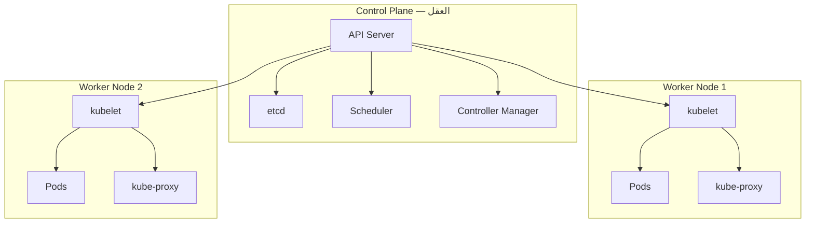

# Kubernetes من الصفر

> **"Kubernetes هو نظام التشغيل للسحابة الحديثة. إنه يدير حاوياتك عبر عشرات الخوادم — تلقائياً."**

## لماذا Kubernetes؟

تخيل أنك تدير ١٠٠ حاوية عبر ٢٠ خادماً. كل يوم:
- خادم يتعطل — من سينقل الحاويات لخادم آخر؟
- حمل المستخدمين يزداد — من سيضاعف الحاويات؟
- نشرت نسخة جديدة — من سيحدث دون توقف الخدمة؟
- حاوية تعطلت — من سيعيد تشغيلها؟

Kubernetes يفعل كل هذا تلقائياً. هذا هو السحر.

## المعمارية — طائرتان



### مكونات Control Plane

| المكون | ماذا يفعل | ماذا لو تعطل؟ |
|---|---|---|
| **API Server** | المدخل الوحيد — كل شيء يمر عبره | الكلستر يعمل لكن لا تغييرات جديدة |
| **etcd** | قاعدة بيانات الكلستر — كل الحالة هنا | كارثة! آخر نسخة احتياطية تنقذك |
| **Scheduler** | يختار أي Node تشغل الـ Pod | Pods جديدة تنتظر إلى الأبد |
| **Controller Manager** | يراقب الحالة ويصلحها | لا إصلاح ذاتي، لا تحجيم |

## الموارد الأساسية — من Pod إلى Service

### Pod — أصغر وحدة

Pod هو مجموعة من حاوية واحدة أو أكثر. يشتركون في:
- نفس عنوان IP
- نفس مساحة التخزين
- نفس دورة الحياة — يولدون معاً ويموتون معاً

```yaml
apiVersion: v1
kind: Pod
metadata:
  name: cloudnova-api
  labels:
    app: api
spec:
  containers:
  - name: api
    image: cloudnova/api:v2.1
    ports:
    - containerPort: 8080
    env:
    - name: DATABASE_URL
      valueFrom:
        secretKeyRef:
          name: db-secret
          key: url
```

### Deployment — يدير Pods نيابة عنك

```yaml
apiVersion: apps/v1
kind: Deployment
metadata:
  name: api-deployment
spec:
  replicas: 3                    # ثلاث نسخ دائمة
  selector:
    matchLabels:
      app: api
  strategy:
    type: RollingUpdate
    rollingUpdate:
      maxSurge: 1                # أقصى عدد Pods إضافية أثناء التحديث
      maxUnavailable: 0          # لا تفقد أي Pod أثناء التحديث
  template:
    metadata:
      labels:
        app: api
    spec:
      containers:
      - name: api
        image: cloudnova/api:v2.1
        ports:
        - containerPort: 8080
        resources:
          requests:
            memory: "128Mi"      # الحد الأدنى المضمون
            cpu: "100m"
          limits:
            memory: "256Mi"      # أقصى حد مسموح
            cpu: "500m"
        readinessProbe:          # هل الحاوية جاهزة لاستقبال الطلبات؟
          httpGet:
            path: /health
            port: 8080
          initialDelaySeconds: 10
          periodSeconds: 5
        livenessProbe:           # هل الحاوية حية؟
          httpGet:
            path: /health
            port: 8080
          initialDelaySeconds: 30
          periodSeconds: 15
```

### Service — كيف تصل للـ Pods

```yaml
apiVersion: v1
kind: Service
metadata:
  name: api-service
spec:
  type: LoadBalancer
  selector:
    app: api
  ports:
  - port: 80
    targetPort: 8080
    protocol: TCP
```

### ConfigMap + Secret

```yaml
apiVersion: v1
kind: ConfigMap
metadata:
  name: api-config
data:
  LOG_LEVEL: "info"
  MAX_CONNECTIONS: "100"
  API_TIMEOUT: "30s"
---
apiVersion: v1
kind: Secret
metadata:
  name: db-secret
type: Opaque
stringData:
  url: "postgresql://user:pass@db:5432/cloudnova"
```

## تشخيص المشاكل — دليل كامل

### CrashLoopBackOff — الحاوية تموت

```bash
# ١. ماذا حدث؟
kubectl describe pod api-deployment-7d8f6-abcde
# State: Waiting — Reason: CrashLoopBackOff
# Last State: Terminated — Reason: OOMKilled ← الذاكرة!
# Exit Code: 137

# ٢. ماذا كتبت قبل أن تموت؟
kubectl logs api-deployment-7d8f6-abcde --previous

# ٣. كم ذاكرة كانت تستهلك؟
kubectl top pod api-deployment-7d8f6-abcde
# الحل: ضاعف limits.memory
```

### ImagePullBackOff — الصورة غير موجودة

```bash
kubectl describe pod api-deployment-7d8f6-xyz
# Failed to pull image "cloudnova/api:v999"
# manifest for cloudnova/api:v999 not found

# الحل: تأكد من:
# ١. اسم الصورة صحيح
# ٢. الإصدار (tag) موجود
# ٣. الـ registry يسمح بالوصول (imagePullSecrets)
```

### Pending — الـ Pod لا يُجدول

```bash
kubectl describe pod api-deployment-7d8f6-pending
# 0/3 nodes are available: 3 Insufficient memory

# الحل:
# ١. قلل requests.memory
# ٢. أو أضف Nodes جديدة
# ٣. أو احذف Pods غير ضرورية
```

## سيناريو CloudNova: حادثة الإنتاج

> **الموقف:** نشرت `v3` من الـ API. بعد ٥ دقائق — ٥٠٪ من الطلبات 500 Error.

```bash
# ١. التراجع فوراً
kubectl rollout undo deployment/api-deployment
# عاد للإصدار السابق — توقف النزيف

# ٢. تحقيق: ماذا حدث في v3؟
kubectl logs api-deployment-v3-xyz --previous
# "Error: Cannot connect to Redis at redis:6379"
# v3 غيرت اسم خدمة Redis من redis إلى redis-cache
# لكن ConfigMap لم يُحدّث!

# ٣. الإصلاح الدائم
# - استخدم ConfigMap لكل القيم
# - أضف اختبار تكامل في CI/CD يتحقق من الاتصال
# - استخدم canary deployment (١٠٪ أولاً)
```

## تحجيم تلقائي — HPA

```yaml
apiVersion: autoscaling/v2
kind: HorizontalPodAutoscaler
metadata:
  name: api-hpa
spec:
  scaleTargetRef:
    apiVersion: apps/v1
    kind: Deployment
    name: api-deployment
  minReplicas: 2
  maxReplicas: 10
  metrics:
  - type: Resource
    resource:
      name: cpu
      target:
        type: Utilization
        averageUtilization: 70
  - type: Resource
    resource:
      name: memory
      target:
        type: Utilization
        averageUtilization: 80
```

## نصائح إنتاجية

1. **Requests = Limits في البداية.** حتى تفهم نمط الاستهلاك
2. **استخدم namespaces.** dev / staging / prod منفصلة تماماً
3. **Resource Quotas.** امنع فريق dev من استهلاك الكلستر كله
4. **Pod Disruption Budgets.** امنع حذف كل الـ Pods دفعة واحدة
5. **انسخ etcd احتياطياً.** إذا ضاع etcd — ضاع الكلستر
6. **لا تستخدم latest tag.** الإصدارات المحددة فقط

---

[← العودة للوحدة](index.md) | [🏠 الرئيسية](/)
