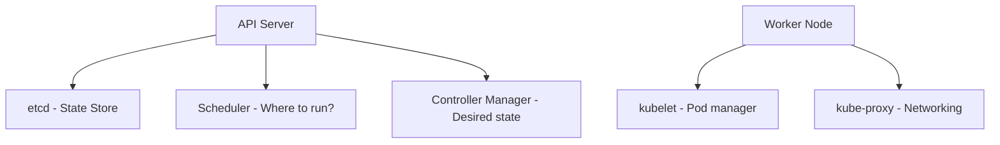

# Kubernetes Architecture

Kubernetes (K8s) orchestrates containers at scale. Understand its core.

## What You Will Learn

- Explain the control plane components
- Work with Pods, Deployments, Services
- Scale applications with HPA
- Debug failing deployments

## Control Plane



## Core Resources

```yaml
apiVersion: apps/v1
kind: Deployment
metadata:
  name: cloudnova-api
spec:
  replicas: 3
  selector:
    matchLabels:
      app: api
  template:
    metadata:
      labels:
        app: api
    spec:
      containers:
        - name: api
          image: cloudnova/api:v2
          ports:
            - containerPort: 8080
          resources:
            requests:
              memory: "128Mi"
              cpu: "100m"
            limits:
              memory: "256Mi"
              cpu: "500m"
```

## Debugging CrashLoopBackOff

```bash
kubectl describe pod pod-name     # What happened?
kubectl logs pod-name             # App output
kubectl logs pod-name --previous  # Previous crash
kubectl get events                # Cluster events
```

## CloudNova Scenario

The production deployment shows `CrashLoopBackOff`. Debug:

1. `kubectl describe pod` → "OOMKilled" — out of memory
2. Check resource limits — set to 64Mi, app needs 256Mi
3. Fix: `resources.limits.memory: "256Mi"`
4. Apply and verify: `kubectl rollout status deployment/api`

---

[← Back to Module](index.md) | [🏠 Home](/)
