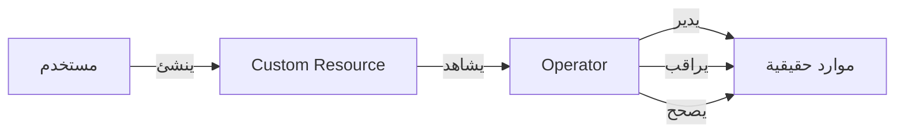

# Operators و CRDs

> "إذا كان Kubernetes لا يفهم تطبيقك، علّمه. هذا هو الـ Operator."

## 🎯 أهداف التعلم

- فهم CRDs (Custom Resource Definitions)
- بناء Operator بسيط
- استخدام Operator Framework
- نشر وإدارة Operators

## ⏱️ الوقت المقدر: 40 دقيقة | المستوى: Advanced

---

## 🧠 الطبقة البسيطة

تخيل أن Kubernetes مثل هاتف ذكي. التطبيقات المدمجة (Deployment, Service) رائعة. لكن أحياناً تحتاج تطبيقاً خاصاً غير موجود. CRD هو متجر التطبيقات: تنشئ تطبيقك الخاص. Operator هو المطور الذي يكتب التطبيق.

---

## 🏗️ CRD — المورد المخصص

```yaml
apiVersion: apiextensions.k8s.io/v1
kind: CustomResourceDefinition
metadata:
  name: postgresbackups.cloudnova.com
spec:
  group: cloudnova.com
  names:
    kind: PostgresBackup
    plural: postgresbackups
    singular: postgresbackup
    shortNames: [pgb]
  scope: Namespaced
  versions:
    - name: v1
      served: true
      storage: true
      schema:
        openAPIV3Schema:
          type: object
          properties:
            spec:
              type: object
              properties:
                database:
                  type: string
                schedule:
                  type: string
                  pattern: "^@(every|daily|weekly)"
```

### استخدام الـ CRD

```yaml
apiVersion: cloudnova.com/v1
kind: PostgresBackup
metadata:
  name: prod-daily-backup
spec:
  database: cloudnova-prod
  schedule: "@daily"
```

الآن الـ Operator يشاهد هذا المورد وينفذ الـ backup تلقائياً!

### Operator Pattern



---

## 🏛️ طبقة الإنتاج: سيناريو CloudNova

يحتاج الفريق نسخاً احتياطية يومية لـ 10 قواعد بيانات. بدلاً من 10 cron jobs + سكريبتات، أنشأنا PostgresBackup Operator:

1. المطور يكتب `kind: PostgresBackup` مع schedule
2. Operator يشاهد وينفذ backup
3. إذا فشل: يعيد المحاولة
4. إذا نجح: يسجل في Prometheus metrics

### Operator SDK

```bash
operator-sdk init --domain cloudnova.com --plugins helm
operator-sdk create api --group db --version v1 --kind PostgresBackup
```

---

## 🎨 متى تبني Operator؟

| السيناريو                                         | استخدم           |
| ------------------------------------------------- | ---------------- |
| نشر تطبيق بسيط                                    | Helm Chart       |
| إدارة دورة حياة معقدة (backup, scaling, failover) | Operator         |
| أتمتة مهام يومية                                  | CronJob + script |

---

## 🛠️ تدريبات

### تمرين: أنشئ CRD لـ `RedisCluster`

### تحدي: انشر Prometheus Operator من OperatorHub

---

## 📝 تقييم

### ✅ فحص المعرفة

1. ما الفرق بين CRD و Operator؟
2. متى تبني Operator بدلاً من Helm chart؟
3. كيف يعمل reconciliation loop؟

### 🃏 بطاقات

| السؤال         | الإجابة                                          |
| -------------- | ------------------------------------------------ |
| CRD            | Custom Resource Definition — يوسع Kubernetes API |
| Operator       | برنامج يدير دورة حياة تطبيق معقد                 |
| Reconciliation | مقارنة الحالة المطلوبة بالحالية وتصحيح الفرق     |

---

## 🎤 مقابلة

1. **"متى تحتاج Operator؟"** → عندما تحتاج منطقاً يتجاوز قدرات Helm (backup, failover, scaling logic)
2. **"كيف يختلف Operator عن Helm؟"** → Helm: نشر مرة واحدة. Operator: مراقبة وتصحيح مستمرين

---

## 📚 مراجع

| النوع     | الرابط                                                            |
| --------- | ----------------------------------------------------------------- |
| درس مرتبط | [K8s Troubleshooting](./06-kubernetes-troubleshooting-production) |
| أداة      | [Operator Framework](https://operatorframework.io)                |

---

[← K8s Storage](./04-kubernetes-storage-persistent-volumes) | [→ Troubleshooting](./06-kubernetes-troubleshooting-production) | [🏠 الرئيسية](/)
