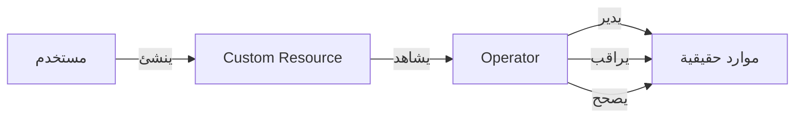

# Operators و CRDs

> "إذا كان Kubernetes لا يفهم تطبيقك، علّمه. هذا هو الـ Operator."

## 🎯 أهداف التعلم

- فهم CRDs (Custom Resource Definitions)
- بناء Operator بسيط
- استخدام Operator Framework
- نشر وإدارة Operators

## ⏱️ الوقت المقدر: 40 دقيقة | المستوى: Advanced

---

## 🏗️ CRD — المورد المخصص

```yaml
apiVersion: apiextensions.k8s.io/v1
kind: CustomResourceDefinition
metadata:
  name: postgresbackups.cloudnova.com
spec:
  group: cloudnova.com
  names:
    kind: PostgresBackup
    plural: postgresbackups
    singular: postgresbackup
    shortNames: [pgb]
  scope: Namespaced
  versions:
  - name: v1
    served: true
    storage: true
    schema:
      openAPIV3Schema:
        type: object
        properties:
          spec:
            type: object
            properties:
              database:
                type: string
              schedule:
                type: string
                pattern: "^@(every|daily|weekly)"
```

### استخدام الـ CRD

```yaml
apiVersion: cloudnova.com/v1
kind: PostgresBackup
metadata:
  name: prod-daily-backup
spec:
  database: cloudnova-prod
  schedule: "@daily"
```

الآن الـ Operator يشاهد هذا المورد وينفذ الـ backup تلقائياً!

### Operator Pattern



---

## 🛠️ تدريب

1. أنشئ CRD لـ `RedisCluster` بسيط
2. انشر Operator من OperatorHub.io (مثل Prometheus Operator)

---

[← K8s Storage](./04-kubernetes-storage-persistent-volumes) | [→ Troubleshooting](./06-kubernetes-troubleshooting-production) | [🏠 الرئيسية](/)
