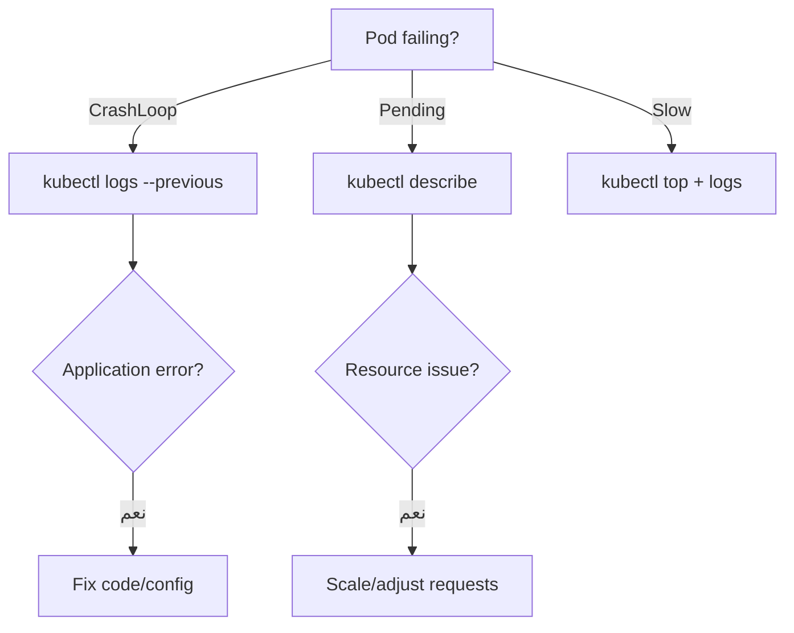

# استكشاف أخطاء Kubernetes

> "90% من مشاكل Kubernetes تتشابه. تعلم الـ 10% المتبقية."

## 🎯 أهداف التعلم

- تشخيص CrashLoopBackOff و OOMKilled
- استكشاف Pending pods
- قراءة Events و Logs بفعالية
- أدوات debugging: kubectl debug, stern, k9s

## ⏱️ الوقت المقدر: 45 دقيقة | المستوى: Advanced

---

## 🏗️ المشاكل الشائعة

### 1. CrashLoopBackOff

```bash
kubectl get pods
kubectl logs api-7d5f --previous
kubectl describe pod api-7d5f | grep -A 10 "Events:"
```

**الأسباب**: خطأ في الكود، ConfigMap غير موجود، DB unreachable، Port conflict

### 2. OOMKilled

```bash
kubectl describe pod api-7d5f | grep OOM
kubectl set resources deployment/api --limits=memory=512Mi
```

### 3. Pending Pods

```bash
kubectl describe pod api-7d5f | grep -A 5 "Events:"
# أسباب: Insufficient cpu/memory, no nodes match affinity, PVC not bound
```

### أدوات debugging

```bash
kubectl debug node/aks-agentpool-123 -it --image=ubuntu
kubectl run tmp-shell --rm -it --image=alpine -- sh
kubectl get events --sort-by='.lastTimestamp' | tail -20
```

---

## 🏛️ طبقة الإنتاج: سيناريو CloudNova

**2 صباحاً**: Production down. 500 errors.

```bash
kubectl get pods  # 3 pods في CrashLoopBackOff
kubectl logs api-xxx --previous  # Error: connect ECONNREFUSED postgres-service:5432
kubectl get svc postgres-service  # لا يوجد! حُذف بالخطأ
helm rollback postgres 1  # عودة فورية
```

الوقت: 4 دقائق.

### Debugging Workflow



---

## 🎨 أدوات debugging

| الأداة | الاستخدام |
|--------|-----------|
| `kubectl describe` | تفاصيل + Events |
| `kubectl logs` | سجلات التطبيق |
| `stern` | tail logs لعدة pods |
| `k9s` | terminal UI تفاعلي |
| `kubectl debug` | حاوية مؤقتة للفحص |

---

## 🛠️ تدريبات

### تمرين: شخّص CrashLoopBackOff عن عمد
### تحدي: استخدم stern لمراقبة logs 5 pods معاً

---

## 📝 تقييم

### ✅ فحص المعرفة
1. كيف تشخص CrashLoopBackOff؟
2. ما الفرق بين OOMKilled و Pending؟
3. متى تستخدم `kubectl debug`؟

### 🃏 بطاقات
| السؤال | الإجابة |
|--------|---------|
| CrashLoopBackOff | pod يعيد التشغيل باستمرار بسبب خطأ |
| OOMKilled | قُتل بسبب تجاوز memory limit |
| `--previous` | logs من المحاولة السابقة للـ pod |

---

## 🎤 مقابلة
1. **"احكِ عن أسوأ حادثة Kubernetes تعاملت معها"** → STAR format
2. **"كيف تشخص بطء pod بدون أخطاء؟"** → `kubectl top` + `kubectl exec` + metrics inspection

---

## 📚 مراجع

| النوع | الرابط |
|-------|--------|
| درس مرتبط | [Operators & CRDs](./05-kubernetes-operators-crds) |
| أداة | [k9s](https://k9scli.io) |

---

[← Operators & CRDs](./05-kubernetes-operators-crds) | [→ Helm Fundamentals](../../11-helm/01-helm-fundamentals) | [🏠 الرئيسية](/)
