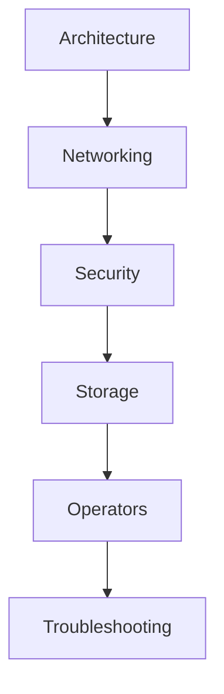

import Tabs from '@theme/Tabs';
import TabItem from '@theme/TabItem';

# 🚀 Kubernetes

> المعمارية، الشبكات، الأمان، التخزين، Operators — أتقن K8s من الداخل.

## 🎯 أهداف التعلم

بعد إكمال هذه الوحدة، ستكون قادراً على:

- [**معمارية K8s**](01-kubernetes-architecture) — المكونات الأساسية
- [**شبكات K8s**](02-kubernetes-networking) — CNI، Service Mesh
- [**أمن K8s**](03-kubernetes-security-rbac-pod-security) — RBAC و Pod Security
- [**تخزين K8s**](04-kubernetes-storage-persistent-volumes) — PV و PVC
- [**Operators**](05-kubernetes-operators-crds) — أتمتة الإدارة
- [**استكشاف الأعطال**](06-kubernetes-troubleshooting-production) — تشخيص الإنتاج

## 💡 المهارات التي ستكتسبها

K8s Architecture • Networking • RBAC • Storage • Operators • Troubleshooting

## 📊 معلومات الوحدة

| العنصر | القيمة |
| ------ | ------ |
| **المستوى** | متقدم |
| **الوقت المقدر** | 12 ساعة |
| **المتطلبات** | Docker |
| **الشهادات** | CKA, CKAD, CKS |
| **المشاريع** | ترحيل إلى AKS |
| **المختبرات** | K8s Playground |

## 🏛️ مهمة CloudNova

> قُد ترحيل CloudNova إلى Kubernetes. 50 خدمة، صفر downtime.

## 🗺️ خريطة الوحدة

## 📖 الدروس

<Tabs>
<TabItem value="all" label="كل الدروس" default>

- [**معمارية K8s**](01-kubernetes-architecture) — المكونات الأساسية
- [**شبكات K8s**](02-kubernetes-networking) — CNI، Service Mesh
- [**أمن K8s**](03-kubernetes-security-rbac-pod-security) — RBAC و Pod Security
- [**تخزين K8s**](04-kubernetes-storage-persistent-volumes) — PV و PVC
- [**Operators**](05-kubernetes-operators-crds) — أتمتة الإدارة
- [**استكشاف الأعطال**](06-kubernetes-troubleshooting-production) — تشخيص الإنتاج

</TabItem>
</Tabs>

## 🚀 ابدأ التعلم

[▶️ ابدأ الدرس الأول](01-kubernetes-architecture)
