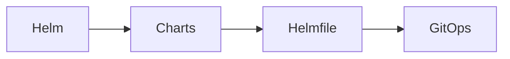

import Tabs from '@theme/Tabs';
import TabItem from '@theme/TabItem';

# 🚀 Helm

> إدارة الحزم لـ Kubernetes — Helm Charts، Helmfile، GitOps.

## 🎯 أهداف التعلم

بعد إكمال هذه الوحدة، ستكون قادراً على:

- [**أساسيات Helm**](01-helm-fundamentals) — Charts و Releases
- [**أفضل ممارسات Helm**](02-helm-chart-best-practices) — تصميم Charts احترافية
- [**Helmfile و GitOps**](03-helmfile-gitops-integration) — دمج مع GitOps

## 💡 المهارات التي ستكتسبها

Helm Charts • Helmfile • Chart Best Practices • GitOps

## 📊 معلومات الوحدة

| العنصر | القيمة |
| ------ | ------ |
| **المستوى** | متوسط |
| **الوقت المقدر** | 4 ساعات |
| **المتطلبات** | Kubernetes |
| **الشهادات** | CKA |
| **المشاريع** | — |
| **المختبرات** | — |

## 🏛️ مهمة CloudNova

> وحد نشر 30 خدمة CloudNova باستخدام Helm. لا مزيد من kubectl apply.

## 🗺️ خريطة الوحدة

## 📖 الدروس

<Tabs>
<TabItem value="all" label="كل الدروس" default>

- [**أساسيات Helm**](01-helm-fundamentals) — Charts و Releases
- [**أفضل ممارسات Helm**](02-helm-chart-best-practices) — تصميم Charts احترافية
- [**Helmfile و GitOps**](03-helmfile-gitops-integration) — دمج مع GitOps

</TabItem>
</Tabs>

## 🚀 ابدأ التعلم

[▶️ ابدأ الدرس الأول](01-helm-fundamentals)
