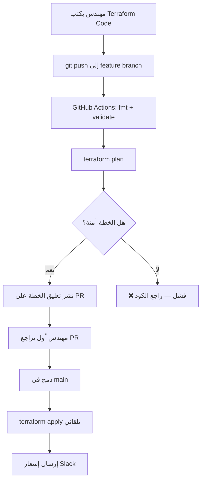

# Terraform — البنية التحتية ككود

> **"لا تنشئ موارد سحابية بالنقر في البوابة. اكتبها ككود. كل شيء يُبنى بنقرة واحدة ويمكن إعادة بنائه في أي وقت."**

## 🎯 أهداف التعلم

- كتابة Infrastructure as Code بـ HCL
- إدارة الـ State بشكل آمن في Azure Storage
- بناء Modules قابلة لإعادة الاستخدام
- دمج Terraform في CI/CD pipelines
- استكشاف وحل مشاكل الإنتاج (state corruption, drift)

---

## 📖 الطبقة الأساسية: لماذا Infrastructure as Code؟

| المشكلة                 | بدون IaC                    | مع Terraform              |
| ----------------------- | --------------------------- | ------------------------- |
| **إعادة البناء**        | ساعات من النقر اليدوي       | `terraform apply`         |
| **معرفة ما في الإنتاج** | "أعتقد أن لدينا ٤ خوادم..." | ملفات `.tf` = الحقيقة     |
| **مراجعة التغييرات**    | "ماذا غيرت بالأمس؟"         | Git history               |
| **بيئات متعددة**        | كل بيئة مختلفة              | نفس الكود، متغيرات مختلفة |
| **التعافي من الكوارث**  | أسابيع                      | ساعات                     |

### الدورة الأساسية — الأوامر الأربعة

```bash
terraform init      # يحمّل الـ Providers، يجهّز الـ Backend
terraform fmt       # ينسق الملفات — دائماً قبل commit
terraform validate  # يتحقق من صحة التركيب
terraform plan      # يعرض ما سيتغير — لا تغيير حقيقي
terraform apply     # ينفذ التغييرات

# بعد الانتهاء
terraform destroy   # يحذف كل شيء — استخدمه بحذر!
```

### ماذا يحدث في كل خطوة؟

| الأمر   | ماذا يفعل                                      | كم يستغرق    |
| ------- | ---------------------------------------------- | ------------ |
| `init`  | يحمّل azurerm provider (~100MB)، يجهّز backend | ١٠-٣٠ ثانية  |
| `plan`  | يقارن `.tf` بالحالة الفعلية في Azure           | ٣٠-١٢٠ ثانية |
| `apply` | يستدعي Azure API لإنشاء/تعديل/حذف الموارد      | ١-١٥ دقيقة   |

---

## 🧱 الطبقة المهنية: أول ملف Terraform — بناء شبكة

```hcl
# main.tf
terraform {
  required_version = ">= 1.5"
  required_providers {
    azurerm = {
      source  = "hashicorp/azurerm"
      version = "~> 4.0"
    }
  }
}

provider "azurerm" {
  features {}
  # لا تضع مفاتيح هنا! استخدم:
  # export ARM_CLIENT_ID=...
  # export ARM_CLIENT_SECRET=...
  # export ARM_TENANT_ID=...
}

resource "azurerm_resource_group" "main" {
  name     = "cloudnova-prod-rg"
  location = "West Europe"
}

resource "azurerm_virtual_network" "main" {
  name                = "cloudnova-vnet"
  location            = azurerm_resource_group.main.location
  resource_group_name = azurerm_resource_group.main.name
  address_space       = ["10.0.0.0/16"]
}

resource "azurerm_subnet" "app" {
  name                 = "app-subnet"
  resource_group_name  = azurerm_resource_group.main.name
  virtual_network_name = azurerm_virtual_network.main.name
  address_prefixes     = ["10.0.1.0/24"]
}

resource "azurerm_subnet" "db" {
  name                 = "db-subnet"
  resource_group_name  = azurerm_resource_group.main.name
  virtual_network_name = azurerm_virtual_network.main.name
  address_prefixes     = ["10.0.2.0/24"]
}

# مخرجات — لاستخدامها في ملفات أخرى
output "vnet_id" {
  value = azurerm_virtual_network.main.id
}

output "app_subnet_id" {
  value = azurerm_subnet.app.id
}
```

---

## 🏗️ الطبقة الإنتاجية: إدارة الحالة — أهم درس في Terraform

```hcl
# ⚠️ لا ترفع terraform.tfstate لـ Git أبداً!
# الملف يحتوي على كل Resource IDs وقد يحتوي أسراراً!

# الحل: Azure Storage Backend مع lease locking
terraform {
  backend "azurerm" {
    resource_group_name  = "tfstate-rg"
    storage_account_name = "tfstatecloudnova"
    container_name       = "tfstate"
    key                  = "prod.terraform.tfstate"
  }
}
```

### ماذا يخزن الـ State؟

- كل Resource ID (حتى يعرف ماذا يدير)
- كل Attribute (حتى يعرف ماذا تغير)
- التبعيات بين الموارد
- **أحياناً أسرار** (لهذا لا يُرفع لـ Git!)

### State Locking — لماذا هو ضروري

```bash
# بدون قفل: مهندسان يشغلان terraform apply في نفس الوقت
# النتيجة: كارثة! تناقض في الحالة

# مع قفل Azure Storage lease:
# terraform apply الأول يحجز lease
# terraform apply الثاني ينتظر:
# "Acquiring state lock..."
# "Error: Error acquiring the state lock"
```

---

## 🎨 الطبقة المعمارية: المتغيرات — Don't Repeat Yourself

```hcl
# variables.tf
variable "environment" {
  description = "بيئة النشر"
  type        = string
  default     = "dev"
  validation {
    condition     = contains(["dev", "staging", "prod"], var.environment)
    error_message = "يجب أن تكون dev أو staging أو prod"
  }
}

variable "vm_count" {
  type    = number
  default = 1
}

variable "vm_size" {
  type = map(string)
  default = {
    dev     = "Standard_B1s"
    staging = "Standard_B2s"
    prod    = "Standard_B2ms"
  }
}

# استخدمها — مع for_each للبيانات الديناميكية
locals {
  subnets = {
    app = { prefix = "10.0.1.0/24", delegations = [] }
    db  = { prefix = "10.0.2.0/24", delegations = ["Microsoft.Sql"] }
  }
}

resource "azurerm_subnet" "app" {
  for_each             = local.subnets
  name                 = "${each.key}-subnet"
  resource_group_name  = azurerm_resource_group.main.name
  virtual_network_name = azurerm_virtual_network.main.name
  address_prefixes     = [each.value.prefix]
}

resource "azurerm_linux_virtual_machine" "web" {
  count = var.vm_count
  name  = "web-${var.environment}-${count.index}"
  size  = var.vm_size[var.environment]
  # ...
}
```

```bash
# قيم من ملف
terraform apply -var-file="prod.tfvars"

# قيم من سطر الأوامر
terraform apply -var="environment=prod" -var="vm_count=3"

# قيم من متغيرات البيئة
export TF_VAR_environment=prod
terraform apply
```

---

## ⚡ الإنتاج وما بعده: Drift Detection

```bash
# هل تغير شيء في Azure خارج Terraform؟
terraform plan -detailed-exitcode
# Exit code 0: لا تغيير
# Exit code 1: خطأ
# Exit code 2: هناك تغييرات — Drift!

# اكتشف drift تلقائياً في CI/CD:
terraform plan -detailed-exitcode
if [ $? -eq 2 ]; then
  echo "⚠️ DRIFT DETECTED!"
  # أرسل تنبيهاً للفريق
fi

# لإصلاح drift:
terraform apply -auto-approve   # يعيد الحالة للمطابقة
# أو:
terraform import <resource> <id>  # استيراد مورد موجود
```

---

## 🏛️ الوحدات — Modules للمؤسسات

```hcl
# modules/web-server/main.tf
resource "azurerm_linux_virtual_machine" "main" {
  count               = var.instance_count
  name                = "${var.name}-${count.index}"
  resource_group_name = var.resource_group_name
  location            = var.location
  size                = var.vm_size
  admin_username      = var.admin_username

  admin_ssh_key {
    username   = var.admin_username
    public_key = file(var.ssh_public_key_path)
  }

  os_disk {
    caching              = "ReadWrite"
    storage_account_type = "Standard_LRS"
  }

  source_image_reference {
    publisher = "Canonical"
    offer     = "0001-com-ubuntu-server-jammy"
    sku       = "22_04-lts"
    version   = "latest"
  }
}

# modules/web-server/variables.tf
variable "name"              { type = string }
variable "instance_count"    { type = number }
variable "vm_size"           { type = string }
variable "resource_group_name" { type = string }
variable "location"          { type = string }
variable "admin_username"    { type = string }
variable "ssh_public_key_path" { type = string }

# modules/web-server/outputs.tf
output "vm_ids" {
  value = [for vm in azurerm_linux_virtual_machine.main : vm.id]
}

# استخدم الوحدة ٣ مرات
module "web_dev" {
  source              = "./modules/web-server"
  name                = "web-dev"
  instance_count      = 1
  vm_size             = "Standard_B1s"
  resource_group_name = azurerm_resource_group.main.name
  location            = azurerm_resource_group.main.location
  admin_username      = "azureuser"
  ssh_public_key_path = "~/.ssh/dev.pub"
}

module "web_prod" {
  source              = "./modules/web-server"
  name                = "web-prod"
  instance_count      = 3
  vm_size             = "Standard_B2ms"
  resource_group_name = azurerm_resource_group.main.name
  location            = azurerm_resource_group.main.location
  admin_username      = "azureuser"
  ssh_public_key_path = "~/.ssh/prod.pub"
}
```

---

## 🚨 سيناريو CloudNova ١: كارثة State

> **الموقف:** `terraform plan` يريد **حذف** قاعدة بيانات الإنتاج!

```bash
Plan: 2 to add, 0 to change, 1 to destroy.
# azurerm_postgresql_database.main must be replaced
```

**لماذا؟** شخص عدّل `name` في الملف. Terraform لا يعرف أن "قاعدة البيانات تغير اسمها". يرى: "احذف القديم، أنشئ جديد".

**الحلول:**

1. **أعد الاسم القديم فوراً.**
2. استخدم `terraform state mv` لنقل المورد القديم للاسم الجديد:

```bash
terraform state mv \
  azurerm_postgresql_database.old_name \
  azurerm_postgresql_database.new_name
```

3. أضف حماية للموارد الحرجة:

```hcl
resource "azurerm_postgresql_database" "main" {
  name = "cloudnova-db"
  # ...
  lifecycle {
    prevent_destroy = true   # ⚠️ ارفض الحذف
  }
}
```

---

## 🚨 سيناريو CloudNova ٢: State Corruption

> **الموقف:** `terraform plan` يفشل: `Error: Invalid state. The state is corrupted.`

```bash
# ١. هل الـ state في Azure Storage سليم؟
az storage blob show \
  --account-name tfstatecloudnova \
  --container-name tfstate \
  --name prod.terraform.tfstate

# ٢. استرجع من backup
# Azure Storage يحفظ نسخاً احتياطية تلقائياً
az storage blob list \
  --account-name tfstatecloudnova \
  --container-name tfstate \
  --prefix prod.terraform.tfstate

# ٣. اسحب نسخة قديمة
terraform state pull > corrupted.tfstate   # احفظ النسخة التالفة
az storage blob download \
  --account-name tfstatecloudnova \
  --container-name tfstate \
  --name prod.terraform.tfstate.backup \
  --file good.tfstate

terraform state push good.tfstate
terraform plan   # ✅ يجب أن يعمل الآن
```

---

## 🚨 سيناريو CloudNova ٣: CI/CD Pipeline

```yaml
# .github/workflows/terraform.yml
name: Terraform CI/CD

on:
  pull_request:
    paths:
      - "terraform/**"

jobs:
  terraform:
    runs-on: ubuntu-latest
    permissions:
      contents: read
      id-token: write # لـ OIDC مع Azure

    steps:
      - uses: actions/checkout@v4

      - name: Azure Login via OIDC
        uses: azure/login@v2
        with:
          client-id: ${{ secrets.AZURE_CLIENT_ID }}
          tenant-id: ${{ secrets.AZURE_TENANT_ID }}
          subscription-id: ${{ secrets.AZURE_SUBSCRIPTION_ID }}

      - name: Setup Terraform
        uses: hashicorp/setup-terraform@v3
        with:
          terraform_version: "1.7"

      - name: Terraform Format
        run: terraform fmt -check -recursive

      - name: Terraform Init
        run: terraform init

      - name: Terraform Validate
        run: terraform validate

      - name: Terraform Plan
        run: terraform plan -no-color -out=tfplan

      - name: Comment Plan on PR
        uses: actions/github-script@v7
        with:
          script: |
            const fs = require('fs');
            const output = fs.readFileSync('tfplan.txt', 'utf8');
            github.rest.issues.createComment({
              issue_number: context.issue.number,
              owner: context.repo.owner,
              repo: context.repo.repo,
              body: `### Terraform Plan\n\n\`\`\`hcl\n${output}\n\`\`\``
            });
```

---

## 📊 رسم بياني: تدفق عمل Terraform في المؤسسة



---

## 🛡️ Terragrunt — إدارة Terraform في المؤسسات الكبيرة

```hcl
# terragrunt.hcl — Terragrunt يقلل التكرار
remote_state {
  backend = "azurerm"
  config = {
    resource_group_name  = "tfstate-rg"
    storage_account_name = "tfstatecloudnova"
    container_name       = "tfstate"
    key                  = "${path_relative_to_include()}/terraform.tfstate"
  }
}

# توليد provider تلقائياً
generate "provider" {
  path      = "provider.generated.tf"
  if_exists = "overwrite"
  contents  = <<EOF
provider "azurerm" {
  features {}
}
EOF
}

inputs = {
  environment = "prod"
  location    = "West Europe"
  vm_count    = 3
}

# في كل بيئة، أنشئ terragrunt.hcl يستدعي الإعدادات العامة:
# terragrunt.hcl:
# include "root" {
#   path = find_in_parent_folders()
# }
```

---

## 📋 ورقة غش الأوامر المتقدمة

| الأمر                                      | الاستخدام                                 |
| ------------------------------------------ | ----------------------------------------- |
| `terraform state list`                     | عرض كل الموارد في الـ state               |
| `terraform state show <addr>`              | تفاصيل مورد واحد                          |
| `terraform state rm <addr>`                | إزالة مورد من الـ state (بدون حذف حقيقي!) |
| `terraform import <addr> <id>`             | استيراد مورد موجود لـ state               |
| `terraform refresh`                        | تحديث الـ state ليطابق الواقع             |
| `terraform taint <addr>`                   | إجبار إعادة إنشاء مورد                    |
| `terraform untaint <addr>`                 | إلغاء taint                               |
| `terraform graph \| dot -Tsvg > graph.svg` | رسم dependency graph                      |
| `terraform workspace new staging`          | إنشاء workspace جديد                      |
| `terraform workspace select prod`          | التبديل لـ workspace                      |

---

## 🧠 التذكّر النشط

1. لماذا لا ترفع ملف `terraform.tfstate` لـ Git أبداً؟
2. ما الفرق بين `terraform plan` و `terraform apply`؟
3. كيف تحمي موارد الإنتاج من الحذف الخطأ؟
4. متى تستخدم `terraform import` بدلاً من `terraform apply`؟
5. كيف تكتشف التغييرات اليدوية خارج Terraform (drift)؟

## ✍️ تمرين Feynman

اشرح لزميل غير تقني: "كيف يضمن Terraform أن بيئة الإنتاج تطابق الكود دائماً؟"

## 📝 بطاقات تعليمية

- **Provider**: المكون الذي يفهم Azure/AWS API. يحوّل `.tf` لـ REST calls
- **State File**: سجل لكل الموارد التي يديرها Terraform. هو الحقيقة الوحيدة
- **Backend**: مكان تخزين الـ state. Azure Storage أو S3 أو Terraform Cloud
- **Module**: حزمة قابلة لإعادة الاستخدام من موارد Terraform
- **Workspace**: نسخة معزولة من الـ state لنفس الكود (بيئة مختلفة)
- **for_each**: إنشاء موارد متعددة من map/set بدلاً من count (أكثر استقراراً)

## 🎤 أسئلة المقابلة

1. **"كيف تدير الـ Terraform State في فريق؟"**
   - Remote backend في Azure Storage/S3
   - State locking لمنع التزامن
   - backups تلقائية
   - لا ترفع state لـ Git أبداً

2. **"ما الفرق بين count و for_each؟"**
   - count: قائمة بالـ index (0,1,2...) — إذا حذفت عنصراً في المنتصف، كل العناصر التالية تتغير!
   - for_each: map/set بمفاتيح محددة — حذف عنصر لا يؤثر على الباقي
   - دائماً استخدم for_each مع maps

3. **"كيف تدمج Terraform في CI/CD؟"**
   - fmt → validate → plan على كل PR
   - apply فقط بعد merge لـ main
   - OIDC للمصادقة (بدون secrets)
   - تعليق plan على PR للمراجعة

---

## نصائح الإنتاج — الخلاصة

1. **State في Azure Storage دائماً.** مع قفل `lease` لمنع التزامن
2. **Plan قبل كل Apply.** وراجع الخطة بعناية
3. **لا تستخدم Terraform لإدارة الأسرار.** استخدم Key Vault مع data source
4. **فصل State.** كل بيئة لها state خاص بها
5. **CI/CD للـ Terraform.** لا تشغل apply من جهازك الشخصي
6. **Sentinel/OPA Policies.** امنع إنشاء موارد غير مسموحة
7. **استخدم for_each بدلاً من count.** أكثر أماناً واستقراراً
8. **اختبر modules.** استخدم Terratest للتحقق من الـ modules

---

---

## 🛠️ تدريبات عملية

### تمرين ١: ابنِ بيئتك الأولى (سهل)

> باستخدام Terraform: VNet + Subnet + NSG + VM. استخدم variables للبيئات.

### تمرين ٢: أصلح drift (متوسط)

> شخص في الفريق عدّل NSG rule يدوياً في Azure portal. اكتشف الـ drift وأصلحه.

### تحدي: CI/CD Pipeline (متقدم)

> ابنِ GitHub Actions workflow: fmt → validate → plan (مع تعليق على PR) → apply بعد merge.

### 📝 تقييم

**س١:** لماذا لا ترفع `terraform.tfstate` لـ Git؟

<details><summary>الإجابة</summary>يحتوي resource IDs وقد يحتوي secrets (مثل passwords). استخدم remote backend.</details>

**س٢:** ما فائدة `terraform plan -detailed-exitcode`؟

<details><summary>الإجابة</summary>Exit code 0 = no changes, 1 = error, 2 = drift detected. مفيد لـ CI/CD للكشف عن التغييرات اليدوية.</details>

**س٣:** `count` vs `for_each`؟

<details><summary>الإجابة</summary>count يستخدم list index — حذف عنصر يغير كل العناصر بعده. for_each يستخدم map keys — حذف عنصر يؤثر عليه فقط.</details>

### 🧠 استدعاء نشط

1. ارسم دورة Terraform: init → plan → apply → destroy.
2. كيف تحمي production resources من الحذف الخطأ؟
3. كيف تدمج Terraform مع Azure Key Vault للأسرار؟

### 🎤 مقابلة

**"كيف تدير Terraform في فريق كبير؟"**
→ Remote state في Azure Storage مع locking. Modules للقابلية لإعادة الاستخدام. CI/CD (plan on PR, apply on merge). Sentinel/OPA policies. Drift detection يومي.

**"ماذا تفعل إذا فسد state file؟"**
→ لا داعي للذعر. استعد من backup. أعد import الموارد إذا لزم. وثق الدرس وأضف soft-delete للـ storage account.

---

## 📚 مراجع

- [Terraform Modules](./02-terraform-modules)
- [GitHub Workflows](../14-github/01-github-workflows)
- 📖 [Terraform Documentation](https://developer.hashicorp.com/terraform)

---

[← العودة للموديول](01-terraform-fundamentals) | [→ Terraform Modules](./02-terraform-modules) | [🏠 الرئيسية](/)
