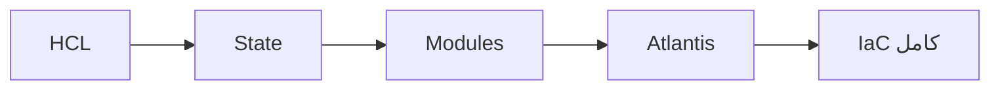

# 🚀 Terraform

> البنية التحتية ككود — Terraform، State، Modules، CI/CD مع Atlantis.

## 🎯 أهداف التعلم

بعد إكمال هذه الوحدة، ستكون قادراً على:

- [**أساسيات Terraform**](01-terraform-fundamentals) — HCL و Providers
- [**Terraform Modules**](02-terraform-modules) — إعادة استخدام الكود
- [**إدارة State**](03-terraform-state-management-deep) — تخزين آمن ومشاركة
- [**Atlantis و CI/CD**](04-terraform-cicd-atlantis) — أتمتة Terraform
- [**Azure Provider**](05-terraform-azure-provider-deep) — Terraform على Azure

## 💡 المهارات التي ستكتسبها

Terraform • HCL • State Management • Modules • Atlantis • Azure Provider

## 📊 معلومات الوحدة

| العنصر           | القيمة                      |
| ---------------- | --------------------------- |
| **المستوى**      | متوسط إلى متقدم             |
| **الوقت المقدر** | 8 ساعات                     |
| **المتطلبات**    | Azure Core                  |
| **الشهادات**     | AZ-104, HashiCorp Certified |

## 🏛️ مهمة CloudNova

> أتمتة نشر بيئة CloudNova كاملة بـ Terraform. لا مزيد من النشر اليدوي.

## 🗺️ خريطة الوحدة

## 📖 الدروس

- [**أساسيات Terraform**](01-terraform-fundamentals) — HCL و Providers
- [**Terraform Modules**](02-terraform-modules) — إعادة استخدام الكود
- [**إدارة State**](03-terraform-state-management-deep) — تخزين آمن ومشاركة
- [**Atlantis و CI/CD**](04-terraform-cicd-atlantis) — أتمتة Terraform
- [**Azure Provider**](05-terraform-azure-provider-deep) — Terraform على Azure

## 🚀 ابدأ التعلم

[▶️ ابدأ الدرس الأول](01-terraform-fundamentals)
