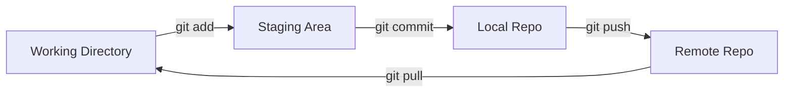

# Git من الصفر إلى الإتقان

> **"Git ليس مجرد `commit` و `push`. إنه آلة زمن لمشروعك. تعلم كيف تسافر عبر تاريخ الكود."**

## مفاهيم Git الأساسية



| المفهوم | المعنى | تشبيه |
|---|---|---|
| **Working Directory** | ملفاتك الحالية | مكتبك |
| **Staging Area** | ما جهّزته للـ commit | صندوق التجهيز |
| **Commit** | لقطة محفوظة | صورة فوتوغرافية |
| **Branch** | خط تطوير منفصل | غرفة جانبية |
| **Remote** | نسخة على الخادم | نسخة احتياطية سحابية |

## دورة العمل اليومية

```bash
# ١. ابدأ يومك
git pull origin main              # خذ آخر التحديثات

# ٢. اعمل على مهمة
git checkout -b feature/add-monitoring

# ٣. عدّل الملفات...
# ٤. شوف ماذا تغير
git status
git diff                          # الفروقات بالتفصيل

# ٥. جهّز وcommit
git add monitoring.tf             # ملف محدد
git add .                         # أو كل الملفات
git commit -m "Add Prometheus alert for API latency > 500ms"

# ٦. ارفع
git push origin feature/add-monitoring

# ٧. افتح Pull Request على GitHub
```

## استراتيجية التفرع — Git Flow للفرق

```
main ─────●─────────●─────────●─────── (إنتاج — نظيف دائماً)
           \       /         /
staging ────●─────●─────────●───────── (اختبار ما قبل الإنتاج)
             \   /
feature/xxx ──●────────────────────── (مكان العمل الآمن)
```

**القواعد الذهبية:**

1. **main مقدس.** لا تدفع إليه مباشرة أبداً
2. **فرع لكل مهمة.** `feature/add-alerts`، `fix/login-bug`، `docs/api-guide`
3. **PR إجباري.** حتى لو كنت الوحيد في الفريق — للمراجعة الذاتية
4. **Commit صغير ومركز.** "Add monitoring" سيء. "Add Prometheus alert for API p99 latency" جيد
5. **Commit متكرر.** ١٠ commits صغيرة > ١ commit ضخم

## التعامل مع الكوارث

```bash
# "أضفت الملف الخطأ للـ commit!"
git reset HEAD unwanted-file.txt     # أخرجه من staging

# "commit للفرع الخطأ!"
git log --oneline                     # ابحث عن commit
git reset HEAD~1                      # تراجع (الملفات تبقى)

# "أريد العودة لنسخة قديمة"
git log --oneline                     # ابحث عن الـ hash
git revert abc1234                    # أنشئ commit جديد يعكس التغييرات

# "تعارض رهيب أثناء merge"
git merge --abort                     # تراجع عن الـ merge
# حل التعارضات يدوياً، ثم:
git add .
git merge --continue

# "أين اختفى commitي؟"
git reflog                            # سجل كل شيء — حتى المحذوف
git cherry-pick abc1234               # استرجعه
```

## Git + Infrastructure as Code

### .gitignore لمشاريع Terraform

```bash
# .gitignore
**/.terraform/*           # الـ providers — كبير ولا يُرفع
*.tfstate                 # ⚠️ لا ترفع state أبداً!
*.tfstate.*
*.tfvars                  # قد تحتوي أسراراً
!example.tfvars           # إلا القالب
.terraformrc              # بيانات اعتماد
override.tf               # تجاوزات محلية
```

### رسائل Commit احترافية

```bash
# ❌ سيء
git commit -m "fix"
git commit -m "updated stuff"
git commit -m "changes"

# ✅ جيد — يخبر ماذا ولماذا
git commit -m "Add lifecycle.prevent_destroy to PostgreSQL database"
git commit -m "Fix: increase API timeout from 30s to 60s for large reports"
git commit -m "Refactor: extract networking module for reuse across environments"
```

### قالب PR لـ IaC

```markdown
## 📋 ماذا يتغير؟
- إضافة Auto Scaling لخوادم الويب
- تغيير VM size من B2s إلى B2ms

## ❓ لماذا؟
- حمل الذروة (٩-١١ صباحاً) يستهلك ٩٠٪ CPU
- B2ms يوفر ٢x الذاكرة بنفس السعر التقريبي

## 📊 خطة Terraform
```
Plan: 3 to add, 1 to change, 0 to destroy.
```

## ✅ الاختبار
- [x] الخطة لا تحذف أي موارد
- [x] طبقت في staging — الخوادم الجديدة تستجيب
- [x] Auto scaling اختبر: زدت الحمل → ٣ خوادم جديدة
```

## سيناريو CloudNova: كارثة الدمج

> **الموقف:** زميلك دمج PR يحذف `prevent_destroy` من قاعدة البيانات. `terraform apply` القادم سيحذف بيانات العملاء!

```bash
# ١. من ومتى؟
git log --oneline -- terraform/database.tf
# abc1234 Remove lifecycle block (محمد — أمس ٤:٣٠ م)

# ٢. ماذا تغير بالضبط؟
git show abc1234

# ٣. اعكس التغيير
git revert abc1234
# Commit جديد يعيد prevent_destroy

# ٤. ادفع فوراً وبلّغ الفريق
git push origin main
```

**الدرس:** كل تغيير على `prevent_destroy` يجب أن يمر بمراجعة إضافية. أضف CODEOWNERS:

```bash
# .github/CODEOWNERS
terraform/database.tf @cloudnova/senior-engineers
```

---

[← العودة للوحدة](index.md) | [🏠 الرئيسية](/)
