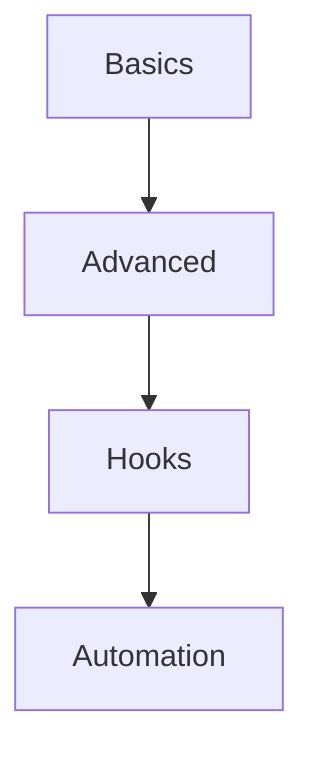

# 🚀 Git

> من الأساسيات إلى Git internals — hooks، rebase، cherry-pick، bisect.

## 🎯 أهداف التعلم

بعد إكمال هذه الوحدة، ستكون قادراً على:

- [**أساسيات Git**](01-git-fundamentals) — commit، branch، merge
- [**Git متقدم**](02-git-advanced) — rebase، cherry-pick، bisect
- [**Git Hooks**](03-git-hooks-automation) — أتمتة ما قبل commit

## 💡 المهارات التي ستكتسبها

Git • Rebase • Bisect • Hooks • Workflows

## 📊 معلومات الوحدة

| العنصر | القيمة |
| ------ | ------ |
| **المستوى** | مبتدئ إلى متوسط |
| **الوقت المقدر** | 4 ساعات |
| **المتطلبات** | Linux |
| **الشهادات** | — |

## 🏛️ مهمة CloudNova

> تعقب bug في تاريخ Git لـ 5000 commit. استخدم git bisect لتجده في دقائق.

## 🗺️ خريطة الوحدة

## 📖 الدروس

- [**أساسيات Git**](01-git-fundamentals) — commit، branch، merge
- [**Git متقدم**](02-git-advanced) — rebase، cherry-pick، bisect
- [**Git Hooks**](03-git-hooks-automation) — أتمتة ما قبل commit

## 🚀 ابدأ التعلم

[▶️ ابدأ الدرس الأول](01-git-fundamentals)
