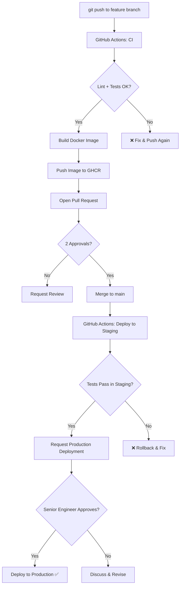

# سير عمل GitHub الاحترافي

> "GitHub ليس مجرد Git عن بعد. إنه منصة التعاون الهندسي الكاملة."

## 🎯 أهداف التعلم

- إتقان GitHub Actions من الصفر للإنتاج
- حماية الفروع ومنع الدمج بدون مراجعة
- تأمين CI/CD مع OIDC (بدون secrets دائمة)
- إدارة Deployment Environments للموافقات
- أتمتة Releases و changelogs و Semantic Versioning

---

## 📖 الطبقة الأساسية: GitHub Actions

### تشريح Workflow

```yaml
name: CI Pipeline

on: # المحفّزات
  push:
    branches: [main]
  pull_request:
    branches: [main]
  schedule:
    - cron: "0 6 * * 1" # كل اثنين 6AM

env: # متغيرات بيئة
  REGISTRY: ghcr.io
  IMAGE_NAME: ${{ github.repository }}

jobs:
  build:
    runs-on: ubuntu-latest
    strategy:
      matrix:
        python-version: ["3.11", "3.12"]

    steps:
      - uses: actions/checkout@v4

      - name: Setup Python
        uses: actions/setup-python@v5
        with:
          python-version: ${{ matrix.python-version }}

      - name: Install dependencies
        run: pip install -r requirements.txt

      - name: Run tests
        run: pytest --junitxml=results.xml

      - name: Upload results
        if: always()
        uses: actions/upload-artifact@v4
        with:
          name: test-results-${{ matrix.python-version }}
          path: results.xml
```

---

## 🧱 الطبقة المهنية: Reusable Workflows + OIDC

```yaml
# .github/workflows/_deploy.yml — Reusable Workflow
name: Reusable Deploy

on:
  workflow_call:
    inputs:
      environment:
        required: true
        type: string

jobs:
  deploy:
    runs-on: ubuntu-latest
    environment: ${{ inputs.environment }}

    # OIDC — مصادقة بدون secrets دائمة!
    permissions:
      id-token: write
      contents: read

    steps:
      - uses: actions/checkout@v4

      - name: Azure Login via OIDC
        uses: azure/login@v2
        with:
          client-id: ${{ secrets.AZURE_CLIENT_ID }}
          tenant-id: ${{ secrets.AZURE_TENANT_ID }}
          subscription-id: ${{ secrets.AZURE_SUBSCRIPTION_ID }}

      - name: Terraform Apply
        run: |
          terraform init
          terraform apply -auto-approve \
            -var="environment=${{ inputs.environment }}"

# استخدام reusable workflow:
# .github/workflows/deploy-prod.yml
jobs:
  deploy:
    uses: ./.github/workflows/_deploy.yml
    with:
      environment: production
    secrets: inherit
```

---

## 🏗️ الطبقة الإنتاجية: حماية الفروع + Deployment Environments

### Branch Protection Rules

```yaml
# إعدادات الحماية: Settings > Branches > Add Rule

Branch: main

□ Require a pull request before merging
  □ Require approvals: 2
  □ Dismiss stale reviews when new commits are pushed

□ Require status checks to pass before merging
  □ build (3.11)
  □ build (3.12)
  □ lint
  □ security-sast
  □ security-sca

□ Require conversation resolution before merging

□ Require branches to be up to date before merging

□ Require signed commits

□ Do not allow bypassing the above settings
```

### Deployment Environments — الموافقات قبل النشر

```yaml
# إعداد Environment: Settings > Environments > production

Production:
  □ Required reviewers: @cloudnova/senior-engineers (at least 1)
  □ Wait timer: 0 minutes
  □ Deployment branches: main
  □ Secrets: AZURE_CLIENT_ID, AZURE_TENANT_ID, AZURE_SUBSCRIPTION_ID
```

> **فائدة Deployment Environment:** لا أحد يستطيع النشر للإنتاج بدون موافقة Senior Engineer.

### CODEOWNERS

```
# CODEOWNERS — من يجب أن يراجع ماذا

# الإعدادات العامة (الفريق الأساسي)
* @cloudnova/core-team

# Terraform (فريق البنية التحتية)
/terraform/ @cloudnova/platform-team
*.tf @cloudnova/platform-team

# Kubernetes
/kubernetes/ @cloudnova/platform-team

# Security (فريق الأمان + مراجعة إلزامية)
/.github/workflows/security* @cloudnova/security-team

# Documentation
/docs/ @cloudnova/tech-writers

# Database migrations
**/migrations/ @cloudnova/dba-team
```

---

## 🎨 الطبقة المعمارية: GitHub Container Registry + Semantic Versioning

```yaml
name: Build and Publish Container

on:
  push:
    tags:
      - "v*.*.*"

jobs:
  publish:
    runs-on: ubuntu-latest
    permissions:
      contents: read
      packages: write

    steps:
      - uses: actions/checkout@v4

      - name: Login to GHCR
        uses: docker/login-action@v3
        with:
          registry: ghcr.io
          username: ${{ github.actor }}
          password: ${{ secrets.GITHUB_TOKEN }}

      - name: Extract metadata
        id: meta
        uses: docker/metadata-action@v5
        with:
          images: ghcr.io/${{ github.repository }}
          tags: |
            type=semver,pattern={{version}}
            type=semver,pattern={{major}}.{{minor}}
            type=sha,prefix=,format=short
            type=raw,value=latest,enable=${{ github.ref == 'refs/tags/v*' }}

      - name: Build and push
        uses: docker/build-push-action@v6
        with:
          context: .
          push: true
          tags: ${{ steps.meta.outputs.tags }}
          labels: ${{ steps.meta.outputs.labels }}
          cache-from: type=gha
          cache-to: type=gha,mode=max
```

---

## 📊 رسم بياني: تدفق CI/CD كامل



---

## ⚡ الإنتاج وما بعده: Release Please (أتمتة كاملة)

```yaml
# .github/workflows/release.yml
name: Release

on:
  push:
    branches:
      - main

permissions:
  contents: write
  pull-requests: write

jobs:
  release-please:
    runs-on: ubuntu-latest
    steps:
      - uses: googleapis/release-please-action@v4
        with:
          release-type: simple
          token: ${{ secrets.GITHUB_TOKEN }}
```

ماذا يفعل؟ عند كل push لـ main:

- يحلل commit messages (يحتاج Conventional Commits)
- يفتح Release PR مع changelog تلقائي
- عند دمج Release PR: يصدر tag + GitHub Release

### Conventional Commits

```
feat: add auto-scaling to API deployment
^──^  ^────────────────────────────────
│     └── وصف التغيير
└── النوع: feat, fix, docs, chore, refactor, test, ci

feat → MINOR version bump (1.0.0 → 1.1.0)
fix  → PATCH version bump (1.0.0 → 1.0.1)
feat! → MAJOR version bump (1.0.0 → 2.0.0)
```

---

## 🚨 سيناريو CloudNova ١: إدارة حادثة في GitHub

```
📋 الحادثة: Memory leak in API v2.1.0

1. إنشاء Issue:
   ├── العنوان: "Memory leak in API connection pool"
   ├── Labels: bug, P1, production
   ├── Assignee: @ahmed (on-call)
   └── Project: CloudNova Sprint 26

2. إنشاء Branch:
   git checkout -b fix/memory-leak-api

3. إصلاح + Commit (Conventional):
   git commit -m "fix: resolve memory leak in connection pool

   - Close idle connections after 300s timeout
   - Add connection pool metrics to Prometheus
   - Add connection age alert at > 250s

   Fixes #456"

4. فتح PR:
   ├── وصف مفصل مع screenshots
   ├── Linked Issue: #456
   ├── Reviewers: @platform-team
   └── Checks: ✅ CI ✅ security

5. مراجعة:
   ├── @sarah: code review
   ├── @omar: approves (CODEOWNERS)
   └── ✅ 2 approvals

6. دمج: Squash & Merge → Auto-delete branch

7. ✅ Issue #456 closes automatically
8. 🏷️ Release Please يفتح Release PR تلقائياً
9. 📦 صورة Docker جديدة تنشر لـ GHCR
```

---

## 🚨 سيناريو CloudNova ٢: إعداد Branch Protection

```
📋 المشكلة: Junior engineer دمج كوداً مباشرة لـ main بدون مراجعة.
النتيجة: Production outage لمدة 30 دقيقة.

الحل: Branch Protection Rules

الإعدادات الجديدة:
1. Require PR before merging to main ✅
2. Require 2 approvals from CODEOWNERS ✅
3. Require all status checks to pass ✅
4. Require branches to be up to date ✅
5. Do not allow bypassing ✅

النتيجة: لا أحد يستطيع الدمج المباشر لـ main — حتى الـ admin.
كل تغيير للإنتاج = PR + 2 reviews + CI passing.

الدرس: لا تنتظر الحادثة لتحمي الفروع. احمِها من اليوم الأول.
```

---

## 🛡️ Dependabot + Secret Scanning

```yaml
# .github/dependabot.yml
version: 2
updates:
  # Python
  - package-ecosystem: pip
    directory: /
    schedule:
      interval: weekly
      day: monday
    open-pull-requests-limit: 10
    reviewers:
      - "cloudnova/platform-team"
    labels:
      - dependencies
      - python

  # Docker
  - package-ecosystem: docker
    directory: /
    schedule:
      interval: daily
    labels:
      - dependencies
      - docker

  # GitHub Actions
  - package-ecosystem: github-actions
    directory: /
    schedule:
      interval: weekly
    labels:
      - dependencies
      - ci
```

```yaml
# تفعيل Secret Scanning + Push Protection
# Settings > Code security > Secret scanning
□ Push protection — امنع push إذا فيه secret
□ Alert when secrets detected
```

---

## 📋 أفضل ممارسات GitHub

| الممارسة                    | التنفيذ                                 |
| --------------------------- | --------------------------------------- |
| **Conventional Commits**    | `feat:`, `fix:`, `docs:`, `chore:`      |
| **PR Templates**            | `.github/PULL_REQUEST_TEMPLATE.md`      |
| **Issue Templates**         | `.github/ISSUE_TEMPLATE/bug_report.yml` |
| **Protected Branches**      | main + release branches                 |
| **CODEOWNERS**              | مراجعة إلزامية من الفريق المناسب        |
| **Deployment Environments** | موافقة إلزامية قبل نشر الإنتاج          |
| **OIDC**                    | مصادقة Azure/AWS بدون secrets دائمة     |
| **Release Please**          | Changelog + Releases تلقائية            |
| **Secret Scanning**         | امنع push إذا فيه secret                |
| **Actions Permissions**     | قيد الأذونات (ليس `write-all`)          |

---

## 🧠 التذكّر النشط

1. ما الفرق بين `GITHUB_TOKEN` و Personal Access Token؟
2. كيف تحمي فرع main من الدمج المباشر؟ (5 إعدادات على الأقل)
3. متى تستخدم reusable workflows بدلاً من نسخ الشفرة؟
4. لماذا OIDC أفضل من secrets الدائمة للتواصل مع Azure؟
5. كيف يحدد Release Please رقم الإصدار الجديد من commit messages؟

## ✍️ تمرين Feynman

اشرح لمدير غير تقني: "كيف يضمن GitHub Actions أن الكود الجديد لا يكسر الإنتاج؟"

## 📝 بطاقات تعليمية

- **OIDC**: مصادقة بدون secrets. GitHub يطلب token مؤقت من Azure لكل workflow
- **Deployment Environment**: بيئة نشر محمية بموافقات وأسرار خاصة
- **Conventional Commits**: صيغة موحدة لرسائل commit. تفعّل semantic versioning تلقائياً
- **Release Please**: أتمتة releases و changelogs من commit history
- **Runner**: الخادم الذي ينفذ الـ workflow. hosted أو self-hosted

## 🎤 أسئلة المقابلة

1. **"كيف تفرض مراجعة الكود قبل الدمج في GitHub؟"**
   - Branch protection: Require PR + 2 approvals
   - CODEOWNERS: مراجعة إلزامية من الفريق الصحيح
   - Status checks: CI يجب أن ينجح
   - لا استثناءات لأحد

2. **"كيف تؤمّن CI/CD pipeline؟"**
   - OIDC للمصادقة (بدون secrets دائمة)
   - Deployment environments مع reviewers إلزاميين
   - Secret scanning + push protection
   - Actions permissions محدودة (ليس write-all)
   - Dependabot لتحديث dependencies

3. **"كيف تصمم CI/CD لفريق من 20 مهندساً؟"**
   - Reusable workflows (لا تكرر الكود)
   - Matrix builds للـ cross-platform testing
   - Deployment environments متعددة (dev → staging → prod)
   - Branch protection لمنع الدمج المباشر
   - Release Please للأتمتة الكاملة

---

---

## 🏛️ طبقة الإنتاج: GitHub في المؤسسة

### GitHub Packages — Container Registry خاص

```bash
# دفع صورة Docker لـ GHCR
 echo ${{ secrets.GITHUB_TOKEN }} | docker login ghcr.io -u ${{ github.actor }} --password-stdin
docker build -t ghcr.io/cloudnova/api:v1.0.0 .
docker push ghcr.io/cloudnova/api:v1.0.0

# صور خاصة (داخل المؤسسة فقط)
# Settings → Packages → Package visibility → Private
```

### Actions Permissions — الأمان أولاً

```yaml
# Settings → Actions → General
# ❌ Allow all actions and reusable workflows
# ✅ Allow CloudNova, and GitHub-created actions

# Fork PRs:
# ❌ Run workflows from fork PRs immediately
# ✅ Require approval for fork PR workflows
```

---

## 🎨 طبقة المعماري: من CI البسيط لـ DevOps الكامل

### GitHub Actions vs Azure DevOps vs Jenkins

| المعيار       | GitHub Actions      | Azure DevOps   | Jenkins             |
| ------------- | ------------------- | -------------- | ------------------- |
| **التكلفة**   | 2000 min/month free | 1800 min/month | مجاني (self-hosted) |
| **التعقيد**   | بسيط                | متوسط          | عالي                |
| **Ecosystem** | 20,000+ actions     | محدود          | 2,000+ plugins      |
| **OIDC**      | ✅ مدمج             | ✅             | ❌                  |
| **YAML**      | ✅                  | ✅             | ❌ (Groovy)         |

### متى تختار ماذا؟

- **GitHub Actions**: الكود على GitHub = الخيار الطبيعي
- **Azure DevOps**: Microsoft ecosystem، boards + repos + pipelines متكاملة
- **Jenkins**: تحتاج تحكماً كاملاً + self-hosted

---

## 🛠️ تدريبات عملية

### تمرين ١: CI Pipeline (سهل)

> ابنِ workflow: lint + test + build. علّق النتائج على PR.

### تمرين ٢: Deployment Environment (متوسط)

> أنشئ `staging` و `production` environments. production يتطلب موافقة senior engineer.

### تحدي: Release Please (متقدم)

> فعّل Release Please مع semantic versioning و changelog تلقائي.

### 📝 تقييم

**س١:** لماذا OIDC أفضل من secrets الدائمة؟

<details><summary>الإجابة</summary>OIDC يطلب token مؤقت من Azure/AWS لكل workflow run. لا secrets دائمة يمكن أن تتسرب. الـ token ينتهي بعد minutes.</details>

**س٢:** كيف تمنع نشر كود بدون مراجعة؟

<details><summary>الإجابة</summary>Branch protection: require PR + 2 approvals + CI checks passing. Deployment environments: required reviewers قبل النشر.</details>

**س٣:** ما فائدة CODEOWNERS؟

<details><summary>الإجابة</summary>يحدد من يجب أن يراجع ملفات معينة. مثال: `*.tf @platform-team` = أي تغيير في Terraform يحتاج مراجعة فريق المنصة.</details>

### 🧠 استدعاء نشط

1. ارسم CI/CD pipeline: push → build → test → deploy → monitor.
2. كيف تؤمّن workflow من fork PRs الخبيثة؟
3. اذكر 5 أفضل ممارسات لـ GitHub Actions.

### 🎤 مقابلة

**"صمم CI/CD لـ 20 microservice."**
→ Reusable workflows. Matrix builds. Path filtering (شغّل CI للخدمة المتغيرة فقط). Deployment environments (dev→staging→prod). OIDC للمصادقة. Release Please للـ semantic versioning.

**"كيف تتعامل مع workflow فشل في الإنتاج؟"**
→ `gh run watch` لمراقبة. `gh run view --log-failed` للتشخيص. أعد تشغيل `gh run rerun`. إذا متكرر: افتح issue وأوقف automated deploy مؤقتاً.

---

## 📚 مراجع

- [CI/CD Pipelines](../15-cicd/01-cicd-pipelines) — تدفق CI/CD المتقدم
- [Git Fundamentals](../13-git/01-git-fundamentals) — أساس Git
- 📖 [GitHub Actions Documentation](https://docs.github.com/en/actions)
- 📖 [GitHub Security Best Practices](https://docs.github.com/en/actions/security-guides)

---

[← العودة للموديول](./01-github-workflows) | [→ CI/CD Pipelines](../15-cicd/01-cicd-pipelines) | [🏠 الرئيسية](/)
