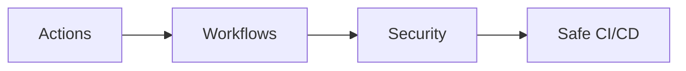

# 🚀 GitHub

> GitHub Actions، CodeQL، Dependabot — أتمتة وأمان منصة GitHub.

## 🎯 أهداف التعلم

بعد إكمال هذه الوحدة، ستكون قادراً على:

- [**GitHub Workflows**](01-github-workflows) — أساسيات CI/CD
- [**Actions متقدمة**](02-github-actions-advanced) — Reusable Workflows
- [**أمن GitHub**](03-github-security-codeql-dependabot) — CodeQL و Dependabot

## 💡 المهارات التي ستكتسبها

GitHub Actions • CodeQL • Dependabot • Security • Workflows

## 📊 معلومات الوحدة

| العنصر           | القيمة                   |
| ---------------- | ------------------------ |
| **المستوى**      | متوسط                    |
| **الوقت المقدر** | 5 ساعات                  |
| **المتطلبات**    | Git                      |
| **الشهادات**     | GitHub Actions Certified |

## 🏛️ مهمة CloudNova

> ابنِ CI/CD pipeline يحمي CloudNova من الثغرات قبل أن تصل للإنتاج.

## 🗺️ خريطة الوحدة

## 📖 الدروس

- [**GitHub Workflows**](01-github-workflows) — أساسيات CI/CD
- [**Actions متقدمة**](02-github-actions-advanced) — Reusable Workflows
- [**أمن GitHub**](03-github-security-codeql-dependabot) — CodeQL و Dependabot

## 🚀 ابدأ التعلم

[▶️ ابدأ الدرس الأول](01-github-workflows)
