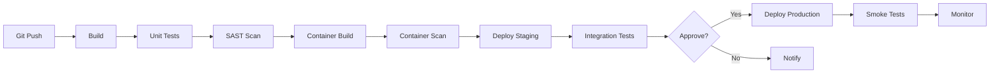

# CI/CD — من الكود إلى الإنتاج

> **"كل دقيقة تقضيها في النشر اليدوي هي دقيقة لا تُصلح فيها مشاكل حقيقية. أتمتة كل شيء."**

## ما هو CI/CD؟

| الحرف | المعنى | السؤال | المثال |
|---|---|---|---|
| **CI** | Continuous Integration | "هل الكود يشتغل؟" | Build + Test تلقائي عند كل PR |
| **CD** | Continuous Delivery | "هل هو جاهز للنشر؟" | نشر تلقائي لـ staging |
| **CD** | Continuous Deployment | "هل نُشر للمستخدمين؟" | نشر تلقائي للإنتاج |

## مراحل الـ Pipeline



## GitHub Actions — Pipeline كامل

```yaml
# .github/workflows/ci-cd.yml
name: CI/CD Pipeline

on:
  pull_request:
    branches: [main]
  push:
    branches: [main]

env:
  REGISTRY: ghcr.io
  IMAGE_NAME: ${{ github.repository }}

jobs:
  # ========== المرحلة ١: الاختبار ==========
  test:
    runs-on: ubuntu-latest
    steps:
      - uses: actions/checkout@v4

      - name: Setup Python
        uses: actions/setup-python@v5
        with:
          python-version: "3.12"

      - name: Install
        run: pip install -r requirements.txt

      - name: Lint
        run: ruff check .

      - name: Unit Tests
        run: pytest --cov=. --cov-report=xml

      - name: Upload Coverage
        uses: codecov/codecov-action@v4

  # ========== المرحلة ٢: الأمان ==========
  security:
    runs-on: ubuntu-latest
    steps:
      - uses: actions/checkout@v4

      - name: SAST Scan
        uses: github/codeql-action/analyze@v3

      - name: Secret Scan
        run: |
          pip install detect-secrets
          detect-secrets scan --all-files

      - name: IaC Scan
        uses: bridgecrewio/checkov-action@master
        with:
          directory: terraform/
          framework: terraform

  # ========== المرحلة ٣: البناء ==========
  build:
    needs: [test, security]
    if: github.event_name == 'push' && github.ref == 'refs/heads/main'
    runs-on: ubuntu-latest
    steps:
      - uses: actions/checkout@v4

      - name: Build Container
        run: |
          docker build -t ${{ env.REGISTRY }}/${{ env.IMAGE_NAME }}:${{ github.sha }} .
          docker tag ${{ env.REGISTRY }}/${{ env.IMAGE_NAME }}:${{ github.sha }} \
                     ${{ env.REGISTRY }}/${{ env.IMAGE_NAME }}:latest

      - name: Scan Image
        uses: aquasecurity/trivy-action@master
        with:
          image-ref: ${{ env.REGISTRY }}/${{ env.IMAGE_NAME }}:${{ github.sha }}
          format: table
          severity: HIGH,CRITICAL

      - name: Push Image
        run: |
          echo ${{ secrets.GITHUB_TOKEN }} | docker login ${{ env.REGISTRY }} -u ${{ github.actor }} --password-stdin
          docker push ${{ env.REGISTRY }}/${{ env.IMAGE_NAME }}:${{ github.sha }}
          docker push ${{ env.REGISTRY }}/${{ env.IMAGE_NAME }}:latest

  # ========== المرحلة ٤: النشر ==========
  deploy:
    needs: build
    runs-on: ubuntu-latest
    environment: production
    steps:
      - name: Deploy to Kubernetes
        run: |
          kubectl set image deployment/api \
            api=${{ env.REGISTRY }}/${{ env.IMAGE_NAME }}:${{ github.sha }}
          kubectl rollout status deployment/api --timeout=5m

      - name: Smoke Test
        run: |
          curl -f https://api.cloudnova.com/health
          curl -f https://api.cloudnova.com/api/v1/status
```

## استراتيجيات النشر

| الاستراتيجية | الوصف | متى تستخدم |
|---|---|---|
| **Rolling** | استبدل Pods واحدة تلو الأخرى | أغلب النشرات اليومية |
| **Blue-Green** | بيئتان — بدّل الحركة فوراً | تراجع فوري مضمون |
| **Canary** | ١٠٪ للمستخدمين للجديد أولاً | اختبار في الإنتاج الحقيقي |

## مبادئ الـ Pipeline الجيد

1. **سرعة.** الاختبارات تستغرق دقائق لا ساعات
2. **أمان.** فحص أمني مدمج — ليس مرحلة منفصلة
3. **قابلية التكرار.** نفس الـ Pipeline لكل البيئات
4. **قابلية التراجع.** أي نشر يمكن عكسه بنقرة واحدة
5. **تغذية راجعة.** المهندس يعرف نتيجة Pipeline خلال ١٠ دقائق

## سيناريو CloudNova: Pipeline فشل في الإنتاج

> **الموقف:** كل شيء يمر في staging. أول نشر إنتاجي — انهيار كامل.

**التحقيق:**

1. الـ staging يستخدم ١٠ سجلات في قاعدة البيانات. الإنتاج ١٠ ملايين.
2. Migration يستغرق ٤٥ دقيقة. الـ healthcheck يفشل بعد ٣٠ ثانية.
3. Pipeline يتراجع تلقائياً — لكن migration لم يتراجع. البيانات في حالة غير متناسقة.

**الدروس المستفادة:**

```yaml
# ١. healthcheck واقعي
readinessProbe:
  httpGet:
    path: /health?deep=true    # فحص عميق
  initialDelaySeconds: 60      # انتظر migration
  failureThreshold: 10         # اسمح بمحاولات أكثر

# ٢. timeout مناسب
- name: Run Migrations
  run: python manage.py migrate
  timeout-minutes: 60          # كان ٥ فقط!

# ٣. اختبار staging بحجم بيانات حقيقي
# استخدم نسخة من بيانات الإنتاج (منظفة من البيانات الحساسة)
```

---

[← العودة للوحدة](index.md) | [🏠 الرئيسية](/)
