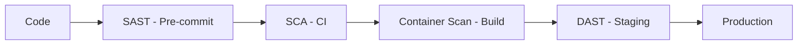

# فحص الأمان في CI/CD

> "لا تنتظر penetration test سنوياً. افحص الأمان مع كل commit."

## 🎯 أهداف التعلم

- دمج SAST, DAST, SCA في CI/CD
- فشل البناء عند اكتشاف ثغرات عالية
- Shift-Left Security

## ⏱️ الوقت المقدر: 35 دقيقة | المستوى: Intermediate

---

## 🏗️ أدوات الفحص

| النوع         | الأداة                     | ماذا تفحص          |
| ------------- | -------------------------- | ------------------ |
| **SAST**      | SonarQube, Semgrep, CodeQL | كود المصدر         |
| **SCA**       | Snyk, Dependabot, Trivy    | المكتبات والتبعيات |
| **DAST**      | OWASP ZAP, Burp Suite      | التطبيق الحي       |
| **Container** | Trivy, Aqua, Snyk          | صور الحاويات       |

### SAST مع Semgrep

```yaml
- name: Semgrep SAST
  uses: semgrep/semgrep-action@v1
  with:
    config: p/owasp-top-ten
    fail-on: error
```

### OWASP ZAP DAST

```yaml
- name: DAST Scan
  run: |
    docker run owasp/zap2docker-stable zap-baseline.py \
      -t https://staging.cloudnova.com \
      -r zap-report.html
```

---

## 🏛️ طبقة الإنتاج: سيناريو CloudNova

Semgrep اكتشف hardcoded API key في الكود قبل merge. CI/CD فشل البناء. تم الإصلاح قبل الإنتاج.

### Shift-Left Security



كلما اكتشفت الثغرة أبكر، كلما كان إصلاحها أرخص (10x أرخص في code vs production!).

---

## 🛠️ تدريبات

### تمرين: أضف Semgrep إلى CI/CD pipeline

### تحدي: ابنِ pipeline مع SAST + SCA + DAST

---

## 📝 تقييم

### ✅ فحص المعرفة

1. ما الفرق بين SAST و DAST؟
2. لماذا Shift-Left مهم؟
3. كيف تفشل البناء عند ثغرات عالية؟

### 🃏 بطاقات

| السؤال     | الإجابة                                 |
| ---------- | --------------------------------------- |
| SAST       | Static Analysis — فحص الكود بدون تشغيله |
| DAST       | Dynamic Analysis — فحص التطبيق الحي     |
| Shift-Left | اختبار الأمان مبكراً في الـ pipeline    |

---

## 🎤 مقابلة

1. **"كيف تدمج الأمان في CI/CD؟"** → SAST + SCA + Container scanning + DAST
2. **"ماذا تفعل عند اكتشاف CVE في إحدى التبعيات؟"** → تحديث المكتبة + SCA إجباري

---

## 🏛️ سيناريو CloudNova الموسع: يوم اكتشفنا CVE-2026-XYZ

**لمى** DevSecOps Engineer في CloudNova. الساعة 9 صباحاً، البريد: "Critical CVE-2026-XYZ في Log4j البديل — CVSS 9.8"

**التسلسل الزمني:**

```mermaid
gantt
    title استجابة CVE-2026-XYZ
    dateFormat HH:mm
    section Detection
        CVE published            :09:00, 1m
        Snyk alert in Slack      :09:02, 1m

    section Triage
        Scan all repos (Snyk CLI) :09:05, 10m
        Identify 8 affected repos :09:15, 5m

    section Remediation
        Auto-fix PRs (Dependabot+Snyk) :09:20, 15m
        CI/CD rebuild all repos   :09:35, 20m

    section Verification
        DAST scan (OWASP ZAP)     :09:55, 15m
        Deploy to staging         :10:10, 10m
        All clear ✅              :10:20, 1m
```



**MTTR: 1 ساعة و 20 دقيقة** من CVE إلى fix.

**كيف استطعنا الاستجابة بهذه السرعة؟**

```bash
# 1. Snyk CLI يمسح كل الـ repos في دقيقة واحدة
for repo in $(gh repo list cloudnova --json name -q '.[].name'); do
  echo "Scanning cloudnova/$repo..."
  snyk test --json --severity-threshold=critical > reports/$repo-snyk.json
done

# 2. اكتشاف المكتبة المصابة
jq '.vulnerabilities[] | select(.id=="SNYK-JAVA-ORG.CLOUDNOVA-1234567")' reports/*.json
# وجدناها في 8 repos!

# 3. Auto-fix مع Dependabot
# .github/dependabot.yml
version: 2
updates:
  - package-ecosystem: "maven"
    directory: "/"
    schedule:
      interval: "daily"
    open-pull-requests-limit: 10
    # Security updates only (not version bumps)
    allow:
      - dependency-type: "direct"
```

---

## 🎨 طبقة المعماري: Security Pipeline Design

### مراحل الفحص الأمني — المهلة الزمنية المثالية

```yaml
# Azure Pipeline: Security Gates
stages:
  # ⏱️ Pre-commit (ثوانٍ) — local dev
  - stage: PreCommit
    jobs:
      - job: PreCommitHooks
        steps:
          - script: |
              # pre-commit hooks
              git-secrets --scan
              detect-secrets-hook --baseline .secrets.baseline

  # ⏱️ CI (دقائق) — after push
  - stage: CI_Security
    jobs:
      - job: SAST
        steps:
          - task: Semgrep@1
            inputs:
              config: "p/owasp-top-ten,p/secrets,p/supply-chain"
              failOn: "error"

      - job: SCA
        steps:
          - task: SnykSecurityScan@1
            inputs:
              testType: "app"
              severityThreshold: "high"
              failOnIssues: true

  # ⏱️ Build (دقائق) — image build
  - stage: Container_Scan
    jobs:
      - job: Trivy
        steps:
          - script: |
              trivy image --severity HIGH,CRITICAL \
                --exit-code 1 \
                cloudnova.azurecr.io/api:$BUILD_ID

  # ⏱️ Staging (ساعات) — deployed env
  - stage: DAST
    jobs:
      - job: ZAP_Scan
        steps:
          - script: |
              docker run owasp/zap2docker-stable zap-full-scan.py \
                -t https://staging.cloudnova.com \
                -r zap-report.html
```

### مصفوفة القرار: أي أداة فحص متى؟

| المرحلة     | الأداة         | الوقت  | التكلفة (لكل فحص) | ماذا يكتشف                         |
| ----------- | -------------- | ------ | ----------------- | ---------------------------------- |
| IDE         | SonarLint      | 0.1s   | مجاني             | code smells, basic bugs            |
| Pre-commit  | git-secrets    | 1s     | مجاني             | مفاتيح API, كلمات سر               |
| PR Review   | CodeQL         | 5-15m  | مجاني (OSS)       | SQL injection, XSS, path traversal |
| CI Build    | Semgrep        | 2-5m   | $0 (OSS rules)    | OWASP Top 10, custom rules         |
| CI Build    | Snyk SCA       | 3-7m   | $0 (limited)      | library CVEs                       |
| Image Build | Trivy          | 1-3m   | مجاني             | OS packages, app deps CVEs         |
| Staging     | OWASP ZAP      | 15-60m | مجاني             | runtime attacks (XSS, SQLi)        |
| Production  | Burp Suite Pro | ساعات  | $$$               | advanced runtime attacks           |

### Anti-Patterns في DevSecOps

| الخطأ                            | المشكلة                       | التصحيح                            |
| -------------------------------- | ----------------------------- | ---------------------------------- |
| DAST فقط (بدون SAST)             | ثغرات الـ code تُكتشف متأخراً | SAST في CI + DAST في staging       |
| إهمال false positives            | المطورون يتجاهلون التنبيهات   | Tuning القواعد + ignore list موثقة |
| عدم فشل البناء عند HIGH/CRITICAL | الثغرات تصل للإنتاج           | `fail-on: error` لكل scanner       |
| فحص أمني شهري                    | 30 يوماً من الثغرات المكشوفة  | فحص مع كل commit                   |

---

## 🛠️ تدريبات موسعة

### تمرين 1: ابنِ CI/CD pipeline مع 3 scanners

```yaml
# .github/workflows/security.yml
name: Security Pipeline
on: [push, pull_request]

jobs:
  sast:
    runs-on: ubuntu-latest
    steps:
      - uses: actions/checkout@v4
      - name: Semgrep SAST
        uses: semgrep/semgrep-action@v1
        with:
          config: |
            p/owasp-top-ten
            p/secrets
            r/python.lang.security.audit.dangerous-subprocess-use
          fail-on: error

  sca:
    runs-on: ubuntu-latest
    steps:
      - uses: actions/checkout@v4
      - name: Snyk SCA
        uses: snyk/actions/python@master
        env:
          SNYK_TOKEN: ${{ secrets.SNYK_TOKEN }}
        with:
          args: --severity-threshold=high --fail-on=all

  container:
    needs: [sast, sca]
    runs-on: ubuntu-latest
    steps:
      - name: Build & Scan
        run: |
          docker build -t app:$GITHUB_SHA .
          trivy image --severity HIGH,CRITICAL --exit-code 1 app:$GITHUB_SHA
```

### تمرين 2: سياسة فشل البناء الذكية

```python
# security_gate.py — يقرر متى يفشل البناء
def security_gate(scan_results):
    blockers = 0
    warnings = 0

    for finding in scan_results:
        if finding.severity == 'CRITICAL':
            blockers += 1
        elif finding.severity == 'HIGH' and finding.exploit_maturity == 'PROVEN':
            blockers += 1
        elif finding.severity == 'HIGH':
            warnings += 1
        elif finding.severity == 'MEDIUM' and finding.age_days > 90:
            warnings += 1  # escalation rule

    if blockers > 0:
        print(f'❌ BUILD FAILED: {blockers} blocker(s)')
        exit(1)
    elif warnings > 5:
        print(f'🟡 WARNING: {warnings} warning(s) — review required')
        exit(0)  # don't block, but alert
    else:
        print(f'✅ PASS: {warnings} warnings')
```

### تحدي: Custom Semgrep Rule

```yaml
# semgrep-rules/cloudnova/no-hardcoded-tokens.yaml
rules:
  - id: no-hardcoded-azure-tokens
    patterns:
      - pattern-either:
          - pattern: |
              $VAR = "DefaultEndpointsProtocol=..."
          - pattern: |
              $VAR = "AccountKey=..."
    message: "❌ Azure Storage connection string detected! Use Managed Identity instead."
    severity: ERROR
    languages: [python, javascript, typescript]
    metadata:
      cwe: "CWE-798: Use of Hard-coded Credentials"
      owasp: "A07:2021 - Identification and Authentication Failures"
```

---

## 📝 تقييم شامل

### ✅ فحص المعرفة (5)

1. ما الفرق بين SAST و DAST و SCA؟
2. لماذا يجب فشل CI/CD عند ثغرات CRITICAL؟
3. كيف تتعامل مع false positives في Semgrep؟
4. ما فائدة Trivy لفحص صور Docker؟
5. أين تضع DAST في pipeline ولماذا في النهاية؟

### 📝 اختبار (3)

1. **Semgrep يبلغ 200 warning. ماذا تفعل؟**

<details><summary>الإجابة</summary>1. تصنيف: blocker vs noise. 2. Tuning القواعد. 3. إضافة `.semgrepignore`. 4. معالجة الحقيقية أولاً.</details>

2. **SCA وجد CVE في مكتبة عميقة (dependency of dependency). كيف تصلح؟**

<details><summary>الإجابة</summary>1. تحقق من توفر fix. 2. override الـ transitive dependency في `package.json`/`pom.xml`. 3. إذا لم يتوفر fix، استخدم بديلاً.</details>

3. **كيف تقيس فعالية DevSecOps pipeline؟**

<details><summary>الإجابة</summary>Time-to-Fix (من CVE إلى fix)، Defect Escape Rate (ثغرات وصلت للإنتاج)، Mean Time to Detect، عدد الثغرات المفتوحة > 30 يوم.</details>

### 🧠 Active Recall (5)

- ارسم pipeline أمني كامل لكل مرحلة
- اشرح Shift-Left Security لمدير غير تقني
- قارن بين 3 أدوات SAST استخدمتها
- كيف تتعامل مع team resistance للـ security gates؟
- صف incident حقيقي منعته security scanning

### 🎓 Feynman: Shift-Left Security لغير التقني

"تخيل أنك تبني بيتاً. فحص الأمان في CI/CD مثل مهندس يفحص الأساسات قبل صب الخرسانة (وليس بعد بناء 10 طوابق). اكتشاف الخطأ مبكراً = تصحيحه بـ $10 بدلاً من $10,000."

### 🃏 بطاقات (8)

| السؤال     | الإجابة                                    |
| ---------- | ------------------------------------------ |
| SAST       | تحليل الكود المصدري دون تشغيله             |
| DAST       | فحص التطبيق الحي من الخارج                 |
| SCA        | فحص المكتبات والتبعيات (CVEs)              |
| Trivy      | فحص صور الحاويات وأنظمة التشغيل            |
| Semgrep    | SAST سريع مع قواعد قابلة للتخصيص           |
| OWASP ZAP  | DAST مجاني                                 |
| Shift-Left | اختبار الأمان أبكر في الـ pipeline         |
| CVSS       | Common Vulnerability Scoring System (0-10) |

---

## 🎤 أسئلة المقابلة الموسعة

### تقني

1. **"صمم DevSecOps pipeline لشركة خدمات مالية."**
   - SAST: Semgrep + CodeQL (OWASP + custom rules)
   - SCA: Snyk + Dependabot (auto-fix PRs)
   - Container: Trivy + Aqua (runtime protection)
   - DAST: OWASP ZAP (staging) + Burp Suite (quarterly production)
   - IaC: Checkov, tfsec (Terraform scanning)
   - Secrets: git-secrets pre-commit + Vault
   - Compliance: PCI-DSS reports من الـ scanners

2. **"False positive rate = 40% في Semgrep. كيف تخفضها؟"**
   - Tuning القواعد: إضافة `paths: include/exclude`
   - `.semgrepignore` للـ generated code
   - Baseline: `semgrep scan --baseline-commit HEAD~1`
   - فريق أمني يراجع القواعد شهرياً

### System Design

**"صمم Centralized Security Dashboard لـ 200 repo."**

- Data: DefectDojo يجمع نتائج كل الـ scanners
- Visualization: Grafana dashboards
- Alerting: Slack integration + weekly email digest
- Metrics: Open Criticals, MTTR, Scan Coverage %
- Policy: كل repo يجب أن يمرر security scan قبل merge

### Behavioral (STAR)

**"احكِ لي عن مرة أوقفت فيها deployment بسبب security issue."**

**S:** فجر الجمعة. فريق يريد deploy عاجل قبل الـ weekend.
**T:** CI/CD كشف hardcoded Azure Storage key في الكود.
**A:** أوقفت deployment. شرحت للفريق خطورة exposure. ساعدتهم في استخدام Managed Identity بدلاً من connection string.
**R:** deploy تأخر 3 ساعات، لكن منعنا data breach. الفريق أضاف git-secrets pre-commit hook بعدها.

---

## 📚 المراجع

- [OWASP Top 10 (2021)](https://owasp.org/www-project-top-ten/)
- [Semgrep Registry](https://semgrep.dev/r)
- [Snyk Documentation](https://docs.snyk.io/)
- [Trivy GitHub](https://github.com/aquasecurity/trivy)
- الشهادات: AZ-500 (Security), CSSLP
- الدروس المرتبطة: [DORA Metrics](./04-cicd-metrics-dora.md) | [Security Pipeline](../../17-devsecops/01-security-pipeline.md) | [Container Security](../../17-devsecops/02-container-security.md)

---

[← Advanced Deployment](./02-advanced-deployment) | [→ DORA Metrics](./04-cicd-metrics-dora) | [🏠 الرئيسية](/)
