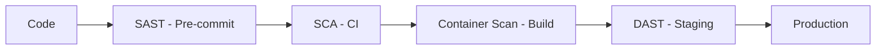

# فحص الأمان في CI/CD

> "لا تنتظر penetration test سنوياً. افحص الأمان مع كل commit."

## 🎯 أهداف التعلم

- دمج SAST, DAST, SCA في CI/CD
- فشل البناء عند اكتشاف ثغرات عالية
- Shift-Left Security

## ⏱️ الوقت المقدر: 35 دقيقة | المستوى: Intermediate

---

## 🏗️ أدوات الفحص

| النوع | الأداة | ماذا تفحص |
|-------|--------|-----------|
| **SAST** | SonarQube, Semgrep, CodeQL | كود المصدر |
| **SCA** | Snyk, Dependabot, Trivy | المكتبات والتبعيات |
| **DAST** | OWASP ZAP, Burp Suite | التطبيق الحي |
| **Container** | Trivy, Aqua, Snyk | صور الحاويات |

### SAST مع Semgrep

```yaml
- name: Semgrep SAST
  uses: semgrep/semgrep-action@v1
  with:
    config: p/owasp-top-ten
    fail-on: error
```

### OWASP ZAP DAST

```yaml
- name: DAST Scan
  run: |
    docker run owasp/zap2docker-stable zap-baseline.py \
      -t https://staging.cloudnova.com \
      -r zap-report.html
```

---

## 🏛️ طبقة الإنتاج: سيناريو CloudNova

Semgrep اكتشف hardcoded API key في الكود قبل merge. CI/CD فشل البناء. تم الإصلاح قبل الإنتاج.

### Shift-Left Security



كلما اكتشفت الثغرة أبكر، كلما كان إصلاحها أرخص (10x أرخص في code vs production!).

---

## 🛠️ تدريبات

### تمرين: أضف Semgrep إلى CI/CD pipeline
### تحدي: ابنِ pipeline مع SAST + SCA + DAST

---

## 📝 تقييم

### ✅ فحص المعرفة
1. ما الفرق بين SAST و DAST؟
2. لماذا Shift-Left مهم؟
3. كيف تفشل البناء عند ثغرات عالية؟

### 🃏 بطاقات
| السؤال | الإجابة |
|--------|---------|
| SAST | Static Analysis — فحص الكود بدون تشغيله |
| DAST | Dynamic Analysis — فحص التطبيق الحي |
| Shift-Left | اختبار الأمان مبكراً في الـ pipeline |

---

## 🎤 مقابلة
1. **"كيف تدمج الأمان في CI/CD؟"** → SAST + SCA + Container scanning + DAST
2. **"ماذا تفعل عند اكتشاف CVE في إحدى التبعيات؟"** → تحديث المكتبة + SCA إجباري

---

[← Advanced Deployment](./02-advanced-deployment) | [→ DORA Metrics](./04-cicd-metrics-dora) | [🏠 الرئيسية](/)
