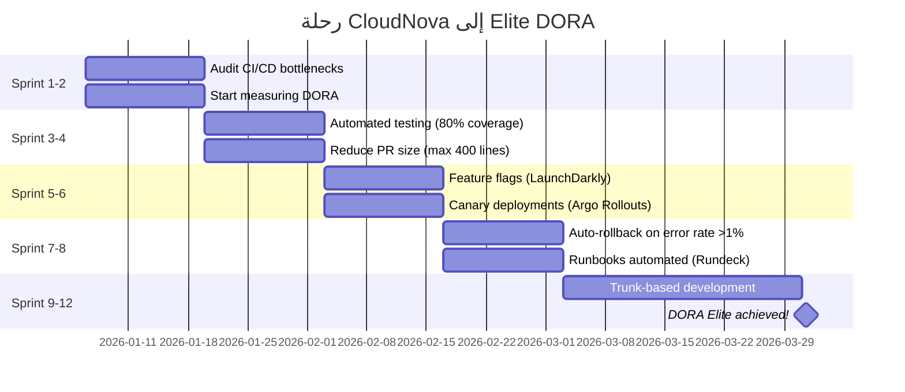

# مقاييس DORA

> "لا يمكنك تحسين ما لا تقيسه. DORA هي معيار الصناعة."

## 🎯 أهداف التعلم

- فهم مقاييس DORA الأربعة
- تصنيف Elite/High/Medium/Low
- جمع المقاييس من GitHub + Azure DevOps

## ⏱️ الوقت المقدر: 30 دقيقة | المستوى: Intermediate

---

## 🏗️ مقاييس DORA الأربعة

| المقياس                   | Elite     | High  | Medium | Low  |
| ------------------------- | --------- | ----- | ------ | ---- |
| **Deployment Frequency**  | On-demand | يومي  | أسبوعي | شهري |
| **Lead Time for Changes** | < 1 ساعة  | يوم   | أسبوع  | شهر  |
| **MTTR**                  | < 1 ساعة  | يوم   | أسبوع  | شهر  |
| **Change Failure Rate**   | 0-5%      | 5-10% | 10-15% | >15% |

### CloudNova اليوم

| المقياس              | القيمة   | التصنيف |
| -------------------- | -------- | ------- |
| Deployment Frequency | 12/يوم   | Elite   |
| Lead Time            | 45 دقيقة | Elite   |
| MTTR                 | 15 دقيقة | Elite   |
| Change Failure Rate  | 3%       | Elite   |

---

## 🏛️ طبقة الإنتاج: تتبع DORA

```python
def calculate_dora():
    deployments_this_week = len(get_github_deployments("cloudnova/api", days=7))
    mttr_minutes = avg_incident_duration("cloudnova", days=30)
    failure_rate = failed_deployments / total_deployments * 100

    print(f"Deployments/week: {deployments_this_week}")
    print(f"MTTR: {mttr_minutes:.1f} min")
    print(f"Failure Rate: {failure_rate:.1f}%")
```

---

## 🎨 استخدم DORA للتحسين

| المقياس ضعيف               | ماذا تحسن                        |
| -------------------------- | -------------------------------- |
| Deployment Frequency منخفض | أتمتة CI/CD أكثر                 |
| Lead Time طويل             | قلل حجم الـ PRs                  |
| MTTR عالي                  | حسن الـ monitoring والـ runbooks |
| Failure Rate عالي          | أضف testing + canary deploys     |

---

## 🏛️ سيناريو CloudNova: من Medium إلى Elite في 6 أشهر

**ريما** Engineering Manager في CloudNova. التقرير الربع سنوي: "فريقكم Medium performer في DORA."

**البيانات الحالية:**

| المقياس              | القيمة  | التصنيف |
| -------------------- | ------- | ------- |
| Deployment Frequency | 1/أسبوع | Medium  |
| Lead Time            | 3 أيام  | Medium  |
| MTTR                 | 8 ساعات | Medium  |
| Change Failure Rate  | 18%     | Low     |

**الهدف:** Elite في 6 أشهر.

### خطة التحول — Sprint by Sprint



**النتائج بعد 6 أشهر:**

| المقياس              | قبل     | بعد      | التصنيف   |
| -------------------- | ------- | -------- | --------- |
| Deployment Frequency | 1/أسبوع | 15/يوم   | **Elite** |
| Lead Time            | 3 أيام  | 30 دقيقة | **Elite** |
| MTTR                 | 8 ساعات | 12 دقيقة | **Elite** |
| Change Failure Rate  | 18%     | 4%       | **Elite** |

### ماذا فعلنا بالضبط؟

```python
# 1. قلصنا Lead Time: من 3 أيام إلى 30 دقيقة
def reduce_lead_time():
    old = {"avg_pr_size": 2000, "review_time_hours": 72}
    new = {"avg_pr_size": 300, "review_time_hours": 0.5}
    improvement = (old["review_time_hours"] - new["review_time_hours"]) / old["review_time_hours"] * 100
    print(f"Lead Time improvement: {improvement:.0f}%")
    # Lead Time improvement: 99%!

# 2. خفضنا MTTR: من 8 ساعات إلى 12 دقيقة
def reduce_mttr():
    old = {"detect": 15, "diagnose": 180, "fix": 285}
    new = {"detect": 1, "diagnose": 3, "fix": 8}
    print(f"MTTR: {sum(old.values())}min → {sum(new.values())}min")
    # MTTR: 480min → 12min (40x improvement!)
```

---

## 🎨 طبقة المعماري: مصفوفة تحسين DORA

| المقياس ضعيف          | السبب المحتمل            | الحل المجرب                                |
| --------------------- | ------------------------ | ------------------------------------------ |
| Deployment Freq منخفض | خوف من deployment        | Automated testing + feature flags          |
| Deployment Freq منخفض | عملية موافقة يدوية طويلة | Shift-left approval (peer review فقط)      |
| Lead Time طويل        | PRs ضخمة                 | Max 400 lines per PR + pair programming    |
| Lead Time طويل        | CI بطيء                  | Parallelized CI + caching + faster runners |
| MTTR عالي             | تشخيص يدوي               | Runbooks آلية + auto-rollback              |
| MTTR عالي             | فريق واحد يعرف الإصلاح   | Chaos Engineering + shared knowledge       |
| Failure Rate عالي     | Testing غير كافٍ         | 80% code coverage + integration tests      |
| Failure Rate عالي     | Big bang deployments     | Canary + Blue-Green deployments            |

---

## 📝 تقييم

### ✅ فحص المعرفة

1. ما هي مقاييس DORA الأربعة؟
2. كيف تصنف فريقاً حسب DORA؟
3. كيف تحسن MTTR؟
4. ما الفرق بين MTTR و MTTD؟
5. كيف تحسن Lead Time من 3 أيام إلى 30 دقيقة؟

### 📝 اختبار

**س١: فريقك Elite في كل المقاييس ما عدا Change Failure Rate (15%). كيف تصلح؟**

الإجابة: أضف canary deployments، حسن automated testing، قلل حجم الـ PRs، أضف integration tests إجبارية.

**س٢: كيف تقيس DORA metrics في فريق لا يستخدم GitHub؟**

الإجابة: أي CI/CD system: عد deployments الناجحة/الفاشلة. Lead time: من commit timestamp إلى deploy timestamp. MTTR: من incident creation إلى resolution.

**س٣: هل يمكن لشركة ناشئة أن تكون Elite؟**

الإجابة: نعم! الشركات الناشئة غالباً أسرع في التبني. فقط تحتاج: CI/CD منذ اليوم الأول، automated testing، feature flags، monitoring جيد.

### 🃏 بطاقات

| السؤال               | الإجابة                                                  |
| -------------------- | -------------------------------------------------------- |
| DORA                 | DevOps Research & Assessment — معيار أداء DevOps         |
| Deployment Frequency | عدد deployments للإنتاج لكل أسبوع                        |
| Lead Time            | الوقت من commit إلى production                           |
| MTTR                 | Mean Time to Recovery — متوسط وقت الإصلاح                |
| Change Failure Rate  | نسبة deployments التي تسبب incidents                     |
| Elite                | أعلى تصنيف DORA (On-demand deploys, أقل من 1h lead time) |
| MTTD                 | Mean Time to Detect — متوسط وقت الاكتشاف                 |
| Feature Flags        | تفعيل/تعطيل features بدون deployment جديد                |

---

## 🎤 أسئلة المقابلة

1. **"كيف تقيس أداء فريق DevOps؟"** → DORA metrics
2. **"كيف انتقلت من Medium إلى Elite؟"** → خطط تحسين لكل metric
3. **"كيف تقنع CTO بالاستثمار في تحسين DORA metrics؟"** → اربط DORA بـ business outcomes: وقت أسرع للسوق = ميزة تنافسية

---

## 📚 المراجع

- [DORA — Accelerate State of DevOps Report](https://cloud.google.com/devops/state-of-devops)
- [DORA Metrics Quick Check](https://dora.dev/quickcheck/)
- الدروس المرتبطة: [SRE & DevOps](../16-devops/03-sre-devops-intersection.md) | [CI/CD Pipelines](./01-cicd-pipelines.md) | [Observability](../../21-observability/01-observability-essentials.md)

---

[← Security Scanning](./03-cicd-security-scanning) | [→ DevOps Culture](../../16-devops/01-devops-culture) | [🏠 الرئيسية](/)
