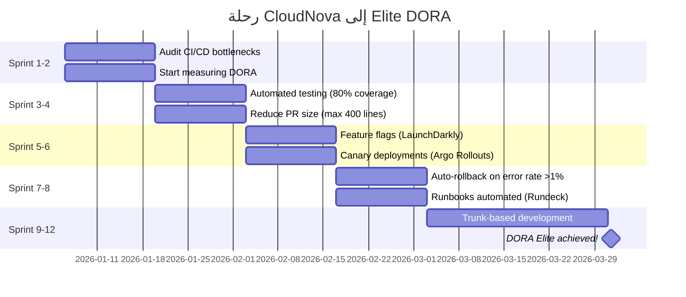

# مقاييس DORA

> "لا يمكنك تحسين ما لا تقيسه. DORA هي معيار الصناعة."

## 🎯 أهداف التعلم

- فهم مقاييس DORA الأربعة
- تصنيف Elite/High/Medium/Low
- جمع المقاييس من GitHub + Azure DevOps

## ⏱️ الوقت المقدر: 30 دقيقة | المستوى: Intermediate

---

## 🏗️ مقاييس DORA الأربعة

| المقياس                   | Elite     | High  | Medium | Low  |
| ------------------------- | --------- | ----- | ------ | ---- |
| **Deployment Frequency**  | On-demand | يومي  | أسبوعي | شهري |
| **Lead Time for Changes** | < 1 ساعة  | يوم   | أسبوع  | شهر  |
| **MTTR**                  | < 1 ساعة  | يوم   | أسبوع  | شهر  |
| **Change Failure Rate**   | 0-5%      | 5-10% | 10-15% | >15% |

### CloudNova اليوم

| المقياس              | القيمة   | التصنيف |
| -------------------- | -------- | ------- |
| Deployment Frequency | 12/يوم   | Elite   |
| Lead Time            | 45 دقيقة | Elite   |
| MTTR                 | 15 دقيقة | Elite   |
| Change Failure Rate  | 3%       | Elite   |

---

## 🏛️ طبقة الإنتاج: تتبع DORA

```python
def calculate_dora():
    deployments_this_week = len(get_github_deployments("cloudnova/api", days=7))
    mttr_minutes = avg_incident_duration("cloudnova", days=30)
    failure_rate = failed_deployments / total_deployments * 100

    print(f"Deployments/week: {deployments_this_week}")
    print(f"MTTR: {mttr_minutes:.1f} min")
    print(f"Failure Rate: {failure_rate:.1f}%")
```

---

## 🎨 استخدم DORA للتحسين

| المقياس ضعيف               | ماذا تحسن                        |
| -------------------------- | -------------------------------- |
| Deployment Frequency منخفض | أتمتة CI/CD أكثر                 |
| Lead Time طويل             | قلل حجم الـ PRs                  |
| MTTR عالي                  | حسن الـ monitoring والـ runbooks |
| Failure Rate عالي          | أضف testing + canary deploys     |

---

## 🛠️ تدريبات

### تمرين: احسب DORA metrics لفريقك

### تحدي: ابنِ Grafana dashboard لـ DORA

---

## 📝 تقييم

### ✅ فحص المعرفة

1. ما هي مقاييس DORA الأربعة؟
2. كيف تصنف فريقاً حسب DORA؟
3. كيف تحسن MTTR؟

### 🃏 بطاقات

| السؤال    | الإجابة                      |
| --------- | ---------------------------- |
| DORA      | DevOps Research & Assessment |
| Lead Time | من commit إلى production     |
| MTTR      | Mean Time to Recovery        |

---

## 🎤 مقابلة

1. **"كيف تقيس أداء فريق DevOps؟"** → DORA metrics
2. **"كيف انتقلت من Medium إلى Elite؟"** → خطط تحسين لكل metric

---

## 🏛️ سيناريو CloudNova الموسع: من Medium إلى Elite في 6 أشهر

**ريما** Engineering Manager في CloudNova. التقرير الربع سنوي: "فريقكم Medium performer في DORA."

**البيانات الحالية:**

| المقياس              | القيمة  | التصنيف |
| -------------------- | ------- | ------- |
| Deployment Frequency | 1/أسبوع | Medium  |
| Lead Time            | 3 أيام  | Medium  |
| MTTR                 | 8 ساعات | Medium  |
| Change Failure Rate  | 18%     | Low     |

**الهدف:** Elite في 6 أشهر.

### خطة التحول — Sprint by Sprint



**النتائج بعد 6 أشهر:**

| المقياس              | قبل     | بعد      | التصنيف   |
| -------------------- | ------- | -------- | --------- |
| Deployment Frequency | 1/أسبوع | 15/يوم   | **Elite** |
| Lead Time            | 3 أيام  | 30 دقيقة | **Elite** |
| MTTR                 | 8 ساعات | 12 دقيقة | **Elite** |
| Change Failure Rate  | 18%     | 4%       | **Elite** |

### ماذا فعلنا بالضبط؟

```python
# 1. قلصنا Lead Time: من 3 أيام إلى 30 دقيقة
def reduce_lead_time():
    # قبل: PRs بحجم 2000 سطر → مراجعة 3 أيام
    # بعد: PRs بحجم 300 سطر أقصى → مراجعة 30 دقيقة

    old = {"avg_pr_size": 2000, "review_time_hours": 72}
    new = {"avg_pr_size": 300, "review_time_hours": 0.5}

    improvement = (old["review_time_hours"] - new["review_time_hours"]) / old["review_time_hours"] * 100
    print(f"Lead Time improvement: {improvement:.0f}%")
    # Lead Time improvement: 99%!

# 2. خفضنا MTTR: من 8 ساعات إلى 12 دقيقة
def reduce_mttr():
    # قبل: on-call يبحث يدوياً عن السبب
    # بعد: auto-rollback + runbook آلي

    old = {"detect": 15, "diagnose": 180, "fix": 285}  # دقائق
    new = {"detect": 1, "diagnose": 3, "fix": 8}         # دقائق

    print(f"MTTR: {sum(old.values())}min → {sum(new.values())}min")
    # MTTR: 480min → 12min (40x improvement!)

    return new
```

---

## 🎨 طبقة المعماري: DORA Metrics System Design

### Pipeline Metrics Collection

```yaml
# Prometheus Exporter — يجمع DORA metrics
dora_metrics:
  deployment_frequency:
    source: github_deployments
    query: 'count(deployments{status="success"}[7d])'

  lead_time_for_changes:
    source: github_commits + github_deployments
    query: "avg(deployment_timestamp - commit_timestamp)"

  mttr:
    source: pagerduty_incidents
    query: "avg(incident_resolved_at - incident_created_at)"

  change_failure_rate:
    source: github_deployments + pagerduty_incidents
    query: "count(incidents caused by deployment) / count(deployments) * 100"
```

### مصفوفة تحسين DORA

| المقياس ضعيف          | السبب المحتمل            | الحل المجرب                                |
| --------------------- | ------------------------ | ------------------------------------------ |
| Deployment Freq منخفض | خوف من deployment        | Automated testing + feature flags          |
| Deployment Freq منخفض | عملية موافقة يدوية طويلة | Shift-left approval (peer review فقط)      |
| Lead Time طويل        | PRs ضخمة                 | Max 400 lines per PR + pair programming    |
| Lead Time طويل        | CI بطيء                  | Parallelized CI + caching + faster runners |
| MTTR عالي             | تشخيص يدوي               | Runbooks آلية + auto-rollback              |
| MTTR عالي             | فريق واحد يعرف الإصلاح   | Chaos Engineering + shared knowledge       |
| Failure Rate عالي     | Testing غير كافٍ         | 80% code coverage + integration tests      |
| Failure Rate عالي     | Big bang deployments     | Canary + Blue-Green deployments            |

### Anti-Patterns في DORA

| الخطأ                       | المشكلة                             | التصحيح                                  |
| --------------------------- | ----------------------------------- | ---------------------------------------- |
| قياس DORA بدون تحسين        | أرقام فقط، لا عمل                   | خطة تحسين لكل metric                     |
| مقارنة فرق مختلفة بدون سياق | Frontend vs Backend احتياجات مختلفة | سياق كل فريق                             |
| DORA كهدف (وليس مؤشر)       | تحسين الأرقام على حساب الجودة       | DORA مؤشر صحة، وليس KPI                  |
| تجاهل Change Failure Rate   | "ننشر كثيراً" لكن مع فشل            | Deployment Frequency + Failure Rate معاً |

---

## 🛠️ تدريبات موسعة

### تمرين 1: احسب DORA Metrics من GitHub API

```python
import requests
from datetime import datetime, timedelta

def get_dora_metrics(owner, repo, days=30):
    since = (datetime.utcnow() - timedelta(days=days)).isoformat() + "Z"

    # Deployment Frequency
    deployments = requests.get(
        f"https://api.github.com/repos/{owner}/{repo}/deployments",
        params={"since": since},
        headers={"Authorization": f"token {GITHUB_TOKEN}"}
    ).json()

    deploy_count = len(deployments)
    deploy_freq = deploy_count / (days / 7)  # per week

    print(f"📊 DORA Metrics for {owner}/{repo}")
    print(f"Deployment Frequency: {deploy_freq:.1f}/week")
    print(f"Classification: {classify_dora(deploy_freq, 'freq')}")

def classify_dora(value, metric):
    thresholds = {
        'freq': {'Elite': 999, 'High': 1, 'Medium': 0.2, 'Low': 0},
        'lead_time': {'Elite': 0.04, 'High': 1, 'Medium': 7, 'Low': 30},
        'mttr': {'Elite': 0.04, 'High': 1, 'Medium': 7, 'Low': 30},
        'failure_rate': {'Elite': 5, 'High': 10, 'Medium': 15, 'Low': 100}
    }

    t = thresholds[metric]
    if value <= t['Elite']: return '🏆 Elite'
    elif value <= t['High']: return '🟢 High'
    elif value <= t['Medium']: return '🟡 Medium'
    else: return '🔴 Low'

get_dora_metrics('cloudnova', 'api', days=30)
```

### تمرين 2: Grafana DORA Dashboard

```json
{
  "dashboard": {
    "title": "DORA Metrics",
    "panels": [
      {
        "title": "Deployment Frequency",
        "targets": [{ "expr": "rate(deployments_total[7d]) * 10080" }],
        "thresholds": [
          { "value": 0.2, "color": "red" },
          { "value": 1, "color": "yellow" },
          { "value": 999, "color": "green" }
        ]
      },
      {
        "title": "Change Failure Rate",
        "targets": [{ "expr": "(failed_deployments / total_deployments) * 100" }],
        "thresholds": [
          { "value": 15, "color": "red" },
          { "value": 10, "color": "yellow" },
          { "value": 5, "color": "green" }
        ]
      },
      {
        "title": "MTTR (minutes)",
        "targets": [{ "expr": "avg(incident_duration_minutes)" }]
      }
    ]
  }
}
```

### تحدي: DORA Alerting System

```python
# Slack bot يحذر عند تدهور أي DORA metric
class DORAAlertBot:
    def __init__(self, webhook_url):
        self.webhook = webhook_url

    def check_and_alert(self, metrics):
        alerts = []

        if metrics['failure_rate'] > 10:
            alerts.append(f"🔴 Change Failure Rate = {metrics['failure_rate']}% (High threshold: <10%)")

        if metrics['mttr_hours'] > 1:
            alerts.append(f"🔴 MTTR = {metrics['mttr_hours']}h (Elite threshold: <1h)")

        if metrics['lead_time_hours'] > 24:
            alerts.append(f"🟡 Lead Time = {metrics['lead_time_hours']}h")

        if alerts:
            message = "⚠️ DORA Metrics Alert:\n" + "\n".join(alerts)
            requests.post(self.webhook, json={"text": message})
        else:
            print("✅ All DORA metrics within thresholds")
```

---

## 📝 تقييم شامل

### ✅ فحص المعرفة (5)

1. ما هي مقاييس DORA الأربعة؟
2. كيف تحسن Lead Time من 3 أيام إلى 30 دقيقة؟
3. لماذا Change Failure Rate مهم أكثر من Deployment Frequency وحده؟
4. كيف تصنف فريقاً كـ Elite في DORA؟
5. ما الفرق بين MTTR و MTTD؟

### 📝 اختبار (3)

1. **فريقك Elite في كل المقاييس ما عدا Change Failure Rate (15%). كيف تصلح؟**

:::tip الإجابة

أضف canary deployments، حسن automated testing، قلل حجم الـ PRs، أضف integration tests إجبارية.</details>

2. **كيف تقيس DORA metrics في فريق لا يستخدم GitHub؟**

:::tip الإجابة

أي CI/CD system: عد deployments الناجحة/الفاشلة. Lead time: من commit timestamp إلى deploy timestamp. MTTR: من incident creation إلى resolution.</details>

3. **هل يمكن لشركة ناشئة أن تكون Elite؟**

:::tip الإجابة

نعم! الشركات الناشئة غالباً أسرع في التبني. فقط تحتاج: CI/CD منذ اليوم الأول، automated testing، feature flags، monitoring جيد.</details>

### 🧠 Active Recall (5)

- ارسم DORA metrics لفريقك الحالي
- اشرح الفرق بين MTTR و MTBF
- كيف تقيس Lead Time بدقة في monorepo؟
- ما العلاقة بين DORA و SLOs؟
- صف خطة لتحسين Deployment Frequency

### 🎓 Feynman: DORA Metrics لمدير غير تقني

"تخيل أنك تدير مطعماً. Deployment Frequency = كم مرة تقدم طبقاً جديداً. Lead Time = الوقت من الطلب إلى التقديم. MTTR = وقت إصلاح خطأ في الطلب. Change Failure Rate = نسبة الأطباق المرتجعة. مطعم Elite يقدم أطباقاً جديدة يومياً، في 3 دقائق، ويصحح الأخطاء فوراً، وأقل من 5% مرتجعات."

### 🃏 بطاقات (8)

| السؤال               | الإجابة                                            |
| -------------------- | -------------------------------------------------- |
| DORA                 | DevOps Research & Assessment — معيار أداء DevOps   |
| Deployment Frequency | عدد deployments للإنتاج لكل أسبوع                  |
| Lead Time            | الوقت من commit إلى production                     |
| MTTR                 | Mean Time to Recovery — متوسط وقت الإصلاح          |
| Change Failure Rate  | نسبة deployments التي تسبب incidents               |
| Elite                | أعلى تصنيف DORA (On-demand deploys, <1h lead time) |
| MTTD                 | Mean Time to Detect — متوسط وقت الاكتشاف           |
| Feature Flags        | تفعيل/تعطيل features بدون deployment جديد          |

---

## 🎤 أسئلة المقابلة الموسعة

### تقني

1. **"كيف تقنع CTO بالاستثمار في تحسين DORA metrics؟"**
   - اربط DORA بـ business outcomes: وقت أسرع للسوق = ميزة تنافسية
   - MTTR أقل = تكلفة downtime أقل
   - Change Failure Rate أقل = ثقة عملاء أعلى
   - استخدم بيانات حقيقية، ليس تخمينات

2. **"فريقان في نفس الشركة: أحدهما Elite والآخر Low. ماذا تفعل؟"**
   - افهم لماذا: فرق context؟ legacy code؟ fear culture؟
   - لا تفرض حلولاً من الأعلى
   - اجعل الفريق Elite يشارك خبراته مع Low (pairing, knowledge sharing)
   - ضع أهدافاً تدريجية: Low → Medium → High

### System Design

**"صمم DORA Metrics Platform لـ 500 فريق."**

- Data Sources: GitHub, GitLab, Azure DevOps, Jenkins, PagerDuty, Jira
- Collection: Webhooks + Prometheus exporters
- Storage: Time-series DB (InfluxDB, Prometheus)
- Visualization: Grafana (organization-level + team-level dashboards)
- Alerting: Slack/PagerDuty عند تدهور أي metric
- Benchmarking: مقارنة بين الفرق (بدون blame culture!)

### Behavioral (STAR)

**"كيف حسنت مقياساً واحداً من DORA بشكل كبير؟"**

**S:** فريق release مرة كل أسبوعين (Low performer).
**T:** زيادة Deployment Frequency إلى يومي.
**A:** (1) أتمتة pipeline بالكامل. (2) أضفت feature flags. (3) قلصت حجم PRs. (4) دربت الفريق على trunk-based development.
**R:** بعد 3 أشهر: 4 deployments/يوم (Elite). الفريق أكثر سعادة وثقة.

---

## 📚 المراجع

- [DORA — Accelerate State of DevOps Report](https://cloud.google.com/devops/state-of-devops)
- [DORA Metrics Quick Check](https://dora.dev/quickcheck/)
- [GitHub Metrics with DORA](https://github.blog/engineering/measuring-engineering-metrics/)
- الشهادات: DORA Certified (Google Cloud)
- الدروس المرتبطة: [SRE & DevOps](../16-devops/03-sre-devops-intersection.md) | [CI/CD Pipelines](./01-cicd-pipelines.md) | [Observability](../../21-observability/01-observability-essentials.md)

---

[← Security Scanning](./03-cicd-security-scanning) | [→ DevOps Culture](../../16-devops/01-devops-culture) | [🏠 الرئيسية](/)
