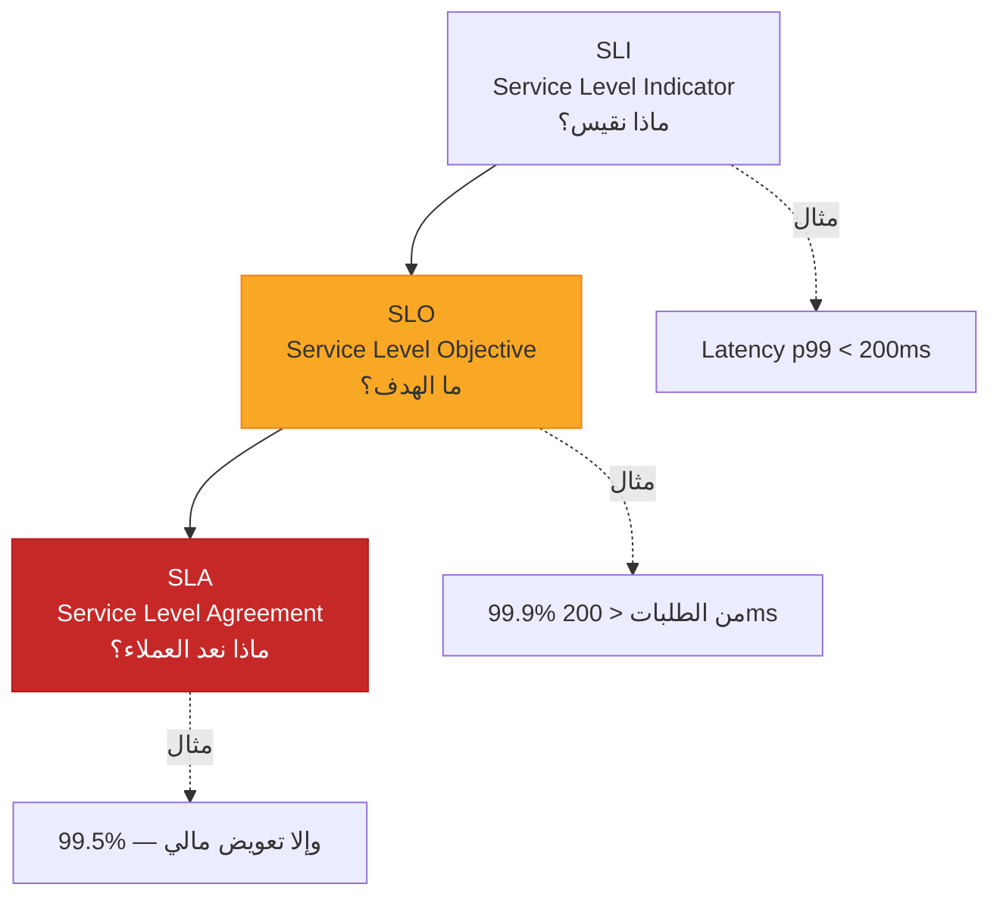
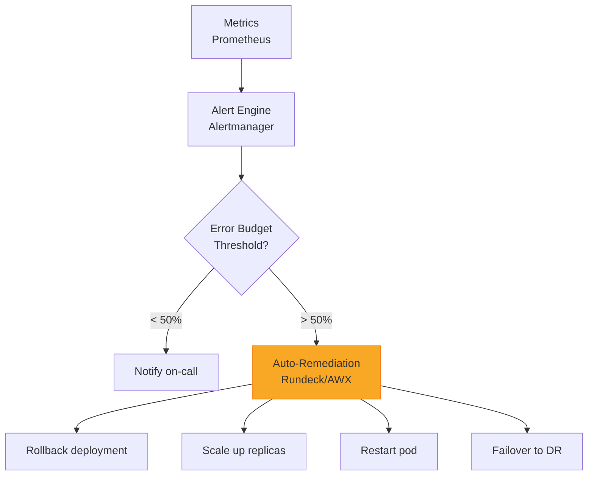

# SRE و DevOps

> "DevOps فلسفة، SRE تطبيق. كلاهما تحتاج إليهما."

## 🎯 أهداف التعلم

- فهم SRE ومبادئه
- Service Level Objectives (SLOs)
- Error Budgets
- تقليل الـ Toil

## ⏱️ الوقت المقدر: 35 دقيقة | المستوى: Advanced

---

## 🏗️ SRE vs DevOps

| | DevOps | SRE |
|---|--------|-----|
| **التركيز** | ثقافة + أتمتة | موثوقية + مقاييس |
| **يقيس** | DORA Metrics | SLOs, Error Budgets |
| **يقول** | "افعلها أسرع" | "اجعلها موثوقة" |
| **الأصل** | حركة ثقافية | Google Engineering |

### SLO و Error Budget

```yaml
# SLO: 99.95% uptime شهرياً
# Error Budget: 0.05% = 22 دقيقة شهرياً

# إذا استهلكت الـ error budget:
- أوقف deployments الجديدة
- ركز على الموثوقية
```

### Toil Automation

```python
# قبل: 3 ساعات أسبوعياً للشهادات
# بعد: Let's Encrypt + Certbot auto-renewal
```

---

## 🏛️ سيناريو CloudNova: Error Budget

استهلكنا 18 من 22 دقيقة error budget في أسبوعين. CTO أوقف deployments. فريق SRE قضى أسبوعاً في تحسين monitoring. رجعنا deployment بعد استعادة الموثوقية.

### SLO Design

| الخدمة | SLO | Error Budget/شهر |
|--------|-----|-----------------|
| API | 99.95% | 22 دقيقة |
| Database | 99.99% | 4.3 دقيقة |
| Frontend | 99.9% | 43 دقيقة |

---

## 🛠️ تدريبات

### تمرين: حدد SLO لخدمتك
### تحدي: احسب error budget الشهري

---

## 📝 تقييم

### ✅ فحص المعرفة
1. ما الفرق بين SLA و SLO؟
2. كيف تحسب error budget؟
3. متى توقف deployments؟

### 🃏 بطاقات
| السؤال | الإجابة |
|--------|---------|
| SLO | Service Level Objective — هدف الموثوقية |
| Error Budget | الوقت المسموح للـ downtime |
| Toil | عمل يدوي متكرر |

---

## 🎤 مقابلة
1. **"ما الفرق بين SRE و DevOps؟"** → DevOps: فلسفة. SRE: تطبيق مع مقاييس
2. **"اشرح Error Budget لمدير غير تقني"** → "مثل ميزانية. إذا صرفت كل الميزانية (downtime)، توقف عن الصرف (deployments)"

---

## 🏛️ سيناريو CloudNova الموسع: حرب الـ Error Budget

**سلمى** SRE Lead في CloudNova. الساعة 3 فجراً، PagerDuty يصيح: API latency ارتفع من 200ms إلى 8 ثوانٍ!

**التسلسل الزمني:**

```mermaid
gantt
    title CloudNova Incident Timeline
    dateFormat HH:mm
    axisFormat %H:%M
    section Detection
        Latency spike        :03:00, 2m
        PagerDuty alert      :03:02, 1m
    section Response
        On-call acknowledges :03:03, 2m
        Identify root cause  :03:05, 15m
        Database connection pool exhausted :crit, 03:05, 15m
    section Resolution
        Increase pool size   :03:20, 3m
        Deploy fix           :03:23, 5m
        Latency normalizes   :03:28, 2m
```



**MTTR: 28 دقيقة.** داخل الـ error budget (22 دقيقة للـ API + 6 دقائق buffer من unused budgets).

**تحليل root cause:**

```bash
# ما حدث فعلاً
kubectl logs -l app=api --tail=100 | grep "connection pool"
# 2026-07-20 03:00:01 ERROR: Connection pool exhausted (max=100, waiting=342)

# السبب: deployment جديد قلل pool size من 200 إلى 100 بالخطأ
# الإصلاح: rollback فوري + إضافة validation في CI/CD
```

**درس مستفاد:** CI/CD pipeline الآن يتحقق من connection pool settings قبل deployment.

---

## 🎨 طبقة المعماري: SLO Design Masterclass

### هرم SLOs



**القاعدة الذهبية:** SLO أشد من SLA. إذا حققت SLO، لن تخترق SLA أبداً.

### مصفوفة قرار SLO

| الخدمة | SLO مقترح | Error Budget/شهر | السبب |
|--------|-----------|-----------------|-------|
| Payment API | 99.99% | 4.3 دقيقة | فلوس حرفياً |
| User Profile | 99.9% | 43 دقيقة | tolerable delay |
| Search Service | 99.5% | 3.6 ساعة | non-critical |
| Admin Dashboard | 99% | 7.2 ساعة | داخلي فقط |
| Reporting | 95% | 36 ساعة | batch processing |

### Anti-Patterns في SRE

| الخطأ | المشكلة | التصحيح |
|-------|---------|---------|
| SLO = 100% | مستحيل، يكلف ثروة | 99.9% - 99.99% حسب الخدمة |
| SLO واحد لكل الخدمات | بعضها أكثر أهمية | SLO متدرج حسب criticality |
| تجاهل error budget | deployments غير مسؤولة | اربط CI/CD بـ error budget |
| عدم مراجعة SLO | احتياجات العمل تتغير | مراجعة ربع سنوية |

---

## 🛠️ تدريبات موسعة

### تمرين 1: صمم SLO لخدمتك
```yaml
# املأ هذا القالب
service: payment-api
sli: latency_p99
slo_target: 99.95%
measurement_window: 30d
error_budget_minutes: 22
alerting_threshold: 50% of error budget consumed
```

### تمرين 2: احسب تكلفة downtime
```python
def cost_of_downtime(revenue_per_hour, downtime_hours, reputation_factor=2.5):
    """
    Revenue: $10,000/hour
    Downtime: 2 hours
    Reputation factor: 2.5x (lost future business)
    
    True cost = 10,000 * 2 * 2.5 = $50,000
    """
    return revenue_per_hour * downtime_hours * reputation_factor

print(f"True cost: ${cost_of_downtime(10000, 2):,}")
# النتيجة: $50,000 — هذا ثمن 4 دقائق من الـ error budget!
```

### تحدي: ابنِ Error Budget Policy Engine

```python
class ErrorBudgetGate:
    """يمنع deployments عندما يكون error budget مستهلكاً"""
    
    def __init__(self, monthly_budget_minutes):
        self.monthly_budget = monthly_budget_minutes
        self.consumed = 0
    
    def record_incident(self, duration_minutes):
        self.consumed += duration_minutes
        remaining = self.monthly_budget - self.consumed
        
        if self.consumed > self.monthly_budget:
            raise Exception(f"⚠️ Error budget exhausted! Stop deployments.")
        elif self.consumed > self.monthly_budget * 0.75:
            print(f"🔶 Warning: {remaining:.0f}min remaining. Freeze non-critical deploys.")
        else:
            print(f"🟢 {remaining:.0f}min remaining. Deploy freely.")

gate = ErrorBudgetGate(monthly_budget_minutes=22)
gate.record_incident(18)  # 🔶 Warning: 4min remaining
gate.record_incident(5)   # ⚠️ Exception!
```

---

## 📝 تقييم شامل

### ✅ فحص المعرفة (5 أسئلة)
1. ما الفرق بين SLI و SLO و SLA؟
2. كيف تحسب error budget الشهري؟
3. متى يجب إيقاف deployments؟
4. لماذا SLO = 100% خطأ؟
5. كيف تختار SLO المناسب لخدمة جديدة؟

### 📝 اختبار (3 أسئلة)
1. **خدمة API بمتوسط 3 ملايين طلب/شهر. كم طلباً يمكن أن يفشل إذا كان SLO = 99.95%؟**
   <details><summary>الإجابة</summary>0.05% × 3,000,000 = 1,500 طلب فاشل مسموح شهرياً</details>

2. **إذا استهلكت 80% من error budget في أول أسبوع، ماذا تفعل؟**
   <details><summary>الإجابة</summary>تجميد deployments غير الضرورية، مراجعة سبب الاستهلاك، تحسين monitoring</details>

3. **ما العلاقة بين SLO و CI/CD pipeline؟**
   <details><summary>الإجابة</summary>CI/CD يجب أن يتحقق من error budget قبل السماح بـ deployment جديد</details>

### 🧠 Active Recall (5)
- اشرح SLO لشخص غير تقني
- متى يكون الـ error budget مفيداً؟
- كيف تقنع مديرك بالاستثمار في SRE؟
- ما الفرق بين monitoring و observability؟
- صف حادثة حقيقية استفدت فيها من error budget

### 🎓 Feynman: اشرح Error Budget لطفل في الـ 10 من عمره
"تخيل أن والدتك تعطيك 22 قطعة حلوى كل شهر. كلما أخطأت، تأخذ قطعة واحدة. إذا أكلت كل القطع قبل نهاية الشهر، لا تلعب بلايستيشن حتى الشهر القادم. Error budget هو قطع الحلوى — تصرفها بحكمة!"

### 🃏 بطاقات (8)
| السؤال | الإجابة |
|--------|---------|
| SLI | Service Level Indicator — المقياس الفعلي (مثل latency p99) |
| SLO | Service Level Objective — الهدف من الـ SLI (مثل 99.9%) |
| SLA | Service Level Agreement — العقد مع العميل (يشمل تعويضات) |
| Error Budget | 100% - SLO% = الوقت المسموح للفشل |
| Toil | عمل يدوي متكرر يمكن أتمتته |
| MTTR | Mean Time to Recovery — متوسط وقت الإصلاح |
| MTTD | Mean Time to Detect — متوسط وقت الاكتشاف |
| CRE | Customer Reliability Engineer (مثل SRE لكن للعملاء) |

---

## 🎤 أسئلة المقابلة الموسعة

### تقني
1. **"صمم SLO framework لشركة عندها 50 microservice."**
   - صنف الخدمات: Tier 0 (critical, 99.99%), Tier 1 (important, 99.9%), Tier 2 (nice-to-have, 99.5%)
   - لكل tier: SLI, SLO, alert threshold, error budget policy
   - أربط CI/CD: gate deployments على error budget
   - راجع SLO كل ربع سنة مع product owners

2. **"كيف تقيس reliability إذا لم يكن لديك SLOs بعد؟"**
   - ابدأ بـ SLIs بسيطة: latency, error rate, availability
   - اجمع 3 أشهر بيانات
   - اعرض الـ SLIs الحالية على stakeholders
   - اتفق على SLO مبني على البيانات، ليس التخمين

### System Design
**"صمم نظام Auto-Remediation يكتشف المشاكل ويصلحها تلقائياً."**



### Behavioral (STAR)
**"احكِ لي عن مرة استخدمت فيها data لاتخاذ قرار صعب."**

**S** (Situation): فريق التطوير يضغط لنشر feature كبير قبل Black Friday.
**T** (Task): كـ SRE، مهمتي حماية الموثوقية.
**A** (Action): عرضت error budget dashboard — 65% مستهلك. اقترحت canary deployment بدلاً من rollout كامل، مع auto-rollback إذا تجاوز latency threshold.
**R** (Result): نجح canary deployment. الصفر latency ارتفع 5% فقط. Black Friday مر بدون incidents. الفريق تعلم قيمة الـ error budget.

---

## 📚 المراجع

- [Site Reliability Engineering (Google Book)](https://sre.google/books/)
- [Implementing SLOs (Google)](https://sre.google/workbook/implementing-slos/)
- [Azure Well-Architected — Reliability](https://learn.microsoft.com/azure/well-architected/reliability/)
- الدروس المرتبطة: [Monitoring](../../20-monitoring/01-monitoring-fundamentals.md) | [Observability](../../21-observability/01-observability-essentials.md) | [GitOps](../../18-gitops/01-gitops-fundamentals.md)

---

[← DevOps Tools](./02-devops-tools) | [→ DevSecOps Pipeline](../../17-devsecops/01-security-pipeline) | [🏠 الرئيسية](/)
