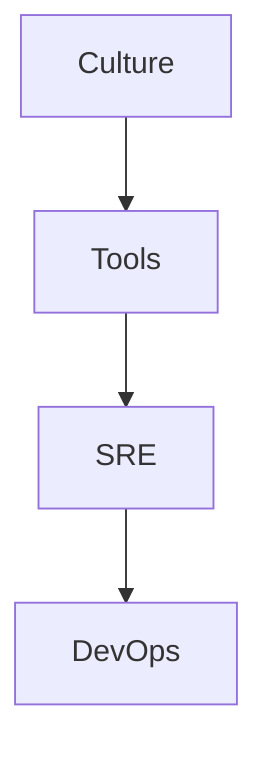

# 🚀 DevOps

> ثقافة DevOps، الأدوات، SRE — من الثقافة إلى التطبيق.

## 🎯 أهداف التعلم

بعد إكمال هذه الوحدة، ستكون قادراً على:

- [**ثقافة DevOps**](01-devops-culture) — CALMS Framework
- [**أدوات DevOps**](02-devops-tools) — سلسلة الأدوات
- [**SRE و DevOps**](03-sre-devops-intersection) — تقاطع المجالين

## 💡 المهارات التي ستكتسبها

DevOps Culture • CALMS • SRE • Toolchain

## 📊 معلومات الوحدة

| العنصر           | القيمة  |
| ---------------- | ------- |
| **المستوى**      | متوسط   |
| **الوقت المقدر** | 4 ساعات |
| **المتطلبات**    | CI/CD   |
| **الشهادات**     | AZ-400  |

## 🏛️ مهمة CloudNova

> حوّل ثقافة CloudNova من Dev vs Ops إلى DevOps حقيقي.

## 🗺️ خريطة الوحدة

## 📖 الدروس

- [**ثقافة DevOps**](01-devops-culture) — CALMS Framework
- [**أدوات DevOps**](02-devops-tools) — سلسلة الأدوات
- [**SRE و DevOps**](03-sre-devops-intersection) — تقاطع المجالين

## 🚀 ابدأ التعلم

[▶️ ابدأ الدرس الأول](01-devops-culture)
