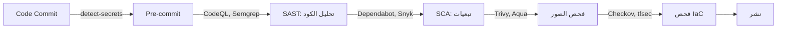

# DevSecOps — الأمن في الـ Pipeline

> **"الأمان ليس بوابة أخيرة. إنه عملية مستمرة مدمجة في كل خطوة من خط الأنابيب."**

## ما هو DevSecOps؟

الأمان التقليدي: فريق الأمان يراجع في النهاية. "لا يمكنك النشر — فشلت في التدقيق."

DevSecOps: الأمان في كل مرحلة. وجدت ثغرة قبل ٥ دقائق من كتابة الكود ≠ بعد ٣ أسابيع في مراجعة النشر.

## مراحل الأمان في الـ Pipeline



## أدوات الأمان

| الأداة                | ماذا تفحص                   | متى           |
| --------------------- | --------------------------- | ------------- |
| **detect-secrets**    | كلمات مرور ومفاتيح في الكود | قبل commit    |
| **CodeQL / Semgrep**  | ثغرات في الكود (SAST)       | عند PR        |
| **Dependabot / Snyk** | ثغرات في المكتبات (SCA)     | عند PR + دوري |
| **Trivy**             | ثغرات في صور Docker         | بعد build     |
| **Checkov / tfsec**   | أخطاء تكوين IaC             | عند PR        |

## مثال: GitHub Actions مع الأمان

```yaml
name: Security Pipeline
on: [pull_request]
jobs:
  secret-scan:
    runs-on: ubuntu-latest
    steps:
      - uses: actions/checkout@v4
      - run: |
          pip install detect-secrets
          detect-secrets scan --all-files

  sast:
    runs-on: ubuntu-latest
    steps:
      - uses: github/codeql-action/analyze@v3

  iac-scan:
    runs-on: ubuntu-latest
    steps:
      - uses: bridgecrewio/checkov-action@master
        with:
          directory: terraform/
          framework: terraform
```

## سيناريو CloudNova: Storage Account مكشوف

> **الموقف:** تدقيق أمني يكتشف Storage Account بشبكة مفتوحة (`default_action = "Allow"`). ظل مكشوفاً ٣ أسابيع.

```hcl
# المشكلة
resource "azurerm_storage_account" "data" {
  name = "cloudnovadata"
  # ... missing: network_rules
}

# الإصلاح
resource "azurerm_storage_account" "data" {
  name = "cloudnovadata"
  # ...
  network_rules {
    default_action = "Deny"
    ip_rules       = ["10.0.0.0/8"]
  }
}
```

**الوقاية:** أضف Checkov للـ pipeline — سيرفض أي Storage Account بدون `default_action = "Deny"`.

---

[← العودة للوحدة](index.md) | [🏠 الرئيسية](/)
