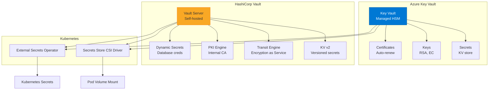

# إدارة الأسرار

> "Secret واحد في الكود = كارثة واحدة في الطريق."

## 🎯 أهداف التعلم

- إدارة الأسرار مع Azure Key Vault
- HashiCorp Vault للمؤسسات
- External Secrets Operator لـ Kubernetes
- تدوير الأسرار تلقائياً

## ⏱️ الوقت المقدر: 35 دقيقة | المستوى: Advanced

---

## 🏗️ Azure Key Vault

```bash
az keyvault secret set \
  --vault-name cloudnova-kv \
  --name "DB-PASSWORD" \
  --value "SuperSecret123!"

# استخدام secret في Terraform
data "azurerm_key_vault_secret" "db_password" {
  name         = "DB-PASSWORD"
  key_vault_id = data.azurerm_key_vault.main.id
}
```

### External Secrets Operator

```yaml
apiVersion: external-secrets.io/v1beta1
kind: ExternalSecret
metadata:
  name: db-credentials
spec:
  refreshInterval: 1h
  secretStoreRef:
    name: azure-kv-store
    kind: SecretStore
  target:
    name: db-secret
  data:
    - secretKey: password
      remoteRef:
        key: DB-PASSWORD
```

### تدوير الأسرار

```bash
az keyvault certificate policy create \
  --vault-name cloudnova-kv \
  --name api-cert \
  --action-type AutoRenew \
  --validity-in-months 12 \
  --renew-before-expiry 30
```

---

## 🏛️ طبقة الإنتاج: CloudNova Incident

نسي أحد المطورين Connection String في `appsettings.json` ودفعه إلى GitHub public repo. في 3 دقائق، bots اكتشفوه واستخدموه.

**بعد الحادثة**: Key Vault لكل الأسرار + GitHub Secret Scanning + No secrets ever in code.

### HashiCorp Vault vs Key Vault

|                     | Azure Key Vault | HashiCorp Vault |
| ------------------- | --------------- | --------------- |
| **النشر**           | مُدار           | Self-hosted     |
| **التكلفة**         | لكل عملية       | مجاني + infra   |
| **Dynamic Secrets** | محدود           | ✅ متقدم        |
| **الأفضل لـ**       | Azure فقط       | Multi-cloud     |

---

## 🛠️ تدريبات

### تمرين: خزّن secret في Key Vault واستخدمه في Terraform

### تحدي: ثبت External Secrets Operator واربطه بـ Key Vault

---

## 📝 تقييم

### ✅ فحص المعرفة

1. لماذا لا نضع secrets في الكود؟
2. ما فائدة External Secrets Operator؟
3. كيف تدير شهادات TLS تلقائياً؟

### 🃏 بطاقات

| السؤال     | الإجابة                                           |
| ---------- | ------------------------------------------------- |
| Key Vault  | خدمة إدارة الأسرار في Azure                       |
| ESO        | External Secrets Operator — مزامنة secrets لـ K8s |
| Auto-Renew | تجديد تلقائي للشهادات قبل انتهائها                |

---

## 🎤 مقابلة

1. **"كيف تدير secrets في Kubernetes؟"** → External Secrets Operator + Key Vault
2. **"ماذا تفعل إذا تسرب secret؟"** → تدويره فوراً + التحقيق + منع التكرار

---

## 🏛️ سيناريو CloudNova: يوم تسربت كل الأسرار

**نواف** DevSecOps Engineer في CloudNova. الجمعة 5 مساءً، تنبيه من GitHub Advanced Security:

"Secret detected in repo cloudnova/api: Azure Storage connection string."

**التسلسل الزمني:**

```
17:00 — GitHub Secret Scanning يكتشف connection string في commit قديم
17:02 — Slack alert لـ #security-team
17:05 — تدوير الـ key في Azure Key Vault (تلقائي)
17:10 — فحص Azure logs: 3 محاولات وصول غير مصرح بها من IP مجهول!
17:15 — التحقيق: الـ secret تعرض لمدة 8 دقائق. الضرر محدود.
```

**كيف منعنا الكارثة:**

```bash
# 1. تدوير المفتاح فوراً
az keyvault key rotate \
  --vault-name cloudnova-kv \
  --name storage-account-key

# 2. تعطيل الـ key القديم
az keyvault key set-attributes \
  --vault-name cloudnova-kv \
  --name storage-account-key \
  --enabled false

# 3. فحص access logs
az monitor log-analytics query \
  --workspace cloudnova-logs \
  --analytics-query "
    StorageBlobLogs
    | where TimeGenerated > ago(1h)
    | where AuthenticationType == 'Key'
    | project TimeGenerated, AccountName, CallerIpAddress, OperationName
  "
```

**بعد الحادثة:**

- 100% من الأسرار في Key Vault (صفر secrets في الكود)
- GitHub Secret Scanning + Push Protection
- External Secrets Operator لـ Kubernetes
- Auto-rotation لكل الشهادات والمفاتيح (90 يوماً)

---

## 🎨 طبقة المعماري: Secrets Management Design

### HashiCorp Vault vs Azure Key Vault — Deep Comparison



### مصفوفة قرار

| المعيار             | Azure Key Vault        | HashiCorp Vault              | AWS Secrets Manager |
| ------------------- | ---------------------- | ---------------------------- | ------------------- |
| **النشر**           | مُدار (PaaS)           | Self-hosted (K8s/VM)         | مُدار (PaaS)        |
| **Dynamic Secrets** | ❌                     | ⭐⭐⭐⭐⭐                   | محدود               |
| **PKI/Internal CA** | ❌                     | ⭐⭐⭐⭐⭐                   | ❌                  |
| **HSM**             | ✅ Managed HSM         | ✅ (with HSM backend)        | ❌                  |
| **التكلفة**         | $0.03/10K transactions | مجاني + infra                | $0.40/secret/month  |
| **الأفضل لـ**       | Azure-native apps      | Multi-cloud, dynamic secrets | AWS-native apps     |

### Secret Rotation Architecture

```python
# Azure Function للتدوير التلقائي
import azure.functions as func
from azure.keyvault.secrets import SecretClient
from azure.identity import DefaultAzureCredential

def auto_rotate_secret(secret_name, vault_url, rotation_days=90):
    credential = DefaultAzureCredential()
    client = SecretClient(vault_url=vault_url, credential=credential)

    # تحقق من عمر الـ secret
    secret = client.get_secret(secret_name)
    age_days = (datetime.utcnow() - secret.properties.updated_on).days

    if age_days >= rotation_days:
        # إنشاء secret جديد
        new_value = generate_secure_password(32)
        client.set_secret(secret_name, new_value)

        # تحديث التطبيقات المعتمدة على الـ secret
        restart_dependent_services(secret_name)

        logger.info(f"Rotated secret: {secret_name} (age: {age_days} days)")
```

### Anti-Patterns

| الخطأ                   | المشكلة                        | التصحيح                            |
| ----------------------- | ------------------------------ | ---------------------------------- |
| Secrets في config files | تسرب عند push لـ Git           | Key Vault references               |
| Secret واحد لكل البيئات | Dev = Production access        | Secrets منفصلة لكل environment     |
| عدم تدوير الأسرار       | Compromised secrets تبقى صالحة | Auto-rotation كل 90 يوماً          |
| Hardcoded Key Vault URL | صعوبة في disaster recovery     | Key Vault references أو CSI Driver |

---

## 🛠️ تدريبات موسعة

### تمرين 1: External Secrets Operator

```bash
# تثبيت ESO
helm repo add external-secrets https://charts.external-secrets.io
helm install external-secrets external-secrets/external-secrets \
  --namespace external-secrets \
  --create-namespace

# SecretStore (بوابة لـ Key Vault)
cat <<EOF | kubectl apply -f -
apiVersion: external-secrets.io/v1beta1
kind: SecretStore
metadata:
  name: azure-kv-store
  namespace: default
spec:
  provider:
    azurekv:
      tenantId: "xxx-xxx-xxx"
      vaultUrl: "https://cloudnova-kv.vault.azure.net"
      authSecretRef:
        clientId:
          name: azure-secret
          key: client-id
        clientSecret:
          name: azure-secret
          key: client-secret
EOF
```

### تمرين 2: Secrets Store CSI Driver

```yaml
apiVersion: secrets-store.csi.x-k8s.io/v1
kind: SecretProviderClass
metadata:
  name: azure-kv
spec:
  provider: azure
  parameters:
    usePodIdentity: "false"
    useVMManagedIdentity: "true"
    userAssignedIdentityID: "xxx"
    keyvaultName: cloudnova-kv
    objects: |
      array:
        - |
          objectName: DB-PASSWORD
          objectType: secret
        - |
          objectName: API-KEY
          objectType: secret
    tenantId: "xxx"
---
apiVersion: v1
kind: Pod
metadata:
  name: api-pod
spec:
  containers:
    - name: api
      image: cloudnova.azurecr.io/api:latest
      volumeMounts:
        - name: secrets-store
          mountPath: /mnt/secrets
          readOnly: true
  volumes:
    - name: secrets-store
      csi:
        driver: secrets-store.csi.k8s.io
        readOnly: true
        volumeAttributes:
          secretProviderClass: azure-kv
```

### تحدي: HashiCorp Vault Dynamic Database Secrets

```bash
# Vault: إنشاء database creds مؤقتة (تنتهي بعد ساعة)
vault write database/roles/readonly \
  db_name=postgres \
  creation_statements="CREATE ROLE '{{name}}' WITH LOGIN PASSWORD '{{password}}' VALID UNTIL '{{expiration}}'; GRANT SELECT ON ALL TABLES IN SCHEMA public TO '{{name}}';" \
  default_ttl="1h" \
  max_ttl="24h"

# التطبيق يطلب creds
vault read database/creds/readonly
# {
#   "username": "v-token-readonly-xxx",
#   "password": "A1b2C3d4...",
#   "lease_duration": 3600  # expires in 1 hour!
# }
# Vault يحذف الـ user تلقائياً بعد TTL — zero standing credentials!
```

---

## 📝 تقييم شامل

### ✅ فحص المعرفة (5)

1. لماذا لا تضع secrets في الكود أو config files؟
2. ما الفرق بين External Secrets Operator و CSI Driver؟
3. متى تحتاج HashiCorp Vault بدلاً من Azure Key Vault؟
4. كيف يعمل secret rotation التلقائي؟
5. ما هي Dynamic Secrets ولماذا هي أفضل من static secrets؟

### 📝 اختبار (3)

1. **Secret تسرب على GitHub public repo. ماذا تفعل في أول 5 دقائق؟**
   

<details><summary>الإجابة</summary>1. Rotate secret فوراً. 2. فحص access logs. 3. Force push لحذف الـ commit. 4. إبلاغ security team. 5. مراجعة باقي الـ repo لـ secrets أخرى.</details>


2. **كيف تدير secrets في multi-cloud (AWS + Azure)؟**
   

<details><summary>الإجابة</summary>HashiCorp Vault (cloud-agnostic). أو External Secrets Operator مع SecretStore لكل cloud. أو استخدام CSI Driver لكل provider.</details>


3. **لماذا Vault dynamic secrets أفضل من static secrets في Key Vault؟**
   

<details><summary>الإجابة</summary>Dynamic secrets: تنشأ عند الطلب، تنتهي تلقائياً (TTL)، unique لكل client. Static secrets: موجودة دائماً، إذا تسربت تبقى صالحة حتى التدوير.</details>


### 🧠 Active Recall (5)

- ارسم معماري secrets management مع ESO + Key Vault
- اشرح الـ secret rotation lifecycle
- قارن بين 3 حلول لإدارة الأسرار
- كيف تحمي secrets في CI/CD pipeline؟
- صف incident تسرب secrets وتعاملت معه

### 🎓 Feynman: Secrets Management لغير التقني

"تخيل أن لديك خزنة حديدية (Key Vault). لا تحمل مفاتيح الخزنة في جيبك (code) — فقد تسقط وتضيع. بدلاً من ذلك، التطبيق يذهب للخزنة ويسأل: 'هل يمكنني استعارة المفتاح؟' كل مرة يحتاجه. الخزنة تسجل من أخذ ماذا ومتى."

### 🃏 بطاقات (8)

| السؤال          | الإجابة                                                        |
| --------------- | -------------------------------------------------------------- |
| Key Vault       | خدمة Azure لإدارة الأسرار والمفاتيح والشهادات                  |
| ESO             | External Secrets Operator — مزامنة secrets من Key Vault لـ K8s |
| CSI Driver      | Secrets Store CSI Driver — تركيب secrets كـ volumes في pods    |
| Dynamic Secret  | اعتماد يُنشأ عند الطلب وينتهي تلقائياً                         |
| Static Secret   | اعتماد دائم حتى يُدرّو يدوياً                                  |
| Secret Rotation | تغيير الأسرار دورياً (عادة 90 يوماً)                           |
| HSM             | Hardware Security Module — تشفير فيزيائي                       |
| Secret Scanning | اكتشاف الأسرار في الكود المصدري (GitHub, GitGuardian)          |

---

## 🎤 أسئلة المقابلة الموسعة

### تقني

1. **"HashiCorp Vault vs Azure Key Vault: متى تختار أياً منهما؟"**
   - Key Vault: Azure-native, managed, FIPS 140-2, HSM, auto-renew certs, بسيط
   - Vault: Dynamic secrets, PKI engine, transit encryption, multi-cloud, complex setup
   - الخيار: Key Vault لـ 80% من الحالات, Vault للاحتياجات المتقدمة

2. **"كيف تتعامل مع secret sprawl (1000+ secrets)؟"**
   - Audit: inventory كل secrets
   - Tagging: owner, environment, rotation schedule
   - Automation: auto-rotation لـ 90% من الأسرار
   - Deprecation: حذف unused secrets تلقائياً

### System Design

**"صمم نظام Secrets Management لـ 1000 service."**

- Central: Azure Key Vault (managed, HSM)
- K8s integration: External Secrets Operator
- Rotation: Azure Functions auto-rotate كل 90 يوماً
- Audit: Log Analytics workspace لكل access
- Emergency: break-glass account في Vault (لحالات الطوارئ)
- Multi-cloud extension: HashiCorp Vault للـ AWS services

### Behavioral (STAR)

**"كيف تعاملت مع secret leak حقيقي؟"**

**S:** Developer committed .env file بـ production DB password.
**T:** منع data breach + منع التكرار.
**A:** (1) Rotated password immediately. (2) Force push to remove commit. (3) Added pre-commit hook (git-secrets). (4) GitHub Push Protection enabled. (5) All secrets migrated to Key Vault.
**R:** Zero data loss. Zero recurrence. Post-mortem led to mandatory secrets training.

---

## 📚 المراجع

- [Azure Key Vault Documentation](https://learn.microsoft.com/azure/key-vault/)
- [External Secrets Operator](https://external-secrets.io/)
- [HashiCorp Vault](https://developer.hashicorp.com/vault)
- [GitHub Secret Scanning](https://docs.github.com/code-security/secret-scanning)
- الشهادات: AZ-500, HashiCorp Vault Associate
- الدروس المرتبطة: [Security Pipeline](./01-security-pipeline.md) | [Container Security](./02-container-security.md) | [Compliance](./04-compliance-as-code.md)

---

[← Container Security](./02-container-security) | [→ Compliance as Code](./04-compliance-as-code) | [🏠 الرئيسية](/)
