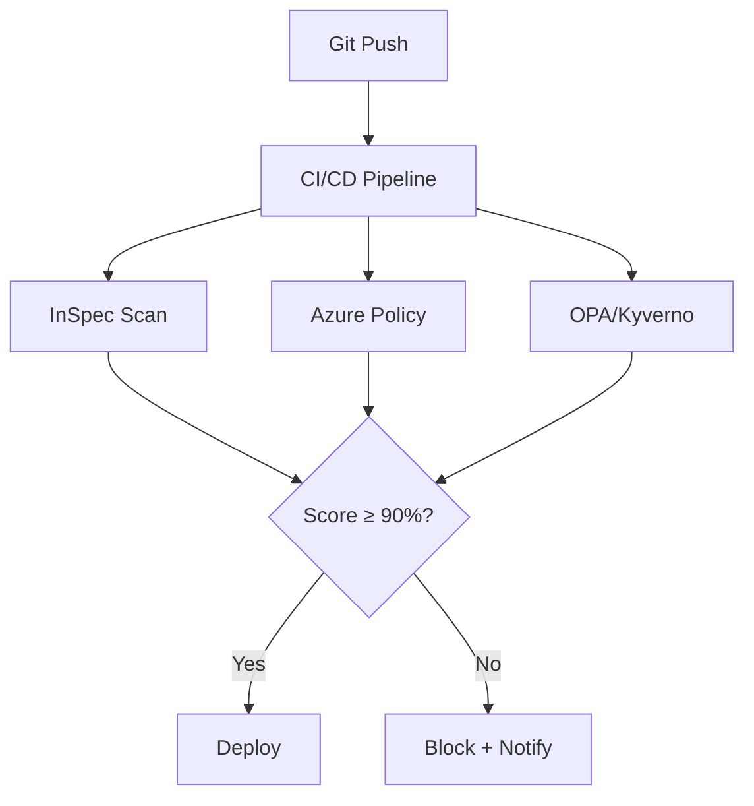

# الامتثال ككود

> "الامتثال اليدوي كذبة. الأتمتة هي الطريق الوحيد."

## 🎯 أهداف التعلم

- كتابة سياسات الامتثال ككود
- InSpec للفحص الآلي
- Azure Policy للامتثال المستمر
- تقارير الامتثال التلقائية

## ⏱️ الوقت المقدر: 30 دقيقة | المستوى: Advanced

---

## 🏗️ InSpec

```ruby
# compliance/cis_azure.rb
control 'azure-cis-1.1' do
  impact 1.0
  title 'Ensure MFA is enabled for all users'
  describe azure_generic_resource(id: '/providers/Microsoft.aad') do
    its('properties.mfaEnabled') { should eq true }
  end
end

control 'azure-cis-2.3' do
  impact 0.7
  title 'Ensure Storage Accounts use HTTPS only'
  azure_storage_accounts.names.each do |name|
    describe azure_storage_account(name: name) do
      its('properties.supportsHttpsTrafficOnly') { should be true }
    end
  end
end
```

```bash
inspec exec cis_azure.rb -t azure://
```

### Azure Policy للامتثال المستمر

```json
{
  "properties": {
    "displayName": "Audit VMs without managed disks",
    "policyRule": {
      "if": { "field": "type", "equals": "Microsoft.Compute/virtualMachines" },
      "then": { "effect": "audit" }
    }
  }
}
```

---

## 🏛️ طبقة الإنتاج: سيناريو CloudNova

مدقق PCI-DSS يطلب تقرير compliance. بدلاً من أسبوعين من العمل اليدوي، `inspec exec` أنتج التقرير في 10 دقائق.

### Compliance Pipeline

```yaml
- name: Compliance Check
  run: |
    inspec exec cis_azure.rb -t azure:// --reporter json:compliance-report.json
    # فشل البناء إذا compliance < 80%
```

---

## 🎨 أدوات Compliance as Code

| الأداة | الاستخدام |
|--------|-----------|
| **InSpec** | فحص compliance للبنية التحتية |
| **Azure Policy** | compliance مستمر في Azure |
| **OPA** | سياسات مخصصة لـ Kubernetes |
| **Trivy** | فحص compliance + ثغرات للحاويات |

---

## 🛠️ تدريبات

### تمرين: اكتب InSpec test لـ Storage Account
### تحدي: ابنِ compliance pipeline مع InSpec في CI/CD

---

## 📝 تقييم

### ✅ فحص المعرفة
1. لماذا Compliance as Code أفضل من اليدوي؟
2. ما الفرق بين InSpec و Azure Policy؟
3. كيف تدمج compliance في CI/CD؟

### 🃏 بطاقات
| السؤال | الإجابة |
|--------|---------|
| InSpec | أداة فحص compliance للبنية التحتية |
| Compliance as Code | كتابة فحوصات compliance ككود |
| CIS | Center for Internet Security — معايير أمان |

---

## 🎤 مقابلة
1. **"كيف تثبت compliance لمدقق خارجي؟"** → InSpec report + Azure Policy compliance dashboard
2. **"كيف تمنع drift عن compliance؟"** → Azure Policy + CI/CD checks

---

## 🏛️ سيناريو CloudNova: تدقيق PCI-DSS المفاجئ

**هيا** مهندسة أمان في CloudNova. صباح الاثنين، بريد من مدقق PCI-DSS الخارجي:

"سنبدأ التدقيق بعد 48 ساعة. نريد تقرير compliance كامل لـ 200 resource في Azure."

**قبل Compliance as Code:** أسبوعان من العمل اليدوي — فحص كل resource، توثيق، screenshot، Excel sheets.

**بعد Compliance as Code:** أمر واحد:

```bash
inspec exec pci-dss-profile/ -t azure:// \
  --reporter json:compliance-report.json html:compliance-report.html
# Compliance Score: 94.2% | 3 failing controls out of 52
```

**الإصلاح خلال ساعتين — أعدنا inspec: 100% ✅**

**المدقق:** "هذا أسرع تدقيق PCI-DSS رأيته في 10 سنوات."

---

## 🎨 طبقة المعماري: Compliance Framework

### Compliance Pipeline



### Anti-Patterns

| الخطأ | المشكلة | التصحيح |
|-------|---------|---------|
| Compliance سنوي فقط | 364 يوماً من عدم الامتثال | Continuous checks |
| Azure Policy فقط | لا يغطي multi-cloud | InSpec + OPA |
| Blind auto-remediation | قد يكسر production | Audit أولاً، ثم auto-fix |

---

## 🛠️ تدريبات موسعة

### تمرين: InSpec لـ CIS Azure

```ruby
control 'cis-1.1-mfa' do
  impact 1.0
  azurerm_ad_users.each do |user|
    describe user do
      its('strongAuthenticationRequirements') { should_not be_empty }
    end
  end
end
```

### تحدي: Kyverno لـ K8s

```yaml
apiVersion: kyverno.io/v1
kind: ClusterPolicy
metadata:
  name: require-labels
spec:
  validationFailureAction: Enforce
  rules:
  - name: check-labels
    match:
      any:
      - resources:
          kinds: [Pod]
    validate:
      message: "Pod must have owner label"
      pattern:
        metadata:
          labels:
            owner: "?*"
```

---

## 📝 تقييم شامل

### ✅ فحص المعرفة (5)
1. لماذا Compliance as Code أفضل من اليدوي؟
2. InSpec vs Azure Policy — متى تستخدم ماذا؟
3. كيف تدمج compliance في CI/CD؟
4. ما هو OPA/Kyverno؟
5. كيف تقيس compliance score؟

### 📝 اختبار (3)
1. **InSpec = 85% compliance. كيف ترفع لـ 95%؟**
   <details><summary>الإجابة</summary>ركز على HIGH impact controls، صنف الفشل، ضع Azure Policies لمنع drift، auto-remediation للـ technical debt.</details>

2. **مدقق SOC2 يطلب evidence. كيف تقدم؟**
   <details><summary>الإجابة</summary>InSpec reports، Azure Policy dashboard، CI/CD logs، Azure AD access reviews.</details>

3. **Azure Policy يمنع deployment شرعي. الحل؟**
   <details><summary>الإجابة</summary>Exemption مؤقت مع justification. Fix root cause: policy too broad?</details>

### 🧠 Active Recall (5)
- ارسم compliance pipeline
- اشرح Audit vs Deny effect
- كيف تبني compliance culture؟
- CIS vs PCI-DSS vs SOC2 technical controls
- صف تجربة Compliance as Code

### 🎓 Feynman: Compliance لغير التقني
"مفتش بناء (InSpec) يفحص كل مبنى يومياً. Azure Policy = قوانين بناء تمنع المخالفة من البداية."

### 🃏 بطاقات (8)
| السؤال | الإجابة |
|--------|---------|
| Compliance as Code | أتمتة فحوصات الامتثال عبر كود |
| InSpec | Chef InSpec — إطار فحص compliance |
| Azure Policy | compliance مستمر لموارد Azure |
| OPA/Kyverno | Policy engine لـ K8s |
| CIS Benchmarks | معايير أمان مجتمعية |
| PCI-DSS | معيار أمان بيانات الدفع |
| Evidence | دليل compliance (تقارير، logs) |
| Drift Detection | اكتشاف التغييرات عن حالة الامتثال |

---

## 🎤 أسئلة المقابلة الموسعة

### تقني
1. **"كيف تثبت compliance لـ 3 frameworks معاً؟"**
   - InSpec profiles منفصلة، Azure Policy initiatives، dashboard موحد

2. **"Legacy resources لا يمكن جعلها compliant. الحل؟"**
   - Risk acceptance موثق، compensating controls، خطة migration

### System Design
**"صمم Continuous Compliance لـ 1000 subscription."**
- Collection: Azure Policy + InSpec، Aggregation: Log Analytics، Dashboard: Power BI، Auto-remediation: Azure Functions

### Behavioral (STAR)
**S:** Developers يرفضون compliance checks في CI/CD. **T:** Compliance بدون قتل velocity. **A:** Audit mode 3 أشهر → gradual enforcement. **R:** Compliance score 60% → 97%.

---

## 📚 المراجع

- [Chef InSpec](https://docs.chef.io/inspec/) | [Azure Policy](https://learn.microsoft.com/azure/governance/policy/) | [CIS Benchmarks](https://www.cisecurity.org/cis-benchmarks/) | [Kyverno](https://kyverno.io/)
- الشهادات: AZ-500, CISA, CISSP
- الدروس المرتبطة: [Secrets](./03-secrets-management-vault.md) | [Container Security](./02-container-security.md) | [Security Pipeline](./01-security-pipeline.md)

---

[← Secrets Management](./03-secrets-management-vault) | [→ GitOps Fundamentals](../../18-gitops/01-gitops-fundamentals) | [🏠 الرئيسية](/)
