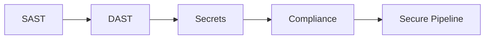

# 🚀 DevSecOps

> Shift-left security — SAST، DAST، SCA، إدارة الأسرار، الامتثال ككود.

## 🎯 أهداف التعلم

بعد إكمال هذه الوحدة، ستكون قادراً على:

- [**خط أمان CI/CD**](01-security-pipeline) — دمج الأمان في pipeline
- [**أمن الحاويات**](02-container-security) — فحص صور الحاويات
- [**إدارة الأسرار**](03-secrets-management-vault) — HashiCorp Vault
- [**الامتثال ككود**](04-compliance-as-code) — سياسات آلية

## 💡 المهارات التي ستكتسبها

SAST • DAST • SCA • HashiCorp Vault • Compliance as Code

## 📊 معلومات الوحدة

| العنصر | القيمة |
| ------ | ------ |
| **المستوى** | متقدم |
| **الوقت المقدر** | 7 ساعات |
| **المتطلبات** | DevOps |
| **الشهادات** | AZ-500 |

## 🏛️ مهمة CloudNova

> ثغرة zero-day! قُد استجابة CloudNova: اكتشف، احتوِ، وأصدر التصحيح.

## 🗺️ خريطة الوحدة

## 📖 الدروس

- [**خط أمان CI/CD**](01-security-pipeline) — دمج الأمان في pipeline
- [**أمن الحاويات**](02-container-security) — فحص صور الحاويات
- [**إدارة الأسرار**](03-secrets-management-vault) — HashiCorp Vault
- [**الامتثال ككود**](04-compliance-as-code) — سياسات آلية

## 🚀 ابدأ التعلم

[▶️ ابدأ الدرس الأول](01-security-pipeline)
