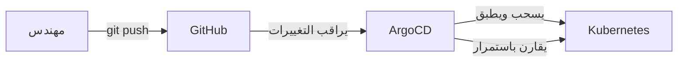

# GitOps — البنية التحتية من Git

> **"Git هو المصدر الوحيد للحقيقة. كل تغيير في البنية التحتية يمر عبر Pull Request. لا استثناءات."**

## ما هو GitOps؟

GitOps يعكس نموذج CI/CD التقليدي:

| النموذج | كيف يعمل | المشكلة |
|---|---|---|
| **Push (تقليدي)** | CI/CD يدفع التغييرات للكلستر | ماذا لو فشل النشر جزئياً؟ |
| **Pull (GitOps)** | الكلستر يسحب الحالة المرغوبة من Git | Git دائماً هو المرجع |



## ArgoCD — الأداة الأكثر شيوعاً

```yaml
# application.yaml — تعريف تطبيق في ArgoCD
apiVersion: argoproj.io/v1alpha1
kind: Application
metadata:
  name: cloudnova-api
spec:
  project: default
  source:
    repoURL: https://github.com/cloudnova/infra
    targetRevision: main
    path: k8s/overlays/prod
  destination:
    server: https://kubernetes.default.svc
    namespace: prod
  syncPolicy:
    automated:
      prune: true      # احذف الموارد المحذوفة من Git
      selfHeal: true   # أصلح أي تغيير يدوي تلقائياً
```

## مبادئ GitOps

1. **كل شيء في Git.** تطبيقات، إعدادات، بنية تحتية — كلها كود
2. **Git هو المصدر الوحيد للحقيقة.** لا تغييرات يدوية على الكلستر أبداً
3. **المراقب المستمر.** ArgoCD/Flux يقارن الكلستر بـ Git كل ٣ دقائق
4. **التصحيح الذاتي.** أي تغيير يدوي يُعكس تلقائياً

## هيكل المستودع

```
infra/
├── k8s/
│   ├── base/                  # التكوين الأساسي
│   │   ├── deployment.yaml
│   │   └── kustomization.yaml
│   └── overlays/
│       ├── dev/
│       │   └── kustomization.yaml
│       └── prod/
│           └── kustomization.yaml
├── terraform/
│   ├── modules/
│   └── environments/
└── .github/
    └── workflows/
        └── terraform-plan.yml
```

## سيناريو CloudNova: التغيير اليدوي الممنوع

> **الموقف:** مهندس عدّل `replicas: 5` يدوياً على الكلستر لمعالجة ارتفاع مفاجئ. بعد ٣ دقائق — عاد إلى `replicas: 3`. لماذا؟

**التفسير:** ArgoCD رأى فرقاً بين Git (`replicas: 3`) والكلستر (`replicas: 5`). `selfHeal: true` يعني "أصلح الفرق فوراً."

**الدرس:** كل تغيير يجب أن يمر عبر Git:
1. عدّل `replicas` في Git
2. افتح PR
3. ادمج
4. ArgoCD يطبق تلقائياً

**هذا يضمن:** كل تغيير مراجع، موثق، وقابل للعكس.

---

[← العودة للوحدة](index.md) | [🏠 الرئيسية](/)
