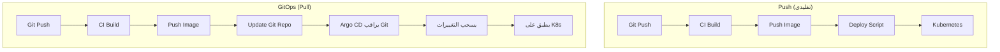
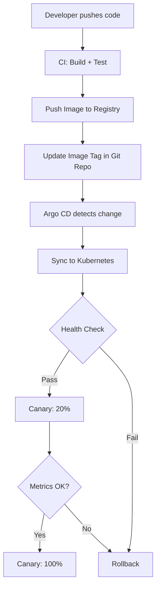

# أساسيات GitOps

> "Git هو مصدر الحقيقة الوحيد. كل شيء في Git. كل تغيير يمر عبر Git. لا أحد يلمس الكلستر يدوياً."

## 🎯 أهداف التعلم

- فهم مبادئ GitOps الأربعة وتطبيقها عملياً
- إتقان Argo CD و Flux CD للنشر المستمر
- بناء pipeline GitOps مع automated image updates
- إدارة بيئات متعددة عبر Git
- تطبيق Progressive Delivery واستراتيجيات التراجع

---

## 📖 الطبقة الأساسية: ما هو GitOps؟

### مبادئ GitOps الأربعة

| المبدأ                    | الوصف                                              |
| ------------------------- | -------------------------------------------------- |
| **مصدر وحيد للحقيقة**     | Git هو المرجع الوحيد لحالة النظام المطلوبة         |
| **التصريح (Declarative)** | كل شيء موصوف كـ YAML/JSON في Git                   |
| **عامل آلي (Agent)**      | أداة مثل Argo CD أو Flux تراقب Git وتطبق التغييرات |
| **التقارب المستمر**       | الـ agent يصحح أي انحراف بين Git والحالة الفعلية   |

### GitOps مقابل Push-based CI/CD



> **الميزة القاتلة:** في GitOps، الـ CI/CD لا يحتاج أسرار نشر في Kubernetes! الـ Agent داخل الكلستر هو من يسحب.

---

## 🧱 الطبقة المهنية: Argo CD مقابل Flux CD

| المعيار | Argo CD | Flux CD |
|---------|---------|---------|
| **واجهة مستخدم** | Web UI ممتازة | لا واجهة (CLI فقط) |
| **التثبيت** | `kubectl apply` | `flux bootstrap` |
| **النضج** | CNCF Graduated | CNCF Graduated |
| **التعقيد** | متوسط — سهل البدء | أعلى — أكثر مرونة |
| **Image Updates** | Argo CD Image Updater | Flux Image Automation (مدمج) |
| **Multi-tenancy** | Projects + AppProjects | Namespace-based |
| **متى تختاره؟** | تريد UI + سهولة | تريد GitOps Toolkit كامل |

### Flux CD — تثبيت وتطبيق

```bash
# تثبيت Flux CLI
curl -s https://fluxcd.io/install.sh | sudo bash

# Bootstrap — يربط Flux بـ GitHub
flux bootstrap github \
  --owner=cloudnova \
  --repository=infrastructure \
  --branch=main \
  --path=clusters/production \
  --personal

# بعد bootstrap: Flux يخلق كل resources تلقائياً
flux get kustomizations --watch
```

```yaml
# Flux GitRepository + Kustomization
apiVersion: source.toolkit.fluxcd.io/v1
kind: GitRepository
metadata:
  name: cloudnova-infra
  namespace: flux-system
spec:
  interval: 1m
  url: https://github.com/cloudnova/infrastructure
  ref:
    branch: main
---
apiVersion: kustomize.toolkit.fluxcd.io/v1
kind: Kustomization
metadata:
  name: cloudnova-apps
  namespace: flux-system
spec:
  interval: 5m
  path: ./kubernetes/overlays/production
  prune: true
  sourceRef:
    kind: GitRepository
    name: cloudnova-infra
  healthChecks:
    - apiVersion: apps/v1
      kind: Deployment
      name: cloudnova-api
      namespace: production
```

---

## 🏗️ الطبقة الإنتاجية: Automated Image Updates

### Argo CD Image Updater

```yaml
# Annotation على الـ Application
apiVersion: argoproj.io/v1alpha1
kind: Application
metadata:
  name: cloudnova-api
  annotations:
    argocd-image-updater.argoproj.io/image-list: |
      api=cloudnova.azurecr.io/api:~v1
    argocd-image-updater.argoproj.io/write-back-method: git
    argocd-image-updater.argoproj.io/git-branch: main
    argocd-image-updater.argoproj.io/update-strategy: newest-build
spec:
  # ...
```

> **كيف يعمل:** Image Updater يفحص الـ registry كل دقيقتين. عندما يجد `v1.4.7` جديدة، يفتح PR في Git repository لتحديث الـ tag. Argo CD يزامن تلقائياً بعد merge.

### Flux Image Automation

```yaml
apiVersion: image.toolkit.fluxcd.io/v1beta2
kind: ImageRepository
metadata:
  name: cloudnova-api
  namespace: flux-system
spec:
  image: cloudnova.azurecr.io/api
  interval: 2m
---
apiVersion: image.toolkit.fluxcd.io/v1beta2
kind: ImagePolicy
metadata:
  name: cloudnova-api
spec:
  imageRepositoryRef:
    name: cloudnova-api
  policy:
    semver:
      range: ">=1.0.0 <2.0.0"
---
apiVersion: image.toolkit.fluxcd.io/v1beta2
kind: ImageUpdateAutomation
metadata:
  name: cloudnova-api
spec:
  interval: 5m
  sourceRef:
    kind: GitRepository
    name: cloudnova-infra
  git:
    checkout:
      ref:
        branch: main
    commit:
      author:
        email: flux@cloudnova.com
        name: Flux CD
      messageTemplate: "chore: update {{ .Image.repository }} to {{ .Image.tag }}"
    push:
      branch: main
  update:
    path: ./kubernetes/overlays/production
    strategy: Setters
```

---

## 🎨 الطبقة المعمارية: تنظيم المستودع للمؤسسات

### هيكل GitOps Repository

```
infrastructure/
├── clusters/
│   ├── production/
│   │   └── flux-kustomization.yaml
│   └── staging/
│       └── flux-kustomization.yaml
├── kubernetes/
│   ├── base/
│   │   ├── api/
│   │   │   ├── deployment.yaml
│   │   │   ├── service.yaml
│   │   │   └── kustomization.yaml
│   │   └── web/
│   │       └── ...
│   └── overlays/
│       ├── development/
│       │   └── kustomization.yaml
│       ├── staging/
│       │   └── kustomization.yaml
│       └── production/
│           ├── kustomization.yaml
│           └── patches/
│               ├── replicas.yaml
│               ├── resources.yaml
│               └── ingress.yaml
├── argocd/
│   ├── apps/
│   │   ├── root.yaml
│   │   ├── cloudnova-api.yaml
│   │   └── monitoring.yaml
│   └── projects/
│       └── cloudnova-project.yaml
└── terraform/
    └── environments/
```

---

## ⚡ الإنتاج وما بعده: Progressive Delivery

### Canary مع Argo Rollouts

```yaml
apiVersion: argoproj.io/v1alpha1
kind: Rollout
metadata:
  name: cloudnova-api
spec:
  replicas: 5
  strategy:
    canary:
      steps:
        - setWeight: 20    # 20% للنسخة الجديدة
        - pause:
            duration: 5m   # انتظر 5 دقائق
        - setWeight: 50
        - pause:
            duration: 10m
        - setWeight: 100   # 100% بعد التأكد
      analysis:
        templates:
          - templateName: error-rate-check
        args:
          - name: service-name
            value: cloudnova-api
---
apiVersion: argoproj.io/v1alpha1
kind: AnalysisTemplate
metadata:
  name: error-rate-check
spec:
  metrics:
    - name: error-rate
      interval: 30s
      count: 10
      successCondition: result <= 0.01
      provider:
        prometheus:
          address: http://prometheus:9090
          query: |
            rate(http_requests_total{
              service="{{args.service-name}}",
              status=~"5.."
            }[2m])
```

---

## 🚨 سيناريو CloudNova: كارثة GitOps

> **الموقف:** مهندس عدّل Deployment يدوياً في Kubernetes (لإصلاح عاجل). بعد 3 دقائق، Argo CD أعاد الحالة لـ Git! الإصلاح ضاع.

```bash
# ١. ماذا حدث؟
argocd app history cloudnova-api
# DEPLOYED  →  OutOfSync (تعديل يدوي)
# OutOfSync → Synced (Argo CD صحح)

# ٢. الدرس: لا تعدّل يدوياً أبداً!
# الإصلاح العاجل الصحيح:
git checkout -b hotfix/emergency-fix
# عدّل الـ YAML في Git
git commit -m "fix: emergency resource increase"
git push
# Argo CD يزامن تلقائياً خلال 3 دقائق
```

---

## 📊 رسم بياني: تدفق GitOps كامل



---

## 🛡️ Secrets في GitOps

```yaml
# ١. External Secrets Operator (الأفضل)
apiVersion: external-secrets.io/v1beta1
kind: ExternalSecret
metadata:
  name: cloudnova-api-secrets
spec:
  refreshInterval: 1h
  secretStoreRef:
    name: azure-keyvault
    kind: ClusterSecretStore
  target:
    name: cloudnova-api-secrets
  data:
    - secretKey: database-url
      remoteRef:
        key: cloudnova-prod-db-url
    - secretKey: api-key
      remoteRef:
        key: cloudnova-api-key

# ٢. Sealed Secrets (للـ secrets البسيطة)
# ٣. SOPS + Azure Key Vault (للـ Git المشفر)
```

---

## 📋 أوامر Argo CD اليومية

```bash
# حالة كل التطبيقات
argocd app list

# تفاصيل تطبيق
argocd app get cloudnova-api

# تاريخ المزامنة
argocd app history cloudnova-api

# تراجع يدوي للإصدار 3
argocd app rollback cloudnova-api 3

# مزامنة فورية
argocd app sync cloudnova-api --prune

# عرض الـ diff بين Git و K8s
argocd app diff cloudnova-api

# إيقاف المزامنة التلقائية مؤقتاً
argocd app set cloudnova-api --sync-policy none
```

---

## 🧠 التذكّر النشط

1. ما الفرق بين Push-based CD و Pull-based GitOps؟
2. لماذا لا يجب التعديل اليدوي في Kubernetes مع Argo CD؟
3. كيف تحدث الصور تلقائياً في GitOps؟
4. متى تختار Argo CD ومتى تختار Flux CD؟
5. كيف تؤمّن الأسرار في GitOps دون وضعها في Git؟

## ✍️ تمرين Feynman

اشرح GitOps لمدير غير تقني: "GitOps مثل الطيار الآلي في الطائرة. الطيار يبرمج المسار (Git)، والطائرة (Argo CD) تتأكد باستمرار أنها على المسار الصحيح. إذا انحرفت — تصحح نفسها."

## 🎤 أسئلة المقابلة

1. **"كيف تختلف GitOps عن CI/CD التقليدي؟"**
   - GitOps: Agent في K8s يسحب من Git. لا أسرار نشر في CI/CD
   - التقليدي: CI/CD يدفع لـ K8s. يحتاج Kubeconfig + secrets
   - GitOps: Self-healing. أي تغيير يدوي يُصحح تلقائياً

2. **"كيف تتعامل مع Drift Detection؟"**
   - Argo CD: `selfHeal: true` يصحح تلقائياً
   - Flux: `prune: true` يحذف الموارد غير الموجودة في Git
   - إشعارات Slack/Teams عند اكتشاف drift

3. **"ماذا يحدث إذا تعطل Argo CD نفسه؟"**
   - التطبيقات تستمر في العمل (Pods لا تتأثر)
   - لا تحديثات جديدة حتى يعود Argo CD
   - Argo CD نفسه يجب أن يكون HA: replicas > 1

---

## 🏛️ طبقة الإنتاج: GitOps في المؤسسة

### Argo CD Health Checks
```yaml
healthChecks:
  - apiVersion: apps/v1
    kind: Deployment
    name: cloudnova-api
```

### متى يفشل GitOps؟
- **Drift**: شخص عدّل يدوياً في K8s → Argo CD يصحح تلقائياً
- **Secrets**: لا تخزن secrets في Git → External Secrets Operator

### 🚨 CloudNova: Drift detection saves the day
> مهندس عدّل replicas يدوياً. Argo CD أعادها بعد 3 دقائق.

---

## 🛠️ تدريبات
**تمرين ١:** ثبت Argo CD. **تمرين ٢:** Flux Image Automation. **تحدي:** Argo Rollouts canary.

### 📝 تقييم
**س١:** Push vs Pull CD؟ → Push: CI يدفع. Pull: agent يسحب من Git.
**س٢:** Drift = ؟ → فرق بين Git والحالة الفعلية.
**س٣:** Argo vs Flux؟ → Argo: UI ممتازة. Flux: GitOps Toolkit كامل.

### 🎤 مقابلة
**"كيف تختلف GitOps عن CI/CD التقليدي؟"** → Pull-based. Agent داخل K8s. Self-healing.

---

[← العودة للموديول](./01-gitops-fundamentals) | [→ Platform Engineering](../19-platform/01-platform-engineering) | [🏠 الرئيسية](/)
