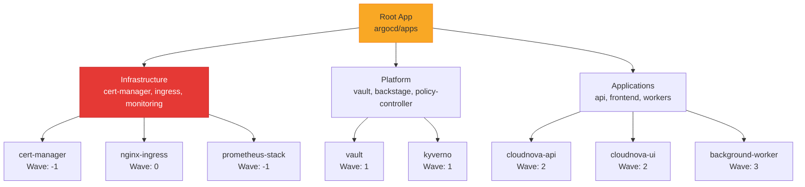

# Argo CD في الإنتاج

> "GitOps بدون Argo CD مثل سيارة بدون محرك."

## 🎯 أهداف التعلم

- تثبيت وتكوين Argo CD
- App of Apps Pattern
- Sync Policies و Auto-Healing
- إدارة البيئات المتعددة

## ⏱️ الوقت المقدر: 40 دقيقة | المستوى: Advanced

---

## 🏗️ App of Apps Pattern

```yaml
apiVersion: argoproj.io/v1alpha1
kind: Application
metadata:
  name: root-app
  namespace: argocd
spec:
  source:
    repoURL: https://github.com/cloudnova/infra
    path: argocd/apps
  destination:
    server: https://kubernetes.default.svc
  syncPolicy:
    automated:
      prune: true
      selfHeal: true
```

```yaml
# Application فردية
apiVersion: argoproj.io/v1alpha1
kind: Application
metadata:
  name: cloudnova-api
spec:
  source:
    repoURL: https://github.com/cloudnova/infra
    path: helm/api
    targetRevision: main
  destination:
    namespace: production
  syncPolicy:
    automated:
      prune: true
      selfHeal: true # إصلاح تلقائي
```

### Sync Waves

```yaml
metadata:
  annotations:
    argocd.argoproj.io/sync-wave: "1" # ينشر أولاً
---
metadata:
  annotations:
    argocd.argoproj.io/sync-wave: "2" # بعد wave 1
```

---

## 🏛️ طبقة الإنتاج: سيناريو CloudNova

حذف أحدهم Deployment بالخطأ. Argo CD اكتشف الـ drift وأعاد إنشائه تلقائياً خلال 3 دقائق (selfHeal).

```bash
argocd app diff cloudnova-api   # معاينة الاختلافات
argocd app sync cloudnova-api    # مزامنة يدوية
argocd app history cloudnova-api # سجل النشر
```

### Health Checks

```yaml
spec:
  syncPolicy:
    automated:
      selfHeal: true
    syncOptions:
      - PruneLast=true # لا تحذف الموارد القديمة حتى ينتهي النشر
      - CreateNamespace=true
```

---

## 🎨 Argo CD vs Flux

|                      | Argo CD  | Flux       |
| -------------------- | -------- | ---------- |
| **UI**               | ✅ ممتاز | ❌ CLI فقط |
| **Image Automation** | ❌       | ✅ مدمج    |
| **Multi-tenancy**    | ✅       | متوسط      |

---

## 🛠️ تدريبات

### تمرين: ثبّت Argo CD على AKS

### تحدي: أنشئ App of Apps لـ 3 تطبيقات وجرب auto-healing

---

## 📝 تقييم

### ✅ فحص المعرفة

1. ما هو App of Apps pattern؟
2. كيف يعمل selfHeal؟
3. متى تستخدم sync waves؟

### 🃏 بطاقات

| السؤال    | الإجابة                       |
| --------- | ----------------------------- |
| Argo CD   | GitOps operator لـ Kubernetes |
| selfHeal  | إصلاح تلقائي للـ drift        |
| Sync Wave | ترتيب نشر التطبيقات           |

---

## 🎤 مقابلة

1. **"كيف تنشر 30 خدمة مع Argo CD؟"** → App of Apps + sync waves
2. **"ماذا يحدث إذا حذف Deployment يدوياً؟"** → Argo CD يعيد إنشائه (selfHeal)

---

## 🏛️ سيناريو CloudNova: يوم اختفى الإنتاج

**ماجد** Platform Engineer في CloudNova. الساعة 10 صباحاً، Slack ينفجر:

"Production معطل! كل الـ pods اختفت!"

**ماذا حدث؟**

```bash
# التحقيق
kubectl get pods -n production
# No resources found in production namespace.

# مراجعة Argo CD
argocd app list | grep production
# cloudnova-api    production    OutOfSync   Missing
# cloudnova-ui     production    OutOfSync   Missing
```

كل التطبيقات في حالة `Missing`! أحدهم شغّل `kubectl delete namespace production` بالخطأ بدلاً من `kubectl delete namespace production-test`.

**Argo CD أنقذنا:**

```bash
# Argo CD اكتشف الـ drift وبدأ الـ auto-heal فوراً
argocd app get cloudnova-api
# Sync Status:   OutOfSync (namespace deleted)
# Auto-Sync:     Enabled (selfHeal: true)

# مراقبة الـ recovery
watch -n 2 'argocd app list | grep production'
# 10:02 — cloudnova-api: Syncing
# 10:03 — cloudnova-api: Synced, Healthy
# 10:05 — cloudnova-ui: Synced, Healthy
# 10:07 — All 12 apps: Synced, Healthy ✅
```

**MTTR: 7 دقائق فقط!** (بدون Argo CD: ساعات من manual recovery).

---

## 🎨 طبقة المعماري: Argo CD Production Design

### App of Apps — إدارة 100+ تطبيق



### Multi-Cluster Architecture

```yaml
# argocd/clusters/prod-eu.yaml
apiVersion: v1
kind: Secret
metadata:
  name: prod-eu-cluster
  namespace: argocd
  labels:
    argocd.argoproj.io/secret-type: cluster
    environment: production
    region: eu
type: Opaque
stringData:
  name: prod-eu
  server: https://prod-eu-aks.azure.com
  config: |
    {
      "bearerToken": "<service-account-token>",
      "tlsClientConfig": {
        "insecure": false,
        "caData": "<cluster-ca-certificate>"
      }
    }

---
# Application deployed to ALL clusters
apiVersion: argoproj.io/v1alpha1
kind: ApplicationSet
metadata:
  name: cloudnova-api-global
spec:
  generators:
    - list:
        elements:
          - cluster: prod-eu
            url: https://prod-eu-aks.azure.com
          - cluster: prod-us
            url: https://prod-us-aks.azure.com
          - cluster: prod-asia
            url: https://prod-asia-aks.azure.com
  template:
    metadata:
      name: "cloudnova-api-{{cluster}}"
    spec:
      source:
        repoURL: https://github.com/cloudnova/infra
        path: helm/api
        targetRevision: main
      destination:
        server: "{{url}}"
        namespace: production
      syncPolicy:
        automated:
          prune: true
          selfHeal: true
```

### Anti-Patterns

| الخطأ                                      | المشكلة                              | التصحيح                                                |
| ------------------------------------------ | ------------------------------------ | ------------------------------------------------------ |
| Remote cluster بدون managed identity       | Token rotation يدوي = expired tokens | Managed Identity أو workload identity                  |
| selfHeal = true على production بلا testing | Auto-fix لكارثة                      | Testing في staging أولاً                               |
| كل التطبيقات في Root App واحدة             | Blast radius كبير                    | فصل Infrastructure عن Applications                     |
| Sync waves غير محددة                       | ترتيب عشوائي = فشل deployment        | Waves: -1 (prereqs), 0 (core), 1 (platform), 2+ (apps) |

---

## 🛠️ تدريبات موسعة

### تمرين 1: Deploy Argo CD مع App of Apps

```bash
# تثبيت Argo CD
kubectl create namespace argocd
kubectl apply -n argocd -f https://raw.githubusercontent.com/argoproj/argo-cd/stable/manifests/install.yaml

# Root App
cat <<EOF | kubectl apply -f -
apiVersion: argoproj.io/v1alpha1
kind: Application
metadata:
  name: root
  namespace: argocd
spec:
  project: default
  source:
    repoURL: https://github.com/cloudnova/infra
    targetRevision: main
    path: argocd/apps
  destination:
    server: https://kubernetes.default.svc
    namespace: argocd
  syncPolicy:
    automated:
      prune: true
      selfHeal: true
EOF
```

### تمرين 2: Argo CD Notifications

```yaml
# إشعارات Slack عند sync failure
apiVersion: v1
kind: ConfigMap
metadata:
  name: argocd-notifications-cm
data:
  service.slack: |
    token: $slack-token
  template.app-sync-failed: |
    message: |
      ❌ Application {{.app.metadata.name}} sync FAILED
      Repo: {{.app.spec.source.repoURL}}
      Status: {{.app.status.sync.status}}
  trigger.on-sync-failed: |
    - when: app.status.sync.status == 'Unknown'
      send: [app-sync-failed]
```

### تحدي: Disaster Recovery Test

```bash
#!/bin/bash
# DR Test: احذف namespace production ولاحظ Argo CD يعيد كل شيء
echo "⚠️ حذف production namespace..."
kubectl delete namespace production --wait=false

echo "⏳ انتظار Argo CD auto-heal..."
sleep 60

echo "📊 حالة التطبيقات:"
argocd app list | grep production

echo "✅ Recovery time: $(date)"
```

---

## 📝 تقييم شامل

### ✅ فحص المعرفة (5)

1. ما هو App of Apps pattern ولماذا هو مفيد؟
2. كيف يعمل selfHeal في Argo CD؟
3. متى تستخدم sync waves؟
4. كيف تدير Argo CD عبر clusters متعددة؟
5. ما الفرق بين prune و selfHeal؟

### 📝 اختبار (3)

1. **Argo CD يظهر OutOfSync لكن الـ app يعمل في الكلاستر. لماذا؟**
   

<details><summary>الإجابة</summary>Manual changes في الكلاستر بدون Git. Argo CD يكتشف الـ drift. إذا selfHeal=true، سيعيد الـ Git state. إذا false، سيبقى OutOfSync.</details>


2. **كيف تمنع Argo CD من sync في ساعات الذروة؟**
   

<details><summary>الإجابة</summary>Sync windows: `syncWindows: - kind: deny, schedule: '0 9-17 * * 1-5', duration: 8h, applications: ['*']`</details>


3. **Argo CD يستهلك 8GB memory. كيف تشخص؟**
   

<details><summary>الإجابة</summary>عدد كبير من applications + clusters. Reduce sync interval. Use sharding: `--application-namespaces`. Check memory leak.</details>


### 🧠 Active Recall (5)

- ارسم App of Apps hierarchy
- اشرح flow الـ reconciliation في Argo CD
- كيف تحمي production من sync خاطئ؟
- ما الفرق بين Blue-Green و Canary في Argo Rollouts؟
- صف incident استخدمت فيه Argo CD للـ recovery

### 🎓 Feynman: Argo CD لغير التقني

"تخيل أن لديك مهندساً آلياً (Argo CD) يراقب المخططات (Git repo). إذا أحدهم غير شيئاً في المبنى (cluster) بدون تحديث المخططات، المهندس الآلي يعيده كما في المخطط فوراً. هذا هو selfHeal."

---

## 🎤 أسئلة المقابلة الموسعة

### تقني

1. **"Argo CD vs Flux CD — كيف تختار؟"**
   - Argo CD: UI قوي، SSO، multi-tenancy ممتاز
   - Flux: Image automation، Git push، Helm native
   - الحل الأمثل: Argo CD للـ UI + Flux للـ image automation

2. **"كيف تتعامل مع secret في Argo CD إذا Git ليس آمناً للأسرار؟"**
   - Sealed Secrets: تشفير secrets في Git
   - External Secrets Operator: مزامنة من Key Vault
   - Argo CD Vault Plugin: استدعاء secrets عند sync

### System Design

**"صمم GitOps لـ 50 فريقاً و 500 تطبيق."**

- Mono-repo: `teams/<team>/apps/<app>/`
- App of Apps: Root → Team Apps → Individual Apps
- Argo CD Projects: عزل كل فريق (allowed sources, destinations)
- Multi-cluster: ApplicationSets للتوزيع الجغرافي
- Sync Windows: منع sync في أوقات الذروة
- Monitoring: Argo CD Notifications + Grafana dashboard

### Behavioral (STAR)

**"كيف أقنعت فريقاً بتبني GitOps مع Argo CD؟"**

**S:** فريق يستخدم `kubectl apply` + Helm CLI. 3 incidents بسبب manual changes.
**T:** إقناعهم أن GitOps = أمان + traceability.
**A:** Demo: حذفت deployment يدوياً، Argo CD أعاده في 3 دقائق. عرضت audit log: كل تغيير مرتبط بـ Git commit.
**R:** تبني كامل في 3 أشهر. Incidents بسبب manual changes = 0.

---

## 📚 المراجع

- [Argo CD Documentation](https://argo-cd.readthedocs.io/)
- [App of Apps Pattern](https://argo-cd.readthedocs.io/en/stable/operator-manual/cluster-bootstrapping/)
- [Argo Rollouts](https://argoproj.github.io/argo-rollouts/)
- [ApplicationSets](https://argo-cd.readthedocs.io/en/stable/user-guide/application-set/)
- الشهادات: CKA, CKAD, CKS
- الدروس المرتبطة: [GitOps Fundamentals](./01-gitops-fundamentals.md) | [Flux CD](./03-flux-cd-production.md) | [Helm](../../11-helm/01-helm-fundamentals.md)

---

[← GitOps Fundamentals](01-gitops-fundamentals) | [→ Flux CD](03-flux-cd-production) | [🏠 الرئيسية](/)
