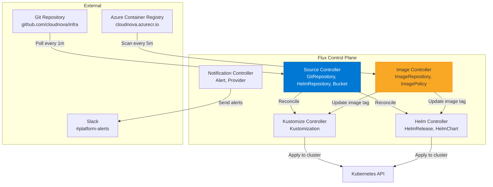

# Flux CD في الإنتاج

> "Flux هو GitOps الأصلي لـ Kubernetes. بسيط، قوي، ومباشر."

## 🎯 أهداف التعلم

- تثبيت Flux CD
- Helm Controller
- Image Automation (تحديث تلقائي للصور)
- Flux vs Argo CD

## ⏱️ الوقت المقدر: 35 دقيقة | المستوى: Advanced

---

## 🏗️ تثبيت Flux

```bash
flux bootstrap github \
  --owner=cloudnova \
  --repository=infra \
  --branch=main \
  --path=./clusters/production
```

### HelmRelease

```yaml
apiVersion: helm.toolkit.fluxcd.io/v2beta1
kind: HelmRelease
metadata:
  name: cloudnova-api
spec:
  interval: 5m
  chart:
    spec:
      chart: ./helm/api
      sourceRef:
        kind: GitRepository
        name: infra
  values:
    replicas: 3
```

### Image Automation

```yaml
apiVersion: image.toolkit.fluxcd.io/v1beta2
kind: ImagePolicy
metadata:
  name: api-policy
spec:
  imageRepositoryRef:
    name: api
  policy:
    semver:
      range: 1.5.x
```

Flux يحدث الصورة تلقائياً عند ظهور نسخة جديدة — ويدفع commit إلى Git!

---

## 🏛️ طبقة الإنتاج: سيناريو CloudNova

دفع أحدهم Docker image جديدة إلى ACR. Flux اكتشفها، حدث الـ deployment تلقائياً، ودفع commit لتحديث الـ manifest في Git.

**الدرس**: Git هو المصدر الوحيد للحقيقة.

### Flux vs Argo CD

|                      | Argo CD  | Flux       |
| -------------------- | -------- | ---------- |
| **UI**               | ✅ ممتاز | ❌ CLI فقط |
| **Image Automation** | ❌       | ✅ مدمج    |
| **Push to Git**      | ❌       | ✅         |

**التوصية**: Argo CD للـ UI + Flux لـ image automation.

---

## 🛠️ تدريبات

### تمرين: ثبّت Flux على cluster

### تحدي: فعّل image automation لتحديث الصور تلقائياً

---

## 📝 تقييم

### ✅ فحص المعرفة

1. كيف يختلف Flux عن Argo CD؟
2. ما فائدة Image Automation؟
3. لماذا Git هو "المصدر الوحيد للحقيقة"؟

### 🃏 بطاقات

| السؤال      | الإجابة                             |
| ----------- | ----------------------------------- |
| Flux        | GitOps operator مع image automation |
| HelmRelease | إدارة Helm عبر Flux                 |
| ImagePolicy | سياسة تحديث الصور تلقائياً          |

---

## 🎤 مقابلة

1. **"Argo CD أم Flux؟"** → كلاهما! Argo CD للـ UI، Flux للـ automation
2. **"كيف تحدث images تلقائياً؟"** → Flux ImagePolicy + ImageRepository

---

## 🏛️ سيناريو CloudNova الموسع: كارثة الـ Image Tag

**عمر** Platform Engineer في CloudNova. الساعة 2 ظهراً، Slack ينفجر:

"لماذا موقع الإنتاج يعرض XSS warnings؟!"
"API يرجع 500 errors!"
"الـ frontend أبيض بالكامل!"

**ماذا حدث؟**

```bash
# تتبع Flux commits
flux get sources git
# NAME    READY   REVISION
# infra   True    main@sha256:abc123...def456

flux get helmreleases
# NAME            READY   STATUS
# cloudnova-api   False   Helm upgrade failed
# cloudnova-ui    True    latest

# تفاصيل الـ HelmRelease الفاشل
kubectl describe helmrelease cloudnova-api
# Error: image 'cloudnova/api:latest' not allowed by policy
```

**السبب:** أحد المطورين دفع image بـ `:latest` tag إلى ACR. Flux ImagePolicy رفضها (السياسة تسمح فقط بـ semver). لكن CI/CD pipeline لم يتحقق من الـ image tag قبل push!

**الإصلاح في 3 خطوات:**

```yaml
# 1. Flux ImagePolicy — يمنع :latest
apiVersion: image.toolkit.fluxcd.io/v1beta2
kind: ImagePolicy
metadata:
  name: api-policy
spec:
  imageRepositoryRef:
    name: api
  policy:
    semver:
      range: ">=1.0.0 <2.0.0"  # فقط semantic versions

# 2. Gatekeeper — يمنع deployment بـ :latest
apiVersion: constraints.gatekeeper.sh/v1beta1
kind: K8sDenyLatestTag
metadata:
  name: deny-latest-tag
spec:
  match:
    kinds:
      - apiGroups: ["apps"]
        kinds: ["Deployment"]

# 3. CI/CD validation — يتحقق قبل push إلى ACR
- name: Validate Image Tag
  run: |
    if [[ "$IMAGE_TAG" == "latest" ]]; then
      echo "❌ :latest tag not allowed!"
      exit 1
    fi
```

**الدرس:** Git هو المصدر الوحيد للحقيقة — لكن Flux + Gatekeeper + CI/CD معاً هم حراس هذه الحقيقة.

---

## 🎨 طبقة المعماري: Flux Architecture Deep Dive

### Flux Component Architecture



### Flux vs Argo CD: مصفوفة قرار تفصيلية

| المعيار              | Flux CD                   | Argo CD                          | الفائز  |
| -------------------- | ------------------------- | -------------------------------- | ------- |
| **التركيب**          | CLI + Git (bootstrapped)  | Helm + YAML                      | تعادل   |
| **الـ UI**           | ❌ (Weave GitOps إضافي)   | ⭐⭐⭐⭐⭐                       | Argo CD |
| **Image Automation** | ⭐⭐⭐⭐⭐ (مدمج)         | ❌ (يحتاج Argo CD Image Updater) | Flux    |
| **Push to Git**      | ✅ تلقائي (image updates) | ❌                               | Flux    |
| **Multi-tenancy**    | ⭐⭐⭐⭐                  | ⭐⭐⭐⭐⭐                       | Argo CD |
| **Helm Support**     | ⭐⭐⭐⭐⭐ (natively)     | ⭐⭐⭐⭐                         | Flux    |
| **Resource Health**  | ⭐⭐⭐⭐                  | ⭐⭐⭐⭐⭐                       | Argo CD |
| **SSO/OIDC**         | ❌ (يحتاج Weave GitOps)   | ⭐⭐⭐⭐⭐                       | Argo CD |

**التوصية النهائية:**

- **Flux** إذا كنت تريد image automation + Git push + Helm natively
- **Argo CD** إذا كنت تريد UI ممتاز + SSO + Multi-tenancy
- **Flux + Argo CD معاً** هو الحل الأمثل في المؤسسات الكبيرة

### Flux Multi-Cluster Architecture

```yaml
# cluster/dev/flux-system/gotk-sync.yaml
apiVersion: kustomize.toolkit.fluxcd.io/v1
kind: Kustomization
metadata:
  name: apps-dev
  namespace: flux-system
spec:
  interval: 5m
  path: ./apps/dev
  prune: true
  sourceRef:
    kind: GitRepository
    name: flux-system
  postBuild:
    substitute:
      cluster_env: dev
      region: westeurope
---
# cluster/prod/flux-system/gotk-sync.yaml
apiVersion: kustomize.toolkit.fluxcd.io/v1
kind: Kustomization
metadata:
  name: apps-prod
  namespace: flux-system
spec:
  interval: 3m
  path: ./apps/prod
  prune: true
  sourceRef:
    kind: GitRepository
    name: flux-system
  postBuild:
    substitute:
      cluster_env: prod
      region: westeurope
```

---

## 🛠️ تدريبات موسعة

### تمرين 1: Bootstrap Flux على Cluster إنتاجي

```bash
# 1. تصدير GitHub token
export GITHUB_TOKEN=ghp_xxx

# 2. Bootstrap Flux
flux bootstrap github \
  --owner=cloudnova \
  --repository=infra \
  --branch=main \
  --path=./clusters/production \
  --personal \
  --components-extra=image-reflector-controller,image-automation-controller

# 3. تأكد من أن Flux يعمل
flux check
# ✅ all checks passed
kubectl get pods -n flux-system
# NAME                                      READY   STATUS
# source-controller-xxx                     1/1     Running
# kustomize-controller-xxx                  1/1     Running
# helm-controller-xxx                       1/1     Running
# image-reflector-controller-xxx            1/1     Running
# image-automation-controller-xxx           1/1     Running
```

### تمرين 2: HelmRelease مع قيم مخصصة

```yaml
apiVersion: helm.toolkit.fluxcd.io/v2
kind: HelmRelease
metadata:
  name: cloudnova-api
  namespace: apps
spec:
  releaseName: cloudnova-api
  chart:
    spec:
      chart: ./helm/api
      sourceRef:
        kind: GitRepository
        name: infra
        namespace: flux-system
  interval: 5m
  timeout: 10m
  values:
    replicaCount: 3
    image:
      repository: cloudnova.azurecr.io/api
    resources:
      requests:
        cpu: 500m
        memory: 512Mi
      limits:
        cpu: 2000m
        memory: 2Gi
    ingress:
      enabled: true
      className: nginx
      hosts:
        - api.cloudnova.com
  valuesFrom:
    - kind: ConfigMap
      name: api-config
      valuesKey: environment.yaml
  # Rollback تلقائي عند الفشل
  rollback:
    cleanupOnFail: true
    recreate: true
    timeout: 5m
```

### تحدي: Flux + SOPS للأسرار المشفرة

```bash
# 1. تثبيت SOPS + Azure Key Vault
az keyvault key create \
  --vault-name cloudnova-kv \
  --name flux-sops-key \
  --protection software

# 2. تشفير secret
sops --encrypt \
  --azure-kv https://cloudnova-kv.vault.azure.net/keys/flux-sops-key \
  secret.yaml > secret.enc.yaml

# 3. Flux Kustomization مع SOPS
apiVersion: kustomize.toolkit.fluxcd.io/v1
kind: Kustomization
metadata:
  name: secrets
spec:
  decryption:
    provider: sops
    secretRef:
      name: sops-key
```

---

## 📝 تقييم شامل

### ✅ فحص المعرفة (5)

1. كيف يختلف Flux عن Argo CD في الـ reconciliation loop؟
2. ما فائدة Image Automation في Flux؟
3. كيف تحمي من نشر `:latest` tags عبر Flux؟
4. ما الفرق بين GitRepository و HelmRepository في Flux؟
5. كيف تفعّل SOPS decryption في Flux؟

### 📝 اختبار (3)

1. **HelmRelease فشل. كيف تشخص المشكلة مع Flux؟**
   

<details><summary>الإجابة</summary>`flux get helmreleases`, `kubectl describe helmrelease <name>`, `flux events --for HelmRelease/<name>`, فحص logs: `kubectl logs -n flux-system helm-controller-xxx`</details>


2. **Flux اكتشف image جديدة لكنه لم يحدث الـ deployment. لماذا؟**
   

<details><summary>الإجابة</summary>ImagePolicy semver range لا يتطابق. أو ImageRepository لم يكتشف الـ image بعد (interval). أو HelmRelease معلق بـ `dependsOn`.</details>


3. **كيف تنقل من Argo CD إلى Flux؟**
   

<details><summary>الإجابة</summary>1. Bootstrap Flux على نفس cluster. 2. نقل HelmReleases/Kustomizations تدريجياً. 3. استخدام `dependsOn` للحفاظ على الترتيب. 4. تعطيل Argo CD بعد التحقق.</details>


### 🧠 Active Recall (5)

- ارسم Flux architecture مع كل controllers
- اشرح reconciliation loop في Flux
- كيف يختلف GitOps عن CI/CD التقليدي؟
- متى تستخدم HelmRelease vs Kustomization؟
- صف سيناريو فشل فيه Flux وأصلحته

### 🎓 Feynman: Flux لغير التقني

"تخيل أن لديك روبوت (Flux) يراقب دفتر تعليمات (Git repo). عندما تغير التعليمات في الدفتر، الروبوت يطبقها فوراً على المصنع (cluster). إذا أحدهم عبث بالمصنع مباشرة، الروبوت يعيده للحالة الصحيحة تلقائياً."

### 🃏 بطاقات (8)

| السؤال            | الإجابة                                      |
| ----------------- | -------------------------------------------- |
| Flux              | GitOps operator — يطبق Git state على cluster |
| Source Controller | يجلب الـ manifests من Git/Helm repos         |
| Kustomization     | يطبق kustomize على cluster                   |
| HelmRelease       | يثبت/يدير Helm charts                        |
| ImagePolicy       | يحدد أي image tags مسموحة                    |
| Reconciliation    | عملية مطابقة cluster state مع Git state      |
| SOPS              | Secrets OPerationS — تشفير الأسرار في Git    |
| Drift Detection   | اكتشاف الفروقات بين Git و cluster            |

---

## 🎤 أسئلة المقابلة الموسعة

### تقني

1. **"فريقك يريد Flux + Argo CD معاً. كيف تصمم هذا؟"**
   - Flux: Image Automation (تحديث الصور + push to Git)
   - Argo CD: UI + SSO + multi-tenancy
   - التكامل: Flux يحدث Git ← Argo CD يكتشف التغيير ← يطبقه
   - حدود: لا تجعل Flux و Argo CD يديران نفس الموارد

2. **"Flux reconciliation loop عالق. ماذا تفعل؟"**
   - `flux suspend kustomization <name>` لإيقاف الـ loop
   - فحص `kubectl describe kustomization <name>`
   - فحص logs: `kubectl logs -n flux-system kustomize-controller`
   - التحقق من الـ Git repo accessibility
   - زيادة timeout في الـ Kustomization

### System Design

**"صمم GitOps pipeline لـ 50 cluster عبر 5 regions."**

- Monorepo: `clusters/<region>/<env>/`
- Flux Bootstrap لكل cluster
- Kustomization overlays للقيم الخاصة بكل region
- Image Automation مركزي (cluster واحد فقط يدفع إلى Git)
- Notification Controller يرسل alerts إلى Slack/PagerDuty
- SOPS + Azure Key Vault للأسرار

### Behavioral (STAR)

**"كيف أقنعت فريقاً بالانتقال إلى GitOps؟"**

**S:** فريق يستخدم `kubectl apply` و Helm CLI يدوياً. 3 incidents بسبب أخطاء بشرية.
**T:** إقناعهم بأن GitOps (Flux) هو الحل.
**A:** Demo حي: (1) حدث deployment عبر Git commit. (2) Flux طبقه تلقائياً. (3) حذفت deployment يدوياً. (4) Flux أعاده تلقائياً خلال 3 دقائق.
**R:** الفريق رأى القيمة. بدأنا بـ dev cluster. بعد شهر، كل الـ 4 clusters تحت Flux.

---

## 📚 المراجع

- [Flux Documentation](https://fluxcd.io/docs/)
- [Flux Image Automation Guide](https://fluxcd.io/flux/guides/image-update/)
- [GitOps Principles (OpenGitOps)](https://opengitops.dev/)
- [Argo CD vs Flux Comparison](https://www.youtube.com/watch?v=Z7OShRzBQVc)
- الشهادات: CKA, CKAD, CKS (CNCF)
- الدروس المرتبطة: [Argo CD](./02-argo-cd-production.md) | [GitOps Fundamentals](./01-gitops-fundamentals.md) | [Helm Fundamentals](../../11-helm/01-helm-fundamentals.md)

---

[← Argo CD](./02-argo-cd-production) | [→ Platform Engineering](../../19-platform/01-platform-engineering) | [🏠 الرئيسية](/)
