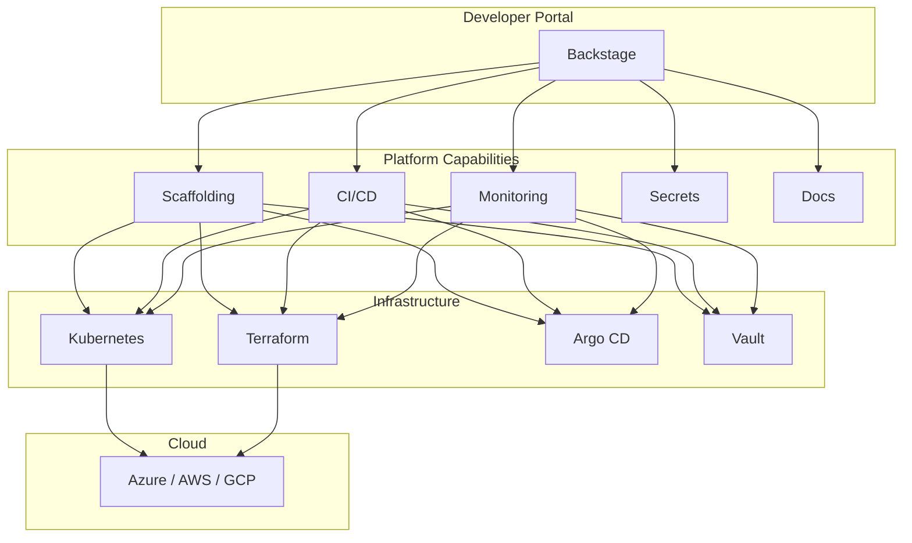

# هندسة المنصات (Platform Engineering)

> "لا تعطِ المطورين أدوات مبعثرة. ابنِ لهم منصة واحدة تحتوي كل ما يحتاجونه — واجعل الطريق السهل هو الطريق الصحيح."

## 🎯 أهداف التعلم

- فهم نموذج Internal Developer Platform (IDP)
- بناء Golden Paths مع Backstage
- تطبيق Team Topologies
- قياس نجاح المنصة (DORA + Developer NPS)
- تطبيق Platform as a Product mindset

---

## 📖 الطبقة الأساسية: تطور DevOps إلى Platform Engineering

```
DevOps التقليدي:
"كل فريق يدير كل شيء"
→ 10 فرق = 10 طرق مختلفة للنشر
→ كل فريق يخترع عجلته الخاصة
→ Cognitive load مرتفع جداً

Platform Engineering:
"المنصة توفر كل شيء جاهز كخدمة"
→ المنصة توفر Golden Paths
→ الفرق تختار المسار المناسب
→ طريق واحد موحد للنشر
→ Cognitive load منخفض — المطور يركز على الـ business logic
```

### مكونات المنصة الداخلية



---

## 🧱 الطبقة المهنية: Backstage — مدخل المطور

### Software Template — إنشاء خدمة بنقرة

```yaml
apiVersion: scaffolder.backstage.io/v1beta3
kind: Template
metadata:
  name: python-microservice
  title: Python Microservice
  description: قالب لإنشاء خدمة Python مع Docker + K8s + CI/CD + Monitoring
spec:
  owner: platform-team
  type: service
  parameters:
    - title: معلومات الخدمة
      required: [name, owner]
      properties:
        name:
          title: اسم الخدمة
          type: string
          pattern: "^[a-z][a-z0-9-]*$"
        description:
          title: وصف الخدمة
          type: string
        port:
          title: المنفذ
          type: number
          default: 8080

  steps:
    - id: fetch-base
      action: fetch:template
      input:
        url: https://github.com/cloudnova/templates/python-service
    - id: publish
      action: publish:github
      input:
        repoUrl: github.com?owner=cloudnova&repo=${{ parameters.name }}
    - id: register
      action: catalog:register
      input:
        repoContentsUrl: ${{ steps.publish.output.repoContentsUrl }}
```

### النتيجة: المطور يحصل في 5 دقائق

```
✅ Repository جاهز مع Dockerfile + K8s manifests
✅ CI/CD pipeline (GitHub Actions)
✅ Monitoring dashboards (Grafana)
✅ Secrets management (External Secrets Operator)
✅ Documentation scaffold (MkDocs)
✅ Scorecard لقياس جودة الخدمة
```

---

## 🏗️ الطبقة الإنتاجية: Team Topologies

| النوع                     | الوصف                | مثال في CloudNova         |
| ------------------------- | -------------------- | ------------------------- |
| **Stream-aligned**        | فريق منتج متكامل     | فريق API، فريق Web        |
| **Platform**              | يبني المنصة الداخلية | فريق Platform Engineering |
| **Enabling**              | يساعد الفرق الأخرى   | فريق SRE، فريق Security   |
| **Complicated Subsystem** | يبني أنظمة معقدة     | فريق AI/ML                |

```
Stream-aligned: "نريد نشر خدمة جديدة"
Platform: "هذا الـ Golden Path — اضغط Create"
Enabling: "سنساعدكم في تحسين الـ performance"

القاعدة: Platform تُخدِم Stream-aligned، لا العكس!
```

---

## 🎨 الطبقة المعمارية: Platform Maturity Model

```
Level 1: Basic Automation
├── Terraform modules مشتركة
├── CI/CD templates
└── الفرق تنسخ وتلصق

Level 2: Service Catalog
├── Backstage catalog لجميع الخدمات
├── من يملك ماذا؟ (ownership واضح)
└── توثيق مركزي

Level 3: Golden Paths
├── Software Templates
├── خدمة ذاتية كاملة
└── الفرق لا تحتاج لفتح tickets

Level 4: Self-Service Platform
├── كل شيء عبر Developer Portal
├── Scorecards تقيس جودة الخدمات
├── Platform as a Product mindset
└── Developer NPS > 60

Level 5: Federated Platform
├── منصات متعددة تتعاون
├── Cross-organization sharing
└── Marketplace داخلي
```

---

## ⚡ الإنتاج وما بعده: قياس نجاح المنصة

### DORA Metrics

| المقياس               | Elite           | كيف نقيسه             |
| --------------------- | --------------- | --------------------- |
| Deployment Frequency  | عدة مرات يومياً | Argo CD sync count    |
| Lead Time for Changes | < 1 ساعة        | Commit → Production   |
| Change Failure Rate   | 0-15%           | Deployments مرتجعة    |
| Time to Restore       | < 1 ساعة        | Incident → Resolution |

### مقاييس إضافية

```
Time to Hello World:
من فكرة → أول deployment
الهدف: < 4 ساعات

Developer NPS:
"هل توصي زميلك باستخدام منصتنا؟"
الهدف: > 60

Time to 10th PR:
من onboarding → 10th merged PR
الهدف: < أسبوعين

Platform Adoption:
% من الفرق تستخدم المنصة
الهدف: > 80%
```

---

## 🚨 سيناريو CloudNova: بناء IDP

> **المشروع:** CloudNova نمت من 3 خدمات إلى 47 خدمة. الفرق تعاني.

```
المشاكل:
├── كل فريق ينشر بطريقة مختلفة
├── لا أحد يعرف من يملك أي خدمة
├── 3 أسابيع لإنشاء خدمة جديدة من الصفر
└── Developer NPS = 12 (سيء جداً!)

الحل — بناء IDP على 3 مراحل:

المرحلة 1: Service Catalog (شهر 1)
├── حصر جميع الخدمات
├── تعريف المالكين
└── Backstage catalog-info.yaml لكل خدمة

المرحلة 2: Golden Paths (شهر 2-3)
├── قالب Python service
├── قالب Go service
├── قالب static website
└── CI/CD + Monitoring تلقائي لكل قالب

المرحلة 3: Developer Portal (شهر 4-6)
├── TechDocs (توثيق تلقائي)
├── Scorecards (جودة الخدمات)
├── Plugins (K8s, Argo CD, PagerDuty)
└── Developer Surveys شهرية

النتيجة بعد 6 أشهر:
✅ إنشاء خدمة جديدة: من 3 أسابيع → 4 ساعات
✅ وقت النشر: من ساعتين → 10 دقائق
✅ Developer NPS: من 12 → 67
✅ Platform adoption: 85%
```

---

## 🛡️ Platform as a Product

```
عامل المنصة كمنتج — وليس كمشروع مؤقت:

1. المستخدمون = المطورون في شركتك
2. المنتج = المنصة الداخلية
3. الـ PM = Platform Product Manager (دور حقيقي!)
4. الـ Roadmap = أولويات مبنية على feedback
5. القياس = DORA + NPS + Adoption

مبادئ أساسية:
├── لا تفرض، بل أقنع (opt-in أفضل من mandatory)
├── لا تبني ما لا يحتاجه أحد (اسأل أولاً!)
├── اجعل الطريق السهل هو الطريق الصحيح
└── المنصة ليست مشروعاً — بل منتج مستمر
```

---

## 🧠 التذكّر النشط

1. ما الفرق بين DevOps و Platform Engineering؟
2. كيف تصمم Golden Path لا يحتاج المطور لقراءة توثيق؟
3. ما هي Team Topologies الأربعة؟ وأيها ينطبق على فريق Platform؟
4. كيف تقيس نجاح منصتك الداخلية (4 metrics)؟
5. لماذا "Platform as a Product" وليس "Platform as a Project"؟

## ✍️ تمرين Feynman

اشرح Platform Engineering لمدير: "تخيل مطاراً. كل شركة طيران كانت تبني مدرجها الخاص (DevOps القديم). المنصة هي برج المراقبة والمدرج الموحد — كل الشركات تستخدمه، وهو آمن، سريع، وموحد."

## 🎤 أسئلة المقابلة

1. **"متى تحتاج المؤسسة لـ Platform Engineering؟"**
   - عدد الفرق > 5
   - طرق النشر مختلفة بين الفرق
   - Cognitive load مرتفع جداً
   - تريد توحيد المعايير دون فرضها

2. **"كيف تقنع الإدارة بالاستثمار في منصة داخلية؟"**
   - احسب الوقت الضائع في المهام المتكررة × عدد المطورين × rate
   - قارن: تكلفة بناء المنصة vs توفير الوقت السنوي
   - ابدأ صغيراً (MVP) وأظهر results في 3 أشهر
   - اعرض DORA metrics قبل وبعد

3. **"ما الفرق بين Backstage و Port؟"**
   - Backstage: مفتوح المصدر، مجتمع ضخم، إعداد معقد، تحكم كامل
   - Port: SaaS، سهل البدء، أقل مرونة، رسوم شهرية
   - القاعدة: فريق Platform < 3 أشخاص → Port. فريق > 5 → Backstage

---

## 🏛️ طبقة الإنتاج: قياس نجاح المنصة

### Developer NPS

> "هل توصي زميلك باستخدام منصتنا؟" الهدف > 60.

### Time to 10th PR

> من onboarding → 10th merged PR. الهدف < أسبوعين.

### 🚨 CloudNova: من 12 إلى 67 NPS

> بعد 6 أشهر: إنشاء خدمة: 3 أسابيع → 4 ساعات. وقت النشر: ساعتين → 10 دقائق.

---

## 🛠️ تدريبات

**تمرين ١:** Software Template. **تمرين ٢:** Backstage catalog. **تحدي:** Scorecards.

### 📝 تقييم

**س١:** DevOps vs Platform Engineering؟ → PE: منصة داخلية موحدة.
**س٢:** Team Topologies الأربعة؟ → Stream-aligned, Platform, Enabling, Complicated Subsystem.
**س٣:** Golden Paths = ؟ → المسار الموصى به للنشر.

### 🎤 مقابلة

**"متى تحتاج Platform Engineering؟"** → > 5 فرق + طرق نشر متعددة.

---

[← العودة للموديول](./01-platform-engineering) | [→ Monitoring](../20-monitoring/01-monitoring-fundamentals) | [🏠 الرئيسية](/)
