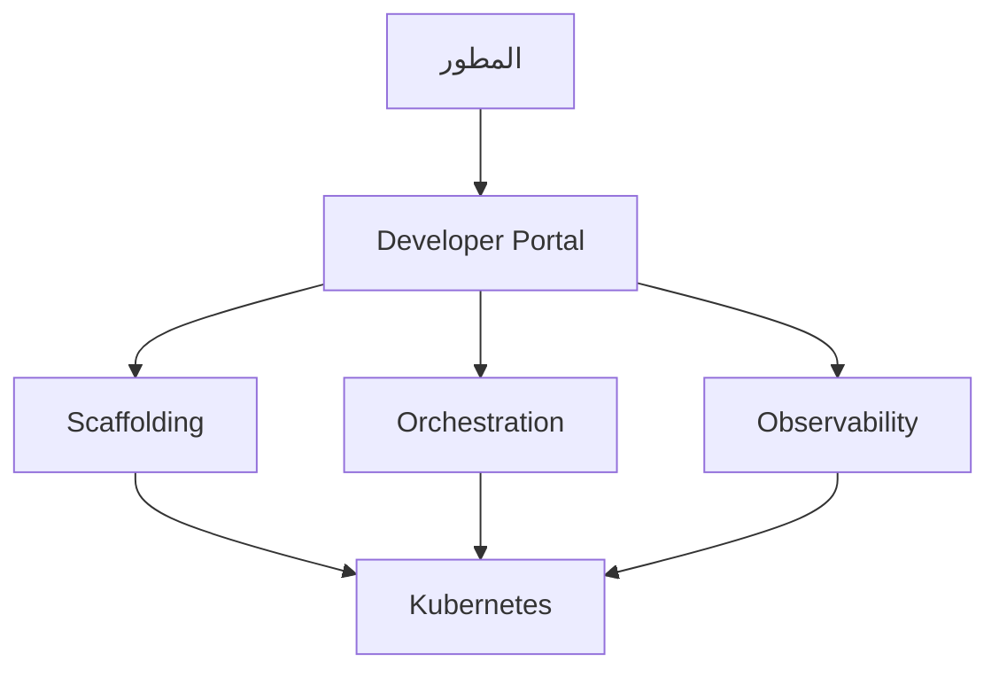

# منصة المطور الداخلية

> "لا تجعل كل مطور خبيراً في Kubernetes. ابنِ له منصة."

## 🎯 أهداف التعلم

- فهم مفهوم IDP
- مكونات الـ IDP
- قياس نجاح الـ IDP
- CloudNova IDP Journey

## ⏱️ الوقت المقدر: 35 دقيقة | المستوى: Advanced

---

## 🏗️ مكونات IDP

### مقاييس IDP

| المقياس | قبل IDP | بعد IDP |
|---------|---------|---------|
| **Time to 10th PR** | 5 أيام | 30 دقيقة |
| **Deployments/يوم** | 2 | 50 |
| **Developer NPS** | 12 | 65 |
| **MTTR** | 4 ساعات | 15 دقيقة |

### CloudNova IDP Journey

قبل IDP: كل مطور يحتاج معرفة Terraform + Kubernetes + Helm + Prometheus. التوظيف صعب، والـ onboarding شهر كامل.

بعد IDP: المطور يختار `Node.js API` template من الـ portal. يحصل على:
- Repository على GitHub
- CI/CD Pipeline
- Kubernetes namespace
- Monitoring dashboard
- Log aggregation

كل هذا في 5 دقائق.

---

## 🛠️ تدريب

صمم IDP لـ CloudNova:
1. Service Catalog (5 templates)
2. Developer Portal
3. Self-service scaffolding

---

[← Platform Engineering](./01-platform-engineering) | [→ Backstage](./03-backstage-developer-portal) | [🏠 الرئيسية](/)
