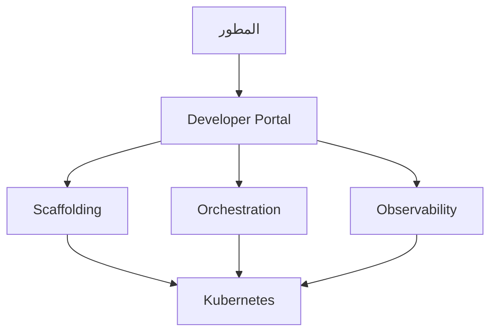

# منصة المطور الداخلية

> "لا تجعل كل مطور خبيراً في Kubernetes. ابنِ له منصة."

## 🎯 أهداف التعلم

- فهم مفهوم IDP
- مكونات الـ IDP
- قياس نجاح الـ IDP
- CloudNova IDP Journey

## ⏱️ الوقت المقدر: 35 دقيقة | المستوى: Advanced

---

## 🏗️ مكونات IDP

### مقاييس IDP

| المقياس | قبل IDP | بعد IDP |
|---------|---------|---------|
| **Time to 10th PR** | 5 أيام | 30 دقيقة |
| **Deployments/يوم** | 2 | 50 |
| **Developer NPS** | 12 | 65 |
| **MTTR** | 4 ساعات | 15 دقيقة |

---

## 🏛️ CloudNova IDP Journey

**قبل IDP**: كل مطور يحتاج Terraform + Kubernetes + Helm + Prometheus. Onboarding: شهر كامل.

**بعد IDP**: يختار `Node.js API` template. يحصل على: Repository + CI/CD + Namespace + Dashboard + Logs. في 5 دقائق.

---

## 🎨 مبادئ IDP الناجح

1. **Self-Service**: المطور لا ينتظر DevOps
2. **Golden Paths**: مسارات موصى بها (وليس إجبارية)
3. **Abstraction**: إخفاء تعقيد Kubernetes
4. **Observability**: مراقبة مدمجة لكل خدمة

---

## 🛠️ تدريبات

### تمرين: صمم Service Catalog لـ CloudNova (5 templates)
### تحدي: احسب Time to 10th PR لفريقك حالياً

---

## 📝 تقييم

### ✅ فحص المعرفة
1. ما هو IDP؟
2. لماذا المطورون يحتاجون IDP؟
3. ما هي Golden Paths؟

### 🃏 بطاقات
| السؤال | الإجابة |
|--------|---------|
| IDP | Internal Developer Platform |
| Golden Path | مسار موصى به للتطوير |
| Time to 10th PR | مقياس سرعة onboarding |

---

## 🎤 مقابلة
1. **"كيف تقنع الإدارة ببناء IDP؟"** → أظهر metrics: Time to 10th PR, Developer NPS, Deployment frequency
2. **"ما الفرق بين IDP و PaaS؟"** → IDP يُبنى داخلياً، PaaS خدمة خارجية

---

[← Platform Engineering](./01-platform-engineering) | [→ Backstage](./03-backstage-developer-portal) | [🏠 الرئيسية](/)
