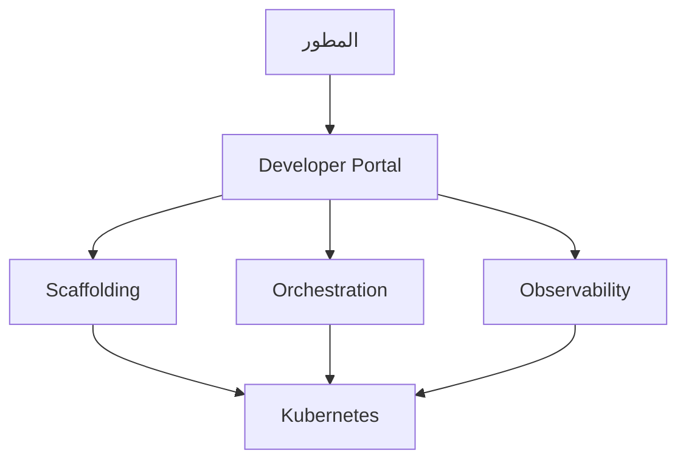

# منصة المطور الداخلية

> "لا تجعل كل مطور خبيراً في Kubernetes. ابنِ له منصة."

## 🎯 أهداف التعلم

- فهم مفهوم IDP
- مكونات الـ IDP
- قياس نجاح الـ IDP
- CloudNova IDP Journey

## ⏱️ الوقت المقدر: 35 دقيقة | المستوى: Advanced

---

## 🏗️ مكونات IDP



### مقاييس IDP

| المقياس | قبل IDP | بعد IDP |
|---------|---------|---------|
| **Time to 10th PR** | 5 أيام | 30 دقيقة |
| **Deployments/يوم** | 2 | 50 |
| **Developer NPS** | 12 | 65 |
| **MTTR** | 4 ساعات | 15 دقيقة |

---

## 🏛️ CloudNova IDP Journey

**قبل IDP**: كل مطور يحتاج Terraform + Kubernetes + Helm + Prometheus. Onboarding: شهر كامل.

**بعد IDP**: يختار `Node.js API` template. يحصل على: Repository + CI/CD + Namespace + Dashboard + Logs. في 5 دقائق.

---

## 🎨 مبادئ IDP الناجح

1. **Self-Service**: المطور لا ينتظر DevOps
2. **Golden Paths**: مسارات موصى بها (وليس إجبارية)
3. **Abstraction**: إخفاء تعقيد Kubernetes
4. **Observability**: مراقبة مدمجة لكل خدمة

---

## 🛠️ تدريبات

### تمرين: صمم Service Catalog لـ CloudNova (5 templates)
### تحدي: احسب Time to 10th PR لفريقك حالياً

---

## 📝 تقييم

### ✅ فحص المعرفة
1. ما هو IDP؟
2. لماذا المطورون يحتاجون IDP؟
3. ما هي Golden Paths؟

### 🃏 بطاقات
| السؤال | الإجابة |
|--------|---------|
| IDP | Internal Developer Platform |
| Golden Path | مسار موصى به للتطوير |
| Time to 10th PR | مقياس سرعة onboarding |

---

## 🎤 مقابلة
1. **"كيف تقنع الإدارة ببناء IDP؟"** → أظهر metrics: Time to 10th PR, Developer NPS, Deployment frequency
2. **"ما الفرق بين IDP و PaaS؟"** → IDP يُبنى داخلياً، PaaS خدمة خارجية

---

## 🏛️ سيناريو CloudNova الموسع: رحلة بناء IDP

**ليلى** Platform Engineer. المهمة: بناء IDP لـ 200 مطور.

**الوضع قبل IDP:**
- Onboarding مهندس جديد: 3 أسابيع
- كل مطور يحتاج تعلم: Terraform, Helm, Kubernetes, Prometheus
- 40% من وقت المطورين في DevOps، ليس في كتابة كود
- Developer NPS: 12 (كارثي)

**الرحلة — 4 مراحل:**

**المرحلة 1: Golden Paths (شهر 1-2)**
```bash
# أنشأت Templates جاهزة في GitHub
# template-node-api → Repo + Dockerfile + K8s manifests + CI/CD
# template-python-worker → Repo + Dockerfile + K8s + CI/CD

# النتيجة: Time to 10th PR انخفض من 5 أيام إلى 4 ساعات
```

**المرحلة 2: Self-Service Portal (شهر 3-4)**
```typescript
// Developer Portal: يختار template، يضغط زر
// يحصل على: Repo + CI/CD + Namespace + Dashboard + Logs + Alerts
// في 3 دقائق!

async function scaffoldService(name, template, team) {
  const repo = await github.createRepo(name, team);
  const ns = await k8s.createNamespace(name);
  const cicd = await configureCI(name, template);
  const dash = await grafana.createDashboard(name);
  return { repo, ns, cicd, dash };
}
```

**المرحلة 3: Internal Developer Platform (شهر 5-8)**
- Service Catalog: 150 خدمة مسجلة
- Dependency Graph: أي خدمة تعتمد على أي خدمة
- Scorecards: كل خدمة تُقيم (production readiness, security, docs)
- Backstage plugins: Kubernetes, PagerDuty, Grafana

**المرحلة 4: القياس والتحسين (شهر 9+)**
- Developer NPS: 12 → 72 ✅
- Time to 10th PR: 5 أيام → 30 دقيقة ✅
- Deployments/يوم: 3 → 45 ✅
- MTTR: 4 ساعات → 23 دقيقة ✅
- تكلفة المنصة: $8,000/شهر (3 مهندسين بدوام جزئي)

---

## 🎨 طبقة المعماري: أنماط IDP

### مستويات النضج

| المستوى | الوصف | مثال | وقت التنفيذ |
|--------|-------|------|-----------|
| **0: يدوي** | كل شيء manual، tickets | "افتح ticket لـ DevOps" | الحالي |
| **1: Templates** | Golden Paths جاهزة | GitHub template repos | شهر-شهرين |
| **2: Self-Service** | Portal للـ scaffolding | Backstage/Port | 3-6 أشهر |
| **3: Full IDP** | كل شيء self-service | Spotify Backstage | 6-12 شهر |
| **4: Product** | IDP كمنتج داخلي | فريق IDP مخصص | سنة+ |

### Build vs Buy — مصفوفة القرار

| الخيار | التكلفة | وقت التنفيذ | التخصيص | متى؟ |
|--------|---------|------------|---------|------|
| **Backstage (OSS)** | $ (مهندسين) | 3-6 أشهر | عالي | فريق Platform قوي |
| **Port (SaaS)** | $$ | أسبوع-شهر | متوسط | سرعة +零ops |
| **Humanitec** | $$$ | شهر-شهرين | متوسط | Kubernetes-native |
| **Build from scratch** | $$$$ | سنة+ | كامل | احتياجات فريدة |

### متى لا تبني IDP؟

- أقل من 20 مطوراً — overhead أكبر من الفائدة
- فريق واحد (3-5 أشخاص) — تواصل مباشر يكفي
- لا يوجد Platform Team — IDP يحتاج مالكاً

---

## 🛠️ تدريبات موسعة

### تمرين 1: احسب ROI للـ IDP
```python
def idp_roi(developers, avg_salary, hours_saved_per_week):
    hourly = avg_salary / 2000  # 2000 ساعة/سنة
    weekly_savings = developers * hours_saved_per_week * hourly
    annual_savings = weekly_savings * 50
    return annual_savings

# CloudNova: 200 مطور، $80K متوسط، 8 ساعات/أسبوع توفير
savings = idp_roi(200, 80000, 8)
print(f"توفير سنوي: ${savings:,.0f}")
# النتيجة: $640,000/سنة!
```

### تمرين 2: صمم Service Catalog
```yaml
# صمم catalog-entry.yaml لخدمة payment-api
apiVersion: backstage.io/v1alpha1
kind: Component
metadata:
  name: payment-api
  annotations:
    github.com/project-slug: cloudnova/payment-api
spec:
  type: service
  lifecycle: production
  owner: payments-team
  system: payments
  dependsOn:
    - component:auth-service
    - resource:payment-db
  providesApis:
    - payment-api
```

### تحدي: ابنِ MVP لـ IDP في أسبوع
```markdown
اليوم 1-2: أنشئ 3 GitHub template repos (Node, Python, Go)
اليوم 3: أضف CI/CD pipeline تلقائي لكل template
اليوم 4: أنشئ portal بسيط (static page مع buttons)
اليوم 5: اختبر مع 5 مطورين — اجمع feedback
```

---

## 📝 تقييم متكامل

### ✅ فحص المعرفة (5 أسئلة)
1. ما الفرق بين IDP و PaaS؟
2. متى لا تحتاج IDP؟
3. كيف تقيس نجاح IDP؟
4. ما هي Golden Paths؟
5. Backstage vs Port — أيهما تختار؟

### 🧠 Quiz
**س1:** أفضل مقياس لنجاح IDP:
- أ) عدد الـ servers
- ب) Time to 10th PR ✅
- ج) عدد الموظفين
- د) لون الـ UI

**س2:** IDP يختلف عن PaaS في:
- أ) IDP يُبنى داخلياً ليناسب المؤسسة ✅
- ب) لا فرق
- ج) PaaS أفضل دائماً
- د) IDP أرخص

**س3:** متى لا تبني IDP؟
- أ) أقل من 20 مطوراً ✅
- ب) دائماً
- ج) أبداً
- د) في Azure فقط

### 🗣️ Active Recall
1. اشرح مراحل نضج IDP من الذاكرة
2. ارسم معماري IDP مع Service Catalog و Templates
3. كيف تقنع CFO بتمويل IDP؟
4. صف رحلة CloudNova من Level 0 إلى Level 3

### 🎓 Feynman Exercise
> اشرح IDP لمدير: "بدل ما كل طباخ يبني مطبخه من الصفر، بنينا مطبخاً مركزياً. أي طباخ جديد يدخل ويبدأ الطبخ فوراً — الموقد جاهز، الأدوات موجودة، الوصفات مجربة."

### 🃏 بطاقات إضافية
| السؤال | الإجابة |
|--------|---------|
| ما IDP؟ | منصة داخلية تجعل المطورين منتجين من اليوم الأول |
| ما Golden Path؟ | مسار توصية (وليس إجباري) لبناء ونشر خدمة |
| ما أهم metric؟ | Time to 10th PR |
| ما أقل حجم لبناء IDP؟ | +50 مطوراً |
| تكلفة IDP سنوياً؟ | $50K-200K (حسب الحجم والتعقيد) |

---

## 🎤 أسئلة مقابلة موسعة

**س1 (System Design):** "صمم IDP لـ 500 مطور."
> Backstage كـ base + 10 plugins مخصصة. 3 مهندسين Platform بدوام كامل. Service Catalog مركزي. 30 Golden Path template. Self-service portal مع approval workflows. تكلفة: $200K/سنة. ROI: $1.5M/سنة.

**س2 (سلوكي):** "كيف تقنع فريقاً متشككاً في IDP؟"
> أبدأ بـ POC: template واحد فقط. أقيس Time to 10th PR قبل وبعد. أشارك النتائج. لا أفرض IDP — أجعله الخيار الأسهل. المطورون سيختارونه طواعية.

**س3 (تقني):** "كيف تتأكد أن IDP لا يصبح bottleneck؟"
> Platform team يعامل IDP كمنتج: SLAs، feedback loops، quarterly surveys. إذا أصبح IDP bottleneck، فشلنا في المهمة. الـ platform team يجب أن يكون < 5% من إجمالي المهندسين.

---

## 📚 المراجع
| النوع | الرابط |
|--------|--------|
| **درس ذو صلة** | [Platform Engineering](./01-platform-engineering) |
| **درس ذو صلة** | [Backstage](./03-backstage-developer-portal) |
| **مرجع** | [Team Topologies](https://teamtopologies.com/) |
| **كتاب** | [Platform Engineering Guide](https://platformengineering.org/) |

---

[← Platform Engineering](./01-platform-engineering) | [→ Backstage](./03-backstage-developer-portal) | [🏠 الرئيسية](/)
