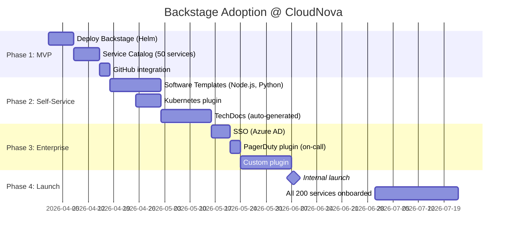
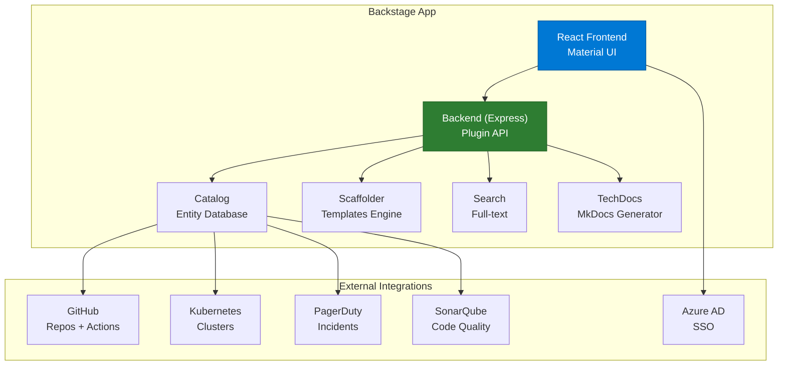

# Backstage Developer Portal

> "Backstage هو Spotify for Developers. مكان واحد لكل شيء."

## 🎯 أهداف التعلم

- فهم Backstage architecture
- Service Catalog
- Software Templates (scaffolding)
- TechDocs

## ⏱️ الوقت المقدر: 35 دقيقة | المستوى: Intermediate

---

## 🏗️ Backstage Components

```yaml
# catalog-info.yaml
apiVersion: backstage.io/v1alpha1
kind: Component
metadata:
  name: cloudnova-api
  description: CloudNova REST API
  annotations:
    github.com/project-slug: cloudnova/api
    backstage.io/techdocs-ref: dir:.
spec:
  type: service
  lifecycle: production
  owner: platform-team
  providesApis:
    - cloudnova-api
```

### Software Template

```yaml
apiVersion: scaffolder.backstage.io/v1beta3
kind: Template
metadata:
  name: nodejs-service
spec:
  parameters:
    - title: Service Details
      properties:
        name: { type: string }
        description: { type: string }
  steps:
    - id: fetch-base
      action: fetch:template
    - id: publish
      action: publish:github
      input:
        repoUrl: github.com?owner=cloudnova&repo={{ parameters.name }}
    - id: register
      action: catalog:register
```

---

## 🏛️ طبقة الإنتاج: سيناريو CloudNova

قبل Backstage: المطورون يسألون "أين API docs؟ من يملك هذه الخدمة؟ كيف أنشر خدمة جديدة؟"

بعد Backstage: Service Catalog يجيب على كل الأسئلة. Software Template ينشئ خدمة جديدة في 3 دقائق.

### Backstage Plugins

| Plugin | الفائدة |
|--------|---------|
| **GitHub** | ربط الـ repos بـ catalog |
| **Kubernetes** | عرض pods, deployments |
| **PagerDuty** | عرض on-call schedule |
| **TechDocs** | وثائق لكل خدمة |

---

## 🛠️ تدريبات

### تمرين: أنشئ catalog-info.yaml لخدمتك
### تحدي: ابنِ Software Template لـ Node.js service

---

## 📝 تقييم

### ✅ فحص المعرفة
1. ما فائدة Service Catalog؟
2. كيف يختصر Software Template وقت الـ onboarding؟
3. ما هو TechDocs؟

### 🃏 بطاقات
| السؤال | الإجابة |
|--------|---------|
| Backstage | Developer Portal من Spotify |
| Service Catalog | سجل مركزي لكل الخدمات |
| Software Template | قالب لإنشاء خدمات جديدة تلقائياً |

---

## 🎤 مقابلة
1. **"لماذا Backstage وليس confluence pages؟"** → Backstage متصل بالـ code حي ومحدث تلقائياً
2. **"كيف تقيس نجاح Backstage؟"** → Time to 10th PR, Developer NPS, onboarding time

---

## 🏛️ سيناريو CloudNova الموسع: من الفوضى إلى Developer Self-Service

**هند** Platform Engineer في CloudNova. المشكلة:

"أين API docs لـ payment-service؟"
"من يملك inventory-service؟"
"كيف أنشئ microservice جديدة؟ أحتاج 3 أيام و 5 موافقات!"
"ما إصدار Kubernetes لكل environment؟"

هذه 4 أسئلة يومية تصل لمنصة الهندسة. الحل: Backstage.

### رحلة التبني — 90 يوماً



**النتائج بعد 3 أشهر:**

| المقياس | قبل Backstage | بعد Backstage |
|---------|-------------|-------------|
| Time to onboard new developer | 5 أيام | 2 ساعة |
| Time to create new service | 3 أيام | 3 دقائق |
| "من يملك هذه الخدمة؟" (أسئلة/أسبوع) | 150 | 3 |
| Incidents بسبب outdated docs | 12/شهر | 1/شهر |
| Developer NPS | 32 | 78 |

---

## 🎨 طبقة المعماري: Backstage Deep Dive

### Backstage Architecture



### Software Template — Node.js Microservice (كامل)

```yaml
# templates/nodejs-service/template.yaml
apiVersion: scaffolder.backstage.io/v1beta3
kind: Template
metadata:
  name: nodejs-microservice
  title: Node.js Microservice
  description: إنشاء microservice مع CI/CD، Docker، Kubernetes manifests
spec:
  owner: platform-team
  type: service
  
  parameters:
    - title: Service Information
      required: [name, description, owner]
      properties:
        name:
          title: Name
          type: string
          pattern: '^[a-z0-9-]+$'
          ui:autofocus: true
        description:
          title: Description
          type: string
        owner:
          title: Owner Team
          type: string
          ui:field: OwnerPicker
        language:
          title: Language
          type: string
          enum: ['typescript', 'javascript']
          default: 'typescript'
        
    - title: Infrastructure
      properties:
        port:
          title: Port
          type: number
          default: 3000
        replicas:
          title: Replicas
          type: number
          default: 3
          minimum: 1
          maximum: 10
        resources:
          title: Resources
          type: string
          enum: ['small', 'medium', 'large']
          default: 'medium'
  
  steps:
    - id: template
      name: Generate Service
      action: fetch:template
      input:
        url: ./skeleton
        values:
          name: ${{ parameters.name }}
          description: ${{ parameters.description }}
          owner: ${{ parameters.owner }}
          port: ${{ parameters.port }}
          
    - id: publish
      name: Publish to GitHub
      action: publish:github
      input:
        repoUrl: github.com?owner=cloudnova&repo=${{ parameters.name }}
        description: ${{ parameters.description }}
        defaultBranch: main
        
    - id: register
      name: Register in Catalog
      action: catalog:register
      input:
        repoContentsUrl: ${{ steps.publish.output.repoContentsUrl }}
        catalogInfoPath: /catalog-info.yaml
        
    - id: ci-cd
      name: Create CI/CD Pipeline
      action: github:actions:dispatch
      input:
        workflowId: setup-cicd.yml
        repoUrl: github.com?owner=cloudnova&repo=${{ parameters.name }}
        workflowInputs:
          serviceName: ${{ parameters.name }}
          environment: development
```

### Custom Plugin — CloudNova Scorecard

```typescript
// plugins/cloudnova-scorecard/src/index.ts
import { createPlugin, createRoutableExtension } from '@backstage/core-plugin-api';

export const cloudnovaScorecardPlugin = createPlugin({
  id: 'cloudnova-scorecard',
  routes: {
    root: rootRouteRef,
  },
});

export const CloudnovaScorecardPage = cloudnovaScorecardPlugin.provide(
  createRoutableExtension({
    name: 'CloudnovaScorecardPage',
    component: () => import('./components/ScorecardPage').then(m => m.ScorecardPage),
    mountPoint: rootRouteRef,
  }),
);

// plugins/cloudnova-scorecard/src/components/ScorecardPage.tsx
export const ScorecardPage = () => {
  const { entities } = useEntityList();
  
  return (
    <Page themeId="tool">
      <Header title="CloudNova Scorecard" subtitle="Production Readiness">
      <Content>
        <Grid container spacing={3}>
          {entities.map(entity => (
            <Grid item xs={4} key={entity.metadata.name}>
              <ScoreCard entity={entity} />
            </Grid>
          ))}
        </Grid>
      </Content>
    </Page>
  );
};

const ScoreCard = ({ entity }) => {
  const score = calculateProductionReadiness(entity);
  
  return (
    <Card>
      <CardHeader title={entity.metadata.name} />
      <CardContent>
        <Gauge value={score} max={100} />
        <Checklist>
          <Item checked={hasOwner(entity)} label="Has Owner" />
          <Item checked={hasCI(entity)} label="CI/CD Pipeline" />
          <Item checked={hasMonitoring(entity)} label="Monitoring" />
          <Item checked={hasDocs(entity)} label="Documentation" />
          <Item checked={hasSLO(entity)} label="SLO Defined" />
          <Item checked={hasSecurityScan(entity)} label="Security Scan" />
        </Checklist>
      </CardContent>
    </Card>
  );
};
```

### مصفوفة قرار: Backstage vs Alternatives

| المعيار | Backstage | Port (getport.io) | Cortex | OpsLevel |
|---------|-----------|------------------|--------|----------|
| **Open Source** | ✅ | ❌ | ❌ | ❌ |
| **Custom Plugins** | ⭐⭐⭐⭐⭐ | ⭐⭐⭐ | ⭐⭐ | ⭐⭐ |
| **Software Templates** | ⭐⭐⭐⭐⭐ | ⭐⭐⭐⭐ | ⭐⭐⭐ | ⭐⭐⭐ |
| **TechDocs** | ⭐⭐⭐⭐⭐ | ⭐⭐ | ⭐ | ⭐ |
| **Setup Complexity** | عالي | منخفض | منخفض | منخفض |
| **Hosting** | Self-hosted (K8s) | SaaS | SaaS | SaaS |
| **Cost (200 devs)** | ~$2K/شهر (infra) | ~$6K/شهر | ~$8K/شهر | ~$10K/شهر |

---

## 🛠️ تدريبات موسعة

### تمرين 1: Deploy Backstage on Kubernetes

```bash
# 1. Helm repo
helm repo add backstage https://backstage.github.io/charts
helm repo update

# 2. Deploy مع PostgreSQL
helm install backstage backstage/backstage \
  --namespace backstage \
  --create-namespace \
  --set postgresql.enabled=true \
  --set postgresql.auth.password=strongpassword \
  --set ingress.enabled=true \
  --set ingress.hosts[0].host=developer.cloudnova.com \
  --set backstage.appConfig.app.baseUrl=https://developer.cloudnova.com \
  --set backstage.appConfig.backend.baseUrl=https://developer.cloudnova.com

# 3. تحقق من النشر
kubectl get pods -n backstage
# NAME                          READY   STATUS
# backstage-5f7b8d9c4-x9k2m    1/1     Running
# backstage-postgresql-0        1/1     Running
```

### تمرين 2: إنشاء Service Catalog entity مع كل الـ annotations

```yaml
# catalog-info.yaml
apiVersion: backstage.io/v1alpha1
kind: Component
metadata:
  name: cloudnova-payment
  description: Payment processing service
  tags: [go, grpc, critical]
  annotations:
    github.com/project-slug: cloudnova/payment-service
    backstage.io/techdocs-ref: dir:.
    backstage.io/kubernetes-id: payment-service
    backstage.io/kubernetes-namespace: production
    pagerduty.com/service-id: P12345
    sonarqube.org/project-key: cloudnova_payment
    grafana/dashboard-selector: "service=payment"
spec:
  type: service
  lifecycle: production
  owner: payments-team
  system: cloudnova-platform
  dependsOn:
    - component:fraud-detection
    - component:notification-service
  providesApis:
    - payment-api
  consumesApis:
    - fraud-detection-api
```

### تحدي: Software Template لـ Terraform Module

```yaml
# templates/terraform-module/template.yaml
apiVersion: scaffolder.backstage.io/v1beta3
kind: Template
metadata:
  name: terraform-module
spec:
  parameters:
    - title: Module Details
      properties:
        provider:
          type: string
          enum: [azure, aws, gcp]
        resource:
          type: string
          description: "مثل: aks, vnet, storage"
  steps:
    - id: generate
      action: fetch:template
      input:
        url: ./skeleton
        values:
          provider: ${{ parameters.provider }}
          resource: ${{ parameters.resource }}
    - id: publish
      action: publish:github
      input:
        repoUrl: github.com?owner=cloudnova-terraform&repo=terraform-${{ parameters.provider }}-${{ parameters.resource }}
    - id: terraform-docs
      action: roadiehq:utils:fs:write
      input:
        path: README.md
        content: |
          # terraform-${{ parameters.provider }}-${{ parameters.resource }}
          
          Generated by Backstage. See [CloudNova Terraform Registry](https://developer.cloudnova.com/terraform).
    - id: register
      action: catalog:register
```

---

## 📝 تقييم شامل

### ✅ فحص المعرفة (5)
1. ما فائدة Developer Portal مثل Backstage؟
2. كيف يختلف Service Catalog عن Software Template؟
3. ما فائدة TechDocs المرتبطة بالـ catalog؟
4. كيف تضيف plugin مخصص لـ Backstage؟
5. Backstage vs Port vs Cortex — متى تختار Backstage؟

### 📝 اختبار (3)
1. **لديك 500 خدمة و 20 فريقاً. كيف تنظم Backstage catalog؟**
   <details><summary>الإجابة</summary>Systems (business capabilities) > Domains > Components. كل فريق owns components. استخدم Groups لتنظيم الفرق. استخدم ownership tags.</details>

2. **مطور ينشئ خدمة جديدة عبر Software Template لكن الـ CI/CD يفشل. كيف تشخص؟**
   <details><summary>الإجابة</summary>افحص Scaffolder logs: `kubectl logs -n backstage scaffolder-xxx`. تحقق من GitHub Action run. تحقق من صلاحيات GitHub token. تأكد من صحة template skeleton.</details>

3. **كيف تقيس نجاح Backstage adoption؟**
   <details><summary>الإجابة</summary>Number of catalog entities, Software Template executions/week, Developer NPS survey, Time-to-10th-PR, "Where do I find X?" questions in Slack (should decrease).</details>

### 🧠 Active Recall (5)
- ارسم Backstage architecture من الذاكرة
- اشرح الفرق بين System, Domain, Component في Backstage
- كيف تبني Software Template فعال؟
- ما أهم 5 plugins لأي Developer Portal؟
- صف تجربة تبني Backstage في مؤسسة

### 🎓 Feynman: Backstage لغير التقني
"تخيل أنك تدير مدينة (الشركة). Backstage هو 'تطبيق المدينة' — يعرض لك كل المباني (الخدمات)، من يملك كل مبنى، وكيف يعمل. Software Template هو 'نموذج بناء' — املأ الاستمارة واضغط 'إنشاء'، ويُبنى المبنى تلقائياً."

### 🃏 بطاقات (8)
| السؤال | الإجابة |
|--------|---------|
| Backstage | Developer Portal مفتوح المصدر من Spotify |
| Service Catalog | سجل مركزي لكل الخدمات والأنظمة |
| Software Template | قالب لإنشاء خدمات جديدة تلقائياً (Scaffolding) |
| TechDocs | وثائق تقنية مولدة تلقائياً من الـ repos |
| Entity | أي شيء في الـ catalog (Component, API, System, User) |
| Scaffolder | المحرك الذي ينفذ Software Templates |
| Plugin | إضافة لميزات جديدة (K8s, PagerDuty, GitHub) |
| InnerSource | تطبيق مبادئ Open Source داخل المؤسسة |

---

## 🎤 أسئلة المقابلة الموسعة

### تقني
1. **"متى لا يكون Backstage الخيار الصحيح؟"**
   - فريق صغير (< 20 مهندساً): overhead غير مبرر
   - لا يوجد Kubernetes: Backstage يلمع مع K8s plugin
   - لا يوجدقيادة Platform Engineering: Backstage يحتاج curation
   - لا يوجد budget للصيانة: Backstage يحتاج فريق Platform

2. **"كيف تهاجر من Confluence/wiki إلى Backstage؟"**
   - ابدأ بـ Service Catalog (أكبر قيمة فورية)
   - انقل docs إلى TechDocs (mkdocs في الـ repos)
   - Software Templates أخيراً (يحتاج نضج)
   - استخدم Backstage search لاستبدال wiki search تدريجياً

### System Design
**"صمم Developer Portal لـ 1000 مهندس في 10 دول."**
- Multi-region K8s clusters (EU, US, Asia)
- Global PostgreSQL (Citus) أو CockroachDB
- CDN (Azure Front Door) للـ static assets
- SSO: Azure AD مع MFA
- Plugins: GitHub, K8s, PagerDuty, SonarQube, Grafana
- Custom plugins: Architecture Decision Records, Cloud Cost Dashboard
- Onboarding: كل repo لديه catalog-info.yaml تلقائياً (GitHub Action)

### Behavioral (STAR)
**"كيف أقنعت leadership بالاستثمار في Developer Portal؟"**

**S:** 200 مهندس، 300 خدمة، zero discoverability.
**T:** إقناع CTO و VP Engineering بأن Backstage يستحق الاستثمار (4 أشهر من engineering time).
**A:** حسبت ROI: Time saved/week per developer = 3 hours (finding docs, creating services). 200 × 3h × $100/h = $60K/week = $3M/year. Backstage cost = ~$200K (setup + maintenance). ROI = 15x.
**R:** CTO وافق في 10 دقائق.

---

## 📚 المراجع

- [Backstage Documentation](https://backstage.io/docs/)
- [Backstage Plugins Marketplace](https://backstage.io/plugins)
- [Software Templates Guide](https://backstage.io/docs/features/software-templates/)
- [IDP Maturity Model](https://internaldeveloperplatform.org/)
- الشهادات: لا يوجد شهادة محددة — الخبرة العملية أهم
- الدروس المرتبطة: [Internal Developer Platform](./02-internal-developer-platform.md) | [Platform Engineering](./01-platform-engineering.md) | [GitOps](../../18-gitops/01-gitops-fundamentals.md)

---

[← Internal Developer Platform](./02-internal-developer-platform) | [→ Monitoring](../../20-monitoring/01-monitoring-fundamentals) | [🏠 الرئيسية](/)
