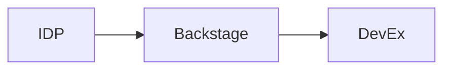

# 🚀 Platform Engineering

> Internal Developer Platform، Backstage — بناء منصة للمطورين.

## 🎯 أهداف التعلم

بعد إكمال هذه الوحدة، ستكون قادراً على:

- [**Platform Engineering**](01-platform-engineering) — مقدمة
- [**IDP**](02-internal-developer-portal) — منصة المطور الداخلية
- [**Backstage**](03-backstage-developer-portal) — بوابة المطور

## 💡 المهارات التي ستكتسبها

IDP • Backstage • DevEx • Scaffolding

## 📊 معلومات الوحدة

| العنصر           | القيمة              |
| ---------------- | ------------------- |
| **المستوى**      | متقدم               |
| **الوقت المقدر** | 5 ساعات             |
| **المتطلبات**    | Kubernetes + DevOps |
| **الشهادات**     | —                   |

## 🏛️ مهمة CloudNova

> صمم Internal Developer Platform لـ 200 مطور في CloudNova.

## 🗺️ خريطة الوحدة

## 📖 الدروس

- [**Platform Engineering**](01-platform-engineering) — مقدمة
- [**IDP**](02-internal-developer-portal) — منصة المطور الداخلية
- [**Backstage**](03-backstage-developer-portal) — بوابة المطور

## 🚀 ابدأ التعلم

[▶️ ابدأ الدرس الأول](01-platform-engineering)
